# address-ai-comments — flow overview

Human-facing overview for auditing the flow at a glance. Non-authoritative — the numbered steps in [`../SKILL.md`](../SKILL.md) win on any conflict. Regenerate this file whenever the skill's flow changes.

Two renderings of the same flow, kept cross-checkable on purpose. The `# N` comments in the pseudo-code are the diagram's node ids, so an id with no matching comment is drift.

## Pseudo-code

Python-shaped for readability only; nothing here runs, and the function names stand for steps this skill performs, not real APIs.

```python
# 1 · Entry: /address-ai-comments <path(s)>, or natural phrasing
#     ("raise/gather/check/find/see the AI?/AI! comments I left on <path>").
def address_ai_comments(arg):
    # 2 · Step 1 — both questions in ONE message, never two round-trips.
    targets, run_tails = ask_together(
        "Which file(s)/folder(s) to sweep?",
        "Run refactor/auto-review tails after?",   # default: no
    )

    # 3 · run-state file, persisted before any scanning starts
    state = create(f"/tmp/address-ai-comments_{session_id}_{ts}.json")
    state.write(targets=targets, run_tails=run_tails)

    if run_tails:                                          # 4
        state.write(BATCH_BASE_SHA=git("rev-parse", "HEAD"))   # 4a · persist immediately

    # ---- Step 2 · locate and classify ----
    # 5 · judged ONCE, at the start of step 2, before the grep+read pass begins.
    if scan_fits_main_session_cheaply():                   # 5 · yes, the default
        hits = grep("-n", ["AI!", "AI?"], targets)         # 5a
        for hit in hits:
            read_surrounding_context(hit)                  # 5b
            match marker_of(hit):                          # 5c
                case "AI!": hit.kind = "action"            # 5c1
                case "AI?": hit.kind = "question"          # 5c2
    else:  # 5 · no — many files or a large tree
        # 5d · optional, NOT the default. One subagent per subdirectory,
        #      mechanical locate+classify only — no fixing, no answering.
        hits = dispatch_parallel("general-purpose · haiku · low", per=subdirs(targets))

    # 6 · themes appended to the run-state file as they are produced, not at the end
    clusters = cluster_into_themes(hits)
    state.append(clusters)

    # 7 · Step 3 — the FULL list is populated before any cluster executes.
    for c in clusters:
        TaskCreate(description=c.theme, metadata={"refs": c.file_lines, "text": c.markers})

    # 8 · sequential by design — inline in main, nothing here parallelizes
    while clusters_remaining():                            # 8
        cluster = next_cluster()
        for marker in cluster.markers:   # 8a · a mixed cluster runs in file order
            match marker.kind:                             # 8a
                case "action":   perform_the_change(marker)      # 8a1 · Step 4a
                case "question": answer_in_chat(marker)          # 8a2 · Step 4b — never in the file
            delete_marker_from_source(marker)              # 8b · only once resolved

    tails = None
    if run_tails:                                          # 9
        # 9a · Step 5 — code-reviewer x2, agent-pinned, dispatched in the SAME turn (∥):
        #      simplification + correctness lenses, over BATCH_BASE_SHA..working tree.
        #      ref: code-review-pipeline/references/code-reviewer-tail-pair.md
        tails = dispatch_parallel("code-reviewer", lenses=["simplification", "correctness"])
        # 9b · hook: check-reviewer-writes.sh — writes allowed only to
        #      verdict_*.md or under /tmp; anything else is denied and aborts the run.

        # 9c · read BOTH verdict reports, synthesize a prioritized summary,
        #      and close with an apply-offer — opt-in only, never auto-applied.
        tails = triage(read_all(tails))
        report.append(tails.paths, tails.top_findings, tails.apply_offer)   # 9d

    # 10 · Step 6 — ONE final report. No per-cluster reports along the way.
    print(tasks_created, tasks_executed, file_line_refs, tails)
    return  # 11 · Done
```

## Flowchart

```mermaid
flowchart TD
  n1(["1. /address-ai-comments &lt;path(s)&gt;<br/>or natural phrasing: 'raise/gather/check/find/see<br/>the AI?/AI! comments I left on &lt;path&gt;'"]):::start
  n2["2. Step 1 · Ask together (one message): 'Which file(s)/folder(s)<br/>to sweep?' + 'Run refactor/auto-review tails after? (default no)'"]:::gate
  n3["3. Create run-state file<br/>/tmp/address-ai-comments_&lt;session_id&gt;_&lt;ts&gt;.json;<br/>persist target(s) + toggle answer"]:::state
  n4{"4. Tails toggle on?"}
  n4a["4a. Capture BATCH_BASE_SHA = git rev-parse HEAD;<br/>persist into run-state JSON immediately"]:::state
  n5{"5. Scan fits main session cheaply?<br/>(judged once, start of step 2,<br/>before grep+read pass begins)"}
  n5a["5a. Step 2 · Grep -n for AI! and AI? in target(s)"]
  n5b["5b. Read surrounding context for each hit"]
  n5c{"5c. Classify marker"}
  n5c1["5c1. AI! -&gt; action item"]
  n5c2["5c2. AI? -&gt; question item"]
  n6["6. Cluster markers into themes;<br/>append classification + theme to run-state file as produced"]:::state
  n5d[["5d. (optional, not default) Dispatch subagents in parallel (∥)<br/>pin: general-purpose · haiku · low<br/>one per subdirectory, mechanical locate+classify only"]]:::dispatch
  n7["7. Step 3 · Create one TaskList task per cluster —<br/>metadata: file:line refs + marker text;<br/>description: theme summary.<br/>Populate full list before executing any"]:::state
  n8{"8. Clusters remaining?<br/>(loop runs sequentially — inline in main<br/>session by design, nothing to parallelize)"}
  n8a{"8a. Cluster's marker type?<br/>(mixed clusters: markers process in file order)"}
  n8a1["8a1. Step 4a · AI!: perform the action/change first"]
  n8a2["8a2. Step 4b · AI?: answer in chat first, never in the file"]
  n8b["8b. Delete the marker from source once resolved"]
  n9{"9. Step 1 toggle was on?"}
  n9a[["9a. Step 5 · Dispatch code-reviewer x2 · agent-pinned,<br/>in parallel (∥, same turn) — simplification + correctness lenses<br/>(ref: code-review-pipeline/references/code-reviewer-tail-pair.md);<br/>diff BATCH_BASE_SHA..working tree"]]:::dispatch
  n9b["9b. PreToolUse hook: check-reviewer-writes.sh<br/>allows writes only to verdict_*.md or under /tmp;<br/>denies + aborts run otherwise"]:::hook
  n9c["9c. Triage: read both verdict reports, synthesize<br/>prioritized summary, close with apply-offer<br/>(opt-in only — never auto-applied)"]:::gate
  n9d["9d. Append tails' two report paths + top findings<br/>+ apply-offer to final report"]
  n10["10. Step 6 · Report tasks created/executed + file:line refs<br/>(single final report — no per-cluster reports)"]
  n11(["11. Done"])

  n1 --> n2
  n2 --> n3
  n3 --> n4
  n4 -->|"yes"| n4a
  n4 -->|"no"| n5
  n4a --> n5
  n5 -->|"yes, fits (default)"| n5a
  n5 -->|"no, many files/large tree"| n5d
  n5d --> n6
  n5a --> n5b
  n5b --> n5c
  n5c -->|"AI!"| n5c1
  n5c -->|"AI?"| n5c2
  n5c1 --> n6
  n5c2 --> n6
  n6 --> n7
  n7 --> n8
  n8 -->|"yes, cluster remains"| n8a
  n8a -->|"AI!"| n8a1
  n8a -->|"AI?"| n8a2
  n8a1 --> n8b
  n8a2 --> n8b
  n8b --> n8
  n8 -->|"no, all clusters done"| n9
  n9 -->|"yes"| n9a
  n9 -->|"no"| n10
  n9a -.->|"guarded by"| n9b
  n9a --> n9c
  n9c --> n9d
  n9d --> n10
  n10 --> n11

  classDef start fill:#fef3c7,stroke:#d97706,stroke-width:2px
  classDef gate fill:#fee2e2,stroke:#dc2626,stroke-width:2px
  classDef dispatch fill:#dbeafe,stroke:#2563eb,stroke-width:2px
  classDef state fill:#dcfce7,stroke:#16a34a,stroke-width:2px
  classDef skill fill:#f3e8ff,stroke:#9333ea,stroke-width:2px
  classDef hook fill:#e5e7eb,stroke:#4b5563,stroke-width:2px
```


