---
# performance-check budget overrides, not part of the diagram itself.
# This file renders one flow twice — once as pseudo-code, once as a diagram — so
# its size is fixed by the skill's step count, and trimming to the bundled defaults
# would drop steps from the flow audit or drop a whole rendering.
# Parked in assets/ and never loaded by the model, so its words cost no context.
words-budget: 4096
lines-budget: 512
---

# address-pr-comments — flow overview

Human-facing overview for auditing the flow at a glance. Non-authoritative — the numbered steps in [`../SKILL.md`](../SKILL.md) win on any conflict. Regenerate this file whenever the skill's flow changes.

Two renderings of the same flow, kept cross-checkable on purpose. The `# N` comments in the pseudo-code are the diagram's node ids, so an id with no matching comment is drift.

## Pseudo-code

Python-shaped for readability only; nothing here runs, and the function names stand for steps this skill performs, not real APIs.

```python
# 1 · Entry: /address-pr-comments PR# [filters]
def address_pr_comments(pr, filters):
    state = create(f"/tmp/address-pr-comments_{session_id}_{ts}.json")   # 2

    # 3 · Seed the TaskList ONCE, before Step 0 runs — one [Reminder] per
    #     remaining step (global CLAUDE.md rule). Each is updated as it
    #     completes; the TaskList survives compaction, so nothing is re-seeded.
    TaskCreate("[Reminder] Step 0: Pre-flight interview")                # 3a
    TaskCreate("[Reminder] Step 1: Validate preconditions (1a-1d)")      # 3b
    TaskCreate("[Reminder] Step 2: Resolve repo + own login")            # 3c
    TaskCreate("[Reminder] Step 3: Fetch, filter, cluster, rank, propose")  # 3d
    TaskCreate("[Reminder] Step 4: Parse the user's edited block")       # 3e
    TaskCreate("[Reminder] Step 5: Per-cluster commits + repo-green gate")  # 3f
    TaskCreate("[Reminder] Step 6: Batch push")                          # 3g
    TaskCreate("[Reminder] Step 7: Post replies (7a-7d)")                # 3h
    TaskCreate("[Reminder] Step 8: Final report")                       # 3i

    # 4 · Step 0 — read-only probing: is the tree dirty, and which runners exist?
    dirty = git("status", "--porcelain")
    runners = probe_lint_and_test_markers()

    # 5 · Step 0 — ONE message, asking only the conditions that actually hold.
    answers = ask_together(
        "Dirty tree — commit now?" if dirty else None,
        "Green baseline check?",              # default no — 1c precondition
        "Which runner?" if ambiguous(runners) else None,
        "Repo-green gate after changes?",     # default no — step 5 baseline+gate
        "Tails after this batch?",            # default no
    )
    state.write(answers)   # 6 · persisted, so the answers survive compaction

    # ---- Step 1 · 1a-1d run sequentially, fail-fast on the first failure ----
    if not on_pr_branch(pr):                               # 7 · Step 1a
        return abort("not on the PR branch — run gh pr checkout")        # 7a

    if state.answers.tree_is_dirty:                        # 8 · Step 1b
        load_skill("commit-standards")                     # 8a
        user_commits_or_stashes()                          # 8b
        return rerun_from_step_0()                         # 8c

    if state.answers.baseline_check:                       # 9 · Step 1c
        lint_result, test_result = run_lint(), run_test()  # 9a
        if not both_green(lint_result, test_result):       # 9b
            load_skill("debug-standards")                  # 9b1
            return abort("fix the pre-existing breakage first")          # 9b2

    owner_repo, my_login = resolve_repo_and_login()        # 10 · Step 2

    # 11 · Step 3 — ONE subagent, general-purpose · sonnet · medium, background,
    #      serial. It reads fetch-cluster-propose.md + review-principles.md and
    #      does the fetch, filter, cluster, rank, and propose.
    clusters = dispatch("general-purpose · sonnet · medium", background=True)

    if not clusters:                                       # 12
        return stop("no clusters to address")              # 12a

    proposal = present(clusters)                           # 13

    while True:
        # 14 · ONE round: the user flips actions, edits reasons, deletes
        #      clusters — per-cluster action approval.
        edited = user_edits(proposal)
        parsed = parse(edited)                             # 15 · Step 4
        if parsed.ok:                                      # 16
            break
        surface_exact_issue(parsed.error)   # 16a · ask the user to re-send

    for c in parsed.applied_clusters:                      # 17
        TaskCreate(f"[Task] {c.title}")

    # 18 · Step 5 — repo-green BASELINE, opt-in, before any cluster edit.
    if state.answers.repo_green_gate:                      # 18
        # 18a · mode=baseline: fixes nothing, just records evidence to diff
        #       against later. Log path/failures/inventory -> state.repo_green.baseline.
        dispatch("repo-green-runner", mode="baseline", background=True)  # 18a

    # ---- Step 5 · one commit per cluster ----
    while apply_clusters_remaining():                      # 19
        c = next_apply_cluster()
        load_skill("code-standards", "test-standards", "doc-standards")  # 19a
        make_changes(c)                                    # 19b
        git("add", only_files_in_scope_of(c))              # 19b
        load_skill("commit-standards")                     # 19c
        sha = git("commit")                                # 19d
        # 19e · both surfaces updated: the [Task]'s metadata and the scratchpad.
        TaskUpdate(c.task, metadata={"action": c.action, "commit_sha": sha,
                                     "status": "done"})
        state.write(c)

        if touched_files_outside(c.scope):                 # 19f
            # 19f1 · the answer resumes the CURRENT cluster, then moves on.
            ask("a separate Drift commit, or bundle it?")  # 19f1

    # 20 · Step 5 — repo-green GATE, opt-in, after all clusters committed,
    #      before the push. Fixes only batch-caused red; never touches
    #      pre-existing red; own 3-cycle-per-signature budget.
    if state.answers.repo_green_gate:                      # 20
        dispatch("repo-green-runner", mode="gate", background=True)  # 20a
        verdict = read_gate_verdict()                       # 20b
        if verdict == "HALT":                               # 20b
            # 20b1 · never push broken commits; never hand-fix what the
            #        runner already handed back.
            return abort("repo-green gate HALT — surface surviving red")  # 20b1

    confirm_with_user("git push")   # 21 · Step 6 — the batch push gate
    while True:
        git("push")                                        # 22 · single batch push
        if not push_rejected_remote_moved():               # 23
            break
        # 23a · stop and surface it. The per-cluster commits stand, and the user
        #       resolves the divergence manually — never auto-rebase. Retrying
        #       re-enters the push ONLY, never step 5's commit logic.
        return abort("remote moved")                       # 23a

    # ---- Step 7 · one reply per surviving reply target ----
    # A target is one thread_id, one top-level comment, or one review-summary —
    # never a single comment inside a thread, which would post duplicates.
    while targets_remaining_in_surviving_clusters():       # 24
        # 24a · per templates 7a-7c (apply / answer / drop) and the signature
        #       rules. Each reply is permission-gated.
        #       inline -> GraphQL addPullRequestReviewThreadReply(thread_id)
        #       top-level / review-summary -> REST issue comment
        result = post_reply(next_target())                 # 24a
        if result.permission_denied:                       # 24b
            skip_and_list_in_final_report()                # 24b1
            continue
        if result.gh_api_failed:                            # 24b2
            retry = retry_gh_api_once()                    # 24b2a
            if not retry.succeeded:                        # 24b2b
                skip_and_list_in_final_report()             # 24b2b1

    if state.answers.tails:                                # 25 · Step 7d
        # 25a · Step 7d — 2x code-reviewer · agent-pinned, parallel (∥),
        #       background, reading code-reviewer-tail-pair.md.
        #       Lens A simplification → verdict_refactor_*.md
        #       Lens B correctness   → verdict_auto-review_*.md
        tails = dispatch_parallel("code-reviewer", lenses=["A", "B"])
        # 25b · PreToolUse hook: check-reviewer-writes.sh auto-approves
        #       writes to verdict_*.md or /tmp, and denies everything else.

        # 25c · read BOTH reports, synthesize a prioritized summary,
        #       and offer to apply — report-only by default.
        summary = synthesize(read_all(tails))
        if user_names_specific_findings():                 # 25d
            for f in named_findings():
                # 25d1 · a FRESH subagent per finding, general-purpose · sonnet ·
                #        medium, serial. Test-first: confirm RED, apply, confirm GREEN.
                dispatch("general-purpose · sonnet · medium", finding=f)

    # 26 · Step 8 — applied / answered / dropped / skipped counts, plus the
    #      repo-green gate verdict (when it ran) and the tails findings.
    return print(final_summary())
```

## Flowchart

```mermaid
flowchart TD
  n1(["1. /address-pr-comments PR# [filters]"]):::start
  n2["2. Create run-state file<br/>/tmp/address-pr-comments_&lt;session_id&gt;_&lt;ts&gt;.json"]:::state

  subgraph seedReminders["3. Seed the TaskList once, before Step 0 runs — one [Reminder] per remaining step (global CLAUDE.md rule).<br/>Update each as it completes; the TaskList survives compaction, so nothing is ever re-seeded."]
    direction TB
    n3a["3a. Add to TaskList a [Reminder] for Step 0:<br/>Pre-flight interview"]:::state
    n3b["3b. Add to TaskList a [Reminder] for Step 1:<br/>Validate preconditions (1a-1d)"]:::state
    n3c["3c. Add to TaskList a [Reminder] for Step 2:<br/>Resolve repo + own login"]:::state
    n3d["3d. Add to TaskList a [Reminder] for Step 3:<br/>Fetch, filter, cluster, rank, propose"]:::state
    n3e["3e. Add to TaskList a [Reminder] for Step 4:<br/>Parse the user's edited block"]:::state
    n3f["3f. Add to TaskList a [Reminder] for Step 5:<br/>Per-cluster commits + repo-green gate"]:::state
    n3g["3g. Add to TaskList a [Reminder] for Step 6:<br/>Batch push"]:::state
    n3h["3h. Add to TaskList a [Reminder] for Step 7:<br/>Post replies (7a-7d)"]:::state
    n3i["3i. Add to TaskList a [Reminder] for Step 8:<br/>Final report"]:::state
    n3a --> n3b --> n3c --> n3d --> n3e --> n3f --> n3g --> n3h --> n3i
  end
  n4["4. Step 0: git status --porcelain;<br/>probe lint/test runner markers (read-only)"]
  n5["5. Step 0: Ask in ONE message<br/>(only conditions that hold)<br/><br/>- Dirty tree -&gt; commit now? (if dirty)<br/>- Green baseline check? (default no)<br/>- Runner pick (if ambiguous/none)<br/>- Repo-green gate after changes? (default no)<br/>- Tails after this batch? (default no)"]:::gate
  n6["6. Persist step-0 answers to<br/>run-state file - survives compaction"]:::state
  n7{"7. Step 1a &middot; On PR's branch?<br/>(1a-1d run sequentially, fail-fast<br/>on first failure)"}
  n7a["7a. Abort: not on PR branch<br/>run gh pr checkout"]
  n8{"8. Step 1b &middot; Working tree clean?<br/>(persisted step-0 answer)"}
  n8a["8a. Load commit-standards<br/>(Skill tool)"]:::skill
  n8b["8b. User commits or stashes<br/>the dirty files"]
  n8c["8c. Re-run skill from Step 0"]
  n9{"9. Step 1c &middot; Baseline check<br/>opted in (step 0)?"}
  n9a["9a. Step 1c &middot; Run lint then test"]
  n9b{"9b. Step 1c &middot; Lint and test green?"}
  n9b1["9b1. Load debug-standards<br/>(Skill tool)"]:::skill
  n9b2["9b2. Abort: fix pre-existing<br/>breakage first"]
  n10["10. Step 2: Resolve owner/repo<br/>and own gh login"]
  n11["11. Step 3: Dispatch subagent<br/>general-purpose &middot; sonnet &middot; medium<br/>background (single, serial)<br/><br/>Reads fetch-cluster-propose.md<br/>+ review-principles.md<br/>fetch, filter, cluster, rank, propose"]:::dispatch
  n12{"12. Subagent found<br/>zero matching comments?"}
  n12a["12a. Stop - no clusters to address"]
  n13["13. Return proposal block to user"]
  n14["14. User edits proposal block<br/>one round: flip actions, edit reasons, delete clusters<br/>(per-cluster action approval)"]:::gate
  n15["15. Step 4: Parse edited block"]
  n16{"16. Parse succeeded?"}
  n16a["16a. Surface exact issue,<br/>ask user to re-send"]
  n17["17. Create one [Task] per applied cluster<br/>(TaskList)"]:::state
  n18{"18. Step 5 &middot; Repo-green gate<br/>toggle on (step 0)?"}
  n18a["18a. Dispatch repo-green-runner<br/>mode=baseline (background)<br/><br/>Fixes nothing; records log path,<br/>failure signatures, suite inventory<br/>for the gate below to diff against"]:::dispatch
  n19{"19. Step 5 &middot; More apply<br/>clusters to commit?"}
  n19a["19a. Load code-standards / test-standards /<br/>doc-standards as applicable<br/>(Skill tool)"]:::skill
  n19b["19b. Make code changes for cluster;<br/>stage only relevant files"]
  n19c["19c. Load commit-standards<br/>(Skill tool)"]:::skill
  n19d["19d. Commit the cluster's<br/>staged changes"]
  n19e["19e. Update cluster's [Task] metadata<br/>+ scratchpad file<br/>(action, commit_sha, status)"]:::state
  n19f{"19f. Edits touched files<br/>outside cluster scope?"}
  n19f1["19f1. Ask user: a separate<br/>Drift commit, or bundle"]
  n20{"20. Step 5 &middot; Repo-green gate<br/>toggle on (step 0)?"}
  n20a["20a. Dispatch repo-green-runner<br/>mode=gate (background)<br/><br/>Fixes only batch-caused red<br/>(own 3-cycle/signature budget);<br/>never touches pre-existing red"]:::dispatch
  n20b{"20b. Gate verdict?<br/>GREEN / GREEN-WITH-EXCEPTIONS / HALT"}
  n20b1["20b1. Abort: stop before push<br/>surface surviving red set<br/>never hand-fix, never auto-retry"]
  n21["21. Step 6: Confirm git push with user<br/>(batch push gate)"]:::gate
  n22["22. git push - single batch push"]
  n23{"23. Push rejected<br/>remote moved?"}
  n23a["23a. Abort: stop, surface to user<br/>per-cluster commits stand<br/>user resolves divergence manually<br/>(never auto-rebase)"]
  n24{"24. Step 7 &middot; More reply targets<br/>in surviving clusters?<br/>(target = one thread_id, top-level, or review-summary)"}
  n24a["24a. Post reply per 7a-7c templates<br/>apply/answer/drop, signature rules<br/>inline &rarr; GraphQL addPullRequestReviewThreadReply<br/>top-level/review-summary &rarr; REST issue comment<br/>(permission-gated per target)"]:::gate
  n24b{"24b. Permission<br/>denied?"}
  n24b1["24b1. Skip reply;<br/>list in final report"]
  n24b2{"24b2. gh api<br/>call failed?"}
  n24b2a["24b2a. Retry gh api once"]
  n24b2b{"24b2b. Retry<br/>succeeded?"}
  n24b2b1["24b2b1. Skip reply;<br/>list in final report"]
  n25{"25. Step 7d &middot; Tails toggle on<br/>step 0 answer?"}
  n25a["25a. Step 7d: Dispatch code-reviewer tail pair<br/>2x code-reviewer &middot; agent-pinned<br/>parallel (∥), background<br/><br/>Reads code-reviewer-tail-pair.md<br/>Lens A simplification -&gt; verdict_refactor_*.md<br/>Lens B correctness -&gt; verdict_auto-review_*.md"]:::dispatch
  n25b["25b. PreToolUse hook:<br/>check-reviewer-writes.sh<br/><br/>Auto-approves writes to verdict_*.md or /tmp;<br/>denies all other writes/mutations"]:::hook
  n25c["25c. Read both verdict reports;<br/>synthesize prioritized summary;<br/>offer to apply (report-only by default)"]
  n25d{"25d. User names specific<br/>findings to apply?"}
  n25d1["25d1. Dispatch a fresh subagent per named finding<br/>general-purpose &middot; sonnet &middot; medium<br/>serial per named finding<br/><br/>test-first: confirm RED, apply fix, confirm GREEN"]:::dispatch
  n26["26. Step 8: Print final summary<br/>applied/answered/dropped/skipped counts<br/>+ repo-green gate verdict (if it ran)<br/>+ tails findings (if they ran)"]

  n1 --> n2
  n2 --> n3a
  n3i --> n4
  n4 --> n5
  n5 --> n6
  n6 --> n7
  n7 -->|"no"| n7a
  n7 -->|"yes"| n8
  n8 -->|"dirty"| n8a
  n8a --> n8b
  n8b --> n8c
  n8 -->|"clean"| n9
  n9 -->|"no / unanswered"| n10
  n9 -->|"yes"| n9a
  n9a --> n9b
  n9b -->|"red"| n9b1
  n9b1 --> n9b2
  n9b -->|"green"| n10
  n10 --> n11
  n11 --> n12
  n12 -->|"yes"| n12a
  n12 -->|"no"| n13
  n13 --> n14
  n14 --> n15
  n15 --> n16
  n16 -->|"fails"| n16a
  n16a --> n14
  n16 -->|"succeeds"| n17
  n17 --> n18
  n18 -->|"yes"| n18a
  n18a --> n19
  n18 -->|"no"| n19
  n19 -->|"yes"| n19a
  n19a --> n19b
  n19b --> n19c
  n19c --> n19d
  n19d --> n19e
  n19e --> n19f
  n19f -->|"yes"| n19f1
  n19f1 -->|"resumes current cluster,<br/>then next"| n19
  n19f -->|"no"| n19
  n19 -->|"no - all committed"| n20
  n20 -->|"yes"| n20a
  n20a --> n20b
  n20b -->|"GREEN / GREEN-WITH-EXCEPTIONS"| n21
  n20b -->|"HALT"| n20b1
  n20 -->|"no"| n21
  n21 --> n22
  n22 --> n23
  n23 -->|"yes"| n23a
  n23a -.->|"retry push only,<br/>not step-5 commit logic"| n22
  n23 -->|"no"| n24
  n24 -->|"yes"| n24a
  n24a --> n24b
  n24b -->|"yes"| n24b1
  n24b1 --> n24
  n24b -->|"no"| n24b2
  n24b2 -->|"no"| n24
  n24b2 -->|"yes"| n24b2a
  n24b2a --> n24b2b
  n24b2b -->|"yes"| n24
  n24b2b -->|"no"| n24b2b1
  n24b2b1 --> n24
  n24 -->|"no - all replied"| n25
  n25 -->|"yes"| n25a
  n25a --> n25b
  n25b --> n25c
  n25c --> n25d
  n25d -->|"yes, named findings"| n25d1
  n25d1 --> n26
  n25d -->|"no / not asked"| n26
  n25 -->|"no"| n26

  classDef start fill:#fef3c7,stroke:#d97706,stroke-width:2px
  classDef gate fill:#fee2e2,stroke:#dc2626,stroke-width:2px
  classDef dispatch fill:#dbeafe,stroke:#2563eb,stroke-width:2px
  classDef state fill:#dcfce7,stroke:#16a34a,stroke-width:2px
  classDef skill fill:#f3e8ff,stroke:#9333ea,stroke-width:2px
  classDef hook fill:#e5e7eb,stroke:#4b5563,stroke-width:2px
```


