---
# performance-check budget override, not part of the diagram itself.
# This file renders one flow twice — once as pseudo-code, once as a diagram — so
# its size is fixed by the skill's step count, and trimming to the bundled default
# would drop steps from the flow audit or drop a whole rendering.
# Parked in assets/ and never loaded by the model, so its words cost no context.
words-budget: 4096
---

# address-verdicts — flow overview

Human-facing overview for auditing the flow at a glance. Non-authoritative — the numbered steps in [`../SKILL.md`](../SKILL.md) win on any conflict. Regenerate this file whenever the skill's flow changes.

Two renderings of the same flow, kept cross-checkable on purpose. The `# N` comments in the pseudo-code are the diagram's node ids, so an id with no matching comment is drift.

## Pseudo-code

Python-shaped for readability only; nothing here runs, and the function names stand for steps this skill performs, not real APIs.

```python
# 1 · Entry: /address-verdicts <which ones> [--no-ask] [--test-cmd <cmd>].
#     A human invokes it, or a skill dispatches it — /quality-gate --auto-solve
#     passes an explicit finding list plus --no-ask, having already triaged.
def address_verdicts(arg):
    # 2 · Step 1 — several timestamped generations can exist per lens, and the
    #     timestamp is embedded in the filename, so it sorts lexically.
    files = glob("verdict_refactor_*.md", "verdict_auto-review_*.md",
                 "verdict_test-sdd_*.md")

    if not files:                                          # 3
        # 3a · Nothing to address yet — run /quality-gate, or a single lens
        #      first. NEVER fabricate a report by re-running a reviewer;
        #      this skill only consumes reports already on disk.
        return stop("no verdict file for any lens")        # 3a

    for lens in lenses_with_no_file(files):                # 4
        if arg.names_explicitly(lens):
            return stop(f"no report exists for the {lens} lens")   # 4a
        # 4 · Otherwise proceed with the lenses that DO have a file,
        #     and say which one was missing in step 6's report.

    # 5 · Step 1 — the newest generation per lens by default (the last name
    #     after a sort); a verdict file path inside <which ones> pins an
    #     older generation instead.
    selected_files = newest_per_lens(files, pinned=arg.paths)

    # 6 · Step 2 — match in this order: all (the default when the arg is
    #     empty), a lens name, a severity floor, then an explicit list of
    #     finding identifiers.
    findings = match(arg.which_ones, selected_files)

    # 7 · Step 2 — needed to run RED-then-GREEN in step 4. Taken from
    #     --test-cmd, else inferred from a package.json test script, a
    #     Makefile target, or the repo's own CLAUDE.md.
    test_cmd = arg.test_cmd or infer_test_command()

    # 8 · Step 2 — an identifier matching more than one finding, a severity
    #     floor the report never labels, a lens name that looks like a typo,
    #     or a test command that would not infer. Never guess past one: a
    #     wrong guess silently works the wrong finding.
    for ambiguity in ambiguities(findings, test_cmd):
        if arg.no_ask:                                     # 8a
            # 8a1 · Skipping beats guessing here, because the caller can
            #       re-run the finding by hand once it reads the ledger,
            #       whereas a wrong guess lands a commit nobody asked for.
            #       A missing test command skips only the findings that need
            #       one — refactor-lens findings still apply, since the
            #       refactor agent brings its own green-before-and-after check.
            mark_skipped(ambiguity.finding, reason=ambiguity)      # 8a1
        else:
            # 8a2 · ONE question, carrying your recommended reading. The
            #       test-command ask bundles into it when one already fires,
            #       and is asked alone otherwise.
            resolve(ask(ambiguity))                        # 8a2

    # 9 · Step 3 — seeded BEFORE anything applies, so the list is this run's
    #     whole timeline: nothing appears later, out of order, as it becomes
    #     relevant.
    tasklist.seed([f"[Task] Apply {f.lens} finding: {f.title}" for f in findings],
                  first="in_progress", rest="pending")     # 9
    # 10 · Step 3 — survives a mid-run compaction, so the wrap-up step
    #      cannot get silently skipped.
    tasklist.add("[Reminder] Close with the report (step 6)")       # 10

    for f in findings:                                     # 17 · serial, in the seeded order
        # 11 · Step 4 — the refactor agent refuses any behavior change BY
        #      DESIGN, so a correctness fix or a test the repo lacks cannot
        #      route through it; both need tdd-coder's test-first discipline.
        match f.lens:
            case "refactor":
                # 11a · It applies the change itself and confirms the tests
                #       are green before and after.
                result = agent("refactor", scope=f, test_cmd=test_cmd)     # 11a
            case "auto-review" | "test-sdd":
                # 11b · Strict TDD, RED before GREEN. For a test-sdd finding
                #       the missing test IS the fix, so the planned title is
                #       passed verbatim and the test lands under the name the
                #       plan declared.
                result = agent("tdd-coder", scope=f, test_cmd=test_cmd)    # 11b

        # 12 · Step 4 — a subagent's summary describes intent; only the
        #      artifact shows what actually landed.
        landed = verify_against_artifacts(result)          # 12

        if not landed:                                     # 13
            # 13a · Recorded as failed, never as done, and never committed.
            f.outcome = failed(result)                     # 13a
        else:
            # 14 · Step 4 — one commit per finding, before the next starts.
            if f.lens != "refactor":
                # 14a · tdd-coder commits its own work under commit-standards,
                #       so confirm the SHA exists rather than re-committing.
                f.sha = confirm_commit_exists(result)      # 14a
            else:
                # 14b · The refactor agent leaves its change uncommitted by
                #       design, so commit it HERE, in this session, where the
                #       permission prompt can render.
                f.sha = commit(f)                          # 14b

        # ---- 15/16 · Step 5 — written in place the MOMENT the finding lands,
        #      never batched to the end of the run: a killed session then still
        #      leaves an accurate ledger, instead of a pile of applied fixes
        #      with no record of which report entries they answer. ----
        if f.sha:
            # 15 · The machine-checkable mark — a re-run skips it and grep
            #      counts it. Same prefix-after-the-number convention
            #      /implement uses on plan task headings, so one rule covers
            #      both surfaces. A skipped or failed finding is left unmarked.
            stamp_heading(f, "[Done]")                     # 15
        # 16 · The evidence. APPLIED pairs with a [Done] heading; SKIPPED
        #      leaves the heading unmarked, so a re-run reconsiders it.
        #      The heading alone cannot say WHY or point at the fix, and the
        #      body line alone is not greppable — hence both.
        write_body_line(f, f"APPLIED ({f.sha})" if f.sha
                           else f"SKIPPED ({f.reason})")   # 16

    # 18 · Step 6 — applied findings with their SHAs, skipped findings with
    #      their reasons, and anything that failed to apply with exactly what
    #      it needs to retry.
    ledger = compose_ledger(findings)                      # 18

    if arg.invoked_by_skill:                               # 19
        # 19b · Hand it back rather than only printing it: the caller composes
        #       the report the human actually reads, and can only name what it
        #       was told.
        return ledger                                      # 19b

    # 19a · Print it, and state plainly EVERY time: every finding step 2 did
    #       not select is untouched and carries no annotation, and this run
    #       never re-ran a reviewer.
    print(ledger, untouched_note(), never_re_ran_note())   # 19a
```

## Flowchart

```mermaid
flowchart TD
  n1(["1. /address-verdicts &lt;which ones&gt;<br/>[--no-ask] [--test-cmd &lt;cmd&gt;]<br/><br/>A human's invocation, or a skill's dispatch —<br/>/quality-gate --auto-solve passes an explicit<br/>finding list plus --no-ask, having already triaged"]):::start
  n2["2. Step 1 · Glob CWD for verdict_refactor_*.md,<br/>verdict_auto-review_*.md, verdict_test-sdd_*.md.<br/>Several timestamped generations can exist per lens,<br/>and the timestamp sorts lexically"]
  n3{"3. Step 1 · Any verdict file at all?"}
  n3a(["3a. STOP — nothing to address yet. Run /quality-gate,<br/>or a single lens, first. NEVER fabricate a report by<br/>re-running a reviewer; this skill only consumes<br/>reports already on disk"])
  n4{"4. Step 1 · A lens has no file — did &lt;which ones&gt;<br/>name that lens explicitly?"}
  n4a(["4a. STOP — say no report exists for that lens"])
  n5["5. Step 1 · Take the newest generation per lens (the last<br/>name after a sort); a verdict file path inside<br/>&lt;which ones&gt; pins an older generation instead.<br/>A lens with no file is dropped, and named in step 6"]
  n6["6. Step 2 · Match &lt;which ones&gt; in this order: all (the<br/>default when empty), a lens name, a severity floor,<br/>then an explicit list of finding identifiers"]
  n7["7. Step 2 · Resolve the test command, needed to run<br/>RED-then-GREEN in step 4: --test-cmd if given, else<br/>infer from a package.json script, a Makefile target,<br/>or the repo's own CLAUDE.md"]
  n8{"8. Step 2 · Any ambiguity left? An identifier matching<br/>more than one finding, a severity floor the report<br/>never labels, a lens name that looks like a typo,<br/>or a test command that would not infer"}
  n8a{"8a. Was --no-ask passed?"}
  n8a1["8a1. Resolve it to SKIPPED (the ambiguity) on that finding<br/>and carry on with the rest. Skipping beats guessing:<br/>the caller re-runs it by hand after reading the ledger,<br/>where a wrong guess lands a commit nobody asked for.<br/>A missing test command skips only the findings that need<br/>one — refactor-lens findings still apply, since that<br/>agent brings its own green-before-and-after check"]
  n8a2["8a2. Ask ONE question, carrying your recommended reading.<br/>Never guess past an ambiguity — a wrong guess silently<br/>works the wrong finding. The test-command ask bundles<br/>into this one when it already fires, else is asked alone"]:::gate
  n9["9. Step 3 · Add to TaskList one [Task] entry per selected<br/>finding, in the order they will execute; the first<br/>in_progress, every other one pending. Seeded upfront so<br/>the list is this run's whole timeline — nothing appears<br/>later, out of order, as it becomes relevant"]:::state
  n10["10. Step 3 · Add to TaskList one closing [Reminder] entry<br/>for step 6's report, so a mid-run compaction cannot<br/>silently skip the wrap-up"]:::state
  n11{"11. Step 4 · Which lens wrote this finding?<br/>The refactor agent refuses any behavior change BY DESIGN,<br/>so a correctness fix or a test the repo lacks cannot<br/>route through it — both need tdd-coder's test-first<br/>discipline instead"}

  n11a["11a. Dispatch refactor (agent-pinned, foreground, serial)<br/>with the finding's scope and step 2's test command.<br/>It applies the change itself and confirms the tests<br/>are green before and after"]:::dispatch
    n11b["11b. Dispatch tdd-coder (agent-pinned, foreground, serial):<br/>strict TDD, RED before GREEN. For a test-sdd finding the<br/>missing test IS the fix, so pass the planned title<br/>verbatim and it lands under the name the plan declared"]:::dispatch

  n12["12. Step 4 · Verify the result against the artifacts —<br/>the diff, the test run — before trusting its done.<br/>A summary describes intent; only the artifact<br/>shows what actually landed"]
  n13{"13. Step 4 · Did the apply land?"}
  n13a["13a. Record it as failed, never as done.<br/>No commit, and no [Done] mark"]
  n14{"14. Step 4 · One commit per finding, before the next<br/>one starts — who commits this one?"}
  n14a["14a. tdd-coder commits its own work under<br/>commit-standards, so confirm the SHA exists<br/>rather than re-committing"]
  n14b["14b. The refactor agent leaves its change uncommitted<br/>by design, so commit it HERE, in this session,<br/>where the permission prompt can render"]:::gate

  subgraph annotate["15/16. Step 5 · Written in place the MOMENT the finding lands, never batched to the end of the run — a killed session then still leaves an accurate ledger, instead of a pile of applied fixes with no record of which report entries they answer."]
    direction TB
    n15["15. In the finding's HEADING, stamp a [Done] prefix right<br/>after the number, before any severity tag. The<br/>machine-checkable mark: a re-run skips it and grep counts<br/>it. Same prefix-after-the-number convention /implement<br/>uses on plan task headings, so one rule covers both.<br/>A skipped or failed finding is left unmarked"]:::state
    n16["16. In the finding's BODY, write the outcome and its<br/>evidence: APPLIED (sha), or SKIPPED (reason) with the<br/>heading left unmarked so a re-run reconsiders it.<br/>The heading alone cannot say WHY or point at the fix,<br/>and the body line alone is not greppable"]:::state
    n15 --> n16
  end

  n17{"17. More seeded findings left?"}
  n18["18. Step 6 · Compose the ledger: applied findings with<br/>their SHAs, skipped findings with their reasons, and<br/>anything that failed to apply with exactly what<br/>it needs to retry"]
  n19{"19. Step 6 · Who invoked this run?"}
  n19a(["19a. Print it, and state plainly EVERY time: every finding<br/>step 2 did not select is untouched and carries no<br/>annotation, and this run never re-ran a reviewer"])
  n19b(["19b. Hand the same ledger back to the caller rather than<br/>only printing it — the caller composes the report the<br/>human actually reads, and can only name what it was told"])

  n1 --> n2 --> n3
  n3 -->|"no file for any lens"| n3a
  n3 -->|"at least one"| n4
  n4 -->|"yes"| n4a
  n4 -->|"no"| n5
  n5 --> n6 --> n7 --> n8
  n8 -->|"no"| n9
  n8 -->|"yes"| n8a
  n8a -->|"yes"| n8a1 --> n9
  n8a -->|"no"| n8a2 --> n9
  n9 --> n10 --> n11
  n11 -->|"refactor lens"| n11a --> n12
  n11 -->|"auto-review or test-sdd lens"| n11b --> n12
  n12 --> n13
  n13 -->|"no"| n13a --> n15
  n13 -->|"yes"| n14
  n14 -->|"tdd-coder"| n14a --> n15
  n14 -->|"refactor agent"| n14b --> n15
  n16 --> n17
  n17 -->|"yes, the next finding"| n11
  n17 -->|"no"| n18
  n18 --> n19
  n19 -->|"a human"| n19a
  n19 -->|"a skill"| n19b

  classDef start fill:#fef3c7,stroke:#d97706,stroke-width:2px
  classDef gate fill:#fee2e2,stroke:#dc2626,stroke-width:2px
  classDef dispatch fill:#dbeafe,stroke:#2563eb,stroke-width:2px
  classDef state fill:#dcfce7,stroke:#16a34a,stroke-width:2px
  classDef skill fill:#f3e8ff,stroke:#9333ea,stroke-width:2px
  classDef hook fill:#e5e7eb,stroke:#4b5563,stroke-width:2px
```


