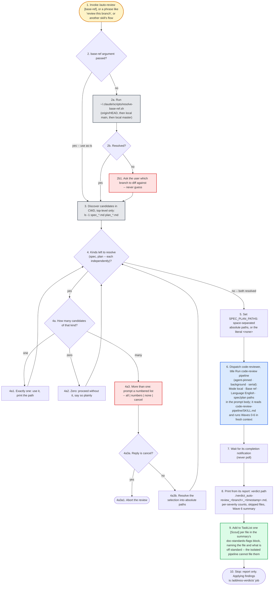

# auto-review — flow overview

Human-facing overview for auditing the flow at a glance. Non-authoritative — the steps in [`../SKILL.md`](../SKILL.md) win on any conflict. Regenerate this file whenever the skill's flow changes.

Two renderings of the same flow, kept cross-checkable on purpose. The `# N` comments in the pseudo-code are the diagram's node ids, so an id with no matching comment is drift.

The pipeline's own waves are collapsed into the dispatch node; they live in `../../code-review-pipeline/assets/flowchart.md`.

## Pseudo-code

Python-shaped for readability only; nothing here runs, and the function names stand for steps this skill performs, not real APIs.

```python
def auto_review(base_ref_arg=None):                            # 1
    if base_ref_arg:                                           # 2
        base_ref = base_ref_arg          # used as-is, any git ref
    else:
        base_ref = run("~/.claude/scripts/resolve-base-ref.sh")   # 2a
        if not base_ref:                                       # 2b
            # 2b1 · never guess a base -- the diff would be against the wrong branch
            base_ref = ask_user("Which branch should I diff against?")

    # 3 · top-level CWD only, never recursive
    candidates = run("ls -1 spec_*.md plan_*.md")

    # 4 · loop check: the spec and the plan resolve independently
    chosen = []
    for kind in ("spec", "plan"):
        of_kind = [c for c in candidates if c.startswith(kind)]
        match len(of_kind):                                    # 4a
            case 1:
                chosen += of_kind; print(of_kind)              # 4a1
            case 0:
                print(f"no {kind}; proceeding without it")     # 4a2
            case _:
                # 4a3 · a prompt is only worth its friction with something to choose
                reply = ask_user(numbered_list(of_kind), options="all | <numbers> | none | cancel")
                if reply == "cancel":                          # 4a3a
                    return abort("review cancelled by the user")   # 4a3a1
                chosen += resolve_selection(reply, of_kind)    # 4a3b

    # 5 · space-separated absolute paths, or the literal <none>
    spec_plan_paths = " ".join(absolute(chosen)) or "<none>"

    # 6 · fresh context is the point: this session usually wrote the diff
    agent = dispatch("code-reviewer", title="Run code-review pipeline",
                     prompt={"Mode": "local", "Base ref": base_ref,
                             "Language": "English",
                             "Spec/plan files": spec_plan_paths}
                            + "read code-review-pipeline/SKILL.md and run Waves 0-6")

    report = await_completion_notification(agent)              # 7

    # 8 · verdict path comes from the Wave 6 summary in the report
    print(report.verdict_path, report.per_severity_counts,
          report.skipped_files, report.wave6_summary)

    # 9 · runtime-sized set: one entry per file the summary's
    #     doc-standards-flags block lists; the isolated pipeline cannot
    #     reach the user's TaskList, so this session files them
    for flagged in report.doc_standards_flags:
        task_create(f"[Scout] {flagged.file}: {flagged.what_is_off_standard}")

    # 10 · report only; applying is /address-verdicts' job
    return "verdict written; nothing applied"
```

## Flowchart


