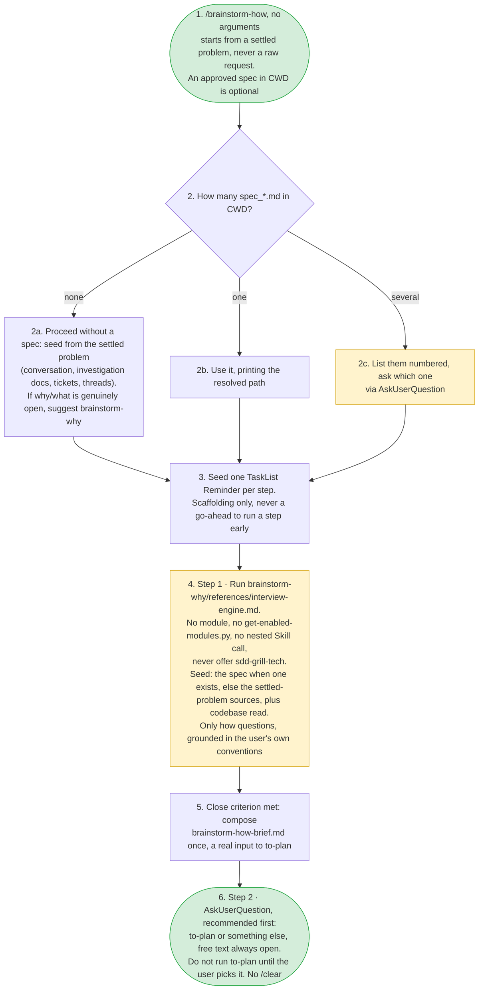

---
# performance-check budget override, not part of the diagram itself.
# One diagram carries every step, branch and stop condition of the skill,
# and trimming to the bundled default would drop steps from the flow audit.
# Parked in assets/ and never loaded by the model, so its words cost no context.
words-budget: 512
---

# brainstorm-how — flow overview

Human-facing overview for auditing the flow at a glance. Non-authoritative — the numbered steps in [`../SKILL.md`](../SKILL.md) win on any conflict. Regenerate this file whenever the skill's flow changes.

