---
# performance-check budget overrides, not part of the diagram itself.
# This file renders one flow twice — once as pseudo-code, once as a diagram — so
# its size is fixed by the skill's step count, and trimming to the bundled defaults
# would drop steps from the flow audit or drop a whole rendering.
# Parked in assets/ and never loaded by the model, so its words cost no context.
words-budget: 4096
lines-budget: 512
---

# brainstorm — flow overview

Human-facing flow audit. Non-authoritative — [`../SKILL.md`](../SKILL.md)'s numbered steps win on any conflict; regenerate whenever the flow changes.

Node labels state what happens; SKILL.md carries the reasoning behind each one.

Two renderings of the same flow, kept cross-checkable on purpose. The `# N` comments in the pseudo-code are the diagram's node ids, so an id with no matching comment is drift.

## Pseudo-code

Python-shaped for readability only; nothing here runs, and the function names stand for steps this skill performs, not real APIs.

```python
# 1 · Entry: /brainstorm — no arguments, ever
def brainstorm():
    # 2 · Step 1 phase 1 — ONE AskUserQuestion, before any other question.
    #     full  = spec + plan, AI self-reviews, deterministic gates
    #     light = plan alone, deterministic gates only (full minus the spec,
    #             minus the AI gates — same plan template either way)
    mode = ask_user_question("How much do you want written?")   # full | light

    if mode == "full":                                          # 3 ·
        # 3a · Step 1 phase 2 — the three rigor toggles, in ONE further call.
        toggles = ask_user_question(
            "Every line traces to an AC?",
            "Right-sized plan?",
            "Fresh-eyes self-review?",   # default yes; a no skips steps 7 AND 10
        )
    else:
        # 3b · light asks none of them — each gates an AI review, and light
        #      runs none, so asking would spend a round-trip on dead questions.
        toggles = ALL_OFF

    # 4 · Step 1 — every later step reads these back from here and never re-asks.
    #     Fresh each run; never written into any committed file.
    write(f"/tmp/sdd_{session_id}.json", {"mode": mode, **toggles})

    # 5 · Step 1 — decisions, discarded alternatives and open questions are
    #     written here as they happen, not at the end. Lives the whole run.
    scratchpad = create(f"/tmp/brainstorm_{session_id}.md")

    # 6 · Seed the TaskList NOW — the mode is already settled, so nothing is
    #     seeded that a later branch cancels. One [Reminder] per step 2-14.
    TaskCreate("[Reminder] Step 2 · Gather starting context")            # 6a ·
    TaskCreate("[Reminder] Step 3 · Probe scope for sub-projects")       # 6b ·
    TaskCreate("[Reminder] Step 4 · Interview")                          # 6c ·
    TaskCreate("[Reminder] Step 5 · Propose 2-3 approaches")             # 6d ·
    if mode == "full":
        TaskCreate("[Reminder] Step 6 · fork writes the spec")           # 6e ·
        if toggles.fresh_eyes:
            TaskCreate("[Reminder] Step 7 · Review the spec")            # 6f ·
        TaskCreate("[Reminder] Step 8 · User review/approve spec")       # 6g ·
    TaskCreate("[Reminder] Step 9 · Write the plan")                     # 6h ·
    if mode == "full" and toggles.fresh_eyes:
        TaskCreate("[Reminder] Step 10 · Review the plan")               # 6i ·
    TaskCreate("[Reminder] Step 11 · User review/approve plan")          # 6j ·
    TaskCreate("[Reminder] Step 12 · Close every Open Question")         # 6k ·
    TaskCreate("[Reminder] Step 13 · Run the deterministic gates")       # 6l ·
    TaskCreate("[Reminder] Step 14 · Hand off with /clear")              # 6m ·

    # 7 · Step 2 — session context plus the codebase the request touches.
    #     No path argument and no glob: a run starts from an idea, never a file.
    context = seed_from_session_and_codebase(request)

    # 8 · Step 3 — multiple nouns, roles, or independently-shippable features.
    if looks_decomposable(request):
        ask("How do these sub-projects relate, and which ships first?")  # 8a ·
        if user_agrees_to_decompose():                     # 8b ·
            # 8c · every sub-project becomes a [Side] entry, the current one
            #      included: a one-sentence purpose plus the id it depends on.
            #      Only the FIRST is brainstormed here.
            for sp in sub_projects:
                TaskCreate(f"[Side] {sp.purpose}", metadata={"depends_on": sp.dep})
        # 8b · no → the whole idea stands, with no implicit narrowing

    # 9 · Step 4 — read BEFORE the first round, so its categories shape the questions.
    load_skill("test-standards", read="references/coverage-taxonomy.md")

    while True:
        # 10 · Step 4 — 2-3 Socratic questions per round via AskUserQuestion,
        #      recommended answer first. Look facts up yourself; ask only
        #      genuine decisions.
        round_answers = ask_user_question(socratic_questions(n=range(2, 4)))
        scratchpad.write(decisions, discarded_alternatives)              # 11 ·

        # 12 · Step 4 — push through EVERY taxonomy category: corner cases
        #      (empty/max/boundary) and failure modes (timeouts/partial/rate-limit).
        cover_every_taxonomy_category()

        # 13 · Step 4 — exit only when the round added nothing new, every category
        #      is covered or ruled out, AND nothing this step raised is still open.
        #      Questions surfacing LATER, while writing, are fine — step 12 owns those.
        if round_added_nothing_new() and every_category_settled() \
                and nothing_raised_still_open():
            break

    approaches = propose(n=range(2, 4), trade_offs=True, recommendation_first=True)  # 14 · Step 5
    pick = get_directional_pick(approaches)                # 15 · Step 5
    scratchpad.write(pick)                                 # 15 ·

    if mode == "light":                                    # 16 ·
        # 16a · Step 9 at light — fork · serial · foreground, NOT plan-writer:
        #       plan-writer reads a spec and nothing else by contract, so with no
        #       spec it would return a plan of pure open questions. The fork
        #       carries the interview, the only place light's requirements live.
        #       It derives its OWN kebab slug, writes "N/A — plan-only run" on the
        #       Spec: line, carries each task's ACs in that task's own field, and
        #       writes "N/A — no spec" for the AC → test coverage list.
        plan = dispatch("fork", write_plan=True, derive_own_slug=True)
    else:
        # 17 · Step 6 — a short kebab-case slug, NEVER confirmed with the user.
        #      The plan inherits it, and that shared slug is what pairs the files.
        slug = derive_kebab_slug()

        # 18 · Step 6 — fork · serial · foreground. Reads the
        #      spec-driven-development library + spec-template and writes EVERY
        #      section; folds the scratchpad's decisions into Functional Decisions.
        #      THIS session never writes the spec itself.
        spec = dispatch("fork", write_spec=True, slug=slug)

        if toggles.fresh_eyes:                             # 19 ·
            # 19a · deep-reviewer · agent-pinned · serial · foreground, over the
            #       spec ALONE — no plan exists yet. AC gaps are its FIRST job.
            #       Then placeholders, contradictions, ambiguity, completeness,
            #       human-reviewable. NOT scope, NOT PR-size, NOT plan-contradiction.
            findings = dispatch("deep-reviewer", target=spec)
            # 19b · fork · serial · foreground, with the findings YOU accepted.
            dispatch("fork", apply=main_session_decides(findings))
            # 19c · every finding, applied or skipped with the reason — the only
            #       way to judge whether this gate earns its cost.
            report_applied_and_skipped_to_user(findings)
            # Runs ONCE per spec; the step-8 loop below re-runs no review.

        while True:
            # 20 · Step 8 — give the user the spec's PATH, then ask.
            verdict = ask_user_question(spec.path, "Approved, or what changes?")
            match verdict:                                 # 21 ·
                case "approved":                  break                    # → 22
                case "wording/detail":            dispatch("fork", edits=...)  # 21a · → 20
                case "missing/wrong requirements": goto(10)                # the interview
                case "approach concerns":          goto(14)                # the proposals

        while True:
            # 22 · Step 9 at full — plan-writer · agent-pinned · serial · foreground.
            #      In: the spec path + the step-17 slug, any planning-conventions
            #      file. It resolves the output path itself, and sees only the spec.
            #      A spec gap never withholds the plan — it becomes a **QUESTION:**.
            result = dispatch("plan-writer", spec=spec, slug=slug)
            if not result.is_gap_list:                     # 23 ·
                plan = result.plan
                break
            # 23a · fork · serial · foreground records the gaps as Open Questions
            #       in the spec, then plan-writer is re-dispatched ONCE — not per gap.
            dispatch("fork", record_gaps_as_open_questions=result.gaps)

    if mode == "full" and toggles.fresh_eyes:              # 24 · Step 10
        # 24a · deep-reviewer · agent-pinned · serial · foreground, over the plan
        #       AND the spec. Test-design gaps are its FIRST job; then the
        #       qualitative pass plus the 2 rigor toggles read back from disk.
        findings = dispatch("deep-reviewer", target=[plan, spec])
        dispatch("fork", apply=main_session_decides(findings))             # 24b ·
        report_applied_and_skipped_to_user(findings)                       # 24c ·
        # Runs ONCE per plan, never twice over the same text.

    while True:
        # 25 · Step 11 — give the user the plan's PATH, then ask. NO self-review
        #      re-runs inside this loop, in either mode.
        verdict = ask_user_question(plan.path, "Approved, or what changes?")
        match verdict:                                     # 26 ·
            case "approved":                  break                        # → 27
            case "plan-level edits":          dispatch("fork", edits=...)   # 26a · → 25
            case "missing/wrong requirements": goto(10)                    # the interview
            case "approach concerns":          goto(14)                    # the proposals

    while True:
        # 27 · Step 12 — the plan's Open Questions, and the spec's when one exists.
        open_qs = read_open_questions(plan) + read_open_questions(spec_if_any)
        if not open_qs:                                    # 28 · every section reads None
            break
        # 28a · AskUserQuestion, 2-3 at a time, recommended answer first.
        #       Step 13 does not run while a question is open.
        settled = ask_user_question(open_qs[:3])
        # 28b · fork · serial · foreground; leaves each section reading None.
        dispatch("fork", close_open_questions=settled)

    # 29 · Step 13 — this reference defines every gate, sorts them into the
    #      deterministic and judged buckets, and gives each bucket's dispatch tier.
    load_skill("spec-driven-development", read="references/self-review-checks.md")

    while True:
        # 30 · Step 13 — the deterministic bucket ONLY, in the reference's order:
        #      the mermaid + density fixers, then the scripts.
        #      check-ac-coverage.sh is SKIPPED at light — it takes a plan and a spec.
        #      NO judged gate runs here, in either mode: steps 7 and 10 already ran
        #      them once each, and the user has approved every document since.
        results = run_deterministic_bucket(skip_ac_coverage=(mode == "light"))
        if all_pass(results):                              # 31 ·
            break
        fix(results.first_failure)   # 31a · re-run THAT gate alone until it passes

    # 32 · Step 14 — tell the user to run /clear, then invoke /implement.
    #      brainstorm never runs /implement itself.
    return hand_off()
```

## Flowchart

```mermaid
flowchart TD
  n1(["1. User runs /brainstorm — no arguments, ever"]):::start

  n2["2. Step 1 phase 1 · ONE AskUserQuestion, before any other question:<br/>How much do you want written?<br/><br/>full = spec + plan, AI self-reviews, deterministic gates<br/>light = plan alone, deterministic gates only<br/>(light is full minus the spec, minus the AI gates — same plan template either way)"]:::gate
  n3{"3. Step 1 · Which mode?"}
  n3a["3a. Step 1 phase 2 · full only — the three rigor toggles in ONE further call:<br/>Every line traces to an AC? · Right-sized plan? ·<br/>Fresh-eyes self-review (default yes; a no skips steps 7 AND 10)?"]:::gate
  n3b["3b. light asks none of them — each gates an AI review and light runs none,<br/>so asking would spend a round-trip on dead questions. Treat all three as off."]

  n4["4. Step 1 · Persist mode + toggles to /tmp/sdd_&lt;session_id&gt;.json<br/>every later step reads these back and never re-asks; fresh each run,<br/>never written into any committed file"]:::state
  n5["5. Step 1 · Create the run scratchpad /tmp/brainstorm_&lt;session_id&gt;.md<br/>decisions, discarded alternatives, open questions — written as they happen"]:::state

  subgraph n6["6. Seed the TaskList NOW — the mode is already settled, so nothing is seeded<br/>that a later branch cancels. One [Reminder] per step 2-14."]
    direction TB
    n6a["6a. [Reminder] Step 2 · Gather starting context"]:::state
    n6b["6b. [Reminder] Step 3 · Probe scope for sub-projects"]:::state
    n6c["6c. [Reminder] Step 4 · Interview"]:::state
    n6d["6d. [Reminder] Step 5 · Propose 2-3 approaches"]:::state
    n6e["6e. [Reminder] Step 6 · fork writes the spec — full only"]:::state
    n6f["6f. [Reminder] Step 7 · Review the spec — full + fresh-eyes toggle only"]:::state
    n6g["6g. [Reminder] Step 8 · User review/approve spec — full only"]:::state
    n6h["6h. [Reminder] Step 9 · Write the plan"]:::state
    n6i["6i. [Reminder] Step 10 · Review the plan — full + fresh-eyes toggle only"]:::state
    n6j["6j. [Reminder] Step 11 · User review/approve plan"]:::state
    n6k["6k. [Reminder] Step 12 · Close every Open Question"]:::state
    n6l["6l. [Reminder] Step 13 · Run the deterministic gates"]:::state
    n6m["6m. [Reminder] Step 14 · Hand off with /clear"]:::state
    n6a --> n6b --> n6c --> n6d --> n6e --> n6f --> n6g
    n6g --> n6h --> n6i --> n6j --> n6k --> n6l --> n6m
  end

  n7["7. Step 2 · Seed from session context plus the codebase the request touches.<br/>No path argument and no glob: a run starts from an idea, never a file."]
  n8{"8. Step 3 · Request looks decomposable?<br/>(multiple nouns, roles, or independently-shippable features)"}
  n8a["8a. Name the candidate sub-projects;<br/>ask how they relate and which ships first"]:::gate
  n8b{"8b. User agrees to decompose?"}
  n8c["8c. Record every sub-project as a [Side] TaskList entry, the current one included:<br/>one-sentence purpose plus the id it depends on. Brainstorm only the first here."]:::state

  n9["9. Step 4 · Read test-standards references/coverage-taxonomy.md<br/>before the FIRST round, so its categories shape the questions"]:::skill
  n10["10. Step 4 · Interview: 2-3 Socratic questions per round via AskUserQuestion,<br/>recommended answer first. Look facts up yourself; ask only genuine decisions."]:::gate
  n11["11. Step 4 · Write the round's decisions and discarded alternatives to the scratchpad"]:::state
  n12["12. Step 4 · Push through every taxonomy category — corner cases<br/>(empty/max/boundary) and failure modes (timeouts/partial/rate-limit)"]:::gate
  n13{"13. Step 4 · Exit criterion met?<br/>round added nothing new AND every category covered or ruled out<br/>AND nothing this step raised is still open<br/>(questions surfacing later, while writing, are fine — step 12 owns those)"}

  n14["14. Step 5 · Propose 2-3 approaches with trade-offs, recommendation first"]
  n15["15. Step 5 · Get a directional pick; capture it in the scratchpad"]:::gate

  n16{"16. Which mode did step 1 settle?"}
  n16a{{"16a. Step 9 at light · Dispatch: Write the plan<br/>fork · serial · foreground — NOT plan-writer<br/><br/>plan-writer reads a spec and nothing else by contract, so with no spec<br/>it would return a plan of pure open questions; the fork carries the<br/>interview, the only place light's requirements live<br/><br/>derives its OWN kebab slug · writes 'N/A — plan-only run' on the Spec: line ·<br/>carries each task's ACs in that task's own field ·<br/>writes 'N/A — no spec' for the AC → test coverage list"}}:::dispatch

  n17["17. Step 6 · Derive a short kebab-case slug, never confirmed with the user;<br/>the plan inherits it, and the shared slug is what pairs the two files"]
  n18{{"18. Step 6 · Dispatch: Write the spec<br/>fork · serial · foreground<br/><br/>reads the spec-driven-development library + spec-template and writes<br/>EVERY section; folds the scratchpad's decisions into Functional Decisions<br/><br/>this session never writes the spec itself"}}:::dispatch

  n19{"19. Step 7 · Fresh-eyes self-review toggle on?<br/>(read back from /tmp/sdd_&lt;session_id&gt;.json)"}
  n19a{{"19a. Dispatch: Fresh-eyes review of the spec<br/>deep-reviewer · agent-pinned · serial · foreground<br/><br/>the spec ALONE — no plan exists yet<br/>AC gaps are its FIRST job, then placeholders · contradictions ·<br/>ambiguity · completeness · human-reviewable<br/>NOT scope, NOT PR-size, NOT plan-contradiction"}}:::dispatch
  n19b{{"19b. Dispatch: Apply the spec review findings<br/>fork · serial · foreground · the findings the main session accepted"}}:::dispatch
  n19c["19c. Report every finding to the user — applied, or skipped with the reason.<br/>The only way to judge whether this gate earns its cost.<br/>Runs ONCE per spec; the step-8 loop re-runs no review."]

  n20["20. Step 8 · Give the user the spec's PATH, then ask:<br/>approved, or what changes?"]:::gate
  n21{"21. User approved the spec?"}
  n21a{{"21a. Dispatch: Apply the spec edits<br/>fork · serial · foreground · carrying the exact edits"}}:::dispatch

  n22{{"22. Step 9 at full · Dispatch: Write the implementation plan<br/>plan-writer · agent-pinned · serial · foreground<br/><br/>in: the spec path + the step-17 slug, any planning-conventions file<br/>it resolves the output path itself, and sees only the spec<br/><br/>a spec gap never withholds the plan — it becomes a **QUESTION:** entry"}}:::dispatch
  n23{"23. Returned a gap list instead of a plan?"}
  n23a{{"23a. Dispatch: Record the gaps as Open Questions in the spec<br/>fork · serial · foreground · then re-dispatch plan-writer ONCE, not once per gap"}}:::dispatch

  n24{"24. Step 10 · Mode full AND the fresh-eyes toggle on?"}
  n24a{{"24a. Dispatch: Fresh-eyes review of the plan<br/>deep-reviewer · agent-pinned · serial · foreground<br/><br/>over the plan AND the spec<br/>test-design gaps are its FIRST job, then the qualitative pass<br/>plus the 2 rigor toggles read back from disk"}}:::dispatch
  n24b{{"24b. Dispatch: Apply the plan review findings<br/>fork · serial · foreground · the findings the main session accepted"}}:::dispatch
  n24c["24c. Report every finding to the user — applied, or skipped with the reason.<br/>Runs ONCE per plan, never twice over the same text."]

  n25["25. Step 11 · Give the user the plan's PATH, then ask:<br/>approved, or what changes?<br/>NO self-review re-runs inside this loop, in either mode."]:::gate
  n26{"26. User approved the plan?"}
  n26a{{"26a. Dispatch: Apply the plan edits<br/>fork · serial · foreground · carrying the exact edits"}}:::dispatch

  n27["27. Step 12 · Read the plan's Open Questions, and the spec's when one exists"]
  n28{"28. Any **QUESTION:** entry still open?"}
  n28a["28a. Interview the user to settle them — AskUserQuestion, 2-3 at a time,<br/>recommended answer first. Step 13 does not run while a question is open."]:::gate
  n28b{{"28b. Dispatch: Close the open questions<br/>fork · serial · foreground · leaves each section reading None"}}:::dispatch

  n29["29. Step 13 · Read spec-driven-development references/self-review-checks.md —<br/>it defines every gate, sorts them into the deterministic and judged buckets,<br/>and gives each bucket's dispatch tier"]:::skill
  n30["30. Step 13 · Run the DETERMINISTIC bucket only, in the reference's order<br/>(the mermaid + density fixers, then the scripts)<br/><br/>check-ac-coverage.sh is SKIPPED at light — it takes a plan and a spec<br/>NO judged gate runs here, in either mode: steps 7 and 10 already ran them<br/>once each, and the user has approved every document since"]
  n31{"31. All deterministic gates pass?"}
  n31a["31a. Fix the failure, then re-run that gate ALONE until it passes"]

  n32(["32. Step 14 · Hand off: tell the user to run /clear, then invoke /implement.<br/>brainstorm never runs /implement itself."]):::gate

  n1 --> n2 --> n3
  n3 -->|"full"| n3a
  n3 -->|"light"| n3b
  n3a --> n4
  n3b --> n4
  n4 --> n5 --> n6a

  n6m --> n7 --> n8
  n8 -->|"yes"| n8a
  n8 -->|"no"| n9
  n8a --> n8b
  n8b -->|"yes"| n8c
  n8b -->|"no: whole idea, no implicit narrowing"| n9
  n8c --> n9

  n9 --> n10 --> n11 --> n12 --> n13
  n13 -->|"no, more rounds"| n10
  n13 -->|"yes"| n14
  n14 --> n15 --> n16

  n16 -->|"light"| n16a
  n16a --> n24

  n16 -->|"full"| n17
  n17 --> n18 --> n19
  n19 -->|"yes"| n19a
  n19 -->|"no, opted out"| n20
  n19a --> n19b --> n19c --> n20

  n20 --> n21
  n21 -->|"no: wording/detail"| n21a
  n21a --> n20
  n21 -->|"no: missing/wrong requirements"| n10
  n21 -->|"no: approach concerns"| n14
  n21 -->|"yes"| n22

  n22 --> n23
  n23 -->|"yes"| n23a
  n23a --> n22
  n23 -->|"no, plan produced"| n24

  n24 -->|"yes"| n24a
  n24 -->|"no: light, or the toggle is off"| n25
  n24a --> n24b --> n24c --> n25

  n25 --> n26
  n26 -->|"no: plan-level edits"| n26a
  n26a --> n25
  n26 -->|"no: missing/wrong requirements"| n10
  n26 -->|"no: approach concerns"| n14
  n26 -->|"yes"| n27

  n27 --> n28
  n28 -->|"yes"| n28a
  n28a --> n28b
  n28b --> n27
  n28 -->|"no, every section reads None"| n29

  n29 --> n30 --> n31
  n31 -->|"no"| n31a
  n31a --> n31
  n31 -->|"yes"| n32

  classDef start fill:#fef3c7,stroke:#d97706,stroke-width:2px
  classDef gate fill:#fee2e2,stroke:#dc2626,stroke-width:2px
  classDef dispatch fill:#dbeafe,stroke:#2563eb,stroke-width:2px
  classDef state fill:#dcfce7,stroke:#16a34a,stroke-width:2px
  classDef skill fill:#f3e8ff,stroke:#9333ea,stroke-width:2px
  classDef hook fill:#e5e7eb,stroke:#4b5563,stroke-width:2px
```


