---
# performance-check budget overrides, not part of the diagram itself.
# This file renders one flow twice — once as pseudo-code, once as a diagram — so
# its size is fixed by the skill's step count, and trimming to the bundled defaults
# would drop steps from the flow audit or drop a whole rendering.
# Parked in assets/ and never loaded by the model, so its words cost no context.
words-budget: 4096
lines-budget: 512
---

# brainstorm — flow overview

Human-facing flow audit. Non-authoritative — [`../SKILL.md`](../SKILL.md)'s numbered steps win on any conflict; regenerate whenever the flow changes.

Node labels state what happens; SKILL.md carries the reasoning behind each one.

Two renderings of the same flow, kept cross-checkable on purpose. The `# N` comments in the pseudo-code are the diagram's node ids, so an id with no matching comment is drift.

## Pseudo-code

Python-shaped for readability only; nothing here runs, and the function names stand for steps this skill performs, not real APIs.

```python
# 1 · Entry: /brainstorm — no arguments, ever
def brainstorm():
    # 2 · Step 1 phase 1 — ONE AskUserQuestion, before any other question.
    #     full  = spec + plan, AI self-reviews, deterministic gates
    #     light = plan alone, deterministic gates only (full minus the spec,
    #             minus the AI gates — same plan template either way)
    mode = ask_user_question("How much do you want written?")   # full | light

    if mode == "full":                                          # 3 ·
        # 3a · Step 1 phase 2 — three toggles, named exactly traces_to_ac,
        #      right_sized, qualitative_pass, in ONE further call.
        #      A "no" to qualitative_pass drops ONLY the checklist — steps 7
        #      and 10 still dispatch and still run their always-on judged
        #      checks, which no toggle can remove.
        toggles = ask_user_question(
            "Every line traces to an AC?",       # -> traces_to_ac
            "Right-sized plan?",                 # -> right_sized
            "Qualitative pass? (default yes)",   # -> qualitative_pass
        )
    else:
        # 3b · light skips phase 2 entirely and treats all three as off —
        #      light dispatches no judged gate at all, so asking would spend
        #      a round-trip on three dead questions.
        toggles = ALL_OFF

    # 4 · Step 1 — every later step reads these back from here and never
    #     re-asks. Fresh each run; never written into any committed file.
    write(f"/tmp/sdd_{session_id}.json", {
        "mode": mode,
        "traces_to_ac": toggles.traces_to_ac,
        "right_sized": toggles.right_sized,
        "qualitative_pass": toggles.qualitative_pass,
    })

    # 5 · Step 1 — decisions, discarded alternatives and open questions are
    #     written here as they happen, not at the end. Lives the whole run.
    scratchpad = create(f"/tmp/brainstorm_{session_id}.md")

    # 6 · Seed the TaskList NOW — the mode is already settled, so nothing is
    #     seeded that a later branch cancels. One [Reminder] per step 2-14.
    TaskCreate("[Reminder] Step 2 · Gather starting context")            # 6a ·
    TaskCreate("[Reminder] Step 3 · Probe scope for sub-projects")       # 6b ·
    TaskCreate("[Reminder] Step 4 · Interview")                          # 6c ·
    TaskCreate("[Reminder] Step 5 · Propose 2-3 approaches")             # 6d ·
    if mode == "full":
        TaskCreate("[Reminder] Step 6 · general-purpose agent writes the spec")  # 6e ·
        TaskCreate("[Reminder] Step 7 · Review the spec")                        # 6f ·
        TaskCreate("[Reminder] Step 8 · User review/approve spec")               # 6g ·
    TaskCreate("[Reminder] Step 9 · Write the plan and run the deterministic gates")  # 6h ·
    if mode == "full":
        TaskCreate("[Reminder] Step 10 · Review the plan")               # 6i ·
    TaskCreate("[Reminder] Step 11 · User review/approve plan")          # 6j ·
    TaskCreate("[Reminder] Step 12 · Close every Open Question")         # 6k ·
    TaskCreate("[Reminder] Step 13 · Re-run the deterministic gates")    # 6l ·
    TaskCreate("[Reminder] Step 14 · Hand off with /clear")              # 6m ·

    # 7 · Step 2 — session context plus the codebase the request touches.
    #     No path argument and no glob: a run starts from an idea, never a file.
    context = seed_from_session_and_codebase(request)

    # 8 · Step 3 — multiple nouns, roles, or independently-shippable features.
    if looks_decomposable(request):
        ask("How do these sub-projects relate, and which ships first?")  # 8a ·
        if user_agrees_to_decompose():                     # 8b ·
            # 8c · every sub-project becomes a [Side] entry, the current one
            #      included: a one-sentence purpose plus the id it depends on.
            #      Only the FIRST is brainstormed here.
            for sp in sub_projects:
                TaskCreate(f"[Side] {sp.purpose}", metadata={"depends_on": sp.dep})
        # 8b · no → the whole idea stands, with no implicit narrowing

    # 9 · Step 4 — read BEFORE the first round, so its categories shape the questions.
    load_skill("test-standards", read="references/coverage-taxonomy.md")

    while True:
        # 10 · Step 4 — 2-3 Socratic questions per round via AskUserQuestion,
        #      recommended answer first. Look facts up yourself; ask only
        #      genuine decisions.
        round_answers = ask_user_question(socratic_questions(n=range(2, 4)))
        scratchpad.write(decisions, discarded_alternatives)              # 11 ·

        # 12 · Step 4 — push through EVERY taxonomy category: corner cases
        #      (empty/max/boundary) and failure modes (timeouts/partial/rate-limit).
        cover_every_taxonomy_category()

        # 13 · Step 4 — exit only when the round added nothing new, every category
        #      is covered or ruled out, AND nothing this step raised is still open.
        #      Questions surfacing LATER, while writing, are fine — step 12 owns those.
        if round_added_nothing_new() and every_category_settled() \
                and nothing_raised_still_open():
            break

    approaches = propose(n=range(2, 4), trade_offs=True, recommendation_first=True)  # 14 · Step 5
    pick = get_directional_pick(approaches)                # 15 · Step 5
    scratchpad.write(pick)                                 # 15 ·

    if mode == "light":                                    # 16 ·
        # 16a · Step 9 at light — general-purpose (sonnet) · serial · foreground,
        #       NOT plan-writer: plan-writer reads a spec and nothing else by
        #       contract, so with no spec it would return a plan of pure open
        #       questions. This agent has no inherited context, so it grounds
        #       from the run scratchpad, the only place light's requirements live.
        #       It derives its OWN kebab slug, writes "N/A — plan-only run" on the
        #       Spec: line, carries each task's ACs in that task's own field, and
        #       writes "N/A — no spec" for the AC → test coverage list.
        plan = dispatch("general-purpose", model="sonnet", write_plan=True, derive_own_slug=True)
    else:
        # 17 · Step 6 — a short kebab-case slug, NEVER confirmed with the user.
        #      The plan inherits it, and that shared slug is what pairs the files.
        slug = derive_kebab_slug()

        # 18 · Step 6 — general-purpose (sonnet) · serial · foreground. No
        #      inherited context: reads the run scratchpad first, then the
        #      spec-driven-development library + spec-template, and writes EVERY
        #      section; folds the scratchpad's decisions into Functional Decisions.
        #      THIS session never writes the spec itself.
        spec = dispatch("general-purpose", model="sonnet", write_spec=True, slug=slug)

        # 19 · Step 7 — deep-reviewer · agent-pinned · serial · foreground, over
        #      the spec ALONE — full only, and ALWAYS dispatched (no toggle gates
        #      the dispatch itself anymore).
        #      ALWAYS runs "How would this break?" (fail-closed): every
        #      boundary/failure-category checklist row instantiated or opted
        #      out, every AC carrying a surfaced failure mode.
        #      THEN, only when qualitative_pass is true (read back from
        #      /tmp/sdd_{session_id}.json), also sweeps: placeholders,
        #      contradictions, ambiguity, completeness, human-reviewable.
        #      NOT PR-size, NOT plan-contradiction (no plan yet), NOT Scope
        #      (step 3 already asked the user about decomposition).
        findings = dispatch("deep-reviewer", target=spec)
        # 20 · general-purpose (sonnet) · serial · foreground, with the
        #      findings YOU accepted.
        dispatch("general-purpose", model="sonnet", apply=main_session_decides(findings))
        # 21 · every finding, applied or skipped with the reason — the only
        #      way to judge whether this gate earns its cost.
        #      Runs ONCE per spec; the step-8 loop below re-runs no review.
        report_applied_and_skipped_to_user(findings)

        while True:
            # 22 · Step 8 — give the user the spec's PATH, then ask.
            verdict = ask_user_question(spec.path, "Approved, or what changes?")
            match verdict:                                 # 23 ·
                case "approved":                  break                    # → 24
                case "wording/detail":            dispatch("general-purpose", model="sonnet", edits=...)  # 23a · → 22
                case "missing/wrong requirements": goto(10)                # the interview
                case "approach concerns":          goto(14)                # the proposals

        # 24 · Step 9 at full — plan-writer · agent-pinned · serial · foreground.
        #      In: the spec path + the step-17 slug, any planning-conventions
        #      file. It resolves the output path itself, and sees only the spec.
        #      A spec gap never withholds the plan — it becomes a **QUESTION:**.
        plan = dispatch("plan-writer", spec=spec, slug=slug)

    # 26 · Step 9, both modes — this reference defines every gate, sorts them
    #      into the deterministic and judged buckets, and gives each bucket's
    #      dispatch tier. Read here, the FIRST time, right after the plan exists,
    #      before any human review of it.
    load_skill("spec-driven-development", read="references/self-review-checks.md")

    while True:
        # 27 · Step 9 — run the DETERMINISTIC bucket only, in the reference's
        #      order. check-ac-coverage.sh is SKIPPED at light — it takes a
        #      plan and a spec, and no spec exists there.
        results = run_deterministic_bucket(skip_ac_coverage=(mode == "light"))
        if all_pass(results):                              # 28 ·
            break
        fix(results.first_failure)   # 28a · re-run THAT gate alone until it passes

    if mode == "full":                                     # 29 ·
        # 29a · Step 10 — deep-reviewer · agent-pinned · serial · foreground,
        #       over the plan AND the spec — full only, and ALWAYS dispatched.
        #       ALWAYS runs the semantic half of "Every AC has a test": does
        #       each cited test actually PROVE its AC? (step 9's script
        #       already checked that every AC is cited and every citation is
        #       real, so this judges only the match no script can make).
        #       Widens to the rest of test design: an untestable planned-test
        #       title, a thin scenario class, an empty Tests-planned list.
        #       THEN adds the qualitative pass (qualitative_pass) and the 2
        #       rigor checks (traces_to_ac, right_sized), each read back from
        #       disk and each independent. Step 7 already ran "How would this
        #       break?" over the spec's ACs — not repeated here.
        findings = dispatch("deep-reviewer", target=[plan, spec])
        dispatch("general-purpose", model="sonnet", apply=main_session_decides(findings))  # 29b ·
        report_applied_and_skipped_to_user(findings)                       # 29c ·
        # Runs ONCE per plan, never twice over the same text.

    while True:
        # 30 · Step 11 — give the user the plan's PATH, then ask. NO self-review
        #      re-runs inside this loop, in either mode.
        verdict = ask_user_question(plan.path, "Approved, or what changes?")
        match verdict:                                     # 31 ·
            case "approved":                  break                        # → 32
            case "plan-level edits":          dispatch("general-purpose", model="sonnet", edits=...)   # 31a · → 30
            case "missing/wrong requirements": goto(10)                    # the interview
            case "approach concerns":          goto(14)                    # the proposals

    while True:
        # 32 · Step 12 — check-open-questions.sh over the plan, and the spec
        #      when one exists. Never settled by eye.
        rc = run("spec-driven-development/scripts/check-open-questions.sh", plan, spec_if_any)
        if rc == 0:                                        # 33 · every section reads None
            break
        # 33a · AskUserQuestion, 2-3 at a time, recommended answer first.
        #       Step 13 does not run while a question is open.
        settled = ask_user_question(open_qs[:3])
        # 33b · general-purpose (sonnet) · serial · foreground; leaves each
        #       section reading None.
        dispatch("general-purpose", model="sonnet", close_open_questions=settled)

    while True:
        # 34 · Step 13 — the deterministic bucket AGAIN, same order and same
        #      light skip-rule as step 9. The reference is already in this
        #      session's context from step 9 (node 26) — don't read it twice.
        #      NO judged gate runs here, in either mode: at full, steps 7 and
        #      10 already ran their judged checks once each and the user has
        #      approved every document since; at light there is no judged
        #      bucket at all.
        results = run_deterministic_bucket(skip_ac_coverage=(mode == "light"))
        if all_pass(results):                              # 35 ·
            break
        fix(results.first_failure)   # 35a · re-run THAT gate alone until it passes

    # 36 · Step 14 — tell the user to run /clear, then invoke /implement.
    #      brainstorm never runs /implement itself.
    return hand_off()
```

## Flowchart

```mermaid
flowchart TD
  n1(["1. User runs /brainstorm — no arguments, ever"]):::start

  n2["2. Step 1 phase 1 · ONE AskUserQuestion, before any other question:<br/>How much do you want written?<br/><br/>full = spec + plan, AI self-reviews, deterministic gates<br/>light = plan alone, deterministic gates only<br/>(light is full minus the spec, minus the AI gates — same plan template either way)"]:::gate
  n3{"3. Step 1 · Which mode?"}
  n3a["3a. Step 1 phase 2 · full only — THREE toggles, named exactly<br/>traces_to_ac, right_sized, qualitative_pass, in ONE further AskUserQuestion call:<br/>Every line traces to an AC? · Right-sized plan? ·<br/>Qualitative pass — sweep the library's qualitative-pass checklist at steps 7 and 10? (default yes)<br/><br/>A 'no' to qualitative_pass drops ONLY that checklist — steps 7 and 10 still dispatch<br/>and still run their always-on judged checks, which no toggle can remove"]:::gate
  n3b["3b. light skips phase 2 entirely and treats all three as off —<br/>light writes no spec and dispatches no judged gate at all,<br/>so asking would spend a round-trip on three dead questions"]

  n4["4. Step 1 · Persist mode, traces_to_ac, right_sized, qualitative_pass<br/>to /tmp/sdd_&lt;session_id&gt;.json — every later step reads these back and never<br/>re-asks; fresh each run, never written into any committed file"]:::state
  n5["5. Step 1 · Create the run scratchpad /tmp/brainstorm_&lt;session_id&gt;.md<br/>decisions, discarded alternatives, open questions — written as they happen"]:::state

  subgraph n6["6. Seed the TaskList NOW — the mode is already settled, so nothing is seeded<br/>that a later branch cancels. One [Reminder] per step 2-14."]
    direction TB
    n6a["6a. [Reminder] Step 2 · Gather starting context"]:::state
    n6b["6b. [Reminder] Step 3 · Probe scope for sub-projects"]:::state
    n6c["6c. [Reminder] Step 4 · Interview"]:::state
    n6d["6d. [Reminder] Step 5 · Propose 2-3 approaches"]:::state
    n6e["6e. [Reminder] Step 6 · general-purpose agent writes the spec — full only"]:::state
    n6f["6f. [Reminder] Step 7 · Review the spec — full only"]:::state
    n6g["6g. [Reminder] Step 8 · User review/approve spec — full only"]:::state
    n6h["6h. [Reminder] Step 9 · Write the plan and run the deterministic gates"]:::state
    n6i["6i. [Reminder] Step 10 · Review the plan — full only"]:::state
    n6j["6j. [Reminder] Step 11 · User review/approve plan"]:::state
    n6k["6k. [Reminder] Step 12 · Close every Open Question"]:::state
    n6l["6l. [Reminder] Step 13 · Re-run the deterministic gates"]:::state
    n6m["6m. [Reminder] Step 14 · Hand off with /clear"]:::state
    n6a --> n6b --> n6c --> n6d --> n6e --> n6f --> n6g
    n6g --> n6h --> n6i --> n6j --> n6k --> n6l --> n6m
  end

  n7["7. Step 2 · Seed from session context plus the codebase the request touches.<br/>No path argument and no glob: a run starts from an idea, never a file."]
  n8{"8. Step 3 · Request looks decomposable?<br/>(multiple nouns, roles, or independently-shippable features)"}
  n8a["8a. Name the candidate sub-projects;<br/>ask how they relate and which ships first"]:::gate
  n8b{"8b. User agrees to decompose?"}
  n8c["8c. Record every sub-project as a [Side] TaskList entry, the current one included:<br/>one-sentence purpose plus the id it depends on. Brainstorm only the first here."]:::state

  n9["9. Step 4 · Read test-standards references/coverage-taxonomy.md<br/>before the FIRST round, so its categories shape the questions"]:::skill
  n10["10. Step 4 · Interview: 2-3 Socratic questions per round via AskUserQuestion,<br/>recommended answer first. Look facts up yourself; ask only genuine decisions."]:::gate
  n11["11. Step 4 · Write the round's decisions and discarded alternatives to the scratchpad"]:::state
  n12["12. Step 4 · Push through every taxonomy category — corner cases<br/>(empty/max/boundary) and failure modes (timeouts/partial/rate-limit)"]:::gate
  n13{"13. Step 4 · Exit criterion met?<br/>round added nothing new AND every category covered or ruled out<br/>AND nothing this step raised is still open<br/>(questions surfacing later, while writing, are fine — step 12 owns those)"}

  n14["14. Step 5 · Propose 2-3 approaches with trade-offs, recommendation first"]
  n15["15. Step 5 · Get a directional pick; capture it in the scratchpad"]:::gate

  n16{"16. Which mode did step 1 settle?"}
  n16a{{"16a. Step 9 at light · Dispatch: Write the plan<br/>general-purpose · sonnet · serial · foreground — NOT plan-writer<br/><br/>plan-writer reads a spec and nothing else by contract, so with no spec<br/>it would return a plan of pure open questions; this agent has no<br/>inherited context, so it grounds from the run scratchpad, the only<br/>place light's requirements live<br/><br/>derives its OWN kebab slug · writes 'N/A — plan-only run' on the Spec: line ·<br/>carries each task's ACs in that task's own field ·<br/>writes 'N/A — no spec' for the AC → test coverage list"}}:::dispatch

  n17["17. Step 6 · Derive a short kebab-case slug, never confirmed with the user;<br/>the plan inherits it, and the shared slug is what pairs the two files"]
  n18{{"18. Step 6 · Dispatch: Write the spec<br/>general-purpose · sonnet · serial · foreground<br/><br/>no inherited context: reads the run scratchpad first, then the<br/>spec-driven-development library + spec-template, and writes EVERY<br/>section; folds the scratchpad's decisions into Functional Decisions<br/><br/>this session never writes the spec itself"}}:::dispatch

  n19{{"19. Step 7 · Dispatch: Fresh-eyes review of the spec<br/>deep-reviewer · agent-pinned · serial · foreground — full only, ALWAYS dispatched<br/><br/>ALWAYS: 'How would this break?' (fail-closed) — every boundary/failure-category<br/>checklist row instantiated or opted out, every AC carrying a surfaced failure mode<br/><br/>THEN, only when qualitative_pass is true (read from /tmp/sdd_&lt;session_id&gt;.json):<br/>also sweeps placeholders · contradictions · ambiguity · completeness · human-reviewable<br/>NOT PR-size, NOT plan-contradiction (no plan yet), NOT Scope (step 3 already asked)"}}:::dispatch
  n20{{"20. Dispatch: Apply the spec review findings<br/>general-purpose · sonnet · serial · foreground · the findings the main session accepted"}}:::dispatch
  n21["21. Report every finding to the user — applied, or skipped with the reason.<br/>The only way to judge whether this gate earns its cost.<br/>Runs ONCE per spec; the step-8 loop re-runs no review."]

  n22["22. Step 8 · Give the user the spec's PATH, then ask:<br/>approved, or what changes?"]:::gate
  n23{"23. User approved the spec?"}
  n23a{{"23a. Dispatch: Apply the spec edits<br/>general-purpose · sonnet · serial · foreground · carrying the exact edits"}}:::dispatch

  n24{{"24. Step 9 at full · Dispatch: Write the implementation plan<br/>plan-writer · agent-pinned · serial · foreground<br/><br/>in: the spec path + the step-17 slug, any planning-conventions file<br/>it resolves the output path itself, and sees only the spec<br/><br/>a spec gap never withholds the plan — it becomes a **QUESTION:** entry"}}:::dispatch

  n26["26. Step 9, both modes · Read spec-driven-development references/self-review-checks.md —<br/>it defines every gate, sorts them into the deterministic and judged buckets, and gives<br/>each bucket's dispatch tier. Read here, the FIRST time, right after the plan exists."]:::skill

  n27["27. Step 9 · Run the DETERMINISTIC bucket only, in the reference's order<br/>(the mermaid + density fixers, then the scripts)<br/><br/>check-ac-coverage.sh is SKIPPED at light — it takes a plan and a spec"]
  n28{"28. All deterministic gates pass?"}
  n28a["28a. Fix the failure, then re-run that gate ALONE until it passes"]

  n29{"29. Step 10 · Mode is full?"}
  n29a{{"29a. Dispatch: Fresh-eyes review of the plan<br/>deep-reviewer · agent-pinned · serial · foreground, over the plan AND the spec —<br/>full only, ALWAYS dispatched<br/><br/>ALWAYS: the semantic half of 'Every AC has a test' — does each cited test<br/>actually PROVE its AC? (step 9's script already checked citation existence/validity)<br/>Widens to the rest of test design: an untestable planned-test title,<br/>a thin scenario class, an empty Tests-planned list<br/><br/>THEN adds the qualitative pass (qualitative_pass) and the 2 rigor checks<br/>(traces_to_ac, right_sized), each read back from disk, each independent<br/>Step 7 already ran 'How would this break?' over the spec — not repeated here"}}:::dispatch
  n29b{{"29b. Dispatch: Apply the plan review findings<br/>general-purpose · sonnet · serial · foreground · the findings the main session accepted"}}:::dispatch
  n29c["29c. Report every finding to the user — applied, or skipped with the reason.<br/>Runs ONCE per plan, never twice over the same text."]

  n30["30. Step 11 · Give the user the plan's PATH, then ask:<br/>approved, or what changes?<br/>NO self-review re-runs inside this loop, in either mode."]:::gate
  n31{"31. User approved the plan?"}
  n31a{{"31a. Dispatch: Apply the plan edits<br/>general-purpose · sonnet · serial · foreground · carrying the exact edits"}}:::dispatch

  n32["32. Step 12 · Run check-open-questions.sh over the plan, and the spec when one exists"]
  n33{"33. Script exits non-zero — any **QUESTION:** entry still open?"}
  n33a["33a. Interview the user to settle them — AskUserQuestion, 2-3 at a time,<br/>recommended answer first. Step 13 does not run while a question is open."]:::gate
  n33b{{"33b. Dispatch: Close the open questions<br/>general-purpose · sonnet · serial · foreground · leaves each section reading None"}}:::dispatch

  n34["34. Step 13 · Run the DETERMINISTIC bucket AGAIN, same order and same light skip-rule as step 9.<br/>The reference is already in this session's context from step 9 (node 26) — don't read it twice.<br/><br/>NO judged gate runs here, in either mode: at full, steps 7 and 10 already ran their judged<br/>checks once each and the user has approved every document since; at light there is no<br/>judged bucket at all"]
  n35{"35. All deterministic gates pass?"}
  n35a["35a. Fix the failure, then re-run that gate ALONE until it passes"]

  n36(["36. Step 14 · Hand off: tell the user to run /clear, then invoke /implement.<br/>brainstorm never runs /implement itself."]):::gate

  n1 --> n2 --> n3
  n3 -->|"full"| n3a
  n3 -->|"light"| n3b
  n3a --> n4
  n3b --> n4
  n4 --> n5 --> n6a

  n6m --> n7 --> n8
  n8 -->|"yes"| n8a
  n8 -->|"no"| n9
  n8a --> n8b
  n8b -->|"yes"| n8c
  n8b -->|"no: whole idea, no implicit narrowing"| n9
  n8c --> n9

  n9 --> n10 --> n11 --> n12 --> n13
  n13 -->|"no, more rounds"| n10
  n13 -->|"yes"| n14
  n14 --> n15 --> n16

  n16 -->|"light"| n16a
  n16a --> n26

  n16 -->|"full"| n17
  n17 --> n18 --> n19 --> n20 --> n21 --> n22

  n22 --> n23
  n23 -->|"no: wording/detail"| n23a
  n23a --> n22
  n23 -->|"no: missing/wrong requirements"| n10
  n23 -->|"no: approach concerns"| n14
  n23 -->|"yes"| n24

  n24 --> n26

  n26 --> n27 --> n28
  n28 -->|"no"| n28a
  n28a --> n27
  n28 -->|"yes"| n29

  n29 -->|"yes"| n29a
  n29 -->|"no: light"| n30
  n29a --> n29b --> n29c --> n30

  n30 --> n31
  n31 -->|"no: plan-level edits"| n31a
  n31a --> n30
  n31 -->|"no: missing/wrong requirements"| n10
  n31 -->|"no: approach concerns"| n14
  n31 -->|"yes"| n32

  n32 --> n33
  n33 -->|"yes"| n33a
  n33a --> n33b
  n33b --> n32
  n33 -->|"no, every section reads None"| n34

  n34 --> n35
  n35 -->|"no"| n35a
  n35a --> n34
  n35 -->|"yes"| n36

  classDef start fill:#fef3c7,stroke:#d97706,stroke-width:2px
  classDef gate fill:#fee2e2,stroke:#dc2626,stroke-width:2px
  classDef dispatch fill:#dbeafe,stroke:#2563eb,stroke-width:2px
  classDef state fill:#dcfce7,stroke:#16a34a,stroke-width:2px
  classDef skill fill:#f3e8ff,stroke:#9333ea,stroke-width:2px
  classDef hook fill:#e5e7eb,stroke:#4b5563,stroke-width:2px
```


