---
# performance-check budget overrides, not part of the diagram itself.
# This file renders one flow twice — once as pseudo-code, once as a diagram — so
# its size is fixed by the skill's step count, and trimming to the bundled defaults
# would drop steps from the flow audit or drop a whole rendering.
# Parked in assets/ and never loaded by the model, so its words cost no context.
words-budget: 4096
lines-budget: 512
---

# brainstorm — flow overview

Human-facing flow audit. Non-authoritative — [`../SKILL.md`](../SKILL.md)'s numbered steps win on any conflict; regenerate whenever the flow changes.

Node labels state what happens; SKILL.md carries the reasoning behind each one.

Two renderings of the same flow, kept cross-checkable on purpose. The `# N` comments in the pseudo-code are the diagram's node ids, so an id with no matching comment is drift.

## Pseudo-code

Python-shaped for readability only; nothing here runs, and the function names stand for steps this skill performs, not real APIs.

```python
# 1 · Entry: /brainstorm [path/to/spec]
def brainstorm(arg):
    # 2 · Seed the TaskList before step 1 runs — the list survives compaction,
    #     so a skipped step stays visible as pending.
    #     Steps 1-5 only; step 6 seeds the tail.
    TaskCreate("[Reminder] Step 1 · Pre-flight")                     # 2a
    TaskCreate("[Reminder] Step 2 · Gather starting context")        # 2b
    TaskCreate("[Reminder] Step 3 · Probe scope for sub-projects")   # 2c
    TaskCreate("[Reminder] Step 4 · Interview")                      # 2d
    TaskCreate("[Reminder] Step 5 · Propose 2-3 approaches")         # 2e

    # 3 · Step 1 — all FOUR questions in ONE AskUserQuestion call, before any other.
    answers = ask_user_question(
        "How much spec/plan writing?",   # full (default) · light · none
        "Every line traces to an AC?",
        "Right-sized plan?",
        "Fresh-eyes self-review?",       # default yes
    )
    # 4 · Step 1 — depth lands in the `mode` field. Every step reads this back
    #     and never re-asks.
    write(f"/tmp/sdd_{session_id}.json", answers)

    # 5 · Step 1 — decisions, discarded alternatives and open questions are
    #     written here as they happen, not at the end.
    scratchpad = create(f"/tmp/brainstorm_{session_id}.md")

    # 6 · Step 2 — the given path, else glob spec_*.md in the CWD's top level.
    matches = [arg.path] if arg.path else glob("spec_*.md", top_level_of=CWD)
    match len(matches):
        case 1: spec = matches[0]                          # 6 · path given, or one match
        case n if n > 1: spec = ask_which_to_refine(numbered(matches))   # 6a
        case 0: spec = seed_from_session_context_and_codebase()          # 6b · fresh idea

    # 7 · Step 2 — step 9 needs this to UPDATE that plan rather than overwrite it.
    plan_already_exists = exists(paired_plan_path_of(spec))

    # 8 · Step 3 — multiple nouns, roles, or independently-shippable features.
    if looks_decomposable(request):
        ask("How do these sub-projects relate, and which ships first?")  # 8a
        if user_agrees_to_decompose():                     # 8b
            # 8c · every sub-project becomes a [Side] entry, the current one
            #      included: a one-sentence purpose plus the id it depends on.
            #      Only the FIRST is brainstormed here.
            for sp in sub_projects:
                TaskCreate(f"[Side] {sp.purpose}", metadata={"depends_on": sp.dep})
        # 8b · no → the whole idea stands, with no implicit narrowing

    # 9 · Step 4 — read BEFORE the first round, so its categories shape the questions.
    load_skill("test-standards", read="references/coverage-taxonomy.md")

    while True:
        # 10 · Step 4 — 2-3 Socratic questions per round via AskUserQuestion,
        #      recommended answer first. Look facts up yourself; ask only
        #      genuine decisions.
        round_answers = ask_user_question(socratic_questions(n=range(2, 4)))
        scratchpad.write(decisions, discarded_alternatives)              # 11

        # 12 · Step 4 — push through EVERY taxonomy category: corner cases
        #      (empty/max/boundary) and failure modes (timeouts/partial/rate-limit).
        cover_every_taxonomy_category()

        # 13 · Step 4 — exit only when the round added nothing new AND every
        #      category is covered or explicitly ruled out.
        if round_added_nothing_new() and every_category_settled():
            break

    approaches = propose(n=range(2, 4), trade_offs=True, recommendation_first=True)  # 14 · Step 5
    pick = get_directional_pick(approaches)                # 15 · Step 5
    scratchpad.write(pick)                                 # 15

    # 16 · Step 6 — THE RUN'S ONLY BRANCH ON DEPTH.
    if answers.depth == "none":
        # 16a · seed one [Reminder] per named section of tasklist-only-mode.md
        TaskCreate("[Reminder] Close every open question first")         # 16a1
        TaskCreate("[Reminder] Seed the work as TaskList entries")       # 16a2
        TaskCreate("[Reminder] Prove the interview's coverage landed")   # 16a3
        TaskCreate("[Reminder] Present the list for approval")           # 16a4
        TaskCreate("[Reminder] Skip every document gate, and say so once")  # 16a5
        TaskCreate("[Reminder] Hand off without /implement")             # 16a6

        # 16b · follow this reference IN PLACE OF steps 6-10.
        read("references/tasklist-only-mode.md")

        # 16c · no Open Questions heading exists in this mode, so one left open
        #       disappears with the session.
        close_every_open_question()

        # 16d · one entry per commit-sized unit, in execution order. [Sub-Step]
        #       when it ships with its parent; decision, files and verify command
        #       go in metadata.
        for unit in commit_sized_units(pick):
            TaskCreate(unit.title, metadata={"decision": ..., "files": ...,
                                             "verify": ...})

        # 16e · one line per coverage-taxonomy category, each ending in the
        #       owning task id, or "declined — the user's reason".
        scratchpad.write(coverage_lines())

        while True:
            # 16f · present the TaskList plus those coverage lines.
            present(tasklist, coverage_lines)
            verdict = ask("Anything missing or wrong?")    # 16g
            match verdict:
                case "satisfied":                     break               # 16g
                case "wording/ordering/task boundaries": edit_entries()   # 16g1 → 16f
                case "missing/wrong requirements":    goto(10)            # 16g → back to the interview
                case "approach concerns":             goto(14)            # 16g → back to the proposals

        # 16h · no fixers, no scripts, no judged passes. State ONCE that they
        #       were skipped because no documents were written.
        skip_every_document_gate_and_say_so()

        # 16i · execute from the TaskList, one task per subagent — or re-run
        #       /brainstorm at light depth to get the documents after all.
        #       /implement is NOT offered: it globs for a plan and stops on none.
        return hand_off_without_implement()

    # ---- 17 · depth full or light — seed one [Reminder] per step 6-10 ----
    TaskCreate("[Reminder] Step 6 · fork writes the spec")            # 17a
    TaskCreate("[Reminder] Step 7 · Fresh-eyes review of the spec")   # 17b
    TaskCreate("[Reminder] Step 8 · Present the spec for review")     # 17c
    TaskCreate("[Reminder] Step 9 · plan-writer writes the plan")     # 17d
    TaskCreate("[Reminder] Step 10 · Self-review, then hand off")     # 17e

    if not spec_exists():                                  # 18 · Step 6
        # 18a · a short kebab-case slug, NEVER confirmed with the user. The plan
        #       inherits it, and that shared slug is what pairs the two files.
        slug = derive_kebab_slug()

    # 19 · Step 6 — fork · serial · foreground. It reads the
    #      spec-driven-development library + spec-template, plus
    #      references/light-section-set.md at depth light, and folds the
    #      scratchpad's decisions into the spec's Decisions section.
    #      THIS session never writes the spec itself.
    dispatch("fork", write_spec=True, slug=slug)

    if answers.fresh_eyes:                                 # 20 · Step 7
        # 20a · deep-reviewer · agent-pinned · serial · foreground, over the spec
        #       file ALONE — no plan exists yet. Checks placeholders,
        #       contradictions, ambiguity, completeness, human-reviewable.
        #       NOT scope, NOT PR-size, NOT plan-contradiction.
        #       Runs once per spec-writing pass, never twice over the same text.
        findings = dispatch("deep-reviewer", target=spec)
        # 20b · fork · serial · foreground, for every blocking finding.
        dispatch("fork", apply=findings.blocking)

    while True:
        # 21 · Step 8 — give the user the spec's PATH and ask what is missing or
        #      wrong. No summary of the spec, and no report of what step 7
        #      flagged or fixed.
        verdict = ask(spec.path, "What is missing or wrong?")   # 22
        match verdict:
            case "satisfied":                 break                       # 22
            case "wording/detail":            dispatch("fork", edits=...)  # 22a → 21
            case "missing/wrong requirements": goto(10)                    # 22 → the interview
            case "approach concerns":          goto(14)                    # 22 → the proposals

    while True:
        # 23 · Step 9 — plan-writer · agent-pinned · serial · foreground.
        #      In: the spec path + slug, any planning-conventions file,
        #      light-section-set at depth light, and whether a plan already sits
        #      at the paired path (from step 2). It resolves the output path
        #      itself from the slug, and sees only the spec.
        #      Updating in place preserves task status markers and the decisions
        #      log. A spec gap never withholds the plan — it becomes a
        #      **QUESTION:** entry.
        result = dispatch("plan-writer", spec=spec, slug=slug,
                          plan_exists=plan_already_exists)
        if not result.is_gap_list:                         # 24
            break
        # 24a · fork · serial · foreground records the gaps as Open Questions in
        #       the spec, then plan-writer is re-dispatched ONCE — not once per gap.
        dispatch("fork", record_gaps_as_open_questions=result.gaps)

    # 25 · Step 10 — this reference defines every gate, sorts them into the
    #      deterministic and judged buckets, and gives each bucket's dispatch tier.
    load_skill("spec-driven-development", read="references/self-review-checks.md")
    if review_round >= 2:
        # 25 · from round 2 on, this scopes each re-review to what the diff changed.
        read("references/delta-scoped-rereview.md")

    while True:
        # 26 · Step 10.1 — in the order that reference gives: the mermaid +
        #      density fixers, then the four scripts.
        results = run_deterministic_bucket()
        if all_pass(results):                              # 27
            break
        fix(results.first_failure)   # 27a · re-run THAT gate alone until it passes

    while True:
        # 28 · Step 10.2 — the Open Questions section of BOTH the spec and the plan.
        open_qs = read_open_questions(spec) + read_open_questions(plan)
        if not open_qs:                                    # 29 · both read None
            break
        # 29a · AskUserQuestion, 2-3 at a time, recommended answer first.
        #       Nothing expensive runs while a question is open.
        settled = ask_user_question(open_qs[:3])
        # 29b · fork · serial · foreground; it leaves both sections reading None.
        dispatch("fork", close_open_questions=settled)

    if answers.fresh_eyes:                                 # 30 · Step 10.3
        # 30a · deep-reviewer · agent-pinned · serial · foreground.
        #       Same toggle answer as step 7, never re-asked.
        dispatch("deep-reviewer", qualitative_pass_over=[spec, plan])
    else:
        note_in_output("the qualitative pass was skipped by request")     # 30b

    # 31 · Step 10.3 — the remaining judged gates, dispatched SERIALLY:
    #      deep-reviewer · agent-pinned · foreground. Semantic AC-to-test
    #      coverage, "how would this break?", and the 2 toggled checks read
    #      back from /tmp/sdd_<session_id>.json.
    findings = dispatch_serial("deep-reviewer", gates=REMAINING_JUDGED_GATES)

    if findings.blocking:                                  # 32
        # 32a · Step 10.4 — snapshot BOTH documents into /tmp/sdd-snapshots/
        #       before any fix lands.
        snapshot([spec, plan], to="/tmp/sdd-snapshots/")
        # 32b · never invent the resolution, never resolve it silently.
        resolution = interview_user(findings.blocking)
        # 32c · fork · serial · foreground — to the spec, the plan, or both.
        dispatch("fork", apply=resolution)
        run_deterministic_bucket()   # 32d · only these; they are free to re-check
        show_diff_against_snapshots()                      # 32e
        if ask("Re-run the judged gates, scoped to that diff?"):   # 32f
            goto(30)
        # 32f · no → accept the documents as they stand

    # 33 · Hand off: tell the user to run /clear, then invoke /implement.
    #      brainstorm never runs /implement itself.
    return hand_off()
```

## Flowchart

```mermaid
flowchart TD
  n1(["1. User runs /brainstorm [path/to/spec]"]):::start

  subgraph n2["2. Seed the TaskList before step 1 runs — the list survives compaction,<br/>so a skipped step stays visible as pending. Steps 1-5 only; step 6 seeds the tail."]
    direction TB
    n2a["2a. [Reminder] Step 1 · Pre-flight"]:::state
    n2b["2b. [Reminder] Step 2 · Gather starting context"]:::state
    n2c["2c. [Reminder] Step 3 · Probe scope for sub-projects"]:::state
    n2d["2d. [Reminder] Step 4 · Interview"]:::state
    n2e["2e. [Reminder] Step 5 · Propose 2-3 approaches"]:::state
    n2a --> n2b --> n2c --> n2d --> n2e
  end

  n3["3. Step 1 · Ask all FOUR questions in ONE AskUserQuestion call, before any other:<br/><br/>How much spec/plan writing? full (default) · light · none<br/>Every line traces to an AC? · Right-sized plan? · Fresh-eyes self-review (default yes)?"]:::gate
  n4["4. Step 1 · Persist all 4 answers to /tmp/sdd_&lt;session_id&gt;.json<br/>depth lands in the mode field; every step reads it back and never re-asks"]:::state
  n5["5. Step 1 · Create the run scratchpad /tmp/brainstorm_&lt;session_id&gt;.md<br/>decisions, discarded alternatives, open questions — written as they happen"]:::state

  n6{"6. Step 2 · Resolve the starting spec:<br/>path given, else glob spec_*.md in CWD (top-level)"}
  n6a["6a. List the matches numbered; ask the user which to refine"]:::gate
  n6b["6b. Fresh idea — seed from session context and codebase understanding"]

  n7["7. Step 2 · Record whether a plan already sits at the paired path —<br/>step 9 needs it to update that plan rather than overwrite it"]:::state

  n8{"8. Step 3 · Request looks decomposable?<br/>(multiple nouns, roles, or independently-shippable features)"}
  n8a["8a. Name the candidate sub-projects;<br/>ask how they relate and which ships first"]:::gate
  n8b{"8b. User agrees to decompose?"}
  n8c["8c. Record every sub-project as a [Side] TaskList entry, the current one included:<br/>one-sentence purpose plus the id it depends on. Brainstorm only the first here."]:::state

  n9["9. Step 4 · Read test-standards references/coverage-taxonomy.md<br/>before the FIRST round, so its categories shape the questions"]:::skill
  n10["10. Step 4 · Interview: 2-3 Socratic questions per round via AskUserQuestion,<br/>recommended answer first. Look facts up yourself; ask only genuine decisions."]:::gate
  n11["11. Step 4 · Write the round's decisions and discarded alternatives to the scratchpad"]:::state
  n12["12. Step 4 · Push through every taxonomy category — corner cases<br/>(empty/max/boundary) and failure modes (timeouts/partial/rate-limit)"]:::gate
  n13{"13. Step 4 · Exit criterion met?<br/>(round added nothing new AND every category covered or ruled out)"}

  n14["14. Step 5 · Propose 2-3 approaches with trade-offs, recommendation first"]
  n15["15. Step 5 · Get a directional pick; capture it in the scratchpad"]:::gate

  n16{"16. Step 6 · Which depth did step 1 settle?<br/>THE RUN'S ONLY BRANCH ON DEPTH"}

  subgraph n16a["16a. Depth none → seed one [Reminder] per named section of references/tasklist-only-mode.md"]
    direction TB
    n16a1["16a1. [Reminder] Close every open question first"]:::state
    n16a2["16a2. [Reminder] Seed the work as TaskList entries"]:::state
    n16a3["16a3. [Reminder] Prove the interview's coverage landed"]:::state
    n16a4["16a4. [Reminder] Present the list for approval"]:::state
    n16a5["16a5. [Reminder] Skip every document gate, and say so once"]:::state
    n16a6["16a6. [Reminder] Hand off without /implement"]:::state
    n16a1 --> n16a2 --> n16a3 --> n16a4 --> n16a5 --> n16a6
  end

  n16b["16b. Read references/tasklist-only-mode.md and follow it in place of steps 6-10"]:::skill
  n16c["16c. Close every open question — no Open Questions heading exists here,<br/>so one left open disappears with the session"]:::gate
  n16d["16d. One TaskList entry per commit-sized unit, in execution order.<br/>[Sub-Step] when it ships with its parent; decision, files, verify command in metadata."]:::state
  n16e["16e. Write one line per coverage-taxonomy category to the scratchpad —<br/>each ending in the owning task id, or 'declined — the user's reason'"]:::state
  n16f["16f. Present the TaskList plus those coverage lines;<br/>ask whether anything is missing or wrong"]:::gate
  n16g{"16g. User satisfied?"}
  n16g1["16g1. Edit the entries, then re-present"]
  n16h["16h. Skip every document gate — no fixers, no scripts, no judged passes.<br/>State once that they were skipped because no documents were written."]:::state
  n16i(["16i. Hand off: execute from the TaskList, one task per subagent —<br/>or re-run /brainstorm at light depth to get the documents after all.<br/>/implement is NOT offered: it globs for a plan and stops when it finds none."]):::gate

  subgraph n17["17. Depth full or light → seed one [Reminder] per step 6-10"]
    direction TB
    n17a["17a. [Reminder] Step 6 · fork writes the spec"]:::state
    n17b["17b. [Reminder] Step 7 · Fresh-eyes review of the spec"]:::state
    n17c["17c. [Reminder] Step 8 · Present the spec for review"]:::state
    n17d["17d. [Reminder] Step 9 · plan-writer writes the plan"]:::state
    n17e["17e. [Reminder] Step 10 · Self-review, then hand off"]:::state
    n17a --> n17b --> n17c --> n17d --> n17e
  end

  n18{"18. Step 6 · The spec already exists?"}
  n18a["18a. Derive a short kebab-case slug, never confirmed with the user;<br/>the plan inherits it, and the shared slug is what pairs the two files"]
  n19{{"19. Step 6 · Dispatch: Write the spec<br/>fork · serial · foreground<br/><br/>reads the spec-driven-development library + spec-template,<br/>plus references/light-section-set.md at depth light;<br/>folds the scratchpad's decisions into the spec's Decisions section<br/><br/>this session never writes the spec itself"}}:::dispatch

  n20{"20. Step 7 · Fresh-eyes self-review toggle on?<br/>(read back from /tmp/sdd_&lt;session_id&gt;.json)"}
  n20a{{"20a. Dispatch: Fresh-eyes review of the spec<br/>deep-reviewer · agent-pinned · serial · foreground<br/><br/>the spec file ALONE — no plan exists yet<br/>placeholders · contradictions · ambiguity · completeness · human-reviewable<br/>NOT scope, NOT PR-size, NOT plan-contradiction<br/><br/>runs once per spec-writing pass, never twice over the same text"}}:::dispatch
  n20b{{"20b. Dispatch: Apply the spec review findings<br/>fork · serial · foreground · every blocking finding"}}:::dispatch

  n21["21. Step 8 · Give the user the spec's PATH and ask what is missing or wrong.<br/>No summary of the spec, no report of what step 7 flagged or fixed."]:::gate
  n22{"22. User satisfied?"}
  n22a{{"22a. Dispatch: Apply the spec edits<br/>fork · serial · foreground · carrying the exact edits"}}:::dispatch

  n23{{"23. Step 9 · Dispatch: Write the implementation plan<br/>plan-writer · agent-pinned · serial · foreground<br/><br/>in: spec path + slug, any planning-conventions file, light-section-set at depth light,<br/>whether a plan already exists at the paired path (from step 2)<br/>it resolves the output path itself from the slug, and sees only the spec<br/><br/>updating in place preserves task status markers and the decisions log<br/>a spec gap never withholds the plan — it becomes a **QUESTION:** entry"}}:::dispatch
  n24{"24. Returned a gap list instead of a plan?"}
  n24a{{"24a. Dispatch: Record the gaps as Open Questions in the spec<br/>fork · serial · foreground · then re-dispatch plan-writer ONCE, not once per gap"}}:::dispatch

  n25["25. Step 10 · Read spec-driven-development references/self-review-checks.md —<br/>it defines every gate, sorts them into the deterministic and judged buckets,<br/>and gives each bucket's dispatch tier.<br/><br/>From round 2 on also read references/delta-scoped-rereview.md,<br/>which scopes each re-review to what diff shows changed."]:::skill

  n26["26. Step 10.1 · Run the deterministic bucket in the order that reference gives<br/>(mermaid + density fixers, then the four scripts)"]
  n27{"27. All deterministic gates pass?"}
  n27a["27a. Fix the failure, then re-run that gate ALONE until it passes"]

  n28["28. Step 10.2 · Read the Open Questions section of BOTH the spec and the plan"]
  n29{"29. Any **QUESTION:** entry still open?"}
  n29a["29a. Interview the user to settle them — AskUserQuestion, 2-3 at a time,<br/>recommended answer first. Nothing expensive runs while a question is open."]:::gate
  n29b{{"29b. Dispatch: Close the open questions<br/>fork · serial · foreground · leaves both sections reading None"}}:::dispatch

  n30{"30. Step 10.3 · Fresh-eyes self-review toggle on?<br/>(same answer as step 7, never re-asked)"}
  n30a{{"30a. Dispatch: Qualitative pass over spec + plan<br/>deep-reviewer · agent-pinned · serial · foreground"}}:::dispatch
  n30b["30b. Note in the output that the qualitative pass was skipped by request"]:::state
  n31{{"31. Step 10.3 · Dispatch the remaining judged gates serially<br/>deep-reviewer · agent-pinned · foreground<br/><br/>semantic AC-to-test coverage · how would this break? ·<br/>the 2 toggled checks read from /tmp/sdd_&lt;session_id&gt;.json"}}:::dispatch

  n32{"32. Any blocking finding?"}
  n32a["32a. Step 10.4 · Snapshot both documents into /tmp/sdd-snapshots/ before any fix lands"]:::state
  n32b["32b. Interview the user to resolve the finding —<br/>never invent the resolution, never resolve it silently"]:::gate
  n32c{{"32c. Dispatch: Apply the self-review findings<br/>fork · serial · foreground · to the spec, the plan, or both"}}:::dispatch
  n32d["32d. Re-run the DETERMINISTIC gates only — they are free to re-check"]
  n32e["32e. Hand the user a diff of each document against its snapshot"]
  n32f{"32f. Re-run the judged gates, scoped to that diff?"}:::gate
  n33(["33. Hand off: tell the user to run /clear, then invoke /implement.<br/>brainstorm never runs /implement itself."]):::gate

  n1 --> n2a
  n2e --> n3
  n3 --> n4 --> n5 --> n6

  n6 -->|"path given, or exactly one match"| n7
  n6 -->|"several matches"| n6a
  n6 -->|"zero matches"| n6b
  n6a --> n7
  n6b --> n7

  n7 --> n8
  n8 -->|"yes"| n8a
  n8 -->|"no"| n9
  n8a --> n8b
  n8b -->|"yes"| n8c
  n8b -->|"no: whole idea, no implicit narrowing"| n9
  n8c --> n9

  n9 --> n10 --> n11 --> n12 --> n13
  n13 -->|"no, more rounds"| n10
  n13 -->|"yes"| n14
  n14 --> n15 --> n16

  n16 -->|"none"| n16a1
  n16a6 --> n16b
  n16b --> n16c --> n16d --> n16e --> n16f --> n16g
  n16g -->|"no: wording, ordering or task boundaries"| n16g1
  n16g1 --> n16f
  n16g -->|"no: missing/wrong requirements"| n10
  n16g -->|"no: approach concerns"| n14
  n16g -->|"yes"| n16h
  n16h --> n16i

  n16 -->|"full or light"| n17a
  n17e --> n18
  n18 -->|"yes"| n19
  n18 -->|"no"| n18a
  n18a --> n19

  n19 --> n20
  n20 -->|"yes"| n20a
  n20 -->|"no, opted out"| n21
  n20a --> n20b
  n20b --> n21

  n21 --> n22
  n22 -->|"no: wording/detail"| n22a
  n22a --> n21
  n22 -->|"no: missing/wrong requirements"| n10
  n22 -->|"no: approach concerns"| n14
  n22 -->|"yes"| n23

  n23 --> n24
  n24 -->|"yes"| n24a
  n24a --> n23
  n24 -->|"no, plan produced"| n25

  n25 --> n26 --> n27
  n27 -->|"no"| n27a
  n27a --> n27
  n27 -->|"yes"| n28

  n28 --> n29
  n29 -->|"yes"| n29a
  n29a --> n29b
  n29b --> n28
  n29 -->|"no, both read None"| n30

  n30 -->|"yes"| n30a
  n30 -->|"no, opted out"| n30b
  n30a --> n31
  n30b --> n31
  n31 --> n32

  n32 -->|"no"| n33
  n32 -->|"yes"| n32a
  n32a --> n32b --> n32c --> n32d --> n32e --> n32f
  n32f -->|"yes"| n30
  n32f -->|"no, accept as they stand"| n33

  classDef start fill:#fef3c7,stroke:#d97706,stroke-width:2px
  classDef gate fill:#fee2e2,stroke:#dc2626,stroke-width:2px
  classDef dispatch fill:#dbeafe,stroke:#2563eb,stroke-width:2px
  classDef state fill:#dcfce7,stroke:#16a34a,stroke-width:2px
  classDef skill fill:#f3e8ff,stroke:#9333ea,stroke-width:2px
  classDef hook fill:#e5e7eb,stroke:#4b5563,stroke-width:2px
```


