---
# performance-check budget overrides, not part of the diagram itself.
# This file renders one flow twice — once as pseudo-code, once as a diagram — so
# its size is fixed by the skill's step count, and trimming to the bundled defaults
# would drop steps from the flow audit or drop a whole rendering.
# Parked in assets/ and never loaded by the model, so its words cost no context.
words-budget: 8192
lines-budget: 512
---

# brainstorm — flow overview

Human-facing flow audit. Non-authoritative — [`../SKILL.md`](../SKILL.md)'s numbered steps win on any conflict; regenerate whenever the flow changes.

Node labels state what happens; SKILL.md carries the reasoning behind each one.

Two renderings of the same flow, kept cross-checkable on purpose. The `# N` comments in the pseudo-code are the diagram's node ids, so an id with no matching comment is drift.

## Pseudo-code

Python-shaped for readability only; nothing here runs, and the function names stand for steps this skill performs, not real APIs.

```python
# 1 · Entry: /brainstorm — no arguments, ever
def brainstorm():
    # 2 · Step 1 — <scratchpad>/notes.md, the harness scratchpad directory's
    #     working-notes file (named in this session's own system prompt):
    #     decisions, rejected alternatives, findings, open questions, under
    #     5 fixed headings, written as they happen. brainstorm-brief.md,
    #     that directory's zero-context hand-off, does NOT exist yet — node
    #     16 composes it once the interview closes, before step 6 dispatches.
    notes = create(f"{scratchpad_dir}/notes.md")

    # 3 · Step 1 — session context plus the codebase the request touches.
    #     No path argument and no glob: a run starts from an idea, never a file.
    context = seed_from_session_and_codebase(request)

    # 4 · Step 2 — multiple nouns, roles, or independently-shippable features.
    if looks_decomposable(request):
        ask("How do these sub-projects relate, and which ships first?")  # 4a ·
        if user_agrees_to_decompose():                     # 4b ·
            # 4c · every sub-project becomes a [Side] entry, the current one
            #      included: a one-sentence purpose plus the id it depends on.
            #      Only the FIRST is brainstormed here.
            for sp in sub_projects:
                TaskCreate(f"[Side] {sp.purpose}", metadata={"depends_on": sp.dep})
        # 4b · no → the whole idea stands, with no implicit narrowing

    # 5 · Step 3 phase 1 — ONE AskUserQuestion, after the codebase read (step 1)
    #     and the scope probe (step 2) — a scope judgment answered holding both,
    #     instead of blind.
    #     full  = spec + plan, AI self-reviews, deterministic gates
    #     light = plan alone, deterministic gates only (full minus the spec,
    #             minus the AI gates — same plan template either way)
    mode = ask_user_question("How much do you want written?")   # full | light

    if mode == "full":                                          # 6 ·
        # 6a · Step 3 phase 2 — three toggles, named exactly traces_to_ac,
        #      right_sized, qualitative_pass, in ONE further call.
        #      A "no" to qualitative_pass drops ONLY the checklist — steps 7
        #      and 10 still dispatch and still run their always-on judged
        #      checks, which no toggle can remove.
        toggles = ask_user_question(
            "Every line traces to an AC?",       # -> traces_to_ac
            "Right-sized plan?",                 # -> right_sized
            "Qualitative pass? (default yes)",   # -> qualitative_pass
        )
    else:
        # 6b · light skips phase 2 entirely and treats all three as off —
        #      light writes no spec and runs only step 10's always-on judged
        #      checks, so all three would be dead questions.
        toggles = ALL_OFF

    # 7 · Step 3 — every later step reads these back from here and never
    #     re-asks. Fresh each run; never written into any committed file.
    write(f"/tmp/sdd_{session_id}.json", {
        "mode": mode,
        "traces_to_ac": toggles.traces_to_ac,
        "right_sized": toggles.right_sized,
        "qualitative_pass": toggles.qualitative_pass,
    })

    # 8 · Seed the TaskList NOW — steps 1-3 already ran, so nothing is seeded
    #     for them. One [Reminder] per step 4-14.
    TaskCreate("[Reminder] Step 4 · Interview")                          # 8a ·
    TaskCreate("[Reminder] Step 5 · Propose 2-3 approaches")             # 8b ·
    if mode == "full":
        TaskCreate("[Reminder] Step 6 · spec-writer agent writes the spec, spec-editor applies later edits")  # 8c ·
        TaskCreate("[Reminder] Step 7 · Review the spec")                        # 8d ·
        TaskCreate("[Reminder] Step 8 · User review/approve spec")               # 8e ·
    TaskCreate("[Reminder] Step 9 · Write the plan and run the deterministic gates")  # 8f ·
    TaskCreate("[Reminder] Step 10 · Review the plan")                   # 8g ·
    TaskCreate("[Reminder] Step 11 · User review/approve plan")          # 8h ·
    TaskCreate("[Reminder] Step 12 · Close every Open Question")         # 8i ·
    TaskCreate("[Reminder] Step 13 · Re-run the deterministic gates")    # 8j ·
    TaskCreate("[Reminder] Step 14 · Hand off with /clear")              # 8k ·

    # 9 · Step 4 — read BEFORE the first round, so its categories shape the questions.
    load_skill("test-standards", read="references/coverage-taxonomy.md")

    while True:
        # 10 · Step 4 — 2-3 Socratic questions per round via AskUserQuestion,
        #      recommended answer first. Look facts up yourself; ask only
        #      genuine decisions.
        round_answers = ask_user_question(socratic_questions(n=range(2, 4)))
        notes.write(decisions, rejected_alternatives)                    # 11 ·

        # 12 · Step 4 — push through EVERY taxonomy category: corner cases
        #      (empty/max/boundary) and failure modes (timeouts/partial/rate-limit).
        cover_every_taxonomy_category()

        # 13 · Step 4 — exit only when the round added nothing new, every category
        #      is covered or ruled out, AND nothing this step raised is still open.
        #      Questions surfacing LATER, while writing, are fine — step 12 owns those.
        if round_added_nothing_new() and every_category_settled() \
                and nothing_raised_still_open():
            break

    approaches = propose(n=range(2, 4), trade_offs=True, recommendation_first=True)  # 14 · Step 5
    pick = get_directional_pick(approaches)                # 15 · Step 5
    notes.write(pick)                                      # 15 ·

    # 16 · Step 5 — the interview closes here. Before step 6 dispatches,
    #      compose brainstorm-brief.md: the verbatim original request, every
    #      finding with its file:line evidence, every decision with the
    #      alternatives it discarded — elaborated past what notes.md's
    #      density guide allows, since a zero-context reader needs it.
    brief = compose(f"{scratchpad_dir}/brainstorm-brief.md")

    slug = None
    spec = None

    if mode == "full":                                          # 17 · full is the elaborated, main-line path; light skips straight to node 25
        # 18 · Step 6 — a short kebab-case slug, NEVER confirmed with the user.
        #      The plan inherits it, and that shared slug is what pairs the files.
        slug = derive_kebab_slug()

        # 19 · Step 6 — dispatch spec-writer (agent-pinned) · serial · background.
        #      No inherited context: reads brainstorm-brief.md first, passing this
        #      session's resolved absolute path to it explicitly — its own
        #      scratchpad directory differs — then the spec-driven-development
        #      library + spec-template, and writes EVERY section; folds the
        #      brief's decisions into Functional Decisions.
        #      THIS session never writes the spec itself.
        spec = dispatch("spec-writer", write_spec=True, slug=slug)

        # 20 · Step 7 — spec-reviewer · agent-pinned · serial · background, over
        #      the spec ALONE — full only, and ALWAYS dispatched (no toggle gates
        #      the dispatch itself anymore).
        #      ALWAYS runs "How would this break?" (fail-closed): every
        #      boundary/failure-category checklist row instantiated or opted
        #      out, every AC carrying a surfaced failure mode.
        #      THEN, only when qualitative_pass is true (read back from
        #      /tmp/sdd_{session_id}.json), also sweeps: placeholders,
        #      contradictions, ambiguity, completeness, human-reviewable.
        #      NOT PR-size, NOT plan-contradiction (no plan yet), NOT Scope
        #      (step 2 already asked).
        findings = dispatch("spec-reviewer", target=spec)
        # 21 · dispatch spec-editor (agent-pinned) · serial · background, with
        #      the findings YOU accepted.
        dispatch("spec-editor", apply=main_session_decides(findings))
        # 22 · every finding, applied or skipped with the reason — the only
        #      way to judge whether this gate earns its cost.
        #      Runs ONCE per spec; the step-8 loop below re-runs no review.
        report_applied_and_skipped_to_user(findings)

        while True:
            # 23 · Step 8 — give the user the spec's PATH, then ask.
            verdict = ask_user_question(spec.path, "Approved, or what changes?")
            match verdict:                                 # 24 ·
                case "approved":                  break                    # → 25
                case "wording/detail":            dispatch("spec-editor", edits=...)  # 24a · → 23
                case "missing/wrong requirements": goto(10)                # the interview
                case "approach concerns":          goto(14)                # the proposals

    # 25 · Step 9, both modes — dispatch plan-writer (agent-pinned) · serial ·
    #      background. Always: this session's resolved absolute path to
    #      brainstorm-brief.md — plan-writer inherits none of this session's
    #      context, same brief contract as step 6/19.
    #      At full: the spec path + the node-18 slug.
    #      At light: no spec path — plan-writer treats its absence as a
    #      plan-only run and derives its own slug from the brief's original
    #      request. Any planning-conventions file the user named (ADR/HLD/LLD),
    #      if one exists.
    #      A spec gap never withholds the plan — it becomes a **QUESTION:**
    #      entry, including a decision the interview settled but the spec
    #      never got. Node 35 closes them all in one batch.
    plan = dispatch("plan-writer", write_plan=True, spec=spec, slug=slug)

    # 26 · Step 9, both modes — this reference defines every gate, sorts them
    #      into the deterministic and judged buckets, and gives each bucket's
    #      dispatch tier. Read here, the FIRST time, right after the plan exists,
    #      before any human review of it.
    load_skill("spec-driven-development", read="references/self-review-checks.md")

    while True:
        # 27 · Step 9 — run the DETERMINISTIC bucket only, in the reference's
        #      order. At light, SKIP both check-ac-coverage.sh and
        #      check-coverage-checklists.sh — both need a spec, and none
        #      exists; check-coverage-checklists.sh exits 2 on a missing spec,
        #      a failure this fix-and-re-run loop can never clear.
        results = run_deterministic_bucket(skip_spec_scripts=(mode == "light"))
        if all_pass(results):                              # 28 ·
            break
        fix(results.first_failure)   # 28a · re-run THAT gate alone until it passes

    # 29 · Step 10, BOTH modes — spec-reviewer · agent-pinned · serial ·
    #      background, over the plan and, at full, the spec.
    #      ALWAYS the semantic half of "Every AC has a test": does each cited
    #      test actually PROVE its AC? At full, step 9's script already
    #      checked citation existence/validity, so this judges only the match.
    #      At light no coverage script ran, so it judges the WHOLE match:
    #      each task's Testable Acceptance criteria field against its
    #      Tests (planned) list.
    #      ALWAYS at light, the library's "How would this break?" judgment,
    #      over each task's Testable Acceptance criteria field — at full
    #      step 7 already ran it over the spec, so it is NOT repeated here.
    #      THEN, full only, each read back from disk: the qualitative pass
    #      (qualitative_pass) and the 2 rigor checks (traces_to_ac,
    #      right_sized). Light leaves all three off.
    findings = dispatch("spec-reviewer", target=[plan, spec] if mode == "full" else [plan])
    # 29b · AT LIGHT, before deciding anything: read the plan against notes.md
    #       yourself. Every interview decision or constraint the plan
    #       contradicts or omits is a finding of the same kind, so accepted
    #       ones ride the SAME apply dispatch below. This session is the only
    #       holder of that interview.
    if mode == "light":
        findings += read_plan_against(notes)
    # 30 · dispatch plan-editor (agent-pinned) · serial · background, with the
    #      findings YOU accepted.
    dispatch("plan-editor", apply=main_session_decides(findings))
    # 31 · every finding, applied or skipped with the reason.
    #      AT LIGHT, one more thing goes into this same report block: name
    #      every gate that ran and every one that didn't (the deterministic
    #      bucket minus its two spec-taking scripts, the 2 always-on judged
    #      checks, and the qualitative/toggled checks the mode leaves off).
    #      Runs ONCE per plan, never twice over the same text.
    report_applied_and_skipped_to_user(findings)

    while True:
        # 32 · Step 11 — give the user the plan's PATH, then ask. NO self-review
        #      re-runs inside this loop, in either mode.
        verdict = ask_user_question(plan.path, "Approved, or what changes?")
        match verdict:                                     # 33 ·
            case "approved":                  break                        # → 34
            case "plan-level edits":          dispatch("plan-editor", edits=...)   # 33a · → 32
            case "missing/wrong requirements": goto(10)                    # the interview
            case "approach concerns":          goto(14)                    # the proposals

    while True:
        # 34 · Step 12 — check-open-questions.sh over the plan, and the spec
        #      when one exists. Never settled by eye.
        rc = run("spec-driven-development/scripts/check-open-questions.sh", plan, spec_if_any)
        if rc == 0:                                        # 35 · every section reads None
            break
        # 35a · AskUserQuestion, 2-3 at a time, recommended answer first.
        #       Step 13 does not run while a question is open.
        settled = ask_user_question(open_qs[:3])
        # 35b · dispatch plan-editor (agent-pinned) · serial · background;
        #       leaves the plan's Open Questions section reading None.
        dispatch("plan-editor", close_open_questions=settled)
        # 35c · full mode only, when the spec also held a **QUESTION:** entry —
        #       dispatch spec-editor (agent-pinned) · serial · background;
        #       leaves the spec's Open Questions section reading None too.
        if mode == "full" and spec_has_open_question:
            dispatch("spec-editor", close_open_questions=settled)

    while True:
        # 36 · Step 13 — the deterministic bucket AGAIN, same order and same
        #      light skip-rule as step 9 (both check-ac-coverage.sh and
        #      check-coverage-checklists.sh skipped at light). The reference
        #      is already in this session's context from step 9 (node 26) —
        #      don't read it twice.
        #      Run NO judged gate here: step 10 — and step 7 at full — already
        #      ran every judged check the mode carries, and the user has
        #      approved every document since.
        results = run_deterministic_bucket(skip_spec_scripts=(mode == "light"))
        if all_pass(results):                              # 37 ·
            break
        fix(results.first_failure)   # 37a · re-run THAT gate alone until it passes

    # 38 · Step 14 — tell the user to run /clear, then invoke /implement.
    #      brainstorm never runs /implement itself.
    return hand_off()
```

## Flowchart

```mermaid
flowchart TD
  n1(["1. User runs /brainstorm — no arguments, ever"]):::start

  n2["2. Step 1 · Create &lt;scratchpad&gt;/notes.md in the harness scratchpad directory<br/>named in this session's own system prompt — decisions, rejected alternatives,<br/>findings, open questions, under 5 fixed headings, written as they happen<br/><br/>brainstorm-brief.md, that same directory's zero-context hand-off, does NOT exist<br/>yet — node 16 composes it once the interview closes, before step 6 dispatches"]:::state
  n3["3. Step 1 · Seed from session context plus the codebase the request touches.<br/>No path argument and no glob: a run starts from an idea, never a file."]

  n4{"4. Step 2 · Request looks decomposable?<br/>(multiple nouns, roles, or independently-shippable features)"}
  n4a["4a. Name the candidate sub-projects;<br/>ask how they relate and which ships first"]:::gate
  n4b{"4b. User agrees to decompose?"}
  n4c["4c. Record every sub-project as a [Side] TaskList entry, the current one included:<br/>one-sentence purpose plus the id it depends on. Brainstorm only the first here."]:::state

  n5["5. Step 3 phase 1 · ONE AskUserQuestion, after the codebase read (step 1) and<br/>the scope probe (step 2) — a scope judgment answered holding both, not blind:<br/>How much do you want written?<br/><br/>full = spec + plan, AI self-reviews, deterministic gates<br/>light = plan alone, deterministic gates only<br/>(light is full minus the spec, minus the AI gates — same plan template either way)"]:::gate
  n6{"6. Step 3 · Which mode?"}
  n6a["6a. Step 3 phase 2 · full only — THREE toggles, named exactly<br/>traces_to_ac, right_sized, qualitative_pass, in ONE further AskUserQuestion call:<br/>Every line traces to an AC? · Right-sized plan? ·<br/>Qualitative pass — sweep the library's qualitative-pass checklist at steps 7 and 10? (default yes)<br/><br/>A 'no' to qualitative_pass drops ONLY that checklist — steps 7 and 10 still dispatch<br/>and still run their always-on judged checks, which no toggle can remove"]:::gate
  n6b["6b. light skips phase 2 entirely and treats all three as off —<br/>light writes no spec and runs only step 10's always-on judged checks,<br/>so all three would be dead questions"]

  n7["7. Step 3 · Persist mode, traces_to_ac, right_sized, qualitative_pass<br/>to /tmp/sdd_&lt;session_id&gt;.json — every later step reads these back and never<br/>re-asks; fresh each run, never written into any committed file"]:::state

  subgraph n8["8. Seed the TaskList NOW — steps 1-3 already ran, so nothing is seeded<br/>for them. One [Reminder] per step 4-14."]
    direction TB
    n8a["8a. [Reminder] Step 4 · Interview"]:::state
    n8b["8b. [Reminder] Step 5 · Propose 2-3 approaches"]:::state
    n8c["8c. [Reminder] Step 6 · spec-writer agent writes the spec — full only"]:::state
    n8d["8d. [Reminder] Step 7 · Review the spec — full only"]:::state
    n8e["8e. [Reminder] Step 8 · User review/approve spec — full only"]:::state
    n8f["8f. [Reminder] Step 9 · Write the plan and run the deterministic gates"]:::state
    n8g["8g. [Reminder] Step 10 · Review the plan"]:::state
    n8h["8h. [Reminder] Step 11 · User review/approve plan"]:::state
    n8i["8i. [Reminder] Step 12 · Close every Open Question"]:::state
    n8j["8j. [Reminder] Step 13 · Re-run the deterministic gates"]:::state
    n8k["8k. [Reminder] Step 14 · Hand off with /clear"]:::state
    n8a --> n8b --> n8c --> n8d --> n8e --> n8f --> n8g
    n8g --> n8h --> n8i --> n8j --> n8k
  end

  n9["9. Step 4 · Read test-standards references/coverage-taxonomy.md<br/>before the FIRST round, so its categories shape the questions"]:::skill
  n10["10. Step 4 · Interview: 2-3 Socratic questions per round via AskUserQuestion,<br/>recommended answer first. Look facts up yourself; ask only genuine decisions."]:::gate
  n11["11. Step 4 · Write the round's decisions and rejected alternatives to notes.md<br/>(Decisions / Rejected headings)"]:::state
  n12["12. Step 4 · Push through every taxonomy category — corner cases<br/>(empty/max/boundary) and failure modes (timeouts/partial/rate-limit)"]:::gate
  n13{"13. Step 4 · Exit criterion met?<br/>round added nothing new AND every category covered or ruled out<br/>AND nothing this step raised is still open<br/>(questions surfacing later, while writing, are fine — step 12 owns those)"}

  n14["14. Step 5 · Propose 2-3 approaches with trade-offs, recommendation first"]
  n15["15. Step 5 · Get a directional pick; capture it in notes.md's Decisions heading"]:::gate
  n16["16. Step 5 · The interview closes here. Before step 6 dispatches, compose<br/>&lt;scratchpad&gt;/brainstorm-brief.md — the verbatim original request, every finding<br/>with its file:line evidence, every decision with the alternatives it discarded,<br/>elaborated past what notes.md's density guide allows"]:::state

  n17{"17. Which mode did step 3 settle?<br/>full is the elaborated, main-line path; light skips straight to node 25"}

  n18["18. Step 6 · Derive a short kebab-case slug, never confirmed with the user;<br/>the plan inherits it, and the shared slug is what pairs the two files"]
  n19{{"19. Step 6 · Dispatch: Write the spec<br/>spec-writer · agent-pinned · serial · background<br/><br/>no inherited context: reads brainstorm-brief.md first, passing this session's<br/>resolved absolute path to it explicitly — its own scratchpad directory differs —<br/>then the spec-driven-development library + spec-template, and writes EVERY<br/>section; folds the brief's decisions into Functional Decisions<br/><br/>this session never writes the spec itself"}}:::dispatch

  n20{{"20. Step 7 · Dispatch: Fresh-eyes review of the spec<br/>spec-reviewer · agent-pinned · serial · background — full only, ALWAYS dispatched<br/><br/>ALWAYS: 'How would this break?' (fail-closed) — every boundary/failure-category<br/>checklist row instantiated or opted out, every AC carrying a surfaced failure mode<br/><br/>THEN, only when qualitative_pass is true (read from /tmp/sdd_&lt;session_id&gt;.json):<br/>also sweeps placeholders · contradictions · ambiguity · completeness · human-reviewable<br/>NOT PR-size, NOT plan-contradiction (no plan yet), NOT Scope (step 2 already asked)"}}:::dispatch
  n21{{"21. Dispatch: Apply the spec review findings<br/>spec-editor · agent-pinned · serial · background · the findings the main session accepted"}}:::dispatch
  n22["22. Report every finding to the user — applied, or skipped with the reason.<br/>The only way to judge whether this gate earns its cost.<br/>Runs ONCE per spec; the step-8 loop re-runs no review."]

  n23["23. Step 8 · Give the user the spec's PATH, then ask:<br/>approved, or what changes?"]:::gate
  n24{"24. User approved the spec?"}
  n24a{{"24a. Dispatch: Apply the spec edits<br/>spec-editor · agent-pinned · serial · background · carrying the exact edits"}}:::dispatch

  n25{{"25. Step 9, both modes · Dispatch: Write the plan<br/>plan-writer · agent-pinned · serial · background<br/><br/>always: this session's resolved absolute path to brainstorm-brief.md — plan-writer<br/>inherits none of this session's context, same brief contract as step 6/19<br/><br/>at full: the spec path + the step-18 slug<br/>at light: no spec path — plan-writer treats its absence as a plan-only run and<br/>derives its own slug from the brief's original request<br/><br/>any planning-conventions file the user named (ADR/HLD/LLD), if one exists<br/><br/>a spec gap never withholds the plan — it becomes a **QUESTION:** entry, including<br/>a decision the interview settled but the spec never got"}}:::dispatch

  n26["26. Step 9, both modes · Read spec-driven-development references/self-review-checks.md —<br/>it defines every gate, sorts them into the deterministic and judged buckets, and gives<br/>each bucket's dispatch tier. Read here, the FIRST time, right after the plan exists."]:::skill

  n27["27. Step 9 · Run the DETERMINISTIC bucket only, in the reference's order<br/>(the mermaid + density fixers, then the scripts)<br/><br/>At light, SKIP both check-ac-coverage.sh and check-coverage-checklists.sh —<br/>both need a spec, and none exists; check-coverage-checklists.sh exits 2 on a<br/>missing spec, a failure this fix-and-re-run loop can never clear"]
  n28{"28. All deterministic gates pass?"}
  n28a["28a. Fix the failure, then re-run that gate ALONE until it passes"]

  n29{{"29. Step 10, BOTH modes · Dispatch: Fresh-eyes review of the plan<br/>spec-reviewer · agent-pinned · serial · background, over the plan and, at full, the spec —<br/>ALWAYS dispatched, in either mode<br/><br/>ALWAYS: the semantic half of 'Every AC has a test' — does each cited test actually<br/>PROVE its AC? At full, step 9's script already checked citation existence/validity,<br/>so this judges only the match; at light no coverage script ran, so it judges the WHOLE<br/>match — each task's Testable Acceptance criteria field against its Tests (planned) list<br/><br/>ALWAYS at light: the library's 'How would this break?' judgment, over each task's<br/>Testable Acceptance criteria field — at full, step 7 already ran it over the spec's<br/>ACs, so it is NOT repeated here<br/><br/>THEN, full only, each read back from disk: the qualitative pass (qualitative_pass)<br/>and the 2 rigor checks (traces_to_ac, right_sized). Light leaves all three off."}}:::dispatch
  n29b["29b. AT LIGHT, before deciding anything · Read the plan against notes.md yourself.<br/>Every interview decision or constraint the plan contradicts or omits is a finding of the<br/>same kind, so accepted ones ride the SAME apply dispatch below.<br/>This session is the only holder of that interview"]:::state
  n30{{"30. Dispatch: Apply the plan review findings<br/>plan-editor · agent-pinned · serial · background · the findings the main session accepted"}}:::dispatch
  n31["31. Report every finding to the user — applied, or skipped with the reason.<br/>Runs ONCE per plan, never twice over the same text.<br/><br/>AT LIGHT, one more thing goes into this same report block: name every gate that ran<br/>and every one that didn't — the deterministic bucket minus its two spec-taking scripts,<br/>the 2 always-on judged checks above, and the qualitative/toggled checks the mode<br/>leaves off. Without it the finished plan carries no trace of what verified it"]

  n32["32. Step 11 · Give the user the plan's PATH, then ask:<br/>approved, or what changes?<br/>NO self-review re-runs inside this loop, in either mode."]:::gate
  n33{"33. User approved the plan?"}
  n33a{{"33a. Dispatch: Apply the plan edits<br/>plan-editor · agent-pinned · serial · background · carrying the exact edits"}}:::dispatch

  n34["34. Step 12 · Run check-open-questions.sh over the plan, and the spec when one exists"]
  n35{"35. Script exits non-zero — any **QUESTION:** entry still open?"}
  n35a["35a. Interview the user to settle them — AskUserQuestion, 2-3 at a time,<br/>recommended answer first. Step 13 does not run while a question is open."]:::gate
  n35b{{"35b. Dispatch: Close the open questions in the plan<br/>plan-editor · agent-pinned · serial · background · leaves the plan's Open Questions section reading None"}}:::dispatch
  n35c{{"35c. Full mode only, when the spec also held a **QUESTION:** entry · Dispatch: Close the open questions in the spec<br/>spec-editor · agent-pinned · serial · background · leaves the spec's Open Questions section reading None too"}}:::dispatch

  n36["36. Step 13 · Run the DETERMINISTIC bucket AGAIN, same order and same light skip-rule<br/>as step 9 — both check-ac-coverage.sh and check-coverage-checklists.sh skipped at light.<br/>The reference is already in this session's context from step 9 (node 26) — don't read it twice.<br/><br/>Run NO judged gate here: step 10 — and step 7 at full — already ran every judged check<br/>the mode carries, and the user has approved every document since"]
  n37{"37. All deterministic gates pass?"}
  n37a["37a. Fix the failure, then re-run that gate ALONE until it passes"]

  n38(["38. Step 14 · Hand off: tell the user to run /clear, then invoke /implement.<br/>brainstorm never runs /implement itself."]):::gate

  n1 --> n2 --> n3 --> n4
  n4 -->|"yes"| n4a
  n4 -->|"no"| n5
  n4a --> n4b
  n4b -->|"yes"| n4c
  n4b -->|"no: whole idea, no implicit narrowing"| n5
  n4c --> n5

  n5 --> n6
  n6 -->|"full"| n6a
  n6 -->|"light"| n6b
  n6a --> n7
  n6b --> n7
  n7 --> n8a

  n8k --> n9 --> n10 --> n11 --> n12 --> n13
  n13 -->|"no, more rounds"| n10
  n13 -->|"yes"| n14
  n14 --> n15 --> n16 --> n17

  n17 -->|"light"| n25

  n17 -->|"full"| n18
  n18 --> n19 --> n20 --> n21 --> n22 --> n23

  n23 --> n24
  n24 -->|"no: wording/detail"| n24a
  n24a --> n23
  n24 -->|"no: missing/wrong requirements"| n10
  n24 -->|"no: approach concerns"| n14
  n24 -->|"yes"| n25

  n25 --> n26

  n26 --> n27 --> n28
  n28 -->|"no"| n28a
  n28a --> n27
  n28 -->|"yes"| n29

  n29 --> n29b --> n30 --> n31 --> n32

  n32 --> n33
  n33 -->|"no: plan-level edits"| n33a
  n33a --> n32
  n33 -->|"no: missing/wrong requirements"| n10
  n33 -->|"no: approach concerns"| n14
  n33 -->|"yes"| n34

  n34 --> n35
  n35 -->|"yes"| n35a
  n35a --> n35b --> n35c
  n35c --> n34
  n35 -->|"no, every section reads None"| n36

  n36 --> n37
  n37 -->|"no"| n37a
  n37a --> n36
  n37 -->|"yes"| n38

  classDef start fill:#fef3c7,stroke:#d97706,stroke-width:2px
  classDef gate fill:#fee2e2,stroke:#dc2626,stroke-width:2px
  classDef dispatch fill:#dbeafe,stroke:#2563eb,stroke-width:2px
  classDef state fill:#dcfce7,stroke:#16a34a,stroke-width:2px
  classDef skill fill:#f3e8ff,stroke:#9333ea,stroke-width:2px
  classDef hook fill:#e5e7eb,stroke:#4b5563,stroke-width:2px
```


