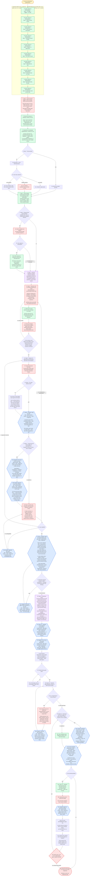

# brainstorm — flow overview

Human-facing flow audit. Non-authoritative — [`../SKILL.md`](../SKILL.md)'s numbered steps win on any conflict; regenerate whenever the flow changes.

```mermaid
flowchart TD
  n1(["1. User runs /brainstorm [path/to/spec]"]):::start

  subgraph seedTaskList["2. Seed the TaskList once, at skill start — one [Reminder] per step, before step 1 runs.<br/>Update each as it completes; the list survives compaction, so nothing is ever re-seeded."]
    direction TB
    n2a["2a. Add to TaskList a [Reminder] for<br/>Step 1 · Pre-flight — toggles + run state"]:::state
    n2b["2b. Add to TaskList a [Reminder] for<br/>Step 2 · Gather starting context"]:::state
    n2c["2c. Add to TaskList a [Reminder] for<br/>Step 3 · Probe scope for sub-projects"]:::state
    n2d["2d. Add to TaskList a [Reminder] for<br/>Step 4 · Interview (Socratic rounds)"]:::state
    n2e["2e. Add to TaskList a [Reminder] for<br/>Step 5 · Propose 2-3 approaches"]:::state
    n2f["2f. Add to TaskList a [Reminder] for<br/>Step 6 · fork writes the spec"]:::state
    n2g["2g. Add to TaskList a [Reminder] for<br/>Step 7 · Self-review the spec"]:::state
    n2h["2h. Add to TaskList a [Reminder] for<br/>Step 8 · Present the spec for review"]:::state
    n2i["2i. Add to TaskList a [Reminder] for<br/>Step 9 · plan-writer writes the plan"]:::state
    n2j["2j. Add to TaskList a [Reminder] for<br/>Step 10 · Self-review, hand off with /clear"]:::state
    n2a --> n2b --> n2c --> n2d --> n2e --> n2f --> n2g --> n2h --> n2i --> n2j
  end

  n3["3. Step 1 · Ask all 3 yes/no toggles in ONE message, before any other question:<br/><br/>Every line traces to an AC? · Right-sized plan? · Fresh-eyes self-review (default yes)?<br/>they gate how strictly steps 7 and 10 check the documents"]:::gate
  n4["4. Persist all 3 answers to /tmp/sdd_&lt;session_id&gt;.json<br/><br/>steps 7 and 10 read them back and never re-ask;<br/>settled before any document exists, so none can be waived for failing"]:::state
  n5["5. Create the run scratchpad /tmp/brainstorm_&lt;session_id&gt;.md<br/><br/>decisions with their why, discarded alternatives, open questions — written as they happen<br/>on resume/after compaction: re-read it first, trust it over recalled context"]:::state

  n6{"6. Step 2 · Path provided?"}
  n6a["6a. Read the provided spec file"]
  n6b["6b. Glob spec_*.md in CWD (top-level)"]
  n6c{"6c. How many matches?"}
  n6c1["6c1. Read the single match"]
  n6c2["6c2. List matches numbered; ask user which to refine"]:::gate
  n6c3["6c3. Zero matches: seed from session context (fresh idea)"]

  n7["7. Step 2 · Check whether a plan already sits beside the resolved spec (the paired path);<br/>record the answer in the run scratchpad — step 9 needs it to update rather than overwrite the plan"]:::state

  n8{"8. Step 3 · Request looks decomposable?<br/>(multiple nouns, roles, or independently-shippable features)"}
  n8a["8a. Name candidate sub-projects;<br/>ask user how they relate and which ships first"]:::gate
  n8b{"8b. User agrees to decompose?"}
  n8b1["8b1. Write scopes.md; brainstorm only the first sub-project here<br/><br/>One line per sub-project: name, purpose, dependency;<br/>it survives the session, so the next run picks up the queue"]:::state

  n9["9. Step 4 · Load test-standards coverage-taxonomy reference<br/>(unconditional, before the FIRST interview round —<br/>its categories shape the questions, not just a final sweep)"]:::skill
  n10["10. Step 4 · Interview: ask 2-3 Socratic questions per round<br/>(AskUserQuestion, recommended answer first)<br/><br/>categories: Background • Goal/KPIs • User Stories • Acceptance Criteria (BDD) • NFR/Technical constraints • Open Questions<br/><br/>split facts (look up yourself) from decisions (ask user)"]:::gate
  n11["11. Write each round's outcome to the scratchpad as it closes<br/><br/>decisions with their why, discarded alternatives with why they lost, open questions"]:::state
  n12["12. Push user through every taxonomy category;<br/>probe corner cases (empty/max/boundary) + failure modes (timeouts/partial/rate-limit)"]:::gate
  n13{"13. Exit criterion met?<br/>(latest round added no new requirement/constraint changes AND every taxonomy category covered or ruled out)"}

  n14["14. Step 5 · Propose 2-3 approaches with trade-offs;<br/>lead with recommendation"]
  n15["15. Get directional pick from user;<br/>the fork later records it plus the discarded alternatives in the spec's Decisions section"]:::gate

  n16{"16. Step 6 · The spec already exists?"}
  n16a["16a. Derive a short kebab-case slug from the feature<br/><br/>never confirmed with the user — it only names two files that travel together,<br/>so a wrong one costs a rename; the plan inherits the same slug, which pairs the two"]
  n17{{"17. Step 6 · Dispatch: Write the spec<br/>fork · inherits session model + full context · serial · foreground<br/><br/>it reads the spec-driven-development library + spec-template, folds the<br/>scratchpad's decisions in, then writes/updates the spec<br/><br/>this session never writes the spec itself — every later edit re-dispatches a fork"}}:::dispatch

  n18{"18. Step 7 · Fresh-eyes self-review toggle on?<br/>(read back from /tmp/sdd_&lt;session_id&gt;.json, never re-asked)"}
  n18a{{"18a. Dispatch: Fresh-eyes review of the spec<br/>deep-reviewer · agent-pinned · serial · foreground<br/>on the spec file ALONE — no plan exists yet<br/><br/>placeholders • contradictions • ambiguity • completeness • human-reviewable<br/>NOT scope (step 3 asked the user) and NOT PR-size/plan-contradiction (no plan)"}}:::dispatch
  n18b{{"18b. Dispatch: Apply the spec review findings<br/>fork · inherits session context · serial · foreground<br/>every blocking finding goes into the spec<br/><br/>runs once per spec-writing pass — a step-8 loop-back through step 6 rewrites<br/>the spec and earns a fresh pass; unchanged text does not, since the user<br/>reading it next is the stronger judge"}}:::dispatch
  n19["19. Step 8 · Give the user the spec's PATH and ask if anything is missing or wrong<br/><br/>no spec summary, no report of what step 7 flagged or fixed —<br/>the user reads the document itself, and a summary is a second version that can contradict it"]:::gate
  n20{"20. User satisfied?"}
  n20a{{"20a. Dispatch: Apply the spec edits<br/>fork · inherits session context · serial · foreground<br/>carrying the exact wording/detail edits"}}:::dispatch

  n21{{"21. Step 9 · Dispatch: Write the implementation plan<br/>plan-writer · agent-pinned · serial · foreground<br/><br/>inputs: spec's absolute path + slug, planning-conventions file if any,<br/>whether a plan already exists at the paired path (from Step 2)<br/>plan-writer resolves the output path itself from the slug; sees only the spec, never this interview<br/><br/>if a plan already exists: update it in place — preserve every task status<br/>marker and everything below the decisions divider<br/><br/>a spec gap NEVER withholds the plan: it writes around the gap and<br/>records it as a **QUESTION:** under the plan's Open Questions"}}:::dispatch
  n22{"22. Returned a gap list instead of a plan?<br/>(unexpected — the agent records gaps rather than refusing)"}
  n22a{{"22a. Dispatch: Record the gaps as Open Questions in the spec<br/>fork · inherits session context · serial · foreground<br/>then re-dispatch plan-writer once — not once per gap"}}:::dispatch

  n23["23. Step 10 · Read spec-driven-development/references/self-review-checks.md now,<br/>and from the second round on also references/delta-scoped-rereview.md<br/>(scopes re-review to what diff shows changed, not both documents whole)<br/><br/>Sort self-review-checks.md's gates into two buckets:<br/>DETERMINISTIC (script/renderer verdict, free to re-run)<br/>NON-DETERMINISTIC (a deep-reviewer judges, one dispatch over both docs)"]:::skill

  n24{{"24. Step 10.1 · Dispatch: Fix the diagrams<br/>mermaid-fixer · model=sonnet · effort=high (overrides its pinned tier) · serial · foreground<br/>leads the density fixer — a repaired diagram adds lines density must then measure"}}:::dispatch
  n25{{"25. Dispatch: Fix over-cap line density<br/>density-fixer · model=sonnet · effort=high (overrides its pinned tier) · serial · foreground<br/>on the spec + plan files — no toggle switches this off"}}:::dispatch
  n26["26. Run the four deterministic scripts serially:<br/>check-ac-coverage.sh · check-test-distribution.sh<br/>check-pr-dag.sh · check-tasks-dag.sh"]
  n27{"27. All deterministic gates pass?"}
  n27a["27a. Fix the failure, then re-run that gate ALONE until it passes"]

  n28["28. Step 10.2 · Read the Open Questions section of BOTH spec and plan"]
  n29{"29. Any **QUESTION:** entry still open?"}
  n29a["29a. Interview the user to settle them<br/>(AskUserQuestion, 2-3 at a time, recommended answer first)<br/><br/>nothing expensive runs while a question is open: a judged gate reads both<br/>docs whole, so it would review a document about to change"]:::gate
  n29b{{"29b. Dispatch: Close the open questions<br/>fork · inherits session context · serial · foreground<br/>folds the answers into both docs, leaving each Open Questions section reading None"}}:::dispatch

  n30{"30. Step 10.3 · Fresh-eyes self-review toggle on?<br/>(same answer as step 7, same file, never re-asked)"}
  n30a{{"30a. Dispatch: Qualitative pass over spec + plan<br/>deep-reviewer · agent-pinned model (opus) · effort=high (overrides its max pin) · serial · foreground<br/>placeholders, contradictions, scope, PR size,<br/>ambiguity, completeness, human-reviewable"}}:::dispatch
  n30b["30b. Note 'qualitative pass skipped by request' in the self-review output"]:::state
  n31{{"31. Run the remaining judged gates serially — each dispatches<br/>deep-reviewer · agent-pinned model (opus) · effort=high (overrides its max pin) · serial · foreground<br/><br/>semantic AC-to-test coverage · 'how would this break?' ·<br/>the 2 toggled checks read from /tmp/sdd_&lt;session_id&gt;.json"}}:::dispatch

  n32{"32. Any blocking finding?"}
  n32a["32a. Step 10.4 · Snapshot both documents into /tmp/sdd-snapshots/<br/>(per delta-scoped-rereview.md) — before any fix lands"]:::state
  n32b["32b. Interview the user to resolve the finding<br/><br/>never invent the resolution, never resolve it silently"]:::gate
  n32c{{"32c. Dispatch: Apply the self-review findings<br/>fork · inherits session context · serial · foreground<br/>applies what the user decided to the spec, the plan, or both"}}:::dispatch
  n32d["32d. Re-run the DETERMINISTIC gates only<br/><br/>the fork's edits can break a DAG or an AC-coverage citation,<br/>and those are free to re-check"]
  n32e["32e. Hand the user a diff of each document against its snapshot<br/><br/>shows what the fork actually changed, and surfaces edits the user made directly"]
  n32f{"32f. Ask the user: re-run the non-deterministic gates, scoped to that diff?"}:::gate
  n33(["33. Hand off: tell the user to run /clear, then invoke /implement<br/><br/>brainstorm never runs /implement itself"]):::gate

  n1 --> n2a
  n2j --> n3
  n3 --> n4
  n4 --> n5
  n5 --> n6

  n6 -->|"yes"| n6a
  n6 -->|"no"| n6b
  n6b --> n6c
  n6c -->|"one match"| n6c1
  n6c -->|"multiple matches"| n6c2
  n6c -->|"zero matches"| n6c3

  n6a --> n7
  n6c1 --> n7
  n6c2 --> n7
  n6c3 --> n7

  n7 --> n8

  n8 -->|"yes"| n8a
  n8 -->|"no"| n9
  n8a --> n8b
  n8b -->|"yes"| n8b1
  n8b -->|"no: whole idea, no narrowing"| n9
  n8b1 --> n9

  n9 --> n10
  n10 --> n11
  n11 --> n12
  n12 --> n13
  n13 -->|"no, more rounds"| n10
  n13 -->|"yes"| n14

  n14 --> n15
  n15 --> n16
  n16 -->|"yes"| n17
  n16 -->|"no"| n16a
  n16a --> n17

  n17 --> n18
  n18 -->|"yes"| n18a
  n18 -->|"no, opted out"| n19
  n18a --> n18b
  n18b --> n19

  n19 --> n20
  n20 -->|"no: wording/detail"| n20a
  n20a --> n19
  n20 -->|"no: missing/wrong requirements"| n10
  n20 -->|"no: approach concerns"| n14
  n20 -->|"yes"| n21

  n21 --> n22
  n22 -->|"yes"| n22a
  n22a --> n21
  n22 -->|"no, plan produced"| n23

  n23 --> n24
  n24 --> n25
  n25 --> n26
  n26 --> n27
  n27 -->|"no"| n27a
  n27a --> n27
  n27 -->|"yes"| n28

  n28 --> n29
  n29 -->|"yes"| n29a
  n29a --> n29b
  n29b --> n28
  n29 -->|"no, both read None"| n30

  n30 -->|"yes"| n30a
  n30 -->|"no, opted out"| n30b
  n30a --> n31
  n30b --> n31
  n31 --> n32

  n32 -->|"no"| n33
  n32 -->|"yes"| n32a
  n32a --> n32b
  n32b --> n32c
  n32c --> n32d
  n32d --> n32e
  n32e --> n32f
  n32f -->|"yes"| n30
  n32f -->|"no, accept as they stand"| n33

  classDef start fill:#fef3c7,stroke:#d97706,stroke-width:2px
  classDef gate fill:#fee2e2,stroke:#dc2626,stroke-width:2px
  classDef dispatch fill:#dbeafe,stroke:#2563eb,stroke-width:2px
  classDef state fill:#dcfce7,stroke:#16a34a,stroke-width:2px
  classDef skill fill:#f3e8ff,stroke:#9333ea,stroke-width:2px
  classDef hook fill:#e5e7eb,stroke:#4b5563,stroke-width:2px
```
