---
# performance-check budget override, not part of the diagram itself.
# This file renders one flow twice — once as pseudo-code, once as a diagram — so
# its size is fixed by the skill's step count, and trimming to the bundled default
# would drop steps from the flow audit or drop a whole rendering.
# Parked in assets/ and never loaded by the model, so its words cost no context.
words-budget: 2048
---

# code-review-pipeline — flow overview

Human-facing overview for auditing the flow at a glance. Non-authoritative — the numbered steps in [`../SKILL.md`](../SKILL.md) win on any conflict. Regenerate this file whenever the skill's flow changes.

Two renderings of the same flow, kept cross-checkable on purpose. The `# N` comments in the pseudo-code are the diagram's node ids, so an id with no matching comment is drift.

## Pseudo-code

Python-shaped for readability only; nothing here runs, and the function names stand for steps this skill performs, not real APIs.

```python
# 1 · Entry: /auto-review (local) or /pr-review (github).
#     Flag --isolate forces the isolated path.
def code_review_pipeline(arg):
    if arg.mode == "local" or arg.isolate:                 # 2
        # 2a · one instance runs the WHOLE pipeline, serial.
        #      Each mode pins its own tier: local's caller
        #      (/auto-review) buys opus judgment, and the
        #      sonnet default covers only github --isolate.
        pin = ("deep-reviewer · opus" if arg.mode == "local"
               else "general-purpose · sonnet · effort inherits")
        return dispatch(pin, arg)
    # 2b · github with no --isolate: run inline in a fresh main session.

    mode, target, language = parse_input_header(arg)       # 3
    load_skill("review-principles.md", "review-checklists.md")   # 4 · grounds every wave

    if mode == "github" and (pr_closed_or_merged() or prior_review_found()):   # 5 · Wave 0
        return abort("PR closed/merged, or a prior review exists")             # 5a

    # 6 · Wave 1 · context prep: mode decides the path
    work_dir = create_work_dir()
    if mode == "github":
        assemble_diff_and_metadata()                       # 6a · pr.diff, changed-files,
                                                             #      pr.json, commit-messages
        if not clone():
            return abort("clone failed")                    # 6a1
        run("extract-commentable-lines.sh", "extract-skipped-files.sh")   # 6b
        if arg.jira_url:
            run("fetch-jira-review-context.sh")   # 6b1 · jira-cli skill, optional
    else:
        # 6c · one script call replaces the old inline git commands;
        #      writes all 7 artifacts Wave 2 needs in a single pass.
        run("prep-local-context.sh", base_ref, work_dir)
        # 6d · repo-wide static checks: lint, typecheck, dead-code,
        #      circular, tests, coverage.
        run_repo_wide_static_checks()

    # 7 · github computes+persists tiny_pr here; local's script (6c)
    #     already wrote it — read either way from disk.
    tiny_pr = added_lines_under_100(work_dir)
    persist(f"{work_dir}/tiny-pr.txt", tiny_pr)

    if tiny_pr:                                            # 8 · tiny_pr
        # 8a · tiny-PR fast-path: load the union of all 8 rubrics'
        #      standards + CLAUDE.md, walk the diff once, tag each
        #      finding with its rubric, emit a 2-sentence summary
        #      instead of the guide, skip Wave 3 entirely.
        load_skill(union_of_specialist_standards(), "CLAUDE.md")
        findings = one_pass_review()
        persist(f"{work_dir}/wave2-guide.md", two_sentence_summary())
        persist(f"{work_dir}/wave3-findings.json", findings)
        goto_wave4()                                       # 8a → 15a
    else:
        # 9 · resume check: an existing specialist-<name>.json means
        #     that rubric already ran — dispatch only what's missing.
        done = {f.stem for f in glob(f"{work_dir}/specialist-*.json")}
        remaining = [s for s in SPECIALISTS_8 if s not in done]

        # 10 · Wave 2 · dispatch every remaining specialist as its own
        #      review-specialist agent, all in one turn, concurrent.
        #      Isolated context each — no specialist sees another's
        #      findings, so dedup can't happen here (moved to 14a).
        dispatch_concurrent("review-specialist · agent-pinned (opus · high)",
                             remaining, one_turn=True)
        # each agent writes $work_dir/specialist-<name>.json

        # 11 · hard guard: an absent file and an empty array are
        #      indistinguishable downstream, so count before merging.
        if count(f"{work_dir}/specialist-*.json") != 8:
            return abort("expected 8 specialist outputs, found fewer")   # 11a

        findings = merge_json(f"{work_dir}/specialist-*.json")           # 12
        persist(f"{work_dir}/wave2-findings.json", findings)

        if mode == "github":                               # 13
            if not exists(f"{work_dir}/wave2-guide.md"):   # 13a
                # 13a1 · github only, max 400 words.
                persist(f"{work_dir}/wave2-guide.md", write_review_guide())
        # 13 · local skips the guide entirely

        if not exists(f"{work_dir}/wave3-findings.json"):  # 14
            # 14a · Wave 3 dedup pre-pass: this is the first step
            #       holding all 8 arrays at once, so cross-specialist
            #       overlap gets resolved here, not inside Wave 2.
            findings = dedup_across_specialists(findings)
            # 14b · per-finding validation: drop false positives,
            #       tighten line anchors. Threshold LOW — keep when
            #       in doubt.
            findings = validate(findings)
            persist(f"{work_dir}/wave3-findings.json", f"{work_dir}/wave3-drop-log.txt")

    if not exists(f"{work_dir}/wave4-findings.json"):      # 15
        # 15a · Wave 4 · drop every finding anchored outside commentable-lines.txt.
        run("filter-off-diff-findings.sh")   # writes wave4-findings.json + wave4-drop-log.txt
        findings = load(f"{work_dir}/wave4-findings.json")

    if not findings:                                       # 16 · the normal outcome
        match mode:                                        # 16a
            case "github": skip_pending_review()           # 16a1 · straight to 22
            case "local":  write_verdict_file("no findings")   # 16a2 · straight to 23
    else:
        match mode:                                        # 17
            case "github":
                # 18 · cap 256 chars / 32 words per line; gap bullets at 80%.
                #      Measures only — nothing here reflows a comment body.
                clean = run("check-density.sh", "check-bullet-gap.py",
                            on=["wave5-comment-*.md", "wave2-guide.md"])
                if not clean:
                    if session_is_calling_not_isolated():  # 18a
                        # 18a1 · one entry per offending file; the user alone
                        #        decides if and when the repair ever runs.
                        file_scout_per_offending_file()
                    else:
                        # 18a2 · a subagent's TaskList write never reaches the
                        #        user, so hand them up for the caller to file.
                        carry_scouts_into_wave6_summary()

                # 19 · one single batch call.
                post_pending_review(build("review-payload.json"))
                if response.status == 422:                 # 20
                    drop_unresolvable_anchors()            # 20a · retry once, same batch shape
                    if retry().status == 422:              # 20a1
                        return stop(report=response.body)  # 20a1a

                # 21 · re-fetch and compare before touching anything else.
                if not (state_is_pending() and comments_match_payload()):
                    # 21a · no GitHub cleanup without the human's go-ahead.
                    return stop("mismatch")
                # 22 · standalone PR comment, from guide-payload.json
                post_review_guide()

            case "local":
                out_file = write(f"verdict_auto-review_{ts}", to=CWD)   # 17a
                # 17a1 · measures only — nothing here reflows the verdict file.
                clean = run("check-density.sh", "check-bullet-gap.py",
                            on=[out_file])
                if not clean:
                    # 17a1a · local mode is always isolated, so its own TaskList
                    #         write would never reach the user who triages it.
                    carry_scouts_into_wave6_summary()

    print(terminal_summary())                              # 23 · Wave 6

    # 24 · The pending review (github) or the verdict file (local) awaits a
    #      human read/submit. Nothing here auto-submits.
    return
```

## Flowchart

```mermaid
flowchart TD
  n1(["1. Invoke /auto-review (local) or /pr-review (github)<br/>flag: --isolate forces isolated path"]):::start
  n2{"2. Mode local, or --isolate passed?"}
  n2a["2a. Dispatch isolated, serial -- one instance runs whole pipeline<br/>local: deep-reviewer · opus (pinned by /auto-review)<br/>github --isolate: general-purpose · sonnet · effort inherits"]:::dispatch
  n2b["2b. Run inline in fresh main session<br/>(github, no --isolate)"]
  n3["3. Parse input header<br/>(mode, PR/branch, language)"]
  n4["4. Load review-principles.md<br/>+ review-checklists.md<br/>(grounds every wave)"]:::skill

  n5{"5. Wave 0 (github-only): PR closed/merged,<br/>or prior review detected?"}
  n5a(["5a. Abort: PR closed/merged<br/>or prior review found"])

  n6{"6. Wave 1: context prep -- Mode?"}

  n6a["6a. github: assemble diff + metadata<br/>(pr.diff, changed-files.txt, pr.json,<br/>commit-messages.txt), clone PR head<br/>into $work_dir/repo"]
  n6a1(["6a1. Abort: clone failed (github-only)"])
  n6b["6b. extract-commentable-lines.sh<br/>extract-skipped-files.sh"]:::hook
  n6b1["6b1. jira-cli skill: fetch-jira-review-context.sh<br/>(github + Jira URL given, optional)"]:::skill

  n6c["6c. local: scripts/prep-local-context.sh --<br/>writes 7 artifacts to $work_dir:<br/>diff, changed-files.txt, commit-messages.txt,<br/>commentable-lines.txt, skipped-binary.txt,<br/>skipped-deleted.txt, tiny-pr.txt"]:::hook
  n6d["6d. local: repo-wide static checks --<br/>lint/typecheck/dead-code/circular,<br/>all test tiers, coverage"]:::hook

  n7["7. tiny_pr = added_lines less than 100,<br/>persisted to $work_dir/tiny-pr.txt<br/>(github computes here; local already<br/>wrote it via 6c)"]:::state

  n8{"8. tiny_pr?"}
  n8a["8a. Tiny-PR fast-path -- read common-preamble.md<br/>+ all 8 specialist files, load union of<br/>per-rubric standards + CLAUDE.md, walk the<br/>diff once tagging findings by rubric; skip<br/>guide writer, emit 2-sentence summary to<br/>wave2-guide.md; persist findings to<br/>wave3-findings.json; skip Wave 3 entirely"]

  n9{"9. $work_dir/specialist-*.json --<br/>which of the 8 rubrics still lack<br/>an output file?"}

  n10["10. Wave 2: dispatch remaining specialists<br/>(of 8 total: correctness, corner-cases,<br/>testing, security, design, ai-slop,<br/>docs, performance) as concurrent<br/>review-specialist agents, one turn --<br/>agent-pinned (opus · high) ∥<br/>each writes specialist-&lt;name&gt;.json"]:::dispatch

  n11{"11. count($work_dir/specialist-*.json)<br/>== 8?"}
  n11a(["11a. Abort: expected 8 specialist<br/>outputs, found fewer"])
  n12["12. jq -s 'add' merge into<br/>wave2-findings.json"]:::state

  n13{"13. Mode local?"}
  n13a{"13a. $work_dir/wave2-guide.md<br/>exists? (github only)"}
  n13a1["13a1. Write Review Guide<br/>(github only, max 400 words)<br/>persist wave2-guide.md"]

  n14{"14. $work_dir/wave3-findings.json<br/>exists?"}
  n14a["14a. Wave 3: dedup pre-pass across all<br/>8 specialist arrays -- same path,<br/>overlapping lines, same underlying<br/>defect = duplicate; keep highest<br/>severity/confidence; log each drop"]
  n14b["14b. Wave 3: per-finding validation --<br/>false-positive check, then line-range<br/>check; threshold LOW -- keep when in doubt<br/>persist wave3-findings.json + wave3-drop-log.txt"]

  n15{"15. $work_dir/wave4-findings.json<br/>exists?"}
  n15a["15a. Wave 4: filter-off-diff-findings.sh<br/>(anchor outside commentable-lines.txt)<br/>persist wave4-findings.json + wave4-drop-log.txt"]:::hook

  n16{"16. Any findings survive Wave 4?"}
  n16a{"16a. Mode?"}
  n16a1["16a1. Skip pending review"]
  n16a2["16a2. Write verdict file:<br/>'no findings'"]:::state

  n17{"17. Mode?"}

  n18["18. check-density.sh + check-bullet-gap.py on<br/>wave5-comment-*.md + wave2-guide.md<br/>(measure only -- nothing reflows a comment body)"]:::hook
  n18a{"18a. Session is<br/>calling (not isolated)?"}
  n18a1["18a1. File ONE Scout TaskList entry per offending file<br/>naming the file and what is off standard<br/>(user alone decides if the repair ever runs)"]:::state
  n18a2["18a2. Carry the same Scouts into the Wave 6 summary<br/>(already a subagent -- its TaskList write<br/>never reaches the user who triages it)"]

  n19["19. Build review-payload.json,<br/>POST pending review (single batch call)"]:::state
  n20{"20. POST returned 422?"}
  n20a["20a. Drop unresolvable anchors,<br/>retry once (same batch shape)"]
  n20a1{"20a1. Retry also failed?"}
  n20a1a(["20a1a. Stop: report 422 body to user"]):::gate

  n21{"21. Re-fetched state is PENDING<br/>and comments match payload?"}
  n21a(["21a. Stop: report mismatch,<br/>no GitHub cleanup without go-ahead"]):::gate

  n22["22. Post Review Guide as<br/>standalone PR comment<br/>(guide-payload.json)"]:::state

  n17a["17a. Write verdict_auto-review_TIMESTAMP<br/>file to CWD"]:::state
  n17a1["17a1. check-density.sh + check-bullet-gap.py on out_file<br/>(measure only -- nothing reflows the verdict file)"]:::hook
  n17a1a["17a1a. Carry the flagged lines into the Wave 6 summary<br/>(local mode is always isolated -- its TaskList<br/>write never reaches the user who triages it)"]

  n23["23. Wave 6: print terminal summary"]
  n24(["24. Pending review (github) or verdict file (local)<br/>awaits human read/submit -- nothing auto-submits"]):::gate

  n1 --> n2
  n2 -->|"local, or --isolate"| n2a
  n2 -->|"github, no --isolate"| n2b
  n2a --> n3
  n2b --> n3
  n3 --> n4
  n4 --> n5

  n5 -->|"yes (github)"| n5a
  n5 -->|"no (github) / no-op (local)"| n6

  n6 -->|"github"| n6a
  n6a -->|"clone fails"| n6a1
  n6a -->|"clone ok"| n6b
  n6b -.->|"github + Jira URL given"| n6b1
  n6b --> n7
  n6b1 --> n7

  n6 -->|"local"| n6c
  n6c --> n6d
  n6d --> n7

  n7 --> n8
  n8 -->|"yes"| n8a
  n8 -->|"no"| n9
  n8a --> n15a

  n9 -->|"some rubrics missing an output file"| n10
  n9 -->|"all 8 already done (resumed)"| n10
  n10 --> n11
  n11 -->|"count != 8"| n11a
  n11 -->|"count == 8"| n12
  n12 --> n13

  n13 -->|"yes, skip guide"| n14
  n13 -->|"no, github"| n13a
  n13a -->|"yes -- load persisted guide"| n14
  n13a -->|"no"| n13a1
  n13a1 --> n14

  n14 -->|"yes -- skip Wave 3"| n15
  n14 -->|"no"| n14a
  n14a --> n14b
  n14b --> n15

  n15 -->|"yes -- skip Wave 4"| n16
  n15 -->|"no"| n15a
  n15a --> n16

  n16 -->|"none (normal outcome)"| n16a
  n16 -->|"some"| n17

  n16a -->|"github"| n16a1
  n16a -->|"local"| n16a2
  n16a1 --> n22
  n16a2 --> n23

  n17 -->|"github"| n18
  n17 -->|"local"| n17a

  n18 -->|"violations found"| n18a
  n18 -->|"clean"| n19
  n18a -->|"yes"| n18a1
  n18a -->|"no, already isolated"| n18a2
  n18a1 --> n19
  n18a2 --> n19

  n19 --> n20
  n20 -->|"no"| n21
  n20 -->|"yes"| n20a
  n20a --> n20a1
  n20a1 -->|"yes"| n20a1a
  n20a1 -->|"no"| n21

  n21 -->|"yes"| n22
  n21 -->|"no"| n21a

  n22 --> n23

  n17a --> n17a1
  n17a1 -->|"violations found"| n17a1a
  n17a1 -->|"clean"| n23
  n17a1a --> n23

  n23 --> n24

  classDef start fill:#fef3c7,stroke:#d97706,stroke-width:2px
  classDef gate fill:#fee2e2,stroke:#dc2626,stroke-width:2px
  classDef dispatch fill:#dbeafe,stroke:#2563eb,stroke-width:2px
  classDef state fill:#dcfce7,stroke:#16a34a,stroke-width:2px
  classDef skill fill:#f3e8ff,stroke:#9333ea,stroke-width:2px
  classDef hook fill:#e5e7eb,stroke:#4b5563,stroke-width:2px
```


