---
# performance-check budget override, not part of the diagram itself.
# This file renders one flow twice — once as pseudo-code, once as a diagram — so
# its size is fixed by the skill's step count, and trimming to the bundled default
# would drop steps from the flow audit or drop a whole rendering.
# Parked in assets/ and never loaded by the model, so its words cost no context.
words-budget: 2048
---

# code-review-pipeline — flow overview

Human-facing overview for auditing the flow at a glance. Non-authoritative — the numbered steps in [`../SKILL.md`](../SKILL.md) win on any conflict. Regenerate this file whenever the skill's flow changes.

Two renderings of the same flow, kept cross-checkable on purpose. The `# N` comments in the pseudo-code are the diagram's node ids, so an id with no matching comment is drift.

## Pseudo-code

Python-shaped for readability only; nothing here runs, and the function names stand for steps this skill performs, not real APIs.

```python
# 1 · Entry: /auto-review (local) or /pr-review (github).
#     Flag --isolate forces the isolated path.
def code_review_pipeline(arg):
    if arg.mode == "local" or arg.isolate:                 # 2
        # 2a · one instance runs the WHOLE pipeline, serial.
        return dispatch("general-purpose · sonnet · effort inherits", arg)
    # 2b · github with no --isolate: run inline in a fresh main session.

    mode, target, language = parse_input_header(arg)       # 3
    load_skill("review-principles.md", "review-checklists.md")   # 4 · grounds every wave

    if mode == "github" and (pr_closed_or_merged() or prior_review_found()):   # 5 · Wave 0
        return abort("PR closed/merged, or a prior review exists")             # 5a

    # ---- 6 · Wave 1 · context prep: create $work_dir, clone/diff,
    #      commentable-lines, skipped-files ----
    work_dir = create_work_dir()
    if not clone():
        return abort("clone failed")                       # 6c · github-only
    run("extract-commentable-lines.sh", "extract-skipped-files.sh")   # 7
    if mode == "github" and arg.jira_url:
        run("fetch-jira-review-context.sh")   # 6a · jira-cli skill, optional
    if mode == "local":
        # 6b · repo-wide static checks: lint, typecheck, dead-code, circular,
        #      tests, coverage.
        run_repo_wide_static_checks()

    # 8 · persist to $work_dir: diff, changed-files, commit-messages,
    #     commentable-lines, skipped-files.
    persist(work_dir, diff, changed_files, commit_messages, commentable, skipped)

    if added_lines() < 100:                                # 9 · tiny_pr
        # 9a · tiny-PR fast-path: one pass, a 2-sentence summary,
        #      skipping the guide writer AND Wave 3 — it jumps straight to 15a.
        findings = one_pass_review()
        goto_wave4()                                       # 9a → 15a
    else:
        # 10 · via the Skill tool, plus the repo's own CLAUDE.md.
        load_skill("code-standards", "test-standards", "doc-standards")
        read("<repo>/CLAUDE.md")

        # 11 · a persisted progress file means resume after the last completed
        #      specialist; absent, start at correctness.
        done = read_or_empty(f"{work_dir}/wave2-progress.txt")

        # 12 · Wave 2 · the 8 specialists: correctness, corner-cases, testing,
        #      security, design, ai-slop, docs, performance.
        for specialist in SPECIALISTS_8[len(done):]:
            findings += specialist.run()   # 60-80% confidence emits a QUESTION tag
            # persist BEFORE moving to the next specialist
            persist(f"{work_dir}/wave2-findings.json", f"{work_dir}/wave2-progress.txt")

        if mode == "github":                               # 13
            if not exists(f"{work_dir}/wave2-guide.md"):   # 13a
                # 13a1 · github only, max 400 words.
                persist(f"{work_dir}/wave2-guide.md", write_review_guide())
        # 13 · local skips the guide entirely

        if not exists(f"{work_dir}/wave3-findings.json"):  # 14
            # 14a · Wave 3 · batched validation: drop false positives, tighten
            #       lines. Threshold LOW — keep the finding when in doubt.
            findings = validate(findings)
            persist(f"{work_dir}/wave3-findings.json", f"{work_dir}/drop-log.txt")

    if not exists(f"{work_dir}/wave4-findings.json"):      # 15
        # 15a · Wave 4 · drop every finding anchored outside commentable-lines.txt.
        findings = [f for f in findings if f.anchor in commentable_lines()]
        persist(f"{work_dir}/wave4-findings.json", findings)

    if not findings:                                       # 16 · the normal outcome
        match mode:                                        # 16a
            case "github": skip_pending_review()           # 16a1 · straight to 22
            case "local":  write_verdict_file("no findings")   # 16a2 · straight to 23
    else:
        match mode:                                        # 17
            case "github":
                # 18 · cap 256 chars / 32 words per line; gap bullets at 80%.
                clean = run("check-density.sh", "check-bullet-gap.py",
                            on=["wave5-comment-*.md", "wave2-guide.md"])
                if not clean:
                    if session_is_calling_not_isolated():  # 18a
                        # 18a1 · agent-pinned, serial; splits over-cap lines and
                        #        gaps bullets, looping internally until both exit 0.
                        dispatch("markdown-standards-fixer")
                    else:
                        # 18a2 · already a subagent, so no re-spawn — fix inline,
                        #        looping until both exit 0.
                        fix_inline_until_clean()

                # 19 · one single batch call.
                post_pending_review(build("review-payload.json"))
                if response.status == 422:                 # 20
                    drop_unresolvable_anchors()            # 20a · retry once, same batch shape
                    if retry().status == 422:              # 20a1
                        return stop(report=response.body)  # 20a1a

                # 21 · re-fetch and compare before touching anything else.
                if not (state_is_pending() and comments_match_payload()):
                    # 21a · no GitHub cleanup without the human's go-ahead.
                    return stop("mismatch")
                # 22 · standalone PR comment, from guide-payload.json
                post_review_guide()

            case "local":
                out_file = write(f"verdict_auto-review_{ts}", to=CWD)   # 17a
                while not run("check-density.sh", out_file):            # 17a1
                    # 17a1a · local mode is always isolated, so fix inline,
                    #         looping until exit 0.
                    fix_density_inline()

    print(terminal_summary())                              # 23 · Wave 6

    # 24 · The pending review (github) or the verdict file (local) awaits a
    #      human read/submit. Nothing here auto-submits.
    return
```

## Flowchart

```mermaid
flowchart TD
  n1(["1. Invoke /auto-review (local) or /pr-review (github)<br/>flag: --isolate forces isolated path"]):::start
  n2{"2. Mode local, or --isolate passed?"}
  n2a["2a. Dispatch general-purpose · sonnet · effort inherits<br/>serial -- one instance runs whole pipeline"]:::dispatch
  n2b["2b. Run inline in fresh main session<br/>(github, no --isolate)"]
  n3["3. Parse input header<br/>(mode, PR/branch, language)"]
  n4["4. Load review-principles.md<br/>+ review-checklists.md<br/>(grounds every wave)"]:::skill

  n5{"5. Wave 0 (github-only): PR closed/merged,<br/>or prior review detected?"}
  n5a(["5a. Abort: PR closed/merged<br/>or prior review found"])

  n6["6. Wave 1: context prep<br/>create $work_dir, clone/diff,<br/>commentable-lines, skipped-files"]
  n7["7. extract-commentable-lines.sh<br/>extract-skipped-files.sh"]:::hook
  n6a["6a. jira-cli skill: fetch-jira-review-context.sh<br/>(github + Jira URL given, optional)"]:::skill
  n6b["6b. Repo-wide static checks<br/>lint/typecheck/dead-code/circular,<br/>tests, coverage (local mode only)"]:::hook
  n6c(["6c. Abort: clone failed"])
  n8["8. Persist to $work_dir:<br/>diff, changed-files, commit-messages,<br/>commentable-lines, skipped-files"]:::state

  n9{"9. added_lines less than 100?<br/>(tiny_pr)"}
  n9a["9a. Tiny-PR fast-path:<br/>one pass, 2-sentence summary,<br/>skip guide writer and Wave 3"]

  n10["10. Invoke code-standards, test-standards,<br/>doc-standards via Skill tool<br/>+ read repo CLAUDE.md"]:::skill
  n11{"11. $work_dir/wave2-progress.txt<br/>exists?"}
  n12["12. Wave 2: run next specialist<br/>(8 total: correctness, corner-cases,<br/>testing, security, design, ai-slop,<br/>docs, performance)<br/><br/>60-80% confidence emitted as QUESTION tag;<br/>persist wave2-findings.json + progress.txt<br/>before each next specialist"]

  n13{"13. Mode local?"}
  n13a{"13a. $work_dir/wave2-guide.md<br/>exists? (github only)"}
  n13a1["13a1. Write Review Guide<br/>(github only, max 400 words)<br/>persist wave2-guide.md"]

  n14{"14. $work_dir/wave3-findings.json<br/>exists?"}
  n14a["14a. Wave 3: batched validation<br/>(drop false positives, tighten lines)<br/>threshold LOW -- keep when in doubt<br/>persist wave3-findings.json + drop-log.txt"]

  n15{"15. $work_dir/wave4-findings.json<br/>exists?"}
  n15a["15a. Wave 4: drop off-diff findings<br/>(anchor outside commentable-lines.txt)<br/>persist wave4-findings.json"]

  n16{"16. Any findings survive Wave 4?"}
  n16a{"16a. Mode?"}
  n16a1["16a1. Skip pending review"]
  n16a2["16a2. Write verdict file:<br/>'no findings'"]:::state

  n17{"17. Mode?"}

  n18["18. check-density.sh + check-bullet-gap.py on<br/>wave5-comment-*.md + wave2-guide.md<br/>(cap: 256 chars / 32 words per line; gap at 80%)"]:::hook
  n18a1["18a1. Dispatch markdown-standards-fixer · agent-pinned · serial<br/>splits over-cap lines and gaps bullets,<br/>loops internally until both exit 0"]:::dispatch
  n18a2["18a2. Fix doc-standards violations inline<br/>(already a subagent, no re-spawn)<br/>loop until both exit 0"]

  n19["19. Build review-payload.json,<br/>POST pending review (single batch call)"]:::state
  n20{"20. POST returned 422?"}
  n20a["20a. Drop unresolvable anchors,<br/>retry once (same batch shape)"]
  n20a1{"20a1. Retry also failed?"}
  n20a1a(["20a1a. Stop: report 422 body to user"]):::gate

  n21{"21. Re-fetched state is PENDING<br/>and comments match payload?"}
  n21a(["21a. Stop: report mismatch,<br/>no GitHub cleanup without go-ahead"]):::gate

  n22["22. Post Review Guide as<br/>standalone PR comment<br/>(guide-payload.json)"]:::state

  n17a["17a. Write verdict_auto-review_TIMESTAMP<br/>file to CWD"]:::state
  n17a1["17a1. check-density.sh on out_file"]:::hook
  n17a1a["17a1a. Fix density violations inline<br/>(local mode is always isolated)<br/>loop until exit 0"]

  n23["23. Wave 6: print terminal summary"]
  n24(["24. Pending review (github) or verdict file (local)<br/>awaits human read/submit -- nothing auto-submits"]):::gate

  n1 --> n2
  n2 -->|"local, or --isolate"| n2a
  n2 -->|"github, no --isolate"| n2b
  n2a --> n3
  n2b --> n3
  n3 --> n4
  n4 --> n5

  n5 -->|"yes (github)"| n5a
  n5 -->|"no (github) / no-op (local)"| n6

  n6 --> n7
  n6 -.->|"github + Jira URL given"| n6a
  n6 -.->|"local mode only"| n6b
  n6 -->|"clone fails (github-only)"| n6c
  n7 --> n8
  n6a --> n8
  n6b --> n8
  n8 --> n9

  n9 -->|"yes"| n9a
  n9 -->|"no"| n10
  n10 --> n11
  n11 -->|"yes -- resume after last<br/>completed specialist"| n12
  n11 -->|"no -- start at correctness"| n12

  n12 -->|"next specialist"| n12
  n12 -->|"all 8 done"| n13

  n9a --> n15a

  n13 -->|"yes, skip guide"| n14
  n13 -->|"no, github"| n13a
  n13a -->|"yes -- load persisted guide"| n14
  n13a -->|"no"| n13a1
  n13a1 --> n14

  n14 -->|"yes -- skip Wave 3"| n15
  n14 -->|"no"| n14a
  n14a --> n15

  n15 -->|"yes -- skip Wave 4"| n16
  n15 -->|"no"| n15a
  n15a --> n16

  n16 -->|"none (normal outcome)"| n16a
  n16 -->|"some"| n17

  n16a -->|"github"| n16a1
  n16a -->|"local"| n16a2
  n16a1 --> n22
  n16a2 --> n23

  n17 -->|"github"| n18
  n17 -->|"local"| n17a

  n18 -->|"violations found"| n18a{"18a. Session is<br/>calling (not isolated)?"}
  n18 -->|"clean"| n19
  n18a -->|"yes"| n18a1
  n18a -->|"no, already isolated"| n18a2
  n18a1 --> n19
  n18a2 --> n19

  n19 --> n20
  n20 -->|"no"| n21
  n20 -->|"yes"| n20a
  n20a --> n20a1
  n20a1 -->|"yes"| n20a1a
  n20a1 -->|"no"| n21

  n21 -->|"yes"| n22
  n21 -->|"no"| n21a

  n22 --> n23

  n17a --> n17a1
  n17a1 -->|"violations found"| n17a1a
  n17a1 -->|"clean"| n23
  n17a1a --> n23

  n23 --> n24

  classDef start fill:#fef3c7,stroke:#d97706,stroke-width:2px
  classDef gate fill:#fee2e2,stroke:#dc2626,stroke-width:2px
  classDef dispatch fill:#dbeafe,stroke:#2563eb,stroke-width:2px
  classDef state fill:#dcfce7,stroke:#16a34a,stroke-width:2px
  classDef skill fill:#f3e8ff,stroke:#9333ea,stroke-width:2px
  classDef hook fill:#e5e7eb,stroke:#4b5563,stroke-width:2px
```


