---
# performance-check budget overrides, not part of the diagram itself.
# This file renders one flow twice — once as pseudo-code, once as a diagram — so
# its size is fixed by the skill's step count, and trimming to the bundled default
# would drop steps from the flow audit or drop a whole rendering.
# Parked in assets/ and never loaded by the model, so its words cost no context.
words-budget: 2048
lines-budget: 512
---

# code-review-pipeline — flow overview

Human-facing overview for auditing the flow at a glance. Non-authoritative — the numbered steps in [`../SKILL.md`](../SKILL.md) win on any conflict. Regenerate this file whenever the skill's flow changes.

Two renderings of the same flow, kept cross-checkable on purpose. The `# N` comments in the pseudo-code are the diagram's node ids, so an id with no matching comment is drift.

## Pseudo-code

Python-shaped for readability only; nothing here runs, and the function names stand for steps this skill performs, not real APIs.

```python
# 1 · Entry: /auto-review (local) or /pr-review (github).
#     Flag --isolate forces the isolated path.
def code_review_pipeline(arg):
    if arg.mode == "local" or arg.isolate:                 # 2
        # 2a · one instance runs the WHOLE pipeline, serial.
        #      Each mode pins its own tier: local's caller
        #      (/auto-review) buys opus judgment, and the
        #      sonnet default covers only github --isolate.
        pin = ("code-reviewer · opus" if arg.mode == "local"
               else "general-purpose · sonnet · effort inherits")
        return dispatch(pin, arg)
    # 2b · github with no --isolate: run inline in a fresh main session.

    mode, target, language = parse_input_header(arg)       # 3
    load_skill("review-principles.md", "review-checklists.md")   # 4 · grounds every wave

    if mode == "github" and (pr_closed_or_merged() or prior_review_found()):   # 5 · Wave 0
        return abort("PR closed/merged, or a prior review exists")             # 5a

    # 6 · Wave 1 · context prep: mode decides the path
    work_dir = create_work_dir()
    if mode == "github":
        assemble_diff_and_metadata()                       # 6a · pr.diff, changed-files,
                                                             #      pr.json, commit-messages
        if not clone():
            return abort("clone failed")                    # 6a1
        run("extract-commentable-lines.sh", "extract-skipped-files.sh")   # 6b
        if arg.jira_url:
            run("fetch-jira-review-context.sh")   # 6b1 · jira-cli skill, optional
    else:
        # 6c · one script call replaces the old inline git commands;
        #      writes all 7 artifacts Wave 2 needs in a single pass.
        run("prep-local-context.sh", base_ref, work_dir)
        # 6d · repo-wide static checks: lint, typecheck, dead-code,
        #      circular, tests, coverage.
        run_repo_wide_static_checks()

    # 7 · github computes+persists tiny_pr here; local's script (6c)
    #     already wrote it -- read either way from disk. tiny_pr no
    #     longer bypasses Wave 2; it only shrinks the guide (13b) and
    #     skips Wave 3's validator (14a).
    tiny_pr = added_lines_under_100(work_dir)
    persist(f"{work_dir}/tiny-pr.txt", tiny_pr)

    # 8 · Wave 2 resume check: an existing wave2-lens-<name>.json means
    #     that lens already ran -- review only what's missing.
    done = {f.stem for f in glob(f"{work_dir}/wave2-lens-*.json")}
    remaining = [lens for lens in LENSES_8 if lens not in done]

    if remaining:                                           # 9
        # 9a · Wave 2 setup (once): read common-preamble.md + all 8
        #      specialists/*.md files in one message; load code-standards
        #      + CLAUDE.md up front -- every lens cites them.
        load_skill("common-preamble.md", "specialists/*.md",
                    "code-standards", "CLAUDE.md")
        # 10 · one inline pass, sequential -- no subagent dispatch, no
        #      fan-out. Each lens walks the diff once, tags findings
        #      scope_tag=<lens>, writes its own file so a mid-pass
        #      compaction resumes from the next unfinished lens.
        for lens in remaining:
            findings = review_one_lens(lens)
            persist(f"{work_dir}/wave2-lens-{lens}.json", findings)

    # 11 · hard guard: an absent file and an empty array are
    #      indistinguishable downstream, so count before merging.
    if count(f"{work_dir}/wave2-lens-*.json") != 8:
        return abort("expected 8 lens outputs, found fewer")   # 11a

    findings = merge_json(f"{work_dir}/wave2-lens-*.json")      # 12 · jq -s add
    persist(f"{work_dir}/wave2-findings.json", findings)
    # dedup is NOT done here -- one pass applying eight lenses over the
    # same diff can still flag one defect twice under two scope_tags;
    # Wave 3 (14b) resolves overlaps with the full merged list in hand.

    if mode == "local":                                     # 13
        pass   # local skips the guide entirely -> Wave 3
    elif exists(f"{work_dir}/wave2-guide.md"):                # 13a
        pass   # already written -- resume
    elif tiny_pr:                                            # 13b
        persist(f"{work_dir}/wave2-guide.md", two_sentence_summary())   # 13b1
    else:
        # 13b2 · github only, max 400 words.
        persist(f"{work_dir}/wave2-guide.md", write_review_guide())

    if exists(f"{work_dir}/wave3-findings.json"):             # 14
        pass   # already completed -- resume straight to Wave 4
    elif tiny_pr:                                             # 14a
        # 14a1 · tiny_pr skips the validator pass entirely -- at <100
        #        added lines the change is in context and hallucinations
        #        are rare, so the per-finding validator costs more than
        #        it saves. Straight copy-through instead.
        persist(f"{work_dir}/wave3-findings.json", findings)
        persist(f"{work_dir}/wave3-drop-log.txt", "")
    else:
        # 14b · Wave 3 dedup pre-pass: first step holding all 8 lens
        #       arrays at once, so cross-lens overlap gets resolved
        #       here, not inside Wave 2.
        findings = dedup_across_lenses(findings)
        # 14c · per-finding validation: drop false positives, tighten
        #       line anchors. Threshold LOW -- keep when in doubt.
        findings = validate(findings)
        persist(f"{work_dir}/wave3-findings.json", f"{work_dir}/wave3-drop-log.txt")

    if not exists(f"{work_dir}/wave4-findings.json"):      # 15
        # 15a · Wave 4 · drop every finding anchored outside commentable-lines.txt.
        run("filter-off-diff-findings.sh")   # writes wave4-findings.json + wave4-drop-log.txt
        findings = load(f"{work_dir}/wave4-findings.json")

    if not findings:                                       # 16 · the normal outcome
        match mode:                                        # 16a
            case "github": skip_pending_review()           # 16a1 · straight to 22
            case "local":  write_verdict_file("no findings")   # 16a2 · straight to 23
    else:
        match mode:                                        # 17
            case "github":
                # 19 · one single batch call.
                post_pending_review(build("review-payload.json"))
                if response.status == 422:                 # 20
                    drop_unresolvable_anchors()            # 20a · retry once, same batch shape
                    if retry().status == 422:              # 20a1
                        return stop(report=response.body)  # 20a1a

                # 21 · re-fetch and compare before touching anything else.
                if not (state_is_pending() and comments_match_payload()):
                    # 21a · no GitHub cleanup without the human's go-ahead.
                    return stop("mismatch")
                # 22 · standalone PR comment, from guide-payload.json
                post_review_guide()

            case "local":
                out_file = write(f"verdict_auto-review_{ts}", to=CWD)   # 17a

    print(terminal_summary())                              # 23 · Wave 6

    # 24 · The pending review (github) or the verdict file (local) awaits a
    #      human read/submit. Nothing here auto-submits.
    return
```

## Flowchart

```mermaid
flowchart TD
  n1(["1. Invoke /auto-review (local) or /pr-review (github)<br/>flag: --isolate forces isolated path"]):::start
  n2{"2. Mode local, or --isolate passed?"}
  n2a["2a. Dispatch isolated, serial -- one instance runs whole pipeline<br/>local: code-reviewer · opus (pinned by /auto-review)<br/>github --isolate: general-purpose · sonnet · effort inherits"]:::dispatch
  n2b["2b. Run inline in fresh main session<br/>(github, no --isolate)"]
  n3["3. Parse input header<br/>(mode, PR/branch, language)"]
  n4["4. Load review-principles.md<br/>+ review-checklists.md<br/>(grounds every wave)"]:::skill

  n5{"5. Wave 0 (github-only): PR closed/merged,<br/>or prior review detected?"}
  n5a(["5a. Abort: PR closed/merged<br/>or prior review found"])

  n6{"6. Wave 1: context prep -- Mode?"}

  n6a["6a. github: assemble diff + metadata<br/>(pr.diff, changed-files.txt, pr.json,<br/>commit-messages.txt), clone PR head<br/>into $work_dir/repo"]
  n6a1(["6a1. Abort: clone failed (github-only)"])
  n6b["6b. extract-commentable-lines.sh<br/>extract-skipped-files.sh"]:::hook
  n6b1["6b1. jira-cli skill: fetch-jira-review-context.sh<br/>(github + Jira URL given, optional)"]:::skill

  n6c["6c. local: scripts/prep-local-context.sh --<br/>writes 7 artifacts to $work_dir:<br/>diff, changed-files.txt, commit-messages.txt,<br/>commentable-lines.txt, skipped-binary.txt,<br/>skipped-deleted.txt, tiny-pr.txt"]:::hook
  n6d["6d. local: repo-wide static checks --<br/>lint/typecheck/dead-code/circular,<br/>all test tiers, coverage"]:::hook

  n7["7. tiny_pr = added_lines less than 100,<br/>persisted to $work_dir/tiny-pr.txt<br/>(github computes here; local already<br/>wrote it via 6c) -- only shrinks the<br/>guide (13b) and skips Wave 3 (14a),<br/>never bypasses Wave 2"]:::state

  n8["8. Wave 2 resume check -- list<br/>$work_dir/wave2-lens-*.json,<br/>compute which of the 8 lenses<br/>still lack an output file"]

  n9{"9. Any lenses remaining?"}
  n9a["9a. Wave 2 setup (once) -- read<br/>common-preamble.md + all 8<br/>specialists/*.md files, load<br/>code-standards + CLAUDE.md up front"]:::skill
  n10["10. Wave 2: one inline pass, sequential --<br/>no subagent dispatch, no fan-out.<br/>For each remaining lens (of 8: correctness,<br/>corner-cases, testing, security, design,<br/>ai-slop, docs, performance): walk the diff<br/>once, tag findings scope_tag=&lt;lens&gt;,<br/>write wave2-lens-&lt;name&gt;.json"]

  n11{"11. count($work_dir/wave2-lens-*.json)<br/>== 8?"}
  n11a(["11a. Abort: expected 8 lens<br/>outputs, found fewer"])
  n12["12. jq -s 'add' merge into<br/>wave2-findings.json"]:::state

  n13{"13. Mode local?"}
  n13a{"13a. $work_dir/wave2-guide.md<br/>exists? (github only)"}
  n13b{"13b. tiny_pr? (github, guide<br/>not yet written)"}
  n13b1["13b1. Emit 2-sentence change summary<br/>persist wave2-guide.md"]
  n13b2["13b2. Write Review Guide<br/>(github only, max 400 words)<br/>persist wave2-guide.md"]

  n14{"14. $work_dir/wave3-findings.json<br/>exists?"}
  n14a{"14a. tiny_pr? (not yet<br/>completed)"}
  n14a1["14a1. Copy wave2-findings.json to<br/>wave3-findings.json verbatim,<br/>write empty wave3-drop-log.txt --<br/>skip the validator entirely"]
  n14b["14b. Wave 3: dedup pre-pass across all<br/>8 lens arrays -- same path,<br/>overlapping lines, same underlying<br/>defect = duplicate; keep highest<br/>severity/confidence; log each drop"]
  n14c["14c. Wave 3: per-finding validation --<br/>false-positive check, then line-range<br/>check; threshold LOW -- keep when in doubt<br/>persist wave3-findings.json + wave3-drop-log.txt"]

  n15{"15. $work_dir/wave4-findings.json<br/>exists?"}
  n15a["15a. Wave 4: filter-off-diff-findings.sh<br/>(anchor outside commentable-lines.txt)<br/>persist wave4-findings.json + wave4-drop-log.txt"]:::hook

  n16{"16. Any findings survive Wave 4?"}
  n16a{"16a. Mode?"}
  n16a1["16a1. Skip pending review"]
  n16a2["16a2. Write verdict file:<br/>'no findings'"]:::state

  n17{"17. Mode?"}

  n19["19. Build review-payload.json,<br/>POST pending review (single batch call)"]:::state
  n20{"20. POST returned 422?"}
  n20a["20a. Drop unresolvable anchors,<br/>retry once (same batch shape)"]
  n20a1{"20a1. Retry also failed?"}
  n20a1a(["20a1a. Stop: report 422 body to user"]):::gate

  n21{"21. Re-fetched state is PENDING<br/>and comments match payload?"}
  n21a(["21a. Stop: report mismatch,<br/>no GitHub cleanup without go-ahead"]):::gate

  n22["22. Post Review Guide as<br/>standalone PR comment<br/>(guide-payload.json)"]:::state

  n17a["17a. Write verdict_auto-review_TIMESTAMP<br/>file to CWD"]:::state

  n23["23. Wave 6: print terminal summary"]
  n24(["24. Pending review (github) or verdict file (local)<br/>awaits human read/submit -- nothing auto-submits"]):::gate

  n1 --> n2
  n2 -->|"local, or --isolate"| n2a
  n2 -->|"github, no --isolate"| n2b
  n2a --> n3
  n2b --> n3
  n3 --> n4
  n4 --> n5

  n5 -->|"yes (github)"| n5a
  n5 -->|"no (github) / no-op (local)"| n6

  n6 -->|"github"| n6a
  n6a -->|"clone fails"| n6a1
  n6a -->|"clone ok"| n6b
  n6b -.->|"github + Jira URL given"| n6b1
  n6b --> n7
  n6b1 --> n7

  n6 -->|"local"| n6c
  n6c --> n6d
  n6d --> n7

  n7 --> n8
  n8 --> n9
  n9 -->|"yes -- some lenses remaining"| n9a
  n9a --> n10
  n10 --> n11
  n9 -->|"no -- all 8 already done (resumed)"| n11

  n11 -->|"count != 8"| n11a
  n11 -->|"count == 8"| n12
  n12 --> n13

  n13 -->|"yes, skip guide"| n14
  n13 -->|"no, github"| n13a
  n13a -->|"yes -- already written, resume"| n14
  n13a -->|"no"| n13b
  n13b -->|"yes"| n13b1
  n13b -->|"no"| n13b2
  n13b1 --> n14
  n13b2 --> n14

  n14 -->|"yes -- already completed, resume"| n15
  n14 -->|"no"| n14a
  n14a -->|"yes"| n14a1
  n14a -->|"no"| n14b
  n14a1 --> n15
  n14b --> n14c
  n14c --> n15

  n15 -->|"yes -- skip Wave 4"| n16
  n15 -->|"no"| n15a
  n15a --> n16

  n16 -->|"none (normal outcome)"| n16a
  n16 -->|"some"| n17

  n16a -->|"github"| n16a1
  n16a -->|"local"| n16a2
  n16a1 --> n22
  n16a2 --> n23

  n17 -->|"github"| n19
  n17 -->|"local"| n17a

  n19 --> n20
  n20 -->|"no"| n21
  n20 -->|"yes"| n20a
  n20a --> n20a1
  n20a1 -->|"yes"| n20a1a
  n20a1 -->|"no"| n21

  n21 -->|"yes"| n22
  n21 -->|"no"| n21a

  n22 --> n23

  n17a --> n23

  n23 --> n24

  classDef start fill:#fef3c7,stroke:#d97706,stroke-width:2px
  classDef gate fill:#fee2e2,stroke:#dc2626,stroke-width:2px
  classDef dispatch fill:#dbeafe,stroke:#2563eb,stroke-width:2px
  classDef state fill:#dcfce7,stroke:#16a34a,stroke-width:2px
  classDef skill fill:#f3e8ff,stroke:#9333ea,stroke-width:2px
  classDef hook fill:#e5e7eb,stroke:#4b5563,stroke-width:2px
```


