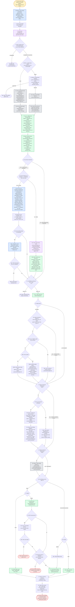

---
# performance-check budget overrides, not part of the diagram itself.
# This file renders one flow twice — once as pseudo-code, once as a diagram — so
# its size is fixed by the skill's step count, and trimming to the bundled default
# would drop steps from the flow audit or drop a whole rendering.
# Parked in assets/ and never loaded by the model, so its words cost no context.
words-budget: 4096
lines-budget: 512
---

# code-review-pipeline — flow overview

Human-facing overview for auditing the flow at a glance. Non-authoritative — the numbered steps in [`../SKILL.md`](../SKILL.md) win on any conflict. Regenerate this file whenever the skill's flow changes.

Two renderings of the same flow, kept cross-checkable on purpose. The `# N` comments in the pseudo-code are the diagram's node ids, so an id with no matching comment is drift.

## Pseudo-code

Python-shaped for readability only; nothing here runs, and the function names stand for steps this skill performs, not real APIs.

```python
# 1 · Entry: /auto-review (local) or /pr-review (github) resolves its input header.
def caller(arg):
    # 2 · one code-reviewer orchestrator runs the WHOLE pipeline, serial, in the
    #     background -- agent-pinned (model/effort live in agents/code-reviewer.md).
    #     Both callers dispatch the same way: /auto-review needs the fresh context
    #     for bias, and both need the diff/rubric reads out of their own window.
    report = dispatch("code-reviewer", arg, background=True)
    print(report)                                              # 23 · caller prints URL/path, counts, Wave 6 summary
    # 24 · pending review (github) or verdict file (local) awaits a human read/submit.

def code_review_pipeline(arg):   # runs inside the code-reviewer orchestrator
    mode, target, language = parse_input_header(arg)          # 3
    load_skill("review-principles.md", "review-checklists.md")   # 4 · grounds every wave

    if mode == "github" and (pr_closed_or_merged() or prior_review_found()):   # 5 · Wave 0
        return abort("PR closed/merged, or a prior review exists")             # 5a

    # 6 · Wave 1 · context prep: mode decides the path
    work_dir = create_work_dir()   # an existing dir is moved aside, never rm -rf'd
    if mode == "github":
        assemble_diff_and_metadata()                          # 6a · pr.diff, changed-files,
                                                              #      pr.json, commit-messages
        if not clone():
            return abort("clone failed")                      # 6a1
        run("extract-commentable-lines.sh", "extract-skipped-files.sh")   # 6b
        run("extract-issue-refs.py | fetch-issue-context.py")   # 6b1 · issue-tracker context from the PR title+body, or the explicit Issue ref
    else:
        # 6c · one script call writes all 8 artifacts Wave 2 needs, tiny-pr.txt
        #      and large-pr.txt included.
        run("prep-local-context.sh", base_ref, work_dir)
        # 6d · repo-wide static checks: lint, typecheck, dead-code,
        #      circular, tests, coverage.
        run_repo_wide_static_checks()

    # 7 · github computes+persists both flags here; local's script (6c) already
    #     wrote them. tiny_pr shrinks the guide (13b) and skips Wave 3's validator
    #     (14a); large_pr (diff > 60000 bytes) selects Wave 2's fan-out path (10).
    persist(f"{work_dir}/tiny-pr.txt", added_lines_under_100(work_dir))
    persist(f"{work_dir}/large-pr.txt", diff_bytes_over_60000(work_dir))

    # 8 · Wave 2 resume check, from disk only: flags (missing file = false),
    #     attempt counter bumped on every entry, lens files already written.
    #     Never Read a tool-results/*.txt the compaction reminder names --
    #     everything needed is re-derivable from work_dir.
    tiny_pr, large_pr = read_flag("tiny-pr.txt"), read_flag("large-pr.txt")
    attempts = bump(f"{work_dir}/wave2-attempts.txt")
    done = {f.stem for f in glob(f"{work_dir}/wave2-lens-*.json")}
    remaining = [lens for lens in LENSES_8 if lens not in done]

    if remaining:                                             # 9
        # 10 · path selection: fan out when the diff is large, or when an
        #      earlier attempt already failed to finish inline -- retrying the
        #      same inline pass reproduces the compaction loop.
        fan_out = large_pr or (attempts >= 2 and len(done) < 8)
        if not fan_out:
            # 10a · inline setup (once): preamble + code-standards + CLAUDE.md.
            #       Lazy test-/doc-standards only when a remaining lens triggers.
            load_skill("common-preamble.md", "code-standards", "CLAUDE.md")
            # 10b · strictly one lens at a time: read ONLY that rubric, walk the
            #       diff, write the lens file BEFORE reading the next rubric --
            #       the file is the only thing a compaction cannot erase.
            for lens in remaining:
                load_skill(f"specialists/{lens}.md")
                persist(f"{work_dir}/wave2-lens-{lens}.json", review_one_lens(lens))
        else:
            # 10c · one message, background, ∥: one code-reviewer per remaining
            #       lens (agent-pinned), each given the resolved preamble
            #       placeholders, its single rubric path and its output path,
            #       returning one line (path + count). The guide agent
            #       (general-purpose · opus) rides in the same message when
            #       github, not tiny_pr and wave2-guide.md is missing.
            #       The orchestrator never reads the diff on this path.
            #       On attempts >= 2, ListAgents first and skip lenses with a
            #       live agent -- a compaction mid-wait leaves them running.
            dispatch_parallel([f"Review lens {lens}" for lens in remaining],
                              guide_agent_if_needed(mode, tiny_pr))
            wait_for_completion_notifications()
            # 10d · verify every expected file exists and parses as an array.
            bad = [lens for lens in remaining
                   if not jq_is_array(f"{work_dir}/wave2-lens-{lens}.json")]
            if bad:                                           # 10e
                # 10e1 · a compaction mid-fan-out cannot tell running from dead:
                #        check ListAgents for a live "Review lens <name>" first,
                #        then re-dispatch each still-missing lens exactly once.
                redispatch_once(bad)
                if still_bad(bad):                            # 10e2
                    return abort(f"wave2: lens {bad} failed twice")   # 10e2a

    # 11 · hard guard: an absent file and an empty array are
    #      indistinguishable downstream, so count before merging.
    if count(f"{work_dir}/wave2-lens-*.json") != 8:
        return abort("expected 8 lens outputs, found fewer")   # 11a

    findings = merge_json(f"{work_dir}/wave2-lens-*.json")      # 12 · jq -s add
    persist(f"{work_dir}/wave2-findings.json", findings)
    # dedup is NOT done here -- eight lenses over the same diff can still flag
    # one defect twice under two scope_tags; Wave 3 (14b) resolves overlaps.

    if mode == "local":                                       # 13
        pass   # local skips the guide entirely -> Wave 3
    elif exists(f"{work_dir}/wave2-guide.md"):                # 13a
        pass   # already written -- resume, or the guide agent (10c) wrote it
    elif tiny_pr:                                             # 13b
        persist(f"{work_dir}/wave2-guide.md", two_sentence_summary())   # 13b1
    elif fan_out:                                             # 13b2
        # 13b2a · the guide agent dispatched at 10c owns the file; await it,
        #         never re-read the diff here. Still missing: ListAgents,
        #         re-dispatch once, then fall back to the 2-sentence summary.
        wait_for_guide_or_fallback(f"{work_dir}/wave2-guide.md")
    else:
        # 13b2b · inline: github only, max 400 words.
        persist(f"{work_dir}/wave2-guide.md", write_review_guide())

    if exists(f"{work_dir}/wave3-findings.json"):             # 14
        pass   # already completed -- resume straight to Wave 4
    elif tiny_pr:                                             # 14a
        # 14a1 · tiny_pr skips the validator pass entirely -- at <100 added
        #        lines the change is in context and hallucinations are rare.
        persist(f"{work_dir}/wave3-findings.json", findings)
        persist(f"{work_dir}/wave3-drop-log.txt", "")
    else:
        # 14b · Wave 3 dedup pre-pass: first step holding all 8 lens arrays at
        #       once, so cross-lens overlap gets resolved here, not in Wave 2.
        findings = dedup_across_lenses(findings)
        # 14c · per-finding validation: drop false positives, tighten line
        #       anchors. Threshold LOW -- keep when in doubt. On the fan-out
        #       path read only each finding's anchored sed -n range, never
        #       the whole diff or file.
        findings = validate(findings)
        persist(f"{work_dir}/wave3-findings.json", f"{work_dir}/wave3-drop-log.txt")

    if not exists(f"{work_dir}/wave4-findings.json"):         # 15
        # 15a · Wave 4 · drop every finding anchored outside commentable-lines.txt.
        run("filter-off-diff-findings.sh")   # writes wave4-findings.json + wave4-drop-log.txt
        findings = load(f"{work_dir}/wave4-findings.json")

    if not findings:                                          # 16 · the normal outcome
        match mode:                                           # 16a
            case "github": skip_pending_review()              # 16a1 · straight to 21
            case "local":  write_verdict_file("no findings")  # 16a2 · straight to 22
    else:
        match mode:                                           # 17
            case "github":
                # 18 · one single batch call.
                post_pending_review(build("review-payload.json"))
                if response.status == 422:                    # 19
                    drop_unresolvable_anchors()               # 19a · retry once, same batch shape
                    if retry().status == 422:                 # 19a1
                        return stop(report=response.body)     # 19a1a

                # 20 · re-fetch and compare before touching anything else.
                if not (state_is_pending() and comments_match_payload()):
                    # 20a · no GitHub cleanup without the human's go-ahead.
                    return stop("mismatch")
                # 21 · standalone PR comment, from guide-payload.json
                post_review_guide()

            case "local":
                out_file = write(f"verdict_auto-review_{ts}", to=CWD)   # 17a

    return terminal_summary()                                 # 22 · Wave 6, returned to the caller
```

## Flowchart


```mermaid
flowchart TD
  n1(["1. Invoke /auto-review (local) or /pr-review (github);<br/>caller resolves the input header"]):::start
  n2["2. Dispatch code-reviewer orchestrator<br/>(agent-pinned · background · serial) --<br/>one instance runs the whole pipeline;<br/>same dispatch for both callers"]:::dispatch
  n3["3. Parse input header<br/>(mode, PR/branch, language)"]
  n4["4. Load review-principles.md<br/>+ review-checklists.md<br/>(grounds every wave)"]:::skill

  n5{"5. Wave 0 (github-only): PR closed/merged,<br/>or prior review detected?"}
  n5a(["5a. Abort: PR closed/merged<br/>or prior review found"])

  n6{"6. Wave 1: context prep -- Mode?<br/>(an existing work dir is moved aside)"}

  n6a["6a. github: assemble diff + metadata<br/>(pr.diff, changed-files.txt, pr.json,<br/>commit-messages.txt), clone PR head<br/>into $work_dir/repo"]
  n6a1(["6a1. Abort: clone failed (github-only)"])
  n6b["6b. extract-commentable-lines.sh<br/>extract-skipped-files.sh"]:::hook
  n6b1["6b1. extract-issue-refs.py | fetch-issue-context.py<br/>(github: Jira/Linear refs from PR title+body,<br/>or the explicit Issue ref)"]:::hook

  n6c["6c. local: scripts/prep-local-context.sh --<br/>writes 8 artifacts to $work_dir:<br/>diff, changed-files.txt, commit-messages.txt,<br/>commentable-lines.txt, skipped-binary.txt,<br/>skipped-deleted.txt, tiny-pr.txt, large-pr.txt"]:::hook
  n6d["6d. local: repo-wide static checks --<br/>lint/typecheck/dead-code/circular,<br/>all test tiers, coverage"]:::hook

  n7["7. tiny_pr = added_lines less than 100,<br/>large_pr = diff bytes over 60000,<br/>persisted to tiny-pr.txt + large-pr.txt<br/>(github computes here; local already<br/>wrote them via 6c). tiny_pr shrinks the<br/>guide (13b) and skips Wave 3 (14a);<br/>large_pr selects the fan-out path (10)"]:::state

  n8["8. Wave 2 resume check, from disk only:<br/>read both flags (missing file = false),<br/>bump $work_dir/wave2-attempts.txt,<br/>list wave2-lens-*.json for the lenses<br/>still lacking a file. Never Read a<br/>tool-results/*.txt the compaction<br/>reminder names"]:::state

  n9{"9. Any lenses remaining?"}
  n10{"10. Fan out? large_pr, or<br/>attempts >= 2 with fewer<br/>than 8 lens files"}
  n10a["10a. Inline setup (once): read<br/>common-preamble.md, load code-standards<br/>+ CLAUDE.md; test-/doc-standards only<br/>when a remaining lens triggers them"]:::skill
  n10b["10b. Inline, one lens at a time (of 8:<br/>correctness, corner-cases, testing, security,<br/>design, ai-slop, docs, performance): read<br/>ONLY that rubric, walk the diff, tag findings<br/>scope_tag=&lt;lens&gt;, write wave2-lens-&lt;name&gt;.json<br/>BEFORE reading the next rubric"]:::state
  n10c["10c. Fan out, one message, ∥ background:<br/>one code-reviewer per remaining lens<br/>(agent-pinned) with resolved preamble<br/>placeholders, its single rubric path and<br/>output path; returns one line (path + count).<br/>Guide agent (general-purpose · opus) rides<br/>along when github, not tiny_pr, guide missing.<br/>Orchestrator never reads the diff here.<br/>attempts &gt;= 2: ListAgents first, skip<br/>lenses with a live agent"]:::dispatch
  n10d["10d. Wait for every completion, then<br/>jq -e 'type==&quot;array&quot;' on each expected<br/>wave2-lens-&lt;name&gt;.json"]
  n10e{"10e. Any lens file missing<br/>or unparsable?"}
  n10e1["10e1. ListAgents: a live 'Review lens &lt;name&gt;'<br/>means still running, wait; otherwise<br/>re-dispatch that lens exactly once"]:::dispatch
  n10e2{"10e2. Still missing after<br/>the one re-dispatch?"}
  n10e2a(["10e2a. Abort Wave 2, naming the lens"])

  n11{"11. count($work_dir/wave2-lens-*.json)<br/>== 8?"}
  n11a(["11a. Abort: expected 8 lens<br/>outputs, found fewer"])
  n12["12. jq -s 'add' merge into<br/>wave2-findings.json"]:::state

  n13{"13. Mode local?"}
  n13a{"13a. $work_dir/wave2-guide.md<br/>exists? (github only; the guide<br/>agent from 10c may have written it)"}
  n13b{"13b. tiny_pr? (github, guide<br/>not yet written)"}
  n13b1["13b1. Emit 2-sentence change summary<br/>persist wave2-guide.md"]
  n13b2{"13b2. Fan-out path?"}
  n13b2a["13b2a. Await the guide agent's<br/>wave2-guide.md (dispatched at 10c);<br/>never re-read the diff here. Still missing:<br/>ListAgents, re-dispatch once, then fall<br/>back to the 2-sentence summary"]
  n13b2b["13b2b. Write Review Guide inline<br/>(github only, max 400 words)<br/>persist wave2-guide.md"]

  n14{"14. $work_dir/wave3-findings.json<br/>exists?"}
  n14a{"14a. tiny_pr? (not yet<br/>completed)"}
  n14a1["14a1. Copy wave2-findings.json to<br/>wave3-findings.json verbatim,<br/>write empty wave3-drop-log.txt --<br/>skip the validator entirely"]
  n14b["14b. Wave 3: dedup pre-pass across all<br/>8 lens arrays -- same path,<br/>overlapping lines, same underlying<br/>defect = duplicate; keep highest<br/>severity/confidence; log each drop"]
  n14c["14c. Wave 3: per-finding validation --<br/>false-positive check, then line-range<br/>check; threshold LOW -- keep when in doubt.<br/>Fan-out path: read only each finding's<br/>anchored sed -n range, never the whole diff.<br/>persist wave3-findings.json + wave3-drop-log.txt"]

  n15{"15. $work_dir/wave4-findings.json<br/>exists?"}
  n15a["15a. Wave 4: filter-off-diff-findings.sh<br/>(anchor outside commentable-lines.txt)<br/>persist wave4-findings.json + wave4-drop-log.txt"]:::hook

  n16{"16. Any findings survive Wave 4?"}
  n16a{"16a. Mode?"}
  n16a1["16a1. Skip pending review"]
  n16a2["16a2. Write verdict file:<br/>'no findings'"]:::state

  n17{"17. Mode?"}

  n18["18. Build review-payload.json,<br/>POST pending review (single batch call)"]:::state
  n19{"19. POST returned 422?"}
  n19a["19a. Drop unresolvable anchors,<br/>retry once (same batch shape)"]
  n19a1{"19a1. Retry also failed?"}
  n19a1a(["19a1a. Stop: report 422 body to user"]):::gate

  n20{"20. Re-fetched state is PENDING<br/>and comments match payload?"}
  n20a(["20a. Stop: report mismatch,<br/>no GitHub cleanup without go-ahead"]):::gate

  n21["21. Post Review Guide as<br/>standalone PR comment<br/>(guide-payload.json)"]:::state

  n17a["17a. Write verdict_auto-review_TIMESTAMP<br/>file to CWD"]:::state

  n22["22. Wave 6: terminal summary,<br/>returned in the orchestrator's report"]
  n23["23. Caller prints review URL / verdict path,<br/>per-severity counts, skipped files,<br/>Wave 6 summary from that report"]
  n24(["24. Pending review (github) or verdict file (local)<br/>awaits human read/submit -- nothing auto-submits"]):::gate

  n1 --> n2
  n2 --> n3
  n3 --> n4
  n4 --> n5

  n5 -->|"yes (github)"| n5a
  n5 -->|"no (github) / no-op (local)"| n6

  n6 -->|"github"| n6a
  n6a -->|"clone fails"| n6a1
  n6a -->|"clone ok"| n6b
  n6b --> n6b1
  n6b1 --> n7

  n6 -->|"local"| n6c
  n6c --> n6d
  n6d --> n7

  n7 --> n8
  n8 --> n9
  n9 -->|"yes -- some lenses remaining"| n10
  n9 -->|"no -- all 8 already done (resumed)"| n11

  n10 -->|"no -- inline"| n10a
  n10a --> n10b
  n10b --> n11
  n10 -->|"yes -- fan out"| n10c
  n10c --> n10d
  n10d --> n10e
  n10e -->|"no"| n11
  n10e -->|"yes"| n10e1
  n10e1 --> n10e2
  n10e2 -->|"no"| n11
  n10e2 -->|"yes"| n10e2a

  n11 -->|"count != 8"| n11a
  n11 -->|"count == 8"| n12
  n12 --> n13

  n13 -->|"yes, skip guide"| n14
  n13 -->|"no, github"| n13a
  n13a -->|"yes -- already written, resume"| n14
  n13a -->|"no"| n13b
  n13b -->|"yes"| n13b1
  n13b -->|"no"| n13b2
  n13b2 -->|"yes"| n13b2a
  n13b2 -->|"no"| n13b2b
  n13b1 --> n14
  n13b2a --> n14
  n13b2b --> n14

  n14 -->|"yes -- already completed, resume"| n15
  n14 -->|"no"| n14a
  n14a -->|"yes"| n14a1
  n14a -->|"no"| n14b
  n14a1 --> n15
  n14b --> n14c
  n14c --> n15

  n15 -->|"yes -- skip Wave 4"| n16
  n15 -->|"no"| n15a
  n15a --> n16

  n16 -->|"none (normal outcome)"| n16a
  n16 -->|"some"| n17

  n16a -->|"github"| n16a1
  n16a -->|"local"| n16a2
  n16a1 --> n21
  n16a2 --> n22

  n17 -->|"github"| n18
  n17 -->|"local"| n17a

  n18 --> n19
  n19 -->|"no"| n20
  n19 -->|"yes"| n19a
  n19a --> n19a1
  n19a1 -->|"yes"| n19a1a
  n19a1 -->|"no"| n20

  n20 -->|"yes"| n21
  n20 -->|"no"| n20a

  n21 --> n22

  n17a --> n22

  n22 --> n23
  n23 --> n24

  classDef start fill:#fef3c7,stroke:#d97706,stroke-width:2px
  classDef gate fill:#fee2e2,stroke:#dc2626,stroke-width:2px
  classDef dispatch fill:#dbeafe,stroke:#2563eb,stroke-width:2px
  classDef state fill:#dcfce7,stroke:#16a34a,stroke-width:2px
  classDef skill fill:#f3e8ff,stroke:#9333ea,stroke-width:2px
  classDef hook fill:#e5e7eb,stroke:#4b5563,stroke-width:2px
```
