---
# performance-check budget override, not part of the diagram itself.
# This file renders one flow twice — once as pseudo-code, once as a diagram — so
# its size is fixed by the skill's step count, and trimming to the bundled default
# would drop steps from the flow audit or drop a whole rendering.
# Parked in assets/ and never loaded by the model, so its words cost no context.
# Raised from 2048 once step 4 gained an already-exists branch and step 5 a
# second entry point: both renderings must carry them, so the step count moved.
words-budget: 4096
---

# create-pr — flow overview

Human-facing overview for auditing the flow at a glance. Non-authoritative — the numbered steps in [`../SKILL.md`](../SKILL.md) win on any conflict. Regenerate this file whenever the skill's flow changes.

Two renderings of the same flow, kept cross-checkable on purpose. The `# N` comments in the pseudo-code are the diagram's node ids, so an id with no matching comment is drift.

## Pseudo-code

Python-shaped for readability only; nothing here runs, and the function names stand for steps this skill performs, not real APIs.

```python
# 1 · Entry: /create-pr — no flags.
def create_pr():
    # 2 · Seed the TaskList before step 1 runs. A skipped step then stays visible
    #     as pending across a compaction, which the steps alone do not survive.
    #     Steps 1-4 only: step 5 runs only if the user asks after the push.
    TaskCreate("[Reminder] Step 1: gather context")                       # 2a
    TaskCreate("[Reminder] Step 2: compose the ideal description")        # 2b
    TaskCreate("[Reminder] Step 3: compose the repo description")        # 2c
    TaskCreate("[Reminder] Step 4: create the draft PR")                  # 2d

    # 3 · Step 1 — none found means authoring from the changes digest alone.
    sources = glob("spec_*.md", "plan_*.md", top_level_of=CWD)

    # 4 · Resolve the base branch. Default: the repo's default branch; empty →
    #     omit --base at create time. The optional <parent> invocation arg is
    #     this skill's whole stacked-PR surface: base becomes the parent's head
    #     branch, which also scopes the changes digest to this PR's own delta.
    #     Never inferred from ancestry or the plan — only the explicit arg
    #     stacks a PR. Chain workflow lives in implement's stacked-prs.md.
    base = parent_arg_head_branch() or git("symbolic-ref", "refs/remotes/origin/HEAD") or None

    # 5 · (A) several spec/plan files matched, (B) several PR-N entries
    #     in the plan's PR Breakdown.
    if ambiguous(sources):
        # 5a · ONE AskUserQuestion carrying (A) and (B) as two SEPARATE
        #      questions. They resolve different things, so merging them would
        #      force two answers into a single choice.
        answers = ask_user_question([question_A, question_B])

    # 6 · created right away, with an HTML comment logging each answer — spec,
    #     PR-N, and base — this skill's durable record, surviving a mid-flow
    #     compaction that drops them.
    ideal_path = write(f"./pr_{slug}_pr{N}.ideal.md", log_answers_as_html_comment())

    # 7 · Never ask for this list: it is the resolved spec/plan MINUS every
    #     section the body renders. It is handed to step 2's agent, which pulls
    #     sections with extract-md-sections.sh and diagrams with
    #     extract-mermaid-blocks.sh — a re-summarized section or re-drawn
    #     diagram diverges silently.
    appendix_sections = sections_of(sources) - sections_rendered_by(body)

    # 8 · changes-gatherer · agent-pinned · foreground (step 2 gates on it).
    #     It writes the full commit log + diff to a /tmp artifact and returns only
    #     the digest, so the raw diff never enters the main session — diffed
    #     against the resolved base, so a stacked PR digests only its own delta.
    digest = dispatch("changes-gatherer")

    # 9 · Step 2 — pr-writer · agent-pinned · mode ideal · foreground.
    #     Main orchestrates and never composes the prose. The agent loads
    #     doc-standards itself, loops check-density.sh and check-pr-page-fit.sh,
    #     and returns only once both pass — nothing out here re-runs them.
    dispatch("pr-writer", mode="ideal", digest=digest, appendix=appendix_sections)
    # 10 · written in THIS skill's own format, ignoring any repo template —
    #      page-fit can only budget a section it recognizes.

    # 11 · Step 3 — this check picks the agent's third input, and is NOT a branch
    #      in this flow: a path when .github/ carries a template, an explicit
    #      "no template" when it does not.
    template = repo_pr_template()

    # 12 · pr-writer · agent-pinned · mode final · foreground. Dispatched either
    #      way, because it owns density and body size end to end: with no template
    #      it copies the ideal verbatim, and once the trim order is exhausted it
    #      returns a blocking caveat rather than cutting into body content.
    final_path = f"./pr_{slug}_pr{N}.final.md"
    dispatch("pr-writer", mode="final", ideal=ideal_path,
             template=template, out=final_path)
    # 13 · the repo's template is the BASE structure, never the thing replaced.
    #      This file is NEVER page-fit-checked, per pr-page-budget.md's
    #      "Measure the ideal description, never the final body", which owns the
    #      reason — restating it here would be a copy that drifts.

    # 14 · Step 4 — an artifact check, never a re-run of the agent's gates: both
    #      ways the body can still be wrong announce themselves, since an
    #      over-budget body is visible in the rendered PR and an over-cap one
    #      fails loudly at the gh pr create API.
    while not exists_and_non_empty(final_path):
        # 14a · missing or empty means step 3's agent never finished. Re-dispatch
        #       it; never compose a replacement body out here.
        dispatch("pr-writer", mode="final", ideal=ideal_path,
                 template=template, out=final_path)

    # 15 · Only NOW push, when the branch has no upstream. The push is the run's
    #      first outward-facing act — it fires CI and makes the branch visible,
    #      while every step above only wrote local files, so a failed compose or
    #      gate leaves nothing on the remote.
    git("push", "-u", "origin", branch)

    # 16 · NO chat-side review gate: the user reviews the rendered body on
    #      GitHub, which is the artifact they will actually judge.
    #      A <parent> run → base is the parent's head branch, per step 1.
    # 16a · an error saying the branch already has an open PR is NOT a failure:
    #       take that PR's number and fall into step 5 against it. That is the
    #       "or update" half of this skill's description, and dead-ending here
    #       would waste the two agent dispatches steps 1-3 already paid for.
    n, already_existed = gh_pr_create_draft(final_path, base)
    print(pr_url(n))                                       # 17

    # 18 · Step 5 — two entry points: 16a above, or the user hand-editing the
    #      body on GitHub / asking for a change in chat.
    while already_existed or user_wants_a_change():
        # 18a · this body is the only prose the main session ever writes, so
        #       its density cap, BLUF ordering, and collapse rules apply HERE.
        #       Steps 1-4 never need them: pr-writer owns both gates.
        load_skill("doc-standards")

        # 18b · skipped on the 16a entry, where the .final.md just composed IS
        #       the replacement, so pulling would overwrite it.
        if not already_existed:
            # 18c · so a hand-edit made on GitHub survives the next push.
            write(final_path, gh("pr", "view", n, "--json", "body"))

        # 18d · edit the .final.md ONLY. The .ideal.md is deliberately left to
        #       drift, since re-deriving the final body would discard the
        #       user's own edits.
        edit(final_path)

        # 18e · the local edit is cheap to revise; the pushed body notifies reviewers.
        confirm_with_user()

        # 18f · never `gh pr edit --body-file`. The REST body update and its
        #       mandatory read-back come from the gh-cli-usage skill, which
        #       authors that hazard — a copy here would be a third that drifts.
        gh_patch_body_and_read_back(n, final_path)
        already_existed = False

    return  # 19 · Done
```

## Flowchart

```mermaid
flowchart TD
  n1(["1. /create-pr — no flags"]):::start

  subgraph n2["2. Seed the TaskList before step 1 runs — a skipped step then stays<br/>visible as pending across a compaction, which the steps alone do not survive.<br/>Steps 1-4 only: step 5 runs only if the user asks after the push"]
    n2a["2a. [Reminder] Step 1: gather context"]:::state
    n2b["2b. [Reminder] Step 2: compose the ideal description<br/>— density and page fit"]:::state
    n2c["2c. [Reminder] Step 3: compose the repo description<br/>— density and body size"]:::state
    n2d["2d. [Reminder] Step 4: create the draft PR"]:::state
  end

  n3["3. Step 1 · Glob cwd top-level for spec_*.md / plan_*.md;<br/>none found -&gt; author from the changes digest alone"]
  n4["4. Resolve the base branch: default is origin/HEAD (empty -&gt; omit --base<br/>at create time). The optional &lt;parent&gt; invocation arg is this skill's whole<br/>stacked-PR surface: base becomes the parent's head branch, which also scopes<br/>the changes digest to this PR's own delta. Never inferred from ancestry or<br/>the plan — only the explicit arg stacks a PR.<br/>Chain workflow lives in implement's references/stacked-prs.md"]
  n5{"5. Anything left ambiguous?<br/>(A) several spec/plan files matched<br/>(B) several PR-N entries in the plan's PR Breakdown"}
  n5a["5a. ONE AskUserQuestion carrying (A) and (B) as two SEPARATE<br/>questions — they resolve different things, so one merged question<br/>would force two answers into one choice"]:::gate
  n6["6. Create ./pr_&lt;slug&gt;_pr&lt;N&gt;.ideal.md right away, with an HTML<br/>comment logging each answer — spec, PR-N, and base — this skill's<br/>durable record, surviving a mid-flow compaction that drops them"]:::state
  n7["7. Derive the appendix's section list — never ask for it:<br/>the resolved spec/plan MINUS every section the body renders.<br/>The list is handed to step 2's agent, which extracts sections with<br/>extract-md-sections.sh and diagrams with extract-mermaid-blocks.sh —<br/>a re-summarized section or re-drawn diagram diverges silently"]
  n8[["8. Dispatch: Gather PR changes digest<br/>changes-gatherer · agent-pinned · foreground (step 2 gates on it)<br/>writes the full commit log + diff to a /tmp artifact and returns only<br/>the digest, so the raw diff never enters the main session — diffed against<br/>the resolved base, so a stacked PR digests only its own delta"]]:::dispatch

  n9[["9. Step 2 · Dispatch: Compose ideal PR description<br/>pr-writer · agent-pinned · mode ideal · foreground<br/>it loads doc-standards itself and loops check-density.sh and<br/>check-pr-page-fit.sh, returning only once both pass —<br/>main never re-runs them, never hand-fixes its prose"]]:::dispatch
  n10["10. Ideal description written to ./pr_&lt;slug&gt;_pr&lt;N&gt;.ideal.md<br/>in THIS skill's own format, ignoring any repo template —<br/>page-fit can only budget a section it recognizes"]:::state

  n11["11. Step 3 · Check .github/ for pull_request_template.md /<br/>PULL_REQUEST_TEMPLATE.md — the result is the agent's third input,<br/>a template path or an explicit 'no template', not a branch here"]
  n12[["12. Dispatch: Compose repo PR description<br/>pr-writer · agent-pinned · mode final · foreground<br/>dispatched either way: it owns density and body size end to end,<br/>copies the ideal verbatim when no template, and returns a blocking<br/>caveat once the trim order is exhausted instead of cutting deeper"]]:::dispatch
  n13["13. Final body written to ./pr_&lt;slug&gt;_pr&lt;N&gt;.final.md — the repo's<br/>template is the base structure, never the thing replaced.<br/>NEVER page-fit-checked, per pr-page-budget.md's 'Measure the ideal<br/>description, never the final body', which owns the reason"]:::state

  n14{"14. Step 4 · Does the .final.md exist and carry content?<br/>an artifact check, never a re-run of the agent's gates —<br/>an over-budget body shows in the rendered PR, and an<br/>over-cap one fails loudly at the gh pr create API"}
  n14a["14a. Missing or empty -&gt; step 3's agent never finished.<br/>Re-dispatch it; never compose a replacement body here"]:::state
  n15["15. Only NOW push: git push -u origin &lt;branch&gt; when it has no<br/>upstream. The push is the run's first outward-facing act — it fires<br/>CI and makes the branch visible, while every step above only wrote<br/>local files, so a failed compose or gate leaves nothing on the remote"]:::gate
  n16{"16. gh pr create --draft --body-file &lt;final&gt; --base &lt;base-branch&gt;,<br/>with NO chat-side review gate — the user reviews the rendered body<br/>on GitHub, which is the artifact they will actually judge.<br/>A &lt;parent&gt; run -&gt; base is the parent's head branch, per step 1.<br/>Did it error that the branch already has an open PR?"}
  n16a["16a. Branch already has an open PR -&gt; take its number and fall into<br/>step 5 against it. NOT a failure: this is the 'or update' half of the<br/>skill's description, and dead-ending here would waste the two agent<br/>dispatches steps 1-3 already paid for"]:::state
  n17["17. Return the PR URL"]

  n18{"18. Step 5 · Does the user hand-edit the body on GitHub,<br/>or ask for a change in chat?"}
  n18a["18a. Load doc-standards — this body is the only prose the main<br/>session ever writes, so its density cap, BLUF ordering, and<br/>collapse rules apply here. Steps 1-4 never need it"]:::skill
  n18b{"18b. Did we arrive straight from step 4's already-exists branch?"}
  n18c["18c. Pull GitHub's current body into the file first —<br/>gh pr view &lt;n&gt; --json body — so a hand-edit made<br/>there is not overwritten by the next push"]
  n18d["18d. Edit ./pr_&lt;slug&gt;_pr&lt;N&gt;.final.md ONLY; the .ideal.md is<br/>deliberately left to drift, since re-deriving the final body<br/>would discard the user's own edits"]:::state
  n18e["18e. Confirm with the user before writing to GitHub —<br/>the local edit is cheap to revise, the pushed body notifies reviewers"]:::gate
  n18f["18f. REST body update + its mandatory read-back, taken from the<br/>gh-cli-usage skill which authors that hazard — never gh pr edit<br/>--body-file. Copying the command here would be a third copy that drifts"]
  n19(["19. Done"])

  n1 --> n2
  n2 --> n3
  n3 --> n4
  n4 --> n5
  n5 -->|"yes"| n5a
  n5 -->|"no, all auto-resolved"| n6
  n5a --> n6
  n6 --> n7
  n7 --> n8
  n8 --> n9
  n9 --> n10
  n10 --> n11
  n11 --> n12
  n12 --> n13
  n13 --> n14
  n14 -->|"no"| n14a
  n14a --> n12
  n14 -->|"yes — never pause for user review"| n15
  n15 --> n16
  n16 -->|"no — new draft PR created"| n17
  n16 -->|"yes"| n16a
  n16a --> n18a
  n17 --> n18
  n18 -->|"yes"| n18a
  n18 -->|"no"| n19
  n18a --> n18b
  n18b -->|"no — a change asked for after the push"| n18c
  n18b -->|"yes — the .final.md just composed IS the replacement,<br/>so pulling would overwrite it with the body it replaces"| n18d
  n18c --> n18d
  n18d --> n18e
  n18e --> n18f
  n18f --> n18

  classDef start fill:#fef3c7,stroke:#d97706,stroke-width:2px
  classDef gate fill:#fee2e2,stroke:#dc2626,stroke-width:2px
  classDef dispatch fill:#dbeafe,stroke:#2563eb,stroke-width:2px
  classDef state fill:#dcfce7,stroke:#16a34a,stroke-width:2px
  classDef skill fill:#f3e8ff,stroke:#9333ea,stroke-width:2px
  classDef hook fill:#e5e7eb,stroke:#4b5563,stroke-width:2px
```


