---
# performance-check budget override, not part of the diagram itself.
# This file renders one flow twice — once as pseudo-code, once as a diagram — so
# its size is fixed by the skill's step count, and trimming to the bundled default
# would drop steps from the flow audit or drop a whole rendering.
# Parked in assets/ and never loaded by the model, so its words cost no context.
words-budget: 2048
---

# create-pr — flow overview

Human-facing overview for auditing the flow at a glance. Non-authoritative — the numbered steps in [`../SKILL.md`](../SKILL.md) win on any conflict. Regenerate this file whenever the skill's flow changes.

Two renderings of the same flow, kept cross-checkable on purpose. The `# N` comments in the pseudo-code are the diagram's node ids, so an id with no matching comment is drift.

## Pseudo-code

Python-shaped for readability only; nothing here runs, and the function names stand for steps this skill performs, not real APIs.

```python
# 1 · Entry: /create-pr — no flags.
def create_pr():
    # 2 · a PR body is a standalone doc, so its density cap, BLUF ordering,
    #     and collapse rules all apply — load them BEFORE drafting.
    load_skill("doc-standards")

    # 3 · Seed the TaskList before step 1 runs. A skipped step then stays visible
    #     as pending across a compaction, which the steps alone do not survive.
    #     Steps 1-5 only: step 6 runs only if the user asks after the push.
    TaskCreate("[Reminder] Step 1: gather context")                    # 3a
    TaskCreate("[Reminder] Step 2: compose the ideal description")     # 3b
    TaskCreate("[Reminder] Step 3: verify the ideal description")      # 3c
    TaskCreate("[Reminder] Step 4: fit it to the repo's PR template")  # 3d
    TaskCreate("[Reminder] Step 5: create the draft PR")               # 3e

    # 4 · Step 1 — none found means authoring from the changes digest alone.
    sources = glob("spec_*.md", "plan_*.md", top_level_of=CWD)

    # 5 · (A) several spec/plan files matched, (B) several PR-N entries
    #     in the plan's PR Breakdown.
    if ambiguous(sources):
        # 5a · ONE AskUserQuestion carrying (A) and (B) as two SEPARATE questions.
        #      They resolve different things, so merging them would force two
        #      answers into a single choice.
        answers = ask_user_question([question_A, question_B])

    # 6 · created right away, with an HTML comment logging each answer — this
    #     skill's durable record, surviving a mid-flow compaction that drops them.
    ideal_path = write(f"./pr_{slug}_pr{N}.ideal.md", log_answers_as_html_comment())

    # 7 · Never ask for this list: it is the resolved spec/plan MINUS every
    #     section the body renders. It is handed to step 2's agent, which pulls
    #     sections with extract-md-sections.sh and diagrams with
    #     extract-mermaid-blocks.sh — a re-summarized section or re-drawn
    #     diagram diverges silently.
    appendix_sections = sections_of(sources) - sections_rendered_by(body)

    # 8 · empty means omit --base when the PR is created.
    base = git("symbolic-ref", "refs/remotes/origin/HEAD") or None

    # 9 · changes-gatherer · agent-pinned · foreground (step 2 gates on it).
    #     It writes the full commit log + diff to a /tmp artifact and returns only
    #     the digest, so the raw diff never enters the main session.
    digest = dispatch("changes-gatherer")

    # 10 · Step 2 — pr-writer · agent-pinned · mode ideal · foreground
    #      (step 3 gates on it). Main orchestrates and never composes the prose.
    dispatch("pr-writer", mode="ideal", digest=digest, appendix=appendix_sections)
    # 11 · written in THIS skill's own format, ignoring any repo template —
    #      page-fit can only budget a section it recognizes.

    while True:
        # 12 · Step 3 — re-run BOTH gates in the main session. What is confirmed
        #      is the artifact, not the agent's account of it.
        density = run("check-density.sh", ideal_path)
        page_fit = run("check-pr-page-fit.sh", ideal_path)
        if density.silent and page_fit.exit_code == 0:     # 13
            break                                          # 13 · never pause for user review
        # 13a · pr-writer · agent-pinned · mode ideal · foreground, handed the
        #       script output. Never hand-fix the prose in main.
        dispatch("pr-writer", mode="ideal", fix=[density, page_fit])

    # 14 · Step 4 — .github/pull_request_template.md or PULL_REQUEST_TEMPLATE.md
    final_path = f"./pr_{slug}_pr{N}.final.md"
    if not repo_pr_template():
        copy(ideal_path, final_path)   # 14a · one push path serves both branches
    else:
        # 14b · pr-writer · agent-pinned · mode final · foreground (step 5 gates
        #       on it), given exactly three paths: the verified ideal, the
        #       template, and the output.
        dispatch("pr-writer", mode="final", ideal=ideal_path,
                 template=repo_pr_template(), out=final_path)
        # 14c · the repo's template is the BASE structure, never the thing
        #       replaced. This file is NEVER page-fit-checked: its structure is
        #       arbitrary, so the script cannot attribute lines to a budgeted section.

    while True:
        # 15 · Step 5 — the only gate the no-template copy path has run on this file.
        size = run("check-pr-body-size.sh", final_path)
        match size.exit_code:                              # 16
            case 0 | 2: break         # 16 · under the 65536-char API cap
            case 3:                   # 16 · over the cap
                # 16a · pr-writer · agent-pinned · mode final · foreground; it
                #       drops the appendix's lowest-value sections and re-checks.
                dispatch("pr-writer", mode="final", trim=True)

    # 17 · Only NOW push, when the branch has no upstream. The push is the run's
    #      first outward-facing act — it fires CI and makes the branch visible,
    #      while every step above only wrote local files, so a failed compose or
    #      gate leaves nothing on the remote.
    git("push", "-u", "origin", branch)

    # 18 · NO chat-side review gate: the user reviews the rendered body on
    #      GitHub, which is the artifact they will actually judge.
    url = gh("pr", "create", "--draft", "--body-file", final_path, "--base", base)
    print(url)                                             # 19

    # 20 · Step 6 — runs only if the user hand-edits the body on GitHub
    #      or asks for a change in chat.
    while user_wants_a_change():
        # 20a · pull GitHub's current body into the file FIRST, so a hand-edit
        #       made there is not overwritten by the next push.
        write(final_path, gh("pr", "view", n, "--json", "body"))

        # 20b · edit the .final.md ONLY. The .ideal.md is deliberately left to
        #       drift, since re-deriving the final body would discard the
        #       user's own edits.
        edit(final_path)

        # 20c · the local edit is cheap to revise; the pushed body notifies reviewers.
        confirm_with_user()

        # 20d · never `gh pr edit --body-file`, which queries Projects-classic
        #       projectCards and can fail the write while still exiting 0.
        gh("api", "--method", "PATCH", f"repos/{owner}/{repo}/pulls/{n}",
           "-F", f"body=@{final_path}")
        assert gh_body_read_back() == read(final_path)     # 20d

    return  # 21 · Done
```

## Flowchart

```mermaid
flowchart TD
  n1(["1. /create-pr — no flags"]):::start
  n2["2. Load doc-standards before drafting —<br/>a PR body is a standalone doc, so its density cap,<br/>BLUF ordering, and collapse rules all apply"]:::skill

  subgraph n3["3. Seed the TaskList before step 1 runs — a skipped step then stays<br/>visible as pending across a compaction, which the steps alone do not survive.<br/>Steps 1-5 only: step 6 runs only if the user asks after the push"]
    n3a["3a. [Reminder] Step 1: gather context"]:::state
    n3b["3b. [Reminder] Step 2: compose the ideal description"]:::state
    n3c["3c. [Reminder] Step 3: verify the ideal description"]:::state
    n3d["3d. [Reminder] Step 4: fit it to the repo's PR template"]:::state
    n3e["3e. [Reminder] Step 5: create the draft PR"]:::state
  end

  n4["4. Step 1 · Glob cwd top-level for spec_*.md / plan_*.md;<br/>none found -&gt; author from the changes digest alone"]
  n5{"5. Anything left ambiguous?<br/>(A) several spec/plan files matched<br/>(B) several PR-N entries in the plan's PR Breakdown"}
  n5a["5a. ONE AskUserQuestion carrying (A) and (B) as two<br/>SEPARATE questions — they resolve different things, so one<br/>merged question would force two answers into one choice"]:::gate
  n6["6. Create ./pr_&lt;slug&gt;_pr&lt;N&gt;.ideal.md right away, with an<br/>HTML comment logging each answer — this skill's durable<br/>record, surviving a mid-flow compaction that drops them"]:::state
  n7["7. Derive the appendix's section list — never ask for it:<br/>the resolved spec/plan MINUS every section the body renders.<br/>The list is handed to step 2's agent, which extracts sections with<br/>extract-md-sections.sh and diagrams with extract-mermaid-blocks.sh —<br/>a re-summarized section or re-drawn diagram diverges silently"]
  n8["8. Resolve the base branch:<br/>git symbolic-ref refs/remotes/origin/HEAD;<br/>empty -&gt; omit --base when the PR is created"]
  n9[["9. Dispatch: Gather PR changes digest<br/>changes-gatherer · agent-pinned · foreground (step 2 gates on it)<br/>writes the full commit log + diff to a /tmp artifact and returns<br/>only the digest, so the raw diff never enters the main session"]]:::dispatch

  n10[["10. Step 2 · Dispatch: Compose ideal PR description<br/>pr-writer · agent-pinned · mode ideal · foreground (step 3 gates on it)<br/>main session orchestrates and never composes the prose itself"]]:::dispatch
  n11["11. Ideal description written to ./pr_&lt;slug&gt;_pr&lt;N&gt;.ideal.md<br/>in THIS skill's own format, ignoring any repo template —<br/>page-fit can only budget a section it recognizes"]:::state

  n12["12. Step 3 · Re-run both gates in the main session:<br/>check-density.sh and check-pr-page-fit.sh —<br/>what is confirmed is the artifact, not the agent's account of it"]:::hook
  n13{"13. Both gates clean?<br/>density silent, page-fit exit 0"}
  n13a[["13a. Dispatch: Fix the flagged ideal description<br/>pr-writer · agent-pinned · mode ideal · foreground<br/>hand it the script output; never hand-fix the prose in main"]]:::dispatch

  n14{"14. Step 4 · Does .github/ carry a PR template?<br/>(pull_request_template.md / PULL_REQUEST_TEMPLATE.md)"}
  n14a["14a. No template -&gt; cp the ideal to ./pr_&lt;slug&gt;_pr&lt;N&gt;.final.md,<br/>so one push path serves both branches"]:::state
  n14b[["14b. Dispatch: Fit PR description to repo template<br/>pr-writer · agent-pinned · mode final · foreground (step 5 gates on it)<br/>exactly three paths: the verified ideal, the template, the output"]]:::dispatch
  n14c["14c. Final body written to ./pr_&lt;slug&gt;_pr&lt;N&gt;.final.md — the repo's<br/>template is the base structure, never the thing replaced.<br/>NEVER page-fit-checked: its structure is arbitrary, so the<br/>script cannot attribute its lines to a budgeted section"]:::state

  n15["15. Step 5 · check-pr-body-size.sh on the .final.md —<br/>the only gate the no-template copy path has run on that file"]:::hook
  n16{"16. Body-size exit code?"}
  n16a[["16a. Dispatch: Trim the oversized final body<br/>pr-writer · agent-pinned · mode final · foreground<br/>drops the appendix's lowest-value sections and re-checks"]]:::dispatch
  n17["17. Only NOW push: git push -u origin &lt;branch&gt; when it has no<br/>upstream. The push is the run's first outward-facing act — it fires<br/>CI and makes the branch visible, while every step above only wrote<br/>local files, so a failed compose or gate leaves nothing on the remote"]:::gate
  n18["18. gh pr create --draft --body-file &lt;final&gt; --base &lt;base-branch&gt;,<br/>with NO chat-side review gate — the user reviews the rendered<br/>body on GitHub, which is the artifact they will actually judge"]
  n19["19. Return the PR URL"]

  n20{"20. Step 6 · Does the user hand-edit the body on GitHub,<br/>or ask for a change in chat?"}
  n20a["20a. Pull GitHub's current body into the file first —<br/>gh pr view &lt;n&gt; --json body — so a hand-edit made<br/>there is not overwritten by the next push"]
  n20b["20b. Edit ./pr_&lt;slug&gt;_pr&lt;N&gt;.final.md ONLY; the .ideal.md is<br/>deliberately left to drift, since re-deriving the final body<br/>would discard the user's own edits"]:::state
  n20c["20c. Confirm with the user before writing to GitHub —<br/>the local edit is cheap to revise, the pushed body notifies reviewers"]:::gate
  n20d["20d. gh api --method PATCH repos/&lt;owner&gt;/&lt;repo&gt;/pulls/&lt;n&gt; -F body=@&lt;file&gt;<br/>— never gh pr edit --body-file, which queries Projects-classic<br/>projectCards and can fail the write while still exiting 0.<br/>Read the body back and confirm it matches the file"]
  n21(["21. Done"])

  n1 --> n2
  n2 --> n3
  n3 --> n4
  n4 --> n5
  n5 -->|"yes"| n5a
  n5 -->|"no, all auto-resolved"| n6
  n5a --> n6
  n6 --> n7
  n7 --> n8
  n8 --> n9
  n9 --> n10
  n10 --> n11
  n11 --> n12
  n12 --> n13
  n13 -->|"no"| n13a
  n13a --> n12
  n13 -->|"yes — never pause for user review"| n14
  n14 -->|"no"| n14a
  n14 -->|"yes"| n14b
  n14b --> n14c
  n14a --> n15
  n14c --> n15
  n15 --> n16
  n16 -->|"0 or 2 — under the 65536-char API cap"| n17
  n16 -->|"3 — over the cap"| n16a
  n16a --> n15
  n17 --> n18
  n18 --> n19
  n19 --> n20
  n20 -->|"yes"| n20a
  n20 -->|"no"| n21
  n20a --> n20b
  n20b --> n20c
  n20c --> n20d
  n20d --> n20

  classDef start fill:#fef3c7,stroke:#d97706,stroke-width:2px
  classDef gate fill:#fee2e2,stroke:#dc2626,stroke-width:2px
  classDef dispatch fill:#dbeafe,stroke:#2563eb,stroke-width:2px
  classDef state fill:#dcfce7,stroke:#16a34a,stroke-width:2px
  classDef skill fill:#f3e8ff,stroke:#9333ea,stroke-width:2px
  classDef hook fill:#e5e7eb,stroke:#4b5563,stroke-width:2px
```


