---
# performance-check budget override, not part of the diagram itself.
# This file renders one flow twice — once as pseudo-code, once as a diagram — so
# its size is fixed by the skill's step count, and trimming to the bundled default
# would drop steps from the flow audit or drop a whole rendering.
# Parked in assets/ and never loaded by the model, so its words cost no context.
words-budget: 2048
---

# create-pr — flow overview

Human-facing overview for auditing the flow at a glance. Non-authoritative — the numbered steps in [`../SKILL.md`](../SKILL.md) win on any conflict. Regenerate this file whenever the skill's flow changes.

Two renderings of the same flow, kept cross-checkable on purpose. The `# N` comments in the pseudo-code are the diagram's node ids, so an id with no matching comment is drift.

## Pseudo-code

Python-shaped for readability only; nothing here runs, and the function names stand for steps this skill performs, not real APIs.

```python
# 1 · Entry: /create-pr — no flags.
def create_pr():
    # 2 · a PR body is a standalone doc, so its density cap, BLUF ordering,
    #     and collapse rules all apply — load them BEFORE drafting.
    load_skill("doc-standards")

    # 3 · Seed the TaskList before step 1 runs. A skipped step then stays visible
    #     as pending across a compaction, which the steps alone do not survive.
    #     Steps 1-4 only: step 5 runs only if the user asks after the push.
    TaskCreate("[Reminder] Step 1: gather context")                       # 3a
    TaskCreate("[Reminder] Step 2: compose the ideal description")        # 3b
    TaskCreate("[Reminder] Step 3: compose the repo description")         # 3c
    TaskCreate("[Reminder] Step 4: create the draft PR")                  # 3d

    # 4 · Step 1 — none found means authoring from the changes digest alone.
    sources = glob("spec_*.md", "plan_*.md", top_level_of=CWD)

    # 5 · Resolve the base BEFORE the interview, so a stack ambiguity can join it.
    #     Default: the repo's default branch; empty → omit --base at create time.
    base = git("symbolic-ref", "refs/remotes/origin/HEAD") or None
    #     Stacked override: an open PR's head branch that is an ancestor of HEAD
    #     is the parent — base becomes that branch, which also scopes the changes
    #     digest to this PR's own delta. One candidate auto-resolves; several
    #     feed question (C); none → not stacked. Chain mechanics (build order,
    #     --update-refs restacks, merge order, retargeting) live in
    #     gh-cli-usage references/stacked-prs.md — read before a stacked create.
    if stack_parent := detect_stack_parent():
        base = stack_parent

    # 6 · (A) several spec/plan files matched, (B) several PR-N entries in the
    #     plan's PR Breakdown, (C) several stack-parent candidates.
    if ambiguous(sources, stack_parent):
        # 6a · ONE AskUserQuestion carrying (A), (B), and (C) as SEPARATE
        #      questions. They resolve different things, so merging them would
        #      force several answers into a single choice.
        answers = ask_user_question([question_A, question_B, question_C])

    # 7 · created right away, with an HTML comment logging each answer — spec,
    #     PR-N, and base — this skill's durable record, surviving a mid-flow
    #     compaction that drops them.
    ideal_path = write(f"./pr_{slug}_pr{N}.ideal.md", log_answers_as_html_comment())

    # 8 · Never ask for this list: it is the resolved spec/plan MINUS every
    #     section the body renders. It is handed to step 2's agent, which pulls
    #     sections with extract-md-sections.sh and diagrams with
    #     extract-mermaid-blocks.sh — a re-summarized section or re-drawn
    #     diagram diverges silently.
    appendix_sections = sections_of(sources) - sections_rendered_by(body)

    # 9 · changes-gatherer · agent-pinned · foreground (step 2 gates on it).
    #     It writes the full commit log + diff to a /tmp artifact and returns only
    #     the digest, so the raw diff never enters the main session — diffed
    #     against the resolved base, so a stacked PR digests only its own delta.
    digest = dispatch("changes-gatherer")

    # 10 · Step 2 — pr-writer · agent-pinned · mode ideal · foreground.
    #      Main orchestrates and never composes the prose. The agent loops
    #      check-density.sh and check-pr-page-fit.sh itself and returns only once
    #      both pass, so nothing out here re-runs them or hand-fixes its prose.
    dispatch("pr-writer", mode="ideal", digest=digest, appendix=appendix_sections)
    # 11 · written in THIS skill's own format, ignoring any repo template —
    #      page-fit can only budget a section it recognizes.

    # 12 · Step 3 — this check picks the agent's third input, and is NOT a branch
    #      in this flow: a path when .github/ carries a template, an explicit
    #      "no template" when it does not.
    template = repo_pr_template()

    # 13 · pr-writer · agent-pinned · mode final · foreground. Dispatched either
    #      way, because it owns density and body size end to end: with no template
    #      it copies the ideal verbatim, and once the trim order is exhausted it
    #      returns a blocking caveat rather than cutting into body content.
    final_path = f"./pr_{slug}_pr{N}.final.md"
    dispatch("pr-writer", mode="final", ideal=ideal_path,
             template=template, out=final_path)
    # 14 · the repo's template is the BASE structure, never the thing replaced.
    #      This file is NEVER page-fit-checked: its structure is arbitrary, so the
    #      script cannot attribute lines to a budgeted section.

    # 15 · Step 4 — an artifact check, never a re-run of the agent's gates: both
    #      ways the body can still be wrong announce themselves, since an
    #      over-budget body is visible in the rendered PR and an over-cap one
    #      fails loudly at the gh pr create API.
    while not exists_and_non_empty(final_path):
        # 15a · missing or empty means step 3's agent never finished. Re-dispatch
        #       it; never compose a replacement body out here.
        dispatch("pr-writer", mode="final", ideal=ideal_path,
                 template=template, out=final_path)

    # 16 · Only NOW push, when the branch has no upstream. The push is the run's
    #      first outward-facing act — it fires CI and makes the branch visible,
    #      while every step above only wrote local files, so a failed compose or
    #      gate leaves nothing on the remote.
    git("push", "-u", "origin", branch)

    # 17 · NO chat-side review gate: the user reviews the rendered body on
    #      GitHub, which is the artifact they will actually judge.
    #      Stacked PR → base is the parent PR's head branch, per step 1.
    url = gh("pr", "create", "--draft", "--body-file", final_path, "--base", base)
    print(url)                                             # 18

    # 19 · Step 5 — runs only if the user hand-edits the body on GitHub
    #      or asks for a change in chat.
    while user_wants_a_change():
        # 19a · pull GitHub's current body into the file FIRST, so a hand-edit
        #       made there is not overwritten by the next push.
        write(final_path, gh("pr", "view", n, "--json", "body"))

        # 19b · edit the .final.md ONLY. The .ideal.md is deliberately left to
        #       drift, since re-deriving the final body would discard the
        #       user's own edits.
        edit(final_path)

        # 19c · the local edit is cheap to revise; the pushed body notifies reviewers.
        confirm_with_user()

        # 19d · never `gh pr edit --body-file`, which queries Projects-classic
        #       projectCards and can fail the write while still exiting 0.
        gh("api", "--method", "PATCH", f"repos/{owner}/{repo}/pulls/{n}",
           "-F", f"body=@{final_path}")
        assert gh_body_read_back() == read(final_path)     # 19d

    return  # 20 · Done
```

## Flowchart

```mermaid
flowchart TD
  n1(["1. /create-pr — no flags"]):::start
  n2["2. Load doc-standards before drafting —<br/>a PR body is a standalone doc, so its density cap,<br/>BLUF ordering, and collapse rules all apply"]:::skill

  subgraph n3["3. Seed the TaskList before step 1 runs — a skipped step then stays<br/>visible as pending across a compaction, which the steps alone do not survive.<br/>Steps 1-4 only: step 5 runs only if the user asks after the push"]
    n3a["3a. [Reminder] Step 1: gather context"]:::state
    n3b["3b. [Reminder] Step 2: compose the ideal description<br/>— density and page fit"]:::state
    n3c["3c. [Reminder] Step 3: compose the repo description<br/>— density and body size"]:::state
    n3d["3d. [Reminder] Step 4: create the draft PR"]:::state
  end

  n4["4. Step 1 · Glob cwd top-level for spec_*.md / plan_*.md;<br/>none found -&gt; author from the changes digest alone"]
  n5["5. Resolve the base branch BEFORE the interview: default is origin/HEAD<br/>(empty -&gt; omit --base at create time). Stacked override: an open PR's head<br/>branch that is an ancestor of HEAD is the parent — base becomes that branch,<br/>which also scopes the changes digest to this PR's own delta. One candidate<br/>auto-resolves; several feed question (C); none -&gt; not stacked.<br/>Chain mechanics live in gh-cli-usage references/stacked-prs.md"]
  n6{"6. Anything left ambiguous?<br/>(A) several spec/plan files matched<br/>(B) several PR-N entries in the plan's PR Breakdown<br/>(C) several stack-parent candidates"}
  n6a["6a. ONE AskUserQuestion carrying (A), (B), and (C) as SEPARATE<br/>questions — they resolve different things, so one merged question<br/>would force several answers into one choice"]:::gate
  n7["7. Create ./pr_&lt;slug&gt;_pr&lt;N&gt;.ideal.md right away, with an HTML<br/>comment logging each answer — spec, PR-N, and base — this skill's<br/>durable record, surviving a mid-flow compaction that drops them"]:::state
  n8["8. Derive the appendix's section list — never ask for it:<br/>the resolved spec/plan MINUS every section the body renders.<br/>The list is handed to step 2's agent, which extracts sections with<br/>extract-md-sections.sh and diagrams with extract-mermaid-blocks.sh —<br/>a re-summarized section or re-drawn diagram diverges silently"]
  n9[["9. Dispatch: Gather PR changes digest<br/>changes-gatherer · agent-pinned · foreground (step 2 gates on it)<br/>writes the full commit log + diff to a /tmp artifact and returns only<br/>the digest, so the raw diff never enters the main session — diffed against<br/>the resolved base, so a stacked PR digests only its own delta"]]:::dispatch

  n10[["10. Step 2 · Dispatch: Compose ideal PR description<br/>pr-writer · agent-pinned · mode ideal · foreground<br/>it loops check-density.sh and check-pr-page-fit.sh itself and returns<br/>only once both pass — main never re-runs them, never hand-fixes its prose"]]:::dispatch
  n11["11. Ideal description written to ./pr_&lt;slug&gt;_pr&lt;N&gt;.ideal.md<br/>in THIS skill's own format, ignoring any repo template —<br/>page-fit can only budget a section it recognizes"]:::state

  n12["12. Step 3 · Check .github/ for pull_request_template.md /<br/>PULL_REQUEST_TEMPLATE.md — the result is the agent's third input,<br/>a template path or an explicit 'no template', not a branch here"]
  n13[["13. Dispatch: Compose repo PR description<br/>pr-writer · agent-pinned · mode final · foreground<br/>dispatched either way: it owns density and body size end to end,<br/>copies the ideal verbatim when no template, and returns a blocking<br/>caveat once the trim order is exhausted instead of cutting deeper"]]:::dispatch
  n14["14. Final body written to ./pr_&lt;slug&gt;_pr&lt;N&gt;.final.md — the repo's<br/>template is the base structure, never the thing replaced.<br/>NEVER page-fit-checked: its structure is arbitrary, so the<br/>script cannot attribute its lines to a budgeted section"]:::state

  n15{"15. Step 4 · Does the .final.md exist and carry content?<br/>an artifact check, never a re-run of the agent's gates —<br/>an over-budget body shows in the rendered PR, and an<br/>over-cap one fails loudly at the gh pr create API"}
  n15a["15a. Missing or empty -&gt; step 3's agent never finished.<br/>Re-dispatch it; never compose a replacement body here"]:::state
  n16["16. Only NOW push: git push -u origin &lt;branch&gt; when it has no<br/>upstream. The push is the run's first outward-facing act — it fires<br/>CI and makes the branch visible, while every step above only wrote<br/>local files, so a failed compose or gate leaves nothing on the remote"]:::gate
  n17["17. gh pr create --draft --body-file &lt;final&gt; --base &lt;base-branch&gt;,<br/>with NO chat-side review gate — the user reviews the rendered<br/>body on GitHub, which is the artifact they will actually judge.<br/>Stacked PR -&gt; base is the parent PR's head branch, per step 1"]
  n18["18. Return the PR URL"]

  n19{"19. Step 5 · Does the user hand-edit the body on GitHub,<br/>or ask for a change in chat?"}
  n19a["19a. Pull GitHub's current body into the file first —<br/>gh pr view &lt;n&gt; --json body — so a hand-edit made<br/>there is not overwritten by the next push"]
  n19b["19b. Edit ./pr_&lt;slug&gt;_pr&lt;N&gt;.final.md ONLY; the .ideal.md is<br/>deliberately left to drift, since re-deriving the final body<br/>would discard the user's own edits"]:::state
  n19c["19c. Confirm with the user before writing to GitHub —<br/>the local edit is cheap to revise, the pushed body notifies reviewers"]:::gate
  n19d["19d. gh api --method PATCH repos/&lt;owner&gt;/&lt;repo&gt;/pulls/&lt;n&gt; -F body=@&lt;file&gt;<br/>— never gh pr edit --body-file, which queries Projects-classic<br/>projectCards and can fail the write while still exiting 0.<br/>Read the body back and confirm it matches the file"]
  n20(["20. Done"])

  n1 --> n2
  n2 --> n3
  n3 --> n4
  n4 --> n5
  n5 --> n6
  n6 -->|"yes"| n6a
  n6 -->|"no, all auto-resolved"| n7
  n6a --> n7
  n7 --> n8
  n8 --> n9
  n9 --> n10
  n10 --> n11
  n11 --> n12
  n12 --> n13
  n13 --> n14
  n14 --> n15
  n15 -->|"no"| n15a
  n15a --> n13
  n15 -->|"yes — never pause for user review"| n16
  n16 --> n17
  n17 --> n18
  n18 --> n19
  n19 -->|"yes"| n19a
  n19 -->|"no"| n20
  n19a --> n19b
  n19b --> n19c
  n19c --> n19d
  n19d --> n19

  classDef start fill:#fef3c7,stroke:#d97706,stroke-width:2px
  classDef gate fill:#fee2e2,stroke:#dc2626,stroke-width:2px
  classDef dispatch fill:#dbeafe,stroke:#2563eb,stroke-width:2px
  classDef state fill:#dcfce7,stroke:#16a34a,stroke-width:2px
  classDef skill fill:#f3e8ff,stroke:#9333ea,stroke-width:2px
  classDef hook fill:#e5e7eb,stroke:#4b5563,stroke-width:2px
```


