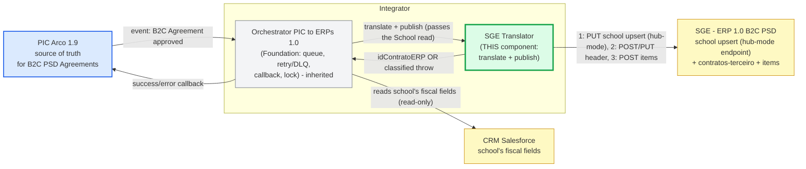
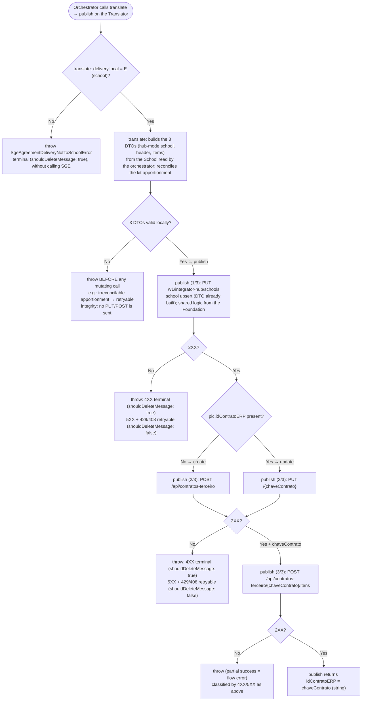

<details>
<summary><strong>Guia de review</strong> (~15 min)</summary>

Ordem de leitura sugerida:

1. `sge-client` — o contrato HTTP com o SGE (3 endpoints, host único, auth `x-api-key`): [`types.ts`](https://github.com/arco-cv/arco2-integrator/blob/feat/itgd-2947_sge-translator/lib/src/sge-client/src/types.ts), [`client.ts`](https://github.com/arco-cv/arco2-integrator/blob/feat/itgd-2947_sge-translator/lib/src/sge-client/src/client.ts).
2. [`classify-http-error.ts`](https://github.com/arco-cv/arco2-integrator/blob/feat/itgd-2947_sge-translator/core/src/modules/sales-agreements/sync-sales-agreement-pic-sge/shared/classify-http-error.ts) + [`errors/`](https://github.com/arco-cv/arco2-integrator/tree/feat/itgd-2947_sge-translator/core/src/modules/sales-agreements/sync-sales-agreement-pic-sge/errors) — a regra retryable/terminal.
3. [`shared/mappers/`](https://github.com/arco-cv/arco2-integrator/tree/feat/itgd-2947_sge-translator/core/src/modules/sales-agreements/sync-sales-agreement-pic-sge/shared/mappers) — o de/para campo-a-campo (header, itens, school, brand→sistema, séries).
4. [`index.ts`](https://github.com/arco-cv/arco2-integrator/blob/feat/itgd-2947_sge-translator/core/src/modules/sales-agreements/sync-sales-agreement-pic-sge/index.ts) — **a peça central**: `translate` (monta e valida os 3 DTOs) e `publish` (3 chamadas em série, com guarda de integridade contra sucesso parcial).
5. [`consumer.ts`](https://github.com/arco-cv/arco2-integrator/blob/feat/itgd-2947_sge-translator/core/src/modules/sales-agreements/sync-sales-agreement-pic-sge/consumer.ts) + [`sales-agreements.module.ts`](https://github.com/arco-cv/arco2-integrator/blob/feat/itgd-2947_sge-translator/core/src/modules/sales-agreements/sales-agreements.module.ts) — o wiring.

Se estiver com pouco tempo: **`index.ts`**, **`items.mapper.ts`**, **`series.mapper.ts`**, **`classify-http-error.ts`** — concentram o principal.

</details>

### Link do Jira

- [ITGD-2947](https://arco-educacao.atlassian.net/browse/ITGD-2947)

### Contexto do PR

PIC Arco 1.9 é a fonte da verdade dos Acordos, mas os ERPs 1.0 ainda operam faturamento e expedição.
Enquanto o estrangulamento não termina, todo Acordo aprovado no PIC precisa ser refletido no ERP 1.0 correto.

Este PR adiciona o tradutor do **SGE** (marcas PSD: Positivo/Conquista/Maralto/PES; PIÁ é alias de Maralto), que recebe **apenas** Acordos B2C (`tipoContrato = "Loja Virtual"`).
É irmão do tradutor Oracle EBS (já mergeado), ambos sobre a mesma Foundation.
Sem ele, Acordos B2C PSD não chegam ao SGE: a loja virtual da escola fica sem contrato e o read-back do 2.0 volta vazio.

#### Solução

Subclasse concreta de `BaseSyncPicAgreementUseCase`, sobrescrevendo **só** `translate` e `publish`.
Lock, retry/DLQ, callback e state machine são herdados da Foundation.
A ordem `school → header → itens` das requests é imposta pelo SGE (endereço referenciado por CNPJ).

**Decisões principais:**

- **`translate` monta e valida os 3 DTOs (school, header, itens) antes de `publish` disparar qualquer request de escrita.**
  - Se algo estiver inválido, nunca envia nenhum request — minimiza chance de sync/sucesso parcial.

- **School upsert sempre `PUT`**, reenviando o registro CRM completo — idempotente e não zera campos ausentes (descartado `PATCH`, consultorias não teriam tempo hábil).

- **Create vs. update pela presença do campo `pic.idContratoERP`**, não pelo campo `pic.operacao`.

- **Classificação de falha:** `5XX`/`429`/`408` → retryable (DLQ/redrive); demais `4XX` → qualidade de dado → **terminal** (não vai para DLQ). Sucesso parcial (header criado, itens falham) gera callback de erro.

### Arquitetura

<details open>
<summary>Context Diagram (C4L1): o SGE Translator (verde) é o componente deste PR; o Orchestrator da Foundation (cinza) é herdado.</summary>



</details>

<details open>
<summary>Call flow (create/update, guardas, classificação de erro): translate valida os 3 DTOs antes de publish enviar qualquer chamada mutante.</summary>



</details>

### Checklist

Esse PR:

- [x] Foi testado localmente
- [x] Possui testes unitários/funcionais
- [x] Documentação atualizada
- [ ] Nova migração no DB
  - [ ] Ativado run-migrations nas pipelines de qa, stage e prod
- [ ] Modificações no terraform validadas no ambiente de QA com deploy manual
- [ ] Modificações no SAM template (serverless) validadas no ambiente de QA com deploy manual
- [ ] Novos recursos de infra que precisam ser criados no localstack
  - [ ] Fila nova adicionada em scripts/testing/local-resources/setup_sqs.sh
  - [ ] Tópico novo adicionado em scripts/testing/local-resources/setup_sns.sh
  - [ ] Tabela nova do dynamoDB adicionado em scripts/testing/local-resources/setup_dynamodb.sh
  - [ ] Novo secret de autenticação adicionado em scripts/testing/local-resources/setup_secrets.sh
- [x] Nova variavel de ambiente
  - [ ] cadastrada na AWS (QA, STAGE, PROD)
  - [x] adicionada no env.example
  - [x] adicionada no core/test/setup/env.js

A fila SGE já existia no `sqs.tf` (o diff só anexa `batch_size_config`) e o router já roteia PSD B2C → fila SGE; nenhum recurso novo de localstack.
"Cadastrada na AWS" é coberto pelos pré-requisitos de deploy manual em **Evidências**.

### Evidências

- **Testes Automatizados:** unitários e de integração cobrindo use-case, mappers, client HTTP, classificador de erro e reconciliador.
- **E2E — [`pic-sge-flow.e2e.spec.ts`][e2e]:** o pipeline inteiro de 2 saltos SQS contra o localstack, ponta a ponta.
  - Acordo PIC cru → fila do router → router resolve o ERP (`marca` Positivo = PSD + `Loja Virtual` → SGE) e republica na fila do SGE via `SqsProducer` real.
  - Consumer do SGE busca a escola no CRM, traduz e publica os 3 outputs. Grafo todo real via DI; só o CRM repo e o `PicArcoClient` são stubados.
  - As 3 chamadas HTTP são interceptadas por `nock` e cada corpo é comparado ao contrato derivado à mão da LLD (`EXPECTED_*`) — prova o **mapeamento**, não só o encanamento.
- **Manual / pré-prod:** ainda não. Backend puro (sem UI); o smoke real contra o SGE depende dos pré-requisitos de deploy abaixo.

**Lembretes adicionais (não bloqueiam merge):**

- [ ] Criar o secret `integrator-core/SGE_API_KEY` no AWS Secrets Manager para **QA, Stage e Prod** — o Terraform **não** cria (`terraform/{env}.secrets` é gitignored). Sem ele o `SgeClient` não autentica.

### Referências

- **Component LLD** (fonte durável, mapeamento campo-a-campo + Open Questions): [SGE Translator LLD](https://github.com/arco-cv/arco2-integrator/blob/feat/itgd-2947_sge-translator/docs/designs/sync-agreements_sge-translator_lld.md)
- **Epic HLD** (racional de negócio, roteamento, taxonomia de erro): [Sync of Agreements PIC Arco → ERPs 1.0](https://github.com/arco-cv/arco2-integrator/blob/feat/itgd-2947_sge-translator/docs/designs/sync-agreements-pic1.9_hld.md)
- **Parent LLD** (Foundation herdada — Orchestrator, retry/DLQ, callback, lock, state machine): [PIC Arco 1.9 → ERPs 1.0: Foundation](https://github.com/arco-cv/arco2-integrator/blob/feat/itgd-2947_sge-translator/docs/designs/Fundacao-PIC-ERPs.md)
- **Ticket:** [ITGD-2947](https://arco-educacao.atlassian.net/browse/ITGD-2947)

<!-- Referências dos testes citados nos Critérios de Aceitação e Evidências -->

[e2e]: https://github.com/arco-cv/arco2-integrator/blob/feat/itgd-2947_sge-translator/core/test/modules/sales-agreements/sync-sales-agreement-pic-sge/pic-sge-flow.e2e.spec.ts

### Spec Driven Development docs (spec + plan)

Contexto completo para quem quiser se aprofundar (e para revisores de IA). Leitura opcional, o diff e descrição do PR são suficientes.

<details>
<summary><strong>spec_sge-translator.md</strong> — spec funcional: contexto, metas, critérios e decisões</summary>

## Background / Context

PIC Arco 1.9 is the new source of truth for commercial Agreements, but the ERPs 1.0 still operate invoicing and shipping.

While the migration hasn't finished (strangulation), every Agreement approved in PIC needs to be reflected in the correct ERP 1.0 — to keep the legacy operation running and the 2.0 read-back consistent.

This component covers **one** ERP 1.0: **SGE** (PSD conglomerate, Positivo/Conquista/Maralto/PES brands; PIÁ is an alias for Maralto).

SGE receives **only** B2C Agreements (`tipoContrato = "Loja Virtual"`); the B2B side of the same brands routes to Oracle EBS and is a different component.

Without this translator, B2C PSD Agreements approved in PIC don't reach SGE — the school's virtual store ends up without a contract and the 2.0 read-back comes back empty.

---
## Goals and Success Metrics / KPIs

Goal: every B2C PSD Agreement approved in PIC, with delivery to the school, is reflected in SGE (contract + items), keeping the legacy operation and the 2.0 read-back consistent.

Success metrics:

- **Complete publication:** B2C PSD Agreements with delivery to the school result in `idContratoERP` returned (all 3 calls completed), within the callback SLA inherited from the Foundation (≤ 30 min).

- **Zero silent partial success:** every failure becomes a classified `throw` + callback; never a success return with the header created and items missing.

- **Correct error routing:** data error (delivery outside the school, unregistered SKU) → error callback with no retry; technical error (ERP down, inconsistent apportionment) → DLQ for redrive.

---
## User Stories

- As a **B2C school of the PSD brands**, I want my Agreement approved in PIC to appear in SGE.
  - So my virtual store has a contract.
  - And the 2.0 read-back doesn't come back empty.

- As an **Integrator operator**, I want Agreements with delivery outside the school or an unregistered SKU to generate a clear error callback **without** useless retry, so I can diagnose quickly.

- As an **Integrator operator**, I want technical failures (ERP down, inconsistent apportionment) to land in the DLQ for redrive, so the Agreement isn't lost.

---
## Non-Functional and Technical Requirements

1. **Foundation inheritance:** implement as a concrete subclass of `BaseSyncPicAgreementUseCase<TTranslated>`, overriding **only** `translate` and `publish`. Orchestration, retry/DLQ, callback, lock, and state machine are inherited.

2. **Error contract:** every failure throws a **named and specific** subclass of `BaseCustomError` (never `new Error()`, never the generic `BaseCustomError`); `shouldDeleteMessage` follows the error classification:
   - `true` (terminal — discards the message + error callback, no retry): data error (delivery outside the school, unregistered SKU) and `4XX` responses **except** `429`/`408`.
   - `false` (retryable → DLQ for redrive): `5XX`, `429`, `408`, irreconcilable kit apportionment, and any unmapped exception.

3. **Reuse without coupling:** the pure apportionment-reconciliation functions (rounding to 2 decimal places + residual in one item) are moved from the `orders` module to a shared location (`lib/src/shared/src/math/`).
   - To eliminate coupling between modules and drift.

4. **SLA:** publication within the callback SLA inherited from the Foundation (≤ 30 min).

5. **Observability:**
   - log with trace context; `warn` on expected fallback (e.g.: **unrecognized** `TaxPayerType` — value outside `CONTRIBUINTE`/`NÃO CONTRIBUINTE`).
   - Logging PII is acceptable for now — we prioritize debuggability and time-to-market over privacy (temporary decision, to be revisited).

6. **B2C-only:** the translator only processes Agreements `tipoContrato = "Loja Virtual"`; the B2B side of the PSD brands belongs to a different component.

7. **Config & secrets (SGE endpoint):** `SGE_API_BASE_URL` (non-secret host) → committed `terraform/{qa,stage,prod}.params`; `SGE_API_KEY` (secret) → AWS Secrets Manager via gitignored `terraform/{env}.secrets`, key `integrator-core/SGE_API_KEY`.
   - Stage/HML resolved (`http://172.21.48.31:8099`, VPN-only, HTTP); **prod host + api-key is an open BLOCKER** (sge-duvidas Q20/Q21).

---
## Testable Acceptance Criteria

Each criterion is observable and testable — the projection of the LLD's field mapping into behavior.

The criteria below carry the field-by-field mapping (source → destination → value), for execution without reopening the LLD; the LLD ([Field mappings](./docs/designs/sync-agreements_sge-translator_lld.md)) remains the durable source.

#### Happy path

### AC-1: B2C Agreement with delivery to the school publishes successfully to SGE
- **Given** `pic.entrega.local` = school (`E`)
- **When** the Orchestrator calls `translate` + `publish`
- **Then** `translate` builds the **3 DTOs** (hub-mode school, header, items) and validates them locally; any local invalidity throws **before** `publish` sends any mutating call (integrity — minimizes partial success)
- **And** the local validations in `translate` are: delivery outside the school (`M`/`O`) → **terminal** error; irreconcilable kit apportionment → **retryable** error.
- **And** any unexpected value/payload from PIC or unmapped exception → **retryable** by default.
- **And** only then does `publish` execute the 3 mutating calls in series: `PUT /v1/integrator-hub/schools` (school upsert), then the header in SGE, then `POST .../{chaveContrato}/itens`
- **And** each step only fires after a 2XX response from the previous one (D-07)
- **And** `publish` returns `idContratoERP` as a `string` — the `chaveContrato` read from the header response (PR-19)

### AC-2: Create when `idContratoERP` is absent
- **Given** `pic.idContratoERP` absent/`null`
- **When** building the header
- **Then** sends via `POST /api/contratos-terceiro` (create) (PR-18)

### AC-3: Update when `idContratoERP` is present
- **Given** `pic.idContratoERP` present (`number`)
- **When** building the header
- **Then** sends via `PUT /api/contratos-terceiro/{chaveContrato}`, with the value normalized to `string` and used as `chaveContrato` (PR-18)

### AC-4: School upsert always `PUT` (read-then-PUT from the CRM)
- **When** performing the school upsert
- **Then** uses `PUT /v1/integrator-hub/schools` **always** (without checking prior existence, without `PATCH`) (D-01)
- **And** resends the **complete** record read from the CRM, so as not to zero out missing fields (D-04)
- **And** `schoolDocNumber` = `pic.escola.cpfCnpj` (lookup key in the CRM)
- **And** `name` ← `crm.RazaoSocial__c` (legal/corporate name)
- **And** `tradeName` ← `crm.NomeFantasia__c`
- **And** `invoiceEmail` ← `crm.Email__c`, with fallback `crm.InvoiceEmail__c` (D-02)
- **And** `stateTaxId` ← `crm.StateRegistration__c` (state tax registration)
- **And** `institutionId` ← `pic.escola.institutionId`
- **And** billing ← `pic.escola.enderecoPrincipal` and delivery ← `pic.entrega.endereco` — PIC's addresses override the CRM's (D-02/D-04)
- **And** each address renames the PIC fields: `logradouro`→`street`, `numero`→`number` (accepts `"S/N"`), `cep`→`postalCode`, `bairro`→`neighborhood`, `municipio`→`city`, `uf`→`state`, `complemento`→`complement`

### AC-5: `isTaxPayerType` derived from the `TaxPayerType` enum
- **Given** the (enriched) CRM record carries `TaxPayerType`
- **When** building the school payload
- **Then** `isTaxPayerType` = `true` if `CONTRIBUINTE`; `false` for `NÃO CONTRIBUINTE` or any other value (D-05)
- **And** only an **unrecognized** value (outside `CONTRIBUINTE`/`NÃO CONTRIBUINTE`) generates a `warn` log; `NÃO CONTRIBUINTE` does not generate a warn (D-05)

### AC-6: Header — derived fields
- **When** building the header
- **Then** `sistema` derives from the brand via the 4-key SGE enum: `Positivo`→`SPE`, `Conquista`→`CONQUISTA`, `PES`→`PES`, `Maralto`/`PIÁ`→`MARALTO` (PR-13)
- **And** a brand outside the PSD group has no SGE B2C store — the translator must not emit an SGE contract for it (PR-13)
- **And** `tipoVenda` = `LNE` if single-brand, `ESK` if multi-brand (`distinct(pic.materiais[].marca)`) (PR-04/D-08)
- **And** term: `anoInicial`=`anoVigencia`; `anoFinal`=`anoVigencia`+`duracao`−1; `dataInicioVigencia`=01/03 of `anoInicial`; `dataFimVigencia`=31/12 of `anoFinal`, as pure `YYYY-MM-DD` strings (PR-02/PR-03)
- **And** `valorContrato` = Σ(`precoFinalLoja` × `quantidadeVenda`) over `pic.materiais[]`; ignores `quantidadeBonificada` and vouchers (PR-05)
- **And** `tipoEndereco` fixed (invoicing/billing=`3`, delivery=`1`) and `cliente` = `pic.escola.cpfCnpj` across all three addresses (B2C, no reseller) (PR-01/PR-04)
- **And** `institutionId` (CGI ID) ← `pic.escola.institutionId`
- **And** `faturadoPor` ← `pic.cnpjFilialFaturamento` (14-digit CNPJ of the invoicing branch)
- **And** `expedidoPor` ← `pic.cnpjFilialExpedicao` (shipping branch)
- **And** `integraLoja`=`true` (PR-06)
- **And** `vendaBimestral`=`false` (PR-06)
- **And** `confissaoDivida`=`false` (PR-06)
- **And** `percentualComissaoEscola`=`null` (PR-06)
- **And** `situacaoContrato`=`1` (In draft) (PR-17)
- **And** `tipoPortal`=`1` (PR-17; absent from swagger v2026.0625, kept as a runtime-lenient attr)
- **And** `tipoCapa`=`"A"` (fixed, declared in the SGE doc)
- **And** `tipoContraCapa`=`1` (fixed, declared in the SGE doc)
- **And** `tipoCapaPreco`=`"A"` (fixed, declared in the SGE doc)
- **And** `tipoContratoTerceiro`=`5` (fixed, declared in the SGE doc)
- **And** `urlLojaNaEscola`=`null` (optional; decided not to send)
- **And** does **not** send (no destination in SGE, best-effort discard): `pic.pedidoMinimo`/`pic.pedidoMaximo` (order %), `pic.devolucaoMaxima` (return %), `pic.pagamento` (B2B only), and `pic.frete` (B2C doesn't pay shipping) (R-11)

### AC-7: Items — collection/kit flattening
- **When** building the items
- **Then** each `pic.materiais[]` (collection) becomes 1 collection item: `produtoGrafica`=`skuColecao`, `anoProduto`=0, `bimestre`=0, `produtoGraficasVinculados`=the `skuKIT`s of its kits (PR-07)
- **And** each `pic.composicaoAnual[]` (kit) becomes 1 "Produto" item: `produtoGrafica`=`skuKIT`, native `bimestre`, `anoProduto`=`pic.anoVigencia` (PR-07)
- **And** `pic.composicao[]` (standalone items) are **not** sent; `pic.suplementar` enters as an entry in the collection item's `produtoGraficasCompulsoriosVinculados` array, not a standalone item (PR-07)
- **And** `quantidadeVenda`/`quantidadeBonificado` (renamed from `quantidadeBonificada`) only on the collection item — "fake" attrs SGE ignores this release, provisional names until the CR (PR-20)
- **And** `siglaNivel`/`siglaSerie` come from the séries de/para keyed by `serie` alone (not passthrough): the table yields an SGE code, split on its first hyphen → before=`siglaNivel`, after=`siglaSerie` (`EI-G1`→`EI`/`G1`) (PR-14)
- **And** `AVULSO` (bare) → both `siglaNivel` and `siglaSerie` `null`; `AVULSO INF`/`EF1`/`EF2`/`EM` (no-hyphen code) → `siglaNivel` set, `siglaSerie` `null` (PR-14)
- **And** a `serie` with no de/para entry throws a terminal error (`shouldDeleteMessage: true`) rather than sending a wrong/blank level (PR-14)
- **And** `modular` is **not** sent — removed from the payload; SGE reads it from the product master (PR-15)
- **And** `sistema` derives from the item's brand (`pic.materiais[].marca`), same mapping as the header (PR-13)
- **And** `descricaoCapa` ← `descricaoColecao` (collection) or `descricaoKIT` (kit) (PR-07)
- **And** fixed constants: `produtoServico`=`false`, `disponivelEcommerce`=`true`, `avulso`=`false` (PR-17)
- **And** omits from the payload (no source in PIC): `pesoBruto`, `pesoBrutoTotal` — SGE reads weights from the product master; `produtoGraficasCompulsoriosVinculados` is **no longer** omitted (carries the suplementares, PR-07/PR-16)

### AC-8: Items — prices on the B2C side
- **When** calculating item values
- **Then** collection item: `precoTotal`=`precoRevendaB2C` (gross, unit); `percentualDescontoProduto` is **not** sent — the ERP computes the discount from the standard price list (PR-09/PR-10)
- **And** kit item: `precoTotal`=the bimester apportionment share (`rateiov1..v4`-based, divided equally among the kits of that bimester); no discount field sent (PR-11)
- **And** the price field is `precoTotal` per the swagger v2026.0625 item schema (`valorUnitario` doesn't exist there) (PR-09)
- **And** the B2C vitrine has one line per SKU without quantity, so the line total is the resale price itself
- **And** only the B2C side is used (`precoRevendaB2C`, `precoFinalLoja`); `voucher` is no longer sent (the ERP computes the discount); the B2B fields (`valorBruto`, `valorLiquido`, `percentualDesconto`) are **never** sent
- **And** also does **not** send: `rateiov1..v4` (only an input to the kit apportionment, PR-11), `listaPreco`/`tipo`/`status`/`digital`/`descricaoAmigavel` (no field in SGE), and `pic.composicao[].suplemento` (S/N flag, no destination)

#### Corner cases

**Boundary checklist** — one line per item of the corner-cases taxonomy (`~/.claude/skills/test-standards/references/coverage-taxonomy.md`):

- empty / single / many: single/many **covered** (`AC-7`: 1 vs many `materiais`/kits; `AC-9`: single-brand vs multi-brand); empty `materiais` = invalid payload → local validation (`AC-1`).
- max-size / overflow: **N/A — no size limit relevant to the translator**.
- null / undefined / missing: **covered** (`AC-2`: `idContratoERP` `null`→create; `percentualComissaoEscola`=`null` in `AC-6`)
- unicode / whitespace-only / leading-trailing spaces: **N/A — text (name/address) is passthrough from the CRM/PIC; shape validation belongs to the middleware/source**
- duplicate / out-of-order entries: **N/A — the translator doesn't deduplicate Agreement entries (message dedup belongs to the Foundation)**
- boundary numbers (0, -1, MAX_INT, off-by-one): **covered** (`AC-10`: `duracao`=1 → off-by-one on the term; `voucher` 0..100 in `AC-8`; `anoProduto`/`bimestre`=0 in `AC-7`)
- clock / timezone / DST boundaries: **covered** (`AC-6`/`AC-10`: term 01/03–31/12, pure `YYYY-MM-DD` string)
- combined / composed filters: **N/A — no composed filters in this flow**

### AC-9: Single-brand vs multi-brand Agreement
- **Given** `pic.materiais[]` with a single brand vs multiple brands
- **When** deriving `tipoVenda`
- **Then** single-brand→`LNE`, multi-brand→`ESK` (D-08)

### AC-10: Minimum-duration term (`duracao`=1)
- **Given** `pic.duracao` = 1
- **When** calculating the term
- **Then** `anoFinal`=`anoInicial`; `dataFimVigencia`=31/12 of the same year (PR-02/PR-03)

### AC-11: Kit apportionment with residual (2-decimal reconciliation)
- **Given** the collection price doesn't divide evenly among the bimester's kits
- **When** apportioning
- **Then** rounds to 2 decimal places and allocates the residual to one item, so that Σ(`precoTotal` of the kits) = the collection price (PR-11)

#### Failure modes

**Failure category checklist** — one line per item of the failure-modes taxonomy (`~/.claude/skills/test-standards/references/coverage-taxonomy.md`):

- validation error (4xx): **covered** (`AC-15`: 4XX terminal)
- downstream timeout / never-responds: **covered** (`AC-15`: 408 → retryable)
- downstream 5xx: **covered** (`AC-15`: 5XX → retryable)
- partial failure (some succeed, some fail): **covered** (`AC-16`: partial success is not swallowed)
- auth / authz failure: **covered** (`AC-15`: 401/403 fall under the 4XX terminal rule)
- rate limits / throttling (429): **covered** (`AC-15`: 429 → retryable)
- concurrency / race / double-submit: **N/A — lock and anti-OLD are the Foundation's responsibility, outside the translator**
- idempotency (repeat-request behavior): **covered** (`AC-17`: idempotent redrive)
- network drop mid-operation: **covered** (`AC-15`: network failure / unmapped exception → retryable)
- datastore unavailable / deadlock / constraint violation: **N/A — the translator doesn't access its own datastore; only HTTP to SGE/CRM**
- crash mid-transaction (what state does retry see?): **covered** (`AC-16`+`AC-17`: retry reprocesses the 3 idempotent calls)
- stale cache: **N/A — read-then-PUT always reads the CRM fresh; no cache in the translator**
- resource exhaustion: **N/A — backpressure/queue is the Foundation's responsibility**
- duplicate delivery (at-least-once): **covered** (`AC-17`: redrive idempotency)
- out-of-order delivery: **N/A — ordering/anti-OLD is the Foundation's responsibility**
- redelivery after partial processing: **covered** (`AC-16`+`AC-17`)
- poison message / dead-letter path: **covered** (`AC-14`/`AC-15`: retryable→DLQ; terminal→discard+callback)

### AC-12: Delivery outside the school → terminal
- **Given** `pic.entrega.local` ≠ school (`M`=Mediator or `O`=Other Unit)
- **When** `translate` runs
- **Then** throws `SgeAgreementDeliveryNotToSchoolError` **terminal** (`shouldDeleteMessage: true`), **without** calling SGE (D-06)

### AC-13: Unregistered SKU → terminal (data quality)
- **Given** a `produtoGrafica` (`skuColecao`/`skuKIT`) not registered in SGE's product master
- **When** sending the items
- **Then** the items call returns 4XX; `publish` reclassifies that raw `SgeRequestError` via `checkIfDataQualityError` as a data-quality error → **terminal** (`shouldDeleteMessage: true`) — Agreement data quality, type 1 in the HLD (PR-12)

### AC-14: Irreconcilable kit apportionment → retryable/DLQ
- **Given** Σ(`precoTotal` of the kits) ≠ collection price **even after** residual reconciliation.
- Defensive guard: the 2-decimal reconciliation already forces an exact Σ by construction, so this error only fires on a reconciliation bug.
- **When** apportioning
- **Then** the apportionment is computed in `translate` (pre-flight), so throwing `SgeKitPriceIrreconcilableError` **retryable** (`shouldDeleteMessage: false`) blocks **all** 3 mutating calls (none is sent) → retry/DLQ
- **And** it's a deterministic technical error (the price is derived by our own division), not bad data; the DLQ preserves visibility and allows redrive (D-09)

### AC-14b: Bad bimestre rateios (rateiov1..v4 ≠ 100%) → terminal
- **Given** a material's `rateiov1..v4` for the bimesters that actually have kits do **not** sum to 100% (raw shares under- or over-allocate the collection price, checked **before** reconciliation)
- **When** apportioning the collection price across the kits (`reconcileKitShares` pre-check)
- **Then** throws `SgeAgreementRateioMismatchError` **terminal** (`shouldDeleteMessage: true`, 400) in `translate` (pre-flight), blocking **all** 3 mutating calls (none is sent)
- **And** it's bad Agreement data (a malformed static payload a retry can't fix), so the base error-callback notifies PIC to fix and resend.
  - Distinct from the post-check `SgeKitPriceIrreconcilableError` (AC-14), which is our own reconciliation regressing (retryable) (D-09)

### AC-15: HTTP classification of the 3 calls
- **Given** one of the 3 calls (school, header, or items) responds with an error
- **When** classifying
- **Then** `5XX` → retryable (`shouldDeleteMessage: false`); `4XX` → terminal (`true`); **except** `429` and `408`, which are transient → retryable (D-07)
- **And** any unmapped exception is treated as retryable (`false`) — types 2 and 3 in the HLD, treated the same
- **And** reprocessing (backoff/`Retry-After`) is the Foundation's responsibility, outside the Translator; reading the CRM is the Orchestrator's responsibility (not classified here)

### AC-16: Partial success (header created, items fail) → not swallowed
- **Given** the header was created (2XX) but the items call fails
- **When** `publish` runs
- **Then** throws the error (classified by the HTTP rule), does **not** return partial success (R-08)
- **And** a 2XX header without a parseable `chaveContrato`/`idContratoERP` (likely the `ContratoTerceiro` column, PR-19 pending) in the response → retryable technical error (without an id there's no items step or callback)

### AC-17: Redrive of a partially processed event
- **Given** a partially processed event is reprocessed (redrive); the message carries the original payload, with `pic.idContratoERP` still absent (no success callback occurred)
- **When** executing the 3 calls again
- **Then** school (`PUT`) and items (`POST` assumed idempotent) reprocess without duplicating (R-08/PR-18)
- **And** the header retries **create** — SGE is **not** idempotent on this endpoint (PR-19)
- **And** on a duplicate the Translator matches the **stringified SGE `responseBody`** with a case-insensitive `/duplica/i` regex (duplicata/duplicado/duplicate).
  - The SGE's text arrives in the response body, not the error `message` (the client fixes that to `'SGE contract header request failed'`).
  - Logs a `warn` with the full SGE body and proceeds gracefully.
- **And** the exact duplicate message (and whether the response returns the `chaveContrato` for the items) is pending SGE confirmation; the `/duplica/i` guard is the agreed interim stopgap (see Open Questions)

---
## Functional Decisions

Chronological log. Editable during refinement; after approval and an execution signal, it becomes append-only below the divider. The full rationale lives in the LLD (recap + link here).

- **DECISION:** __Chose__ school upsert always via `PUT` (read-then-PUT from the CRM), __because__ it's idempotent and resending the complete record doesn't zero out fields.
    - __Discarded__ **GET-then-decide / `PATCH`**: more calls and risk of zeroing out missing fields (LLD D-01/D-04).

- **DECISION:** __Chose__ to decide create vs update by the presence of `pic.idContratoERP`, __because__ the `operacao` field is not a reliable source of the state in the ERP.
    - __Discarded__ **routing by `operacao`**: diverges from the real state (LLD PR-18).

- **DECISION:** __Chose__ HTTP classification `5XX`/`429`/`408` retryable and `4XX` terminal for the 3 calls.
    - __Because__ `429`/`408` are transient and retriable (LLD D-07); the reprocessing itself belongs to the Foundation.

- **DECISION:** __Chose__ `SgeKitPriceIrreconcilableError` as **retryable→DLQ** (not terminal), __because__ the mismatch is a deterministic technical bug (price derived by our own division), not bad data.
    - The DLQ preserves visibility and redrive (LLD D-09).

- **DECISION:** __Chose__ to move the pure apportionment functions to `lib/src/shared/src/math/`, __because__ it eliminates `orders`↔`sge` coupling and the drift from duplicated logic.
    - __Discarded__ **importing from the `orders` module**: couples the modules (LLD D-09).

- **DECISION:** __Chose__ an SGE-specific error distinct from `orders`' `KitPriceIrreconcilableError`, __because__ the purpose and context are distinct (SGE collection→kits vs SAS kit→standalone items), even though both are retryable (LLD D-09).

- **DECISION:** __Chose__ to accept the assumptions in [`sge-duvidas.md`](./sge-duvidas.md) as fact.
    - Includes: term 01/03–31/12, `tipoEndereco` 3/1, `situacaoContrato`=1 (kept for now), the 4-key `sistema` mapping, séries de/para, quantities as ignored attrs, pre-registered SKUs, redrive idempotency.
    - __Because__ working agreement: build on the assumptions now, validate with the client later (LLD + `sge-duvidas.md`).

- **DECISION:** __Chose__ to build and validate the **3 DTOs** in `translate` before `publish` sends any mutating call (PUT/POST), __because__ failing before the first write minimizes the partial-success scenario (non-integrity).
    - Reading the CRM (`GET`, read-only) happens in the inherited orchestrator, which passes the already-validated `School` to `translate`; the latter only builds the school DTO from it.
    - Only **server-side** rejections (unregistered SKU, HTTP 4xx/5xx) can generate partial success in the middle of the series.
    - Aligned with the `translate` (builds the payloads) / `publish` (makes the 3 calls) pair already defined in the LLD (`translate`/`publish`).

<!-- ── execution begins below; entries above are frozen, append-only below ── -->

</details>

<details>
<summary><strong>plan_sge-translator.md</strong> — plano técnico: arquitetura, fluxo, test design, task breakdown, decisões</summary>

## Test Design

Titles designed before implementation; the bodies come in each RED-GREEN cycle. Behavioral titles (no `AC-N`), mirroring the criterion they prove.

**Integration / use-case tests (outer layer)** — the observable contract of the translator, in `core/test/modules/sales-agreements/sync-sales-agreement-pic-sge/`:

```
// index.spec.ts (SgeSyncPicAgreementUseCase)
describe("SgeSyncPicAgreementUseCase", () => {
  // Happy cases
  it("builds the 3 DTOs in translate when entrega.local is E");
  it("calls upsertSchool, header, and items in that order, each after a 2XX from the previous one");
  it("uses POST on the header when pic.idContratoERP is absent");
  it("passes the idContratoERP from the header response to the items call");
  it("returns idContratoERP as a string on success of the 3 steps");

  // Corner cases
  it("uses PUT and normalizes idContratoERP (number to string) when pic.idContratoERP is present");
  it("treats 429/408 from the header as retryable (exception to terminal 4XX)");
  it("treats missing or unknown entrega.local as outside the school → terminal, no publish");

  // Failure scenarios
  // OUR OWN checks in translate, BEFORE publish (minimizes partial success).
  it("throws terminal in translate and does not call publish when entrega.local is M (mediator)");
  it("throws terminal in translate and does not call publish when entrega.local is O (other unit)");
  it("does not call publish when translate throws any local error (pre-flight integrity)");
  // Server-side rejections from the SGE (not our own checks; occur in publish).
  it("throws a retryable error when the header responds 5XX");
  it("throws terminal when the header responds with a data 4XX (e.g., 400)");
  it("throws terminal when the items call is rejected with a data 4XX (e.g., unregistered SKU)");
  it("propagates the classified shouldDeleteMessage to the Orchestrator (terminal deletes; technical goes to DLQ)");
  it("throws (does not swallow) when the school upsert fails on the first call");
  it("throws (does not swallow) when the header fails");
  it("throws (does not swallow) when items fail after the header is created");
  it("treats header 2XX without chaveContrato as a non-terminal technical issue (→ DLQ)");
  // Partial-success recovery: redrive reprocesses (non-idempotent header → treats as duplicate).
  it("redrive after school upsert done and header failed reprocesses the 3 calls");
  it("redrive after header done and items failed reprocesses the 3 calls");
  it("treats the SGE's contract-already-exists response on redrive (create) as already-created and proceeds to items");
  it("treats a duplicate-create response without the existing chaveContrato as retryable (→ DLQ)");
});

// consumer.spec.ts
describe("SgeSyncPicAgreementConsumer", () => {
  // Happy cases
  it("delegates the queue message to the SGE use-case");
  // Failure scenarios
  it("propagates isLastReceive to the callback control on the last attempt");
});
```

**Unit tests for known-in-advance pure helpers** — functions that will exist regardless of implementation choices:

```
// lib/src/shared/src/math/reconcile-rounded-shares.spec.ts
describe("reconcileRoundedShares", () => {
  it("returns shares that sum exactly to the total when there is no remainder");
  it("puts the rounding remainder into a single item");
  it("keeps the sum of shares equal to the total across N unequal divisions");
});

// lib/src/sge-client/src/test/client.spec.ts (3 methods, 1 per SGE endpoint — includes the hub-mode school)
describe("SgeClient", () => {
  it("sends x-api-key in the header of every request");
  it("upsertSchool uses PUT /v1/integrator-hub/schools on the SGE host");
  it("syncContractHeader without chaveContrato uses POST /api/contratos-terceiro (create)");
  it("syncContractHeader with chaveContrato uses PUT /api/contratos-terceiro/{chaveContrato} (update)");
  it("upsertContractItems uses POST /api/contratos-terceiro/{chaveContrato}/itens");
  // error handling — a nested error-handling block in code; flattened here so the breadcrumb
  // keeps the SgeClient prefix. statusCode + responseBody are the sole inputs to the consumer's
  // terminal-vs-retryable classification, so both are pinned on the wrapped SgeRequestError.
  it("should wrap httpClient exceptions into SgeRequestError and log the failure");
  it("forwards the upstream response body onto SgeRequestError.responseBody");
  it("forwards a 4XX upstream status onto SgeRequestError.statusCode");
  it("forwards a 5XX upstream status onto SgeRequestError.statusCode");
});
// Note: the school's synchronous upsert (formerly the core component `SyncHubSchoolUpsert`, C3) was absorbed
// by `SgeClient.upsertSchool` in task 13 — the school is an endpoint of the SGE itself, not of a separate Hub.

// core/test/.../sync-sales-agreement-pic-sge/errors/errors.spec.ts
describe("classifyHttpError", () => {
  it("5XX classifies as retryable (shouldDeleteMessage false)");
  it("429 and 408 classify as retryable despite being 4XX");
  it("remaining 4XX classify as terminal (shouldDeleteMessage true)");
  it("unmapped exception (no HTTP status) classifies as retryable");
});

describe("SgeKitPriceIrreconcilableError", () => {
  it("is born with shouldDeleteMessage false (non-terminal technical issue → DLQ)");
});

// core/test/.../schools/shared/repositories/crm-schools.repository.spec.ts
describe("accountToSchoolWithAddresses (TaxPayerType)", () => {
  it("maps CONTRIBUINTE to isTaxPayerType true");
  it("maps NÃO CONTRIBUINTE to false, no warn");
  it("maps missing/undefined to false, no warn");
  it("maps an unrecognized present value to false, with warn");
});

// core/test/.../sync-sales-agreement-pic-sge/shared/mappers/school-upsert.mapper.spec.ts
describe("SchoolUpsertMapper", () => {
  it("overwrites CRM addresses with PIC addresses (billing and delivery)");
  it("renames PIC address fields (logradouro→street etc.) and accepts numero S/N");
  it("passes school.email through to invoiceEmail");
  it("resends the complete CRM record (does not zero out fields)");
});

// core/test/.../sync-sales-agreement-pic-sge/shared/mappers/header.mapper.spec.ts
describe("SgeAgreementHeaderMapper", () => {
  it("derives sistema MARALTO/SPE/CONQUISTA/PES from the commercial marca");
  it("throws terminal when the commercial marca is outside the PSD group");
  it("sets tipoVenda to ESK when the Agreement has more than one marca");
  it("sets tipoVenda to LNE when the Agreement is single-marca");
  it("calculates anoFinal as anoVigencia + duracao - 1");
  it("sets anoFinal equal to anoInicial when duracao is 1");
  it("sets dataInicioVigencia to 01/03 of anoInicial as a YYYY-MM-DD string");
  it("sets dataFimVigencia to 31/12 of anoFinal as a YYYY-MM-DD string");
  it("sets tipoEndereco to 3 for faturamento and cobranca and 1 for entrega");
  it("maps faturadoPor and expedidoPor from the branch CNPJs");
  it("sums valorContrato ignoring bonus items and vouchers");
});

// core/test/.../sync-sales-agreement-pic-sge/shared/mappers/items.mapper.spec.ts
describe("SgeAgreementItemsMapper", () => {
  it("links the kits' skuKIT to the collection item via produtoGraficasVinculados");
  it("does not send standalone items (only collection and kits)");
  it("nests the supplementary in the collection's produtoGraficasCompulsoriosVinculados");
  it("builds a kit item with produtoGrafica=skuKIT, native bimestre, and anoProduto=anoVigencia");
  it("builds a collection item with anoProduto=0 and bimestre=0");
  it("uses B2C prices and never sends B2B fields");
  it("omits percentualDescontoProduto and modular from every item (dropped fields)");
  it("resolves siglaNivel and siglaSerie through the séries de/para, not passthrough");
  it("sends quantities as quantidadeVenda and quantidadeBonificado (attrs SGE currently ignores)");
  it("splits the proration equally among the bimestre's kits");
  it("puts the float-precision remainder of the proration into a single kit (sum matches the collection)");
  it("throws SgeKitPriceIrreconcilableError (non-terminal technical issue → DLQ) when the sum of the kits does not match the collection");
  it("throws SgeAgreementRateioMismatchError (terminal bad data) when the present-bimestre rateios under-allocate the collection price");
  it("throws SgeAgreementRateioMismatchError (terminal bad data) when the present-bimestre rateios over-allocate the collection price");
});

// core/test/.../sync-sales-agreement-pic-sge/shared/mappers/series.mapper.spec.ts
describe("SgeSeriesMapper", () => {
  // Happy cases
  it("maps a PIC serie to the SGE code via the séries de/para table");
  it("splits the SGE code on the first hyphen into siglaNivel and siglaSerie");
  it("maps bare AVULSO to null siglaNivel and siglaSerie");
  it("maps an AVULSO level variant to a non-null siglaNivel and null siglaSerie");
  // Failure scenarios
  it("throws terminal when a PIC serie has no séries de/para entry");
});
```

**AC → test coverage** — nested list: each spec AC with the tests (verbatim from Test Design) that prove it.
Verified by `spec-driven-development/scripts/check-ac-coverage.sh <plan> <spec>` (completeness + honesty).

- **AC-1** Publishes to the SGE (3 DTOs validated beforehand; series; returns a string)
  - "SgeSyncPicAgreementUseCase > happy > builds the 3 DTOs in translate when entrega.local is E"
  - "SgeSyncPicAgreementUseCase > happy > calls upsertSchool, header, and items in that order, each after a 2XX from the previous one"
  - "SgeSyncPicAgreementUseCase > happy > passes the idContratoERP from the header response to the items call"
  - "SgeSyncPicAgreementUseCase > happy > returns idContratoERP as a string on success of the 3 steps"

- **AC-2** Create when `idContratoERP` is absent
  - "SgeSyncPicAgreementUseCase > happy > uses POST on the header when pic.idContratoERP is absent"

- **AC-3** Update when `idContratoERP` is present (string)
  - "SgeSyncPicAgreementUseCase > corner > uses PUT and normalizes idContratoERP (number to string) when pic.idContratoERP is present"

- **AC-4** School upsert always PUT + mapping
  - "SgeClient > upsertSchool uses PUT /v1/integrator-hub/schools on the SGE host"
  - "SchoolUpsertMapper > overwrites CRM addresses with PIC addresses (billing and delivery)"
  - "SchoolUpsertMapper > renames PIC address fields (logradouro→street etc.) and accepts numero S/N"
  - "SchoolUpsertMapper > passes school.email through to invoiceEmail"
  - "SchoolUpsertMapper > resends the complete CRM record (does not zero out fields)"

- **AC-5** `isTaxPayerType` from the enum + warn
  - "accountToSchoolWithAddresses (TaxPayerType) > maps CONTRIBUINTE to isTaxPayerType true"
  - "accountToSchoolWithAddresses (TaxPayerType) > maps NÃO CONTRIBUINTE to false, no warn"
  - "accountToSchoolWithAddresses (TaxPayerType) > maps missing/undefined to false, no warn"
  - "accountToSchoolWithAddresses (TaxPayerType) > maps an unrecognized present value to false, with warn"

- **AC-6** Header — derived fields
  - "SgeAgreementHeaderMapper > derives sistema MARALTO/SPE/CONQUISTA/PES from the commercial marca"
  - "SgeAgreementHeaderMapper > throws terminal when the commercial marca is outside the PSD group"
  - "SgeAgreementHeaderMapper > calculates anoFinal as anoVigencia + duracao - 1"
  - "SgeAgreementHeaderMapper > sets dataInicioVigencia to 01/03 of anoInicial as a YYYY-MM-DD string"
  - "SgeAgreementHeaderMapper > sets dataFimVigencia to 31/12 of anoFinal as a YYYY-MM-DD string"
  - "SgeAgreementHeaderMapper > sets tipoEndereco to 3 for faturamento and cobranca and 1 for entrega"
  - "SgeAgreementHeaderMapper > maps faturadoPor and expedidoPor from the branch CNPJs"
  - "SgeAgreementHeaderMapper > sums valorContrato ignoring bonus items and vouchers"

- **AC-7** Items — collection/kit flattening
  - "SgeAgreementItemsMapper > links the kits' skuKIT to the collection item via produtoGraficasVinculados"
  - "SgeAgreementItemsMapper > does not send standalone items (only collection and kits)"
  - "SgeAgreementItemsMapper > nests the supplementary in the collection's produtoGraficasCompulsoriosVinculados"
  - "SgeAgreementItemsMapper > builds a kit item with produtoGrafica=skuKIT, native bimestre, and anoProduto=anoVigencia"
  - "SgeAgreementItemsMapper > builds a collection item with anoProduto=0 and bimestre=0"
  - "SgeAgreementItemsMapper > resolves siglaNivel and siglaSerie through the séries de/para, not passthrough"
  - "SgeAgreementItemsMapper > sends quantities as quantidadeVenda and quantidadeBonificado (attrs SGE currently ignores)"
  - "SgeSeriesMapper > happy > maps a PIC serie to the SGE code via the séries de/para table"
  - "SgeSeriesMapper > happy > splits the SGE code on the first hyphen into siglaNivel and siglaSerie"
  - "SgeSeriesMapper > happy > maps bare AVULSO to null siglaNivel and siglaSerie"
  - "SgeSeriesMapper > happy > maps an AVULSO level variant to a non-null siglaNivel and null siglaSerie"
  - "SgeSeriesMapper > failure > throws terminal when a PIC serie has no séries de/para entry"

- **AC-8** Items — B2C prices
  - "SgeAgreementItemsMapper > uses B2C prices and never sends B2B fields"
  - "SgeAgreementItemsMapper > omits percentualDescontoProduto and modular from every item (dropped fields)"
  - "SgeAgreementItemsMapper > splits the proration equally among the bimestre's kits"

- **AC-9** Single-marca vs. multi-marca → `tipoVenda`
  - "SgeAgreementHeaderMapper > sets tipoVenda to ESK when the Agreement has more than one marca"
  - "SgeAgreementHeaderMapper > sets tipoVenda to LNE when the Agreement is single-marca"

- **AC-10** Term `duracao`=1 (off-by-one)
  - "SgeAgreementHeaderMapper > sets anoFinal equal to anoInicial when duracao is 1"

- **AC-11** Proration with remainder (reconciliation)
  - "reconcileRoundedShares > returns shares that sum exactly to the total when there is no remainder"
  - "reconcileRoundedShares > puts the rounding remainder into a single item"
  - "reconcileRoundedShares > keeps the sum of shares equal to the total across N unequal divisions"
  - "SgeAgreementItemsMapper > puts the float-precision remainder of the proration into a single kit (sum matches the collection)"

- **AC-12** Delivery outside the school → terminal
  - "SgeSyncPicAgreementUseCase > failure > throws terminal in translate and does not call publish when entrega.local is M (mediator)"
  - "SgeSyncPicAgreementUseCase > failure > throws terminal in translate and does not call publish when entrega.local is O (other unit)"
  - "SgeSyncPicAgreementUseCase > corner > treats missing or unknown entrega.local as outside the school → terminal, no publish"

- **AC-13** Unregistered SKU → terminal, data quality (server-side data 4XX reclassified in `publish` via `checkIfDataQualityError`)
  - "classifyHttpError > remaining 4XX classify as terminal (shouldDeleteMessage true)"
  - "SgeSyncPicAgreementUseCase > failure > throws terminal when the header responds with a data 4XX (e.g., 400)"

- **AC-14** Irreconcilable proration → non-terminal/DLQ (blocks all sends)
  - "SgeAgreementItemsMapper > throws SgeKitPriceIrreconcilableError (non-terminal technical issue → DLQ) when the sum of the kits does not match the collection"
  - "SgeKitPriceIrreconcilableError > is born with shouldDeleteMessage false (non-terminal technical issue → DLQ)"
  - "SgeSyncPicAgreementUseCase > failure > does not call publish when translate throws any local error (pre-flight integrity)"

- **AC-14b** Bad bimestre rateios (rateiov1..v4 ≠ 100%) → terminal (pre-check, bad Agreement data)
  - "SgeAgreementItemsMapper > throws SgeAgreementRateioMismatchError (terminal bad data) when the present-bimestre rateios under-allocate the collection price"
  - "SgeAgreementItemsMapper > throws SgeAgreementRateioMismatchError (terminal bad data) when the present-bimestre rateios over-allocate the collection price"
  - orchestrator-level: the same "does not call publish … (pre-flight integrity)" test drives a `rateiov1: 90` payload and asserts the throw is `SgeAgreementRateioMismatchError` and `publish` is never called

- **AC-15** HTTP classification of the 3 calls
  - "classifyHttpError > 5XX classifies as retryable (shouldDeleteMessage false)"
  - "classifyHttpError > 429 and 408 classify as retryable despite being 4XX"
  - "classifyHttpError > remaining 4XX classify as terminal (shouldDeleteMessage true)"
  - "classifyHttpError > unmapped exception (no HTTP status) classifies as retryable"
  - "SgeSyncPicAgreementUseCase > failure > throws a retryable error when the header responds 5XX"
  - "SgeSyncPicAgreementUseCase > failure > throws terminal when the header responds with a data 4XX (e.g., 400)"
  - "SgeSyncPicAgreementUseCase > corner > treats 429/408 from the header as retryable (exception to terminal 4XX)"

- **AC-16** Partial success → does not swallow
  - "SgeSyncPicAgreementUseCase > failure > throws (does not swallow) when the school upsert fails on the first call"
  - "SgeSyncPicAgreementUseCase > failure > throws (does not swallow) when the header fails"
  - "SgeSyncPicAgreementUseCase > failure > throws (does not swallow) when items fail after the header is created"
  - "SgeSyncPicAgreementUseCase > failure > treats header 2XX without chaveContrato as a non-terminal technical issue (→ DLQ)"
  - "SgeSyncPicAgreementUseCase > failure > propagates the classified shouldDeleteMessage to the Orchestrator (terminal deletes; technical goes to DLQ)"

- **AC-17** Redrive of a partially processed event
  - "SgeSyncPicAgreementUseCase > failure > redrive after school upsert done and header failed reprocesses the 3 calls"
  - "SgeSyncPicAgreementUseCase > failure > redrive after header done and items failed reprocesses the 3 calls"
  - "SgeSyncPicAgreementUseCase > failure > treats the SGE's contract-already-exists response on redrive (create) as already-created and proceeds to items"
  - "SgeSyncPicAgreementUseCase > failure > treats a duplicate-create response without the existing chaveContrato as retryable (→ DLQ)"

---
## Technical Decisions

Chronological log. Editable while planning; after approval and the execution signal, becomes append-only below the divider.

- **DECISION:** __Chose__ the translator's location `core/src/modules/sales-agreements/sync-sales-agreement-pic-sge/` (mirrors the `sync-sales-agreement-pic` router), __because__ it keeps colocation with the routing and the module naming pattern.

- **DECISION:** __Chose__ the shared pure fn at `lib/src/shared/src/math/reconcile-rounded-shares.ts` with signature `reconcileRoundedShares(total, shares) → number[]`.
  __Because__ it's a monorepo lib, outside `orders`, with no domain type (receives/returns numbers) — eliminates the `orders`↔`sge` coupling.
    - __Discarded__ **importing from the `orders` module**: couples the modules and creates drift (D-09).

- **DECISION (superseded/task 13):** __Chose__ to build the synchronous school upsert in this PR, without waiting for the Foundation.
  __Because__ the series of 3 calls (D-07) requires a synchronous `PUT` and the existing CRM→Hub upsert is asynchronous (publishes an event on SQS).
    - __Superseded in task 13:__ the core component `SyncHubSchoolUpsert` (C3) was absorbed by `SgeClient.upsertSchool`.
    - The `PUT /v1/integrator-hub/schools` endpoint belongs to the SGE itself (hub-mode format, same host + `x-api-key`).
    - So `publish` calls `sgeClient.upsertSchool` directly, with no intermediate component.
    - Reuses the existing school mapper and DTO (hub-mode); widens the Foundation contract (D-03).

- **DECISION:** __Chose__ to build and validate the 3 DTOs in `translate` before `publish` sends any mutating call.
  __Because__ failing before the first write minimizes partial success (integrity); aligned with the LLD's `translate`/`publish` pair.

<!-- ── execution begins below; entries above are frozen, append-only below ── -->

- **DECISION (sge-duvidas adjustments, 2026-07-13):** __Chose__ to apply the SGE owner's answers (`sge-duvidas.md`) as field-level refinements over the shipped C1–C11 code, in LLD→spec→plan→test→code order.
  __Because__ the answers correct concrete payload assumptions against the SGE swagger + de/para spreadsheet, which the owner named as the source of truth.
    - `sistema` keys are `MARALTO/SPE/CONQUISTA/PES` (not `CQT`/`LIVROS`); a brand outside the PSD group gets no SGE contract.
    - Vigência: `dataInicioVigencia=01/03`, `dataFimVigencia=31/12`, both pure `YYYY-MM-DD` strings (no timezone).
    - `tipoEndereco`: 3 = faturamento/cobrança, 1 = entrega (per the real payloads; the doc was corrected).
    - Dropped from the item payload: `percentualDescontoProduto`, `modular`, `voucher`, `pesoBruto`, `pesoBrutoTotal` — the ERP computes the discount and reads weights from the product master.
    - Suplementares ride in the collection's `produtoGraficasCompulsoriosVinculados`; quantities ride as ignored attrs `quantidadeVenda`/`quantidadeBonificado`, pending a CR.
    - `siglaNivel`/`siglaSerie` come from a séries de/para (split on the first hyphen), not passthrough.
    - `situacaoContrato=1` and `tipoPortal=1` kept as runtime-lenient attrs (absent from swagger v2026.0625; ASP.NET ignores unknown JSON props).
    - `precoTotal` is the item price field per swagger v2026.0625 (`valorUnitario` was dropped from the item schema); renamed from the earlier `valorUnitario` design.


</details>
