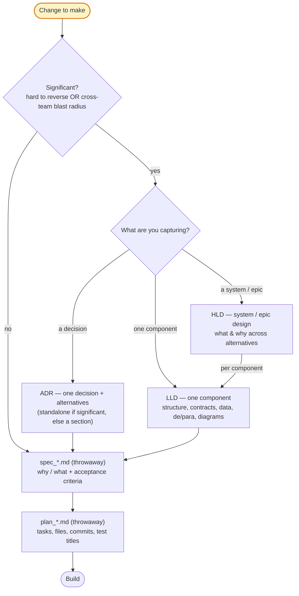

# Design & Build Docs — ADR / HLD / LLD / spec / plan

How the five docs divide work, so each one is written faster and none re-derives another.

This skill picks *which* doc to write and routes you to its template and a worked example. Two companion skills carry the quality bar — load them alongside this one:

- **`doc-standards`** — prose, comment, and density rules for the words inside any of these docs (also runs the density check).
- **`mermaid-diagrams`** — for every diagram you embed: validation, the target renderer version, and the common parse traps.

The toolbox: **ADR, HLD, LLD** (durable, committed in `docs/`) and **spec_<slug>.md, plan_<slug>.md** (throwaway, untracked, deleted after the PR).

The split that matters most is **purpose**: HLD, LLD, and ADR are **decision & alignment** docs (for humans aligning); spec and plan are **AI-build** docs (spec-driven), fed from them.

So durable docs carry tests, tasks, and launch at **alignment altitude** — strategy, titles, cross-team deps — while the plan carries the **concrete** version — commit-tasks, file paths, test titles.

The spec_<slug>.md/plan_<slug>.md workflow — interviewing, drafting, refining — lives in the `spec-driven-development` skill; this skill only covers their shape and altitude.

## Who owns what (single source of truth)

When two docs could carry the same thing, this table says which one owns the full version; the others recap + link instead of repeating.

| Concern | Owner | Others |
|---|---|---|
| Why / business context | HLD (epic) · spec_<slug>.md (feature) | recap + link |
| Decision + alternatives | ADR; or HLD/LLD decision section / spec·plan log (minor) | recap + link the ADR |
| Structure, contracts, data model, de/para | LLD | recap + link the LLD |
| Diagrams — big-picture (C4L1, architecture; high-level flow/sequence/state) | HLD | recap + link, don't redraw |
| Diagrams — detailed (code/component design, data-model & endpoint schemas, detailed flow/sequence/state, corner/failure) | LLD | recap + link, don't redraw |
| Success metrics, UAT, test & launch strategy — high-level | HLD / LLD | spec/plan recap + link |
| Task breakdown — titles only (estimates, parallelization, cross-team deps) | HLD / LLD | plan expands to commit-tasks |
| Concrete testable acceptance criteria | spec_<slug>.md | HLD/LLD keep the high-level version + link |
| Test titles, commit-sized tasks, file paths, commit sketch | plan_<slug>.md | — |

Diagram *type* isn't the discriminator — altitude is: the same flow/sequence/state diagram can serve an HLD at big-picture level and an LLD at detail level.

## Relating docs: recap + link by file, let sections flex

When two docs relate, the referencing doc points to the other by **file path, URL, or named anchor — never by a section or page number**.

It adds a **brief recap** of what's there.

The recap is enough to read standalone; the link is the drill-down for readers who want the full detail.

Recap *and* link, never link alone and never a bare number.

A `§X` pointer rots when the target renumbers and forces a jump to understand; the inline recap keeps each doc readable on its own.

So related sections are **elastic**:

- References an upstream that already answers a section (context, requirements, a decision) → that section shrinks to *recap + link*. An LLD that references an HLD is smaller.

- Self-contained, no related upstream → those sections grow to carry the full content. An LLD with no HLD has a fuller Context and Requirements.

Applies to every pair that relates: HLD↔ADR, HLD↔LLD, LLD↔LLD, LLD↔ADR, HLD↔spec, LLD↔plan, spec↔plan.

## Within a doc: sections reference only what the reader already read

The rule above covers doc→doc pointers, which may point anywhere. This one covers section→section pointers inside a single doc, where reading is linear.

- **A section may reference only earlier sections** — the reader has read them; a forward reference demands a jump into unread territory mid-sentence.

- **The appendix is the only exception**: it is optional-reading lookup material, so any section may reference it.

- **Token refs count as references** — `(OQ-17)` / `(R-11)` may only be cited after their registry section; before it, state the fact inline without the token.
  - Item-to-item token refs inside the same registry section are fine: the section's roadmap already introduced every item.

- **Order sections knowns-first so refs flow backward**: Context → Requirements → Premises → Decisions → Risks → Open Questions → core solution (design, mappings, flows) → Appendix.
  - Unknowns cite the knowns that spawned them; the core solution cites everything; the HLD/LLD templates encode this order.

- **Circular pairs** (a premise and the risk it creates, an open question and its risk): the earlier item keeps only the inline recap — no token.
  - The later item carries the backward token.

- **A forward pointer must be linkless**: "detalhado adiante" / "detailed ahead" with no anchor, token, or section number — it signals detail is coming without demanding the jump.

- Applies to all five docs — ADR, HLD, LLD, spec, plan.

## RFC is a status, not a doc

An RFC is a doc *circulating for comments*, not a sixth document.

Put it as a `Status` on an HLD or ADR (`Draft → RFC / In Review → Accepted`) while you gather feedback.

Don't create a separate RFC artifact; it would duplicate the HLD.

## Rules of thumb

- **Durable docs carry only the alignment altitude** — task *titles*, test/launch *strategy*, success metrics — for estimates, parallelization, and cross-team deps.

- **File paths, commit-sized tasks, and concrete test titles live only in the throwaway plan** — they rot, and they belong with the build (plan + TaskList).

- **Code bodies live in neither** the design nor the plan — they live in the repo. The LLD holds interfaces/schemas (the contract); the plan holds file paths and tasks.

- **A decision you'll argue again in 6–12 months → ADR.** A minor one → a line in the spec/plan decision log; graduate it to an ADR if it grows teeth.

## Decisions, Premises, Risks, Open Questions — how to structure them

The durable docs (HLD, LLD) carry numbered Decisions, Premises, Risks, and Open Questions. Keep those four sections clean with these rules.

- **One item, one sub-section — never a flat bullet list.** Give each Decision/Premise/Risk/Open-Question its own markdown heading, with the entry's body beneath it.
  - Applies uniformly to all four sections — don't leave one as a bullet list and another as sub-sections.
  - **The heading title is a scannable summary.** A reader skims the outline and opens a body only for details — so the title must carry the gist, not just the token.
  - Format: `### <TOKEN> — 
`, e.g. `### OQ-08 — Preço do item: unitário vs total`.
  - Keep the stable `<TOKEN>` (OQ-/PR-/D-/R-N) in the heading as the cross-reference anchor.
  - Cross-reference these items only by their stable `<TOKEN>`, never a `§N.M`-number.
    - Items get added/removed and `§`-numbers churn, while the token is a named anchor that tracks the item.
  - Tokens obey the reading-order rule above: cite them only from text after their registry section; earlier text recaps inline without the token.

- **Label by what you actually know.** A fact you've validated or assume true is a *Premise*; a genuine unknown is an *Open Question*.
  - Don't dress an unknown as a Premise, nor prematurely close a question you can't yet answer — both directions matter.

- **An unknown that would block execution becomes a provisional Premise + Risk, not an Open Question.** Assume the most reasonable default, write it as a Premise flagged provisional (e.g. "Provisória — confirmar com o time X"), and register what breaks if the assumption is wrong as a Risk that cites the Premise back.
  - This keeps the build moving on the assumed default while the real answer is chased in parallel — reserve Open Questions for unknowns that don't gate work already in flight.
  - Since Risks (section 5) follows Premises (section 3), the Premise points forward with a linkless phrase ("risco ... registrado adiante"); the Risk then carries the backward token once both entries exist.

- **A fact already stated in Context isn't a Premise**, even if later sections cite it often or in a specific way.
  - Recap the Context fact inline instead of minting or reviving a registry token for it.

- **Each fact lives once.** When a question is answered, move the answer into *Decisions*; don't leave decided content embedded inside the *Open Question*.
  - Drop any Open Question that a Premise already settles — no duplicate item across sections.

- **Open Questions is a burn-down list — its goal is "Nenhuma".** It records only what is *still* unknown, not a history of what got resolved.
  - When a question closes, **relocate** its content to the right home — a *Premise*, *Decision*, *Risk*, or embedded directly in the solution/mapping — and **remove** it from the Open Questions list.
  - Never leave a "[RESOLVIDA]" / "resolved" stub sitting in the Open Questions section — that defeats the burn-down and clutters the list.
  - When relocating, keep cross-references intact: repoint any `OQ-N` pointer to the item's new home (or state the fact inline), then grep the doc for dangling `OQ-/PR-/D-/R-` tokens before calling it done.

- **One logical decision, one Decision.** Consolidate; don't fragment a single choice across several `D-` items. Rejected options belong as *"discarded alternatives"* sub-bullets under the decision they lost to, not separate entries.

- **Trade-offs as sub-bullets, not a table.** For a decision's pros/cons, nest bullets under each option — more scannable and easier to keep inside the density cap than a markdown table.

- **Cluster items by theme, then order the clusters along one stable narrative.** Don't leave the four sections in the accidental order the tokens were minted.
  - Pick a narrative the whole doc already follows and reuse it in every section — e.g. the payload/call flow (source-of-truth → header → items → response → read-back), or foundational-scope-first.
  - Reorder freely: the stable `<TOKEN>` is a named anchor, so moving a `### OQ-08` block never breaks a `(OQ-08)` cross-reference elsewhere.
  - **Never renumber a token to fit the new order** — that *does* break every reference.
  - Open the section with a **roadmap** naming each cluster and listing its tokens in reading order (one cluster per line), then order the `###` items to match.
  - The roadmap gives the reader the map before the details.
  - Prefer the roadmap over per-cluster headings — a heading with a single item under it violates the "never a one-item heading" rule, and singleton clusters are common.

## The five docs at a glance

Shared mental model for which doc is which — not a step you need help running.

| Doc | Lifespan | Job |
|---|---|---|
| **ADR** | Durable | Decide — one significant decision + alternatives |
| **HLD** | Durable | Design (system / epic) — what & why across alternatives |
| **LLD** | Durable | Design (one component) — structure, contracts, data, de/para |
| **spec_<slug>.md** | Throwaway | Why / What — requirements + acceptance criteria, one feature |
| **plan_<slug>.md** | Throwaway | Build — tasks, files, commits, test titles, one feature |

**Significant** = hard to reverse OR cross-team blast radius.

Not significant (cheap to reverse AND contained) → skip durable docs, go straight to `spec_<slug>.md` → `plan_<slug>.md`.

Significant → write the durable doc, then still produce `spec_<slug>.md` → `plan_<slug>.md` downstream to execute.

## Templates and worked examples — start here to write one

When authoring a design doc or ADR: copy the matching `assets/` template to start, then read the matching `references/` example to see it filled in.

Every diagram in these examples was validated with the `mermaid-diagrams` skill — load it before you paste your own.

- HLD — start from `assets/template-hld.md` (skeleton with TODOs + authoring notes); see `references/example-good-hld.md` for a full worked example (MoSCoW scope, numbered premises/decisions/risks, sequence + state diagrams, appendix).

- ADR — start from `assets/template-adr.md` (skeleton with TODOs); see `references/example-good-adr.md` for a worked example (decision + alternatives with +/-/~ trade-offs + consequences).

- LLD — start from `assets/template-lld.md` (one component, implementation-ready: code design, data model, contracts, de/para mappings, error/concurrency, observability). The top comment block holds the HLD↔LLD boundary rule. No worked example yet.

- Schema as JSONC — when a doc shows a request/response/event payload, render it as one annotated JSONC object, not a field table; copy `references/example-good-schema.jsonc`.
  - "Schema as jsonc" means that file's style: real values, each field tagged `type | required|optional | constraints | description`, optional fields shown, nested objects in full, quirks inline.
  - Keep every line ≤80 chars: short annotations stay inline.
    - When a full annotation would push the field line past 80, move the comment above the field (wrapped, multi-line), preceded by a blank line so it hugs its field.
    - When the *value* is long (two origin paths in one de/para value), keep the leaf field in the value and move the container path up into the comment — never truncate.
    - When an enum has several long or multi-word values, list one value per line (`// enum:` header, then `//   - value` per line).
      - This avoids wrapping inline `enum [a, b, c]` mid-value across lines.
    - Never leave an orphaned continuation fragment (a lone trailing word) when wrapping.
      - Either fit the whole clause on one line.
      - Or split at a real idea boundary (e.g. a semicolon joining two clauses) so every resulting line stands complete on its own.
    - Measure before wrapping (`wc -c` on the line).
      - A line that looks long by eye often already fits within 80 chars.
      - Splitting one that doesn't need it adds noise instead of removing it.
  - **The description segment is optional — include it only when it adds real information beyond the name and type; otherwise omit it rather than forcing one.**
    - A phrase that just unpacks the identifier is not a description: `"modular"` → `// indica se é de modelo modular`, `"dataFimVigencia"` → `// data de término da vigência`.
    - Both examples above restate the name and teach the reader nothing new.
    - A description earns its place when it decodes a magic value/enum, states a unit, or names a business rule/quirk: `"tipoEndereco": 1  // fixo 1 = Faturamento conforme doc`.
  - **When a description does earn its place, keep it one short clause — never a paragraph.**
    - This is a content rule, distinct from the ≤80-char line cap above: a description can fit inside the cap and still be over-elaborate.
    - "Every field needs a description" is license to cover more fields, never to write more per field.
    - The fix for a useless description is to delete or tighten it, not expand it.

- de/para (from → to) mapping — qualify every field by its system.
  - Prefix each field with its source/destination system (`pic.`, `sge.`, `hub.`, `crm.`, or `const` for a literal), so provenance stays clear when systems share field names.
  - Validate the mapping against a real production payload, not just the vendor's example — real data stress-tests edge cases the example misses before you finalize.
  - **If a field has no destination because that concept doesn't apply on the destination side, say so plainly — don't call it a gap.**
