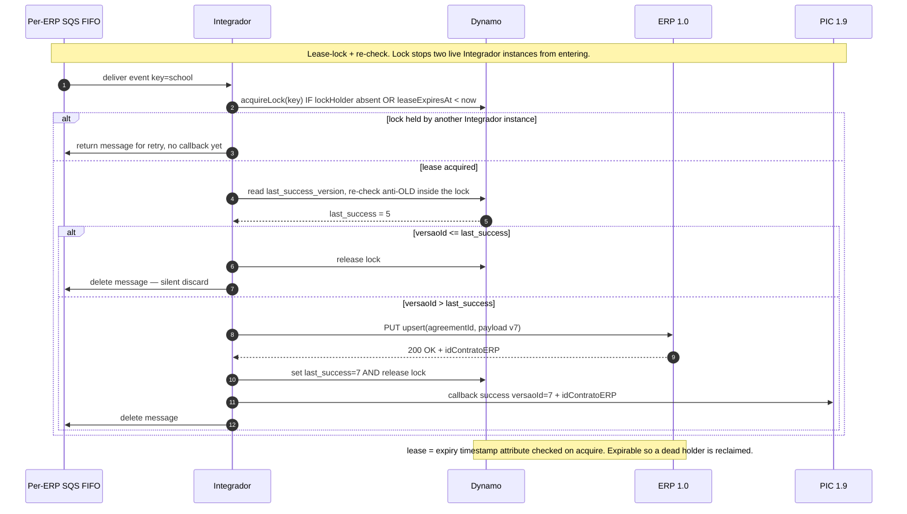
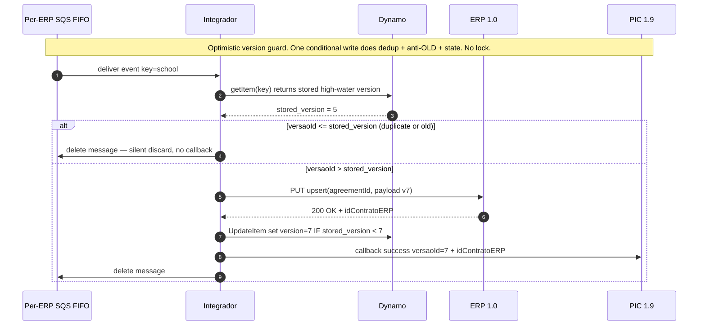
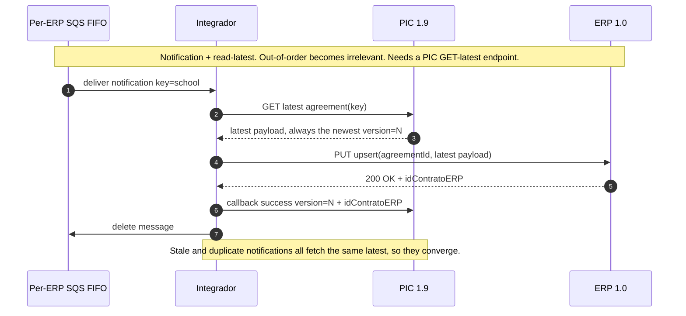

---
# performance-check budget override, not part of the example ADR itself.
# This file's size is set by the document it reproduces, so trimming it would make
# the example unrealistic. Doubled from the 1024w bundled default until it fits.
# No lines-budget: 135 non-blank lines already fits the 256 default.
words-budget: 2048
---

## Contexto

No Sync de Acordos (PIC 1.9 → Integrador → ERPs 1.0), cada Acordo chega como eventos versionados (`versaoId` monotônico crescente por contrato).

Há um requisito crítico de anti-OLD: **nunca gravar no ERP uma versão anterior depois de uma posterior já ter sido gravada**.

Além disso, processar no máximo 1 evento por `schoolDocNumber#brandSlug#agreementId` por vez, para garantir isso, evitando race condition.

Três fatos do ambiente tornam isso não-trivial:

- **A entrega é at-least-once e pode ser concorrente.**
  - A fila SQS FIFO com `MessageGroupId = schoolDocNumber#brandSlug#agreementId` mantém apenas 1 mensagem em voo por grupo **até a mensagem ser deletada ou o visibility timeout expirar**

  - O consumer da fila estende a visibility por heartbeat enquanto está vivo.
  - Mas se o processo morre ou crasha, a mensagem é entregue a outra réplica e duas podem processar o mesmo Acordo ao mesmo tempo.

- **O ERP aceita escrita antiga.**
  - Os ERPs 1.0 são idempotentes por `agreementId`, mas **não** condicionais por versão — não rejeitam um PUT com versão menor (alguns nem possuem esse conceito de versão).

- **Já existe um padrão de dedup por chave no DynamoDB** (tabela `integrator-syncs-last-upsert-triage`), que compara a última data de modificação antes de aceitar um sync — há referência.

A pergunta desta ADR: **como garantir o anti-OLD sob concorrência?**

## Decisão

Adotar **lease-lock no DynamoDB + re-check do anti-OLD dentro do lock** (Alternativa A).

- A Fundação adquire um lock por `schoolDocNumber#brandSlug#agreementId` via conditional write antes da seção crítica.
- Dentro do lock, re-lê o `last_success_version` e só aciona o Tradutor (chamada ao ERP) se o evento for mais novo.
- O lease lock tem um atributo de timestamp (`leaseExpiresAt`) checado no acquire. Lease expirável evita deadlock se o holder morre.
- O lock mora na própria linha de dedup (mesma chave): um conditional write adquire o lock e lê o `last_success`.

## Justificativa

Entre as opções viáveis no prazo, o lease-lock é o **mais confiável**.

Ele serializa a seção crítica `{ler → PUT ERP → gravar last_success}` por chave, impedindo que duas instâncias vivas passem no check e escrevam no ERP fora de ordem.

A Alternativa B (version guard otimista) deixa uma janela de corrida maior numa entidade crítica (acordo de vendas, V1 Excelente).

A Alternativa C (notification + read-latest) foi descartada porque o PIC 1.9 não expõe o endpoint GET de Acordo que ela exige.

## Alternativas Consideradas

[+] → vantagens
[-] → desvantagens
[~] → trade-off

### A.) [Escolhida] Lease-lock pessimista + re-check

Adquire um lock por chave, re-checa o anti-OLD dentro do lock, então escreve no ERP.

O lock impede duas instâncias vivas de entrarem na seção crítica ao mesmo tempo.

- [+] Menor risco de race condition entre os viáveis — duas instâncias vivas não entram juntas na seção crítica
- [+] Lease expirável evita deadlock se o holder morre — outra instância assume após a expiração
- [-] Round-trips extras ao DynamoDB (acquire + release) por evento
- [-] Mais estados e ramos no consumer (lock detido, lease expirado, release em erro)
- [~] **Falha residual**: o ERP não rejeita escrita antiga, então um zumbi que retoma após o lease expirar pode gravar coisa antiga (raro).
  - Mitigado pelo re-check antes do PUT e pelo lease > tempo de processamento; não eliminado.

### B.) Version guard otimista (conditional write)

FIFO dá ordenação; **um** conditional write faz dedup + anti-OLD + state de uma vez (`set version=7 IF stored < 7`).

Sem lock — detecta o conflito na hora da escrita, não previne a entrada concorrente.

- [+] Mais simples — um único conditional write cobre dedup + anti-OLD + atualização de estado
- [+] Sem ciclo de lock (acquire/release), menos round-trips no caminho feliz
- [-] **Falha**: duas instâncias vivas (após redelivery por visibility timeout) leem o mesmo `stored_version`, ambas passam no check e escrevem no ERP em ordem indefinida.
  - A versão antiga pode ficar por último no ERP.

- [-] O conditional write protege a linha do DynamoDB, mas **não** a ordem da escrita no ERP — janela de corrida maior que a do lock

- [~] Janela menor na prática graças ao SQS FIFO, mas grande demais para um invariante crítico (acordo de vendas)

### C.) [Descartado] Notification + read-latest do PIC

Trata o webhook como um sinal de "algo mudou"; busca o Acordo mais recente no PIC e aplica. Ordenação e Duplicação se tornam irrelevante por construção.

- [+] Elimina o problema by design — sem lógica de anti-OLD, sem lock, eventos convergem para o mais novo
- [+] Dedup e anti-OLD viram efeito colateral grátis do "buscar o mais recente"
- [-] **Falha / bloqueio**: exige um endpoint GET-latest no PIC que **o PIC 1.9 não expõe** — inviável no escopo atual
- [-] Adiciona uma chamada de leitura por evento e acopla o processamento ao uptime do PIC
- [~] Forte candidata para o rePIC (2.0), que pode nascer com esse GET — reavaliar no futuro

## Consequências

Aceitamos dois trade-offs conscientes:

- Round-trips extras ao DynamoDB (acquire/release) no caminho de cada evento.

- Um **resíduo irredutível** — como os ERPs não rejeitam escrita antiga, nenhum lock fecha 100% a janela.
  - Risco: sobrescrever o ERP 1.0 com uma versão antiga.
  - Acontece se uma instância zumbi volta após o lease expirar, ou se o lock expira cedo demais enquanto algum fluxo ainda está sendo processado.

Mitigamos com o re-check imediatamente antes do PUT no ERP e com o lease dimensionado acima do tempo máximo de processamento (30min).

## Referências

1. [HLD — Sync de Acordos PIC Arco → ERPs 1.0 (Fase 1)](../designs/sync-agreements-pic1.9_hld.md)
2. [Idempotent consumer pattern — microservices.io](https://microservices.io/post/microservices/patterns/2020/10/16/idempotent-consumer.html)
3. [Optimistic locking with version number — Amazon DynamoDB](https://docs.aws.amazon.com/amazondynamodb/latest/developerguide/BestPractices_OptimisticLocking.html)
4. [Idempotency — Powertools for AWS Lambda](https://docs.aws.amazon.com/powertools/typescript/latest/features/idempotency/)
5. [FIFO queue delivery logic — Amazon SQS](https://docs.aws.amazon.com/AWSSimpleQueueService/latest/SQSDeveloperGuide/FIFO-queues-understanding-logic.html)
6. [ITGD-2930 — Sync de Acordos PIC Arco → ERPs 1.0](https://arco-educacao.atlassian.net/browse/ITGD-2930)
