---
# performance-check budget override, not part of the example HLD itself.
# This file's size is set by the document it reproduces, so trimming it would make
# the example unrealistic. Doubled from the 1024w/256l bundled defaults until it fits.
words-budget: 16384
lines-budget: 1024
---

# HLD — Sync de Acordos: PIC Arco → ERPs 1.0 (Fase 1)

Issue raiz: [ITGD-2930](https://arco-educacao.atlassian.net/browse/ITGD-2930).  
Prazo Fase 1: 06/Jul/2026

---

## 0. Sobre este documento

**Objetivo**: HLD (High Level Design) do Sync de Acordos PIC Arco → ERPs 1.0 (Fase 1).

Captura contexto, escopo, premissas, decisões (ADRs) e riscos.

Não substitui o LLD (Low Level Design) por ERP 1.0 — cada um terá o seu, detalhando contrato HTTP, mapeamento de campos e especificidades.

**Como ler**:
- **Corpo (seções #1–#5)**: leitura linear cobrindo contexto, escopo, AS-IS, premissas, decisões, TO-BE, riscos etc.
- **Apêndice (#6)**: leitura opcional — terminologia, schemas etc.

---

## 1. Contexto

O Programa de Integração de Contratos (PIC) Arco é o sistema interno para cadastro/atualização de Acordos de Vendas (contrato comercial entre Arco e Escola).

É a versão evoluída do PIC 1.0 (sistema original), também chamada de PIC 1.9.

Tem UI mais amigável e validações que reduzem erro humano.

Hoje, integra **diretamente e de forma síncrona** com 3 ERPs 1.0: Protheus SAS, SAE, IS.

As outras marcas (PSD B2B/B2C, COC, PGS, Gênio, Pleno, EI, Mestre, Nave à vela / Geekie) usam outros ERPs 1.0 legados: SGE, Oracle EBS, SAPB1, Raízes.

Nesses, Acordos são cadastrados manualmente em UIs com uma UX confusa (SAPB1 é o pior exemplo).

Resultado: alta margem de erro humano, entregas em endereço errado, divergências entre sistemas, retrabalho.

O PIC 2.0 (também chamado de **rePIC** — sistema 2.0 final para Acordos) está sendo construído, mas **não estará pronto a tempo do V1 Excelente (Agosto/2027)**.

A estratégia acordada: evoluir o PIC 1.0 → PIC 1.9 para atender todas as marcas que faltam, fazendo o sync para os ERPs 1.0 via Integrador.

Quando o rePIC lançar, **a maior parte do esforço feito aqui é reaproveitável**.

### 1.1. O Integrador como ponte 1.0 ↔ 2.0 (e por que isso molda este Sync)

O Integrador é o **facade strangler-fig** e a **camada anticorrupção** entre o ecossistema 1.0 (ERPs legados) e o 2.0 (CRM, rePIC, OMS, Loja Meu Arco etc).

Para a migração acontecer de forma faseada, ele sincroniza dados nos **dois sentidos**, em diferentes fluxos.

Escreve 2.0 → 1.0 para manter o legado funcionando, e lê 1.0 → 2.0 o dado que ainda só existe no legado.

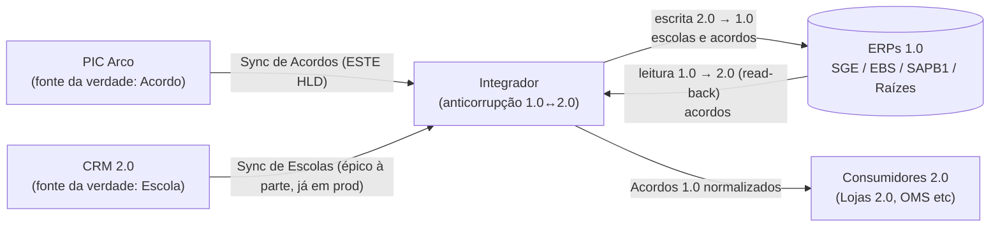

**Dois fluxos de escrita** nos ERPs 1.0 fazem upsert no mesmo registro de Escola/Acordo:

- **Sync de Acordos** (PIC Arco → ERPs 1.0) — escopo deste HLD.
- **Sync de Escolas** (CRM 2.0 → ERPs 1.0) — épico separado, já em produção (Protheus SAS/IS/SAE + SAPB1).

Esses fluxos **compartilham campos** no ERP 1.0 — em especial os **endereços (faturamento e entrega)**, escritos por ambos.

Além disso, o Integrador **lê de volta** (read-back) campos de Escola e de Acordo dos ERPs 1.0 para servir 2.0.

Duas consequências imediatas:

1. **Fonte da verdade dos endereços precisa ser o Acordo**, não o cadastro de Escola — o Sync de Escolas não pode sobrescrever o endereço que o Acordo gravou.

2. **Os campos que 2.0 precisa do Acordo, hoje vindo dos ERPs 1.0 via Integrador, são mandatórios no Sync de Acordos.**
  - Se 2.0 lê um campo, o Sync de Acordos tem de garantir que ele foi gravado, caso contrário o read-back devolve incompleto.

---

## 2. Escopo

**Política de prioridades (MoSCoW)**: itens [MUST] entram na Fase 1.

Itens [SHOULD] e [COULD] viram tarefas separadas no fim do backlog do épico — feitos só se sobrar tempo.

### 2.1. Funcional

**Em escopo (Fase 1):**

1. [MUST] Sync de **criação e atualização** de Acordos do PIC Arco → 4 ERPs 1.0: **SGE, Oracle EBS, SAPB1, Raízes**.
2. [MUST] Quebra de Acordo multimarca em 1 POST por marca (feito pelo PIC).

3. [MUST] Roteamento no Integrador por `(brandSlug, tipoContrato)` → ERP
  - 1 use case por ERP atendendo N marcas.
  - Marcas PSD (SPE, Conquista, Maralto, PES) roteiam para SGE quando B2C e para Oracle EBS quando B2B; mapeamento completo no apêndice.

4. [MUST] Tradução de/para por ERP (modo ativo — Integrador entende ativamente o que ERP tem disponível para tradução).
5. [MUST] Callback HTTP do Integrador → PIC Arco com status (sucesso/erro + mensagem) para refletir na UI do operador.
6. [MUST] Persistência do **Institution ID** (ID da Escola no CGI — futuro sistema fonte da verdade para Escolas/Instituições) no ERP 1.0 junto com o Acordo.

7. [MUST] Suporte a retry manual pelo operador via UI do PIC (para erros de negócio).
8. **Acordos com Intermediador** (`tipoContrato = Comercializador`):
  - [MUST] Cada Acordo persistido no ERP 1.0 tem exatamente 1 endereço de entrega: PIC envia 1 POST por escola atendida.
  - Preservar endereços já cadastrados em upsert é responsabilidade de cada Tradutor (read-before-write ou PATCH conforme o ERP) e detalhado em seus LLDs.

9. [SHOULD] Erros cadastrados na tabela `errors_callbacks` para visualização no Painel de Erros

10. [MUST] **Fonte da verdade do endereço é o Acordo**: faturamento e entrega vêm do Acordo, nunca do cadastro de Escola — o Sync de Escolas não pode sobrescrevê-los.
  - Trava será implementada em outro épico.

11. [MUST] **Infos obrigatórias do Acordo no ERP 1.0** — o que o 2.0 lê de volta via Integrador; sempre gravadas (lista única para os 4 ERPs).
  - Os demais campos do PIC são best-effort, alinhado com os times dos ERPs 1.0.
  - São obrigatórias:
    - Número do Contrato
    - Marca
    - CNPJ da Escola
    - Tem interveniente?
    - Ano Coleção
    - Séries contratadas e alunado
    - Por SKU contratado:
      - Preço
      - Desconto
      - Quantidade bonificada

    - Endereço de Faturamento (fonte da verdade: Acordo)
    - Endereço de Entrega (fonte da verdade: Acordo)
    - Infos de Frete
    - Infos de Pagamento (somente B2B)
    - ID da Instituição (CGI ID, metadado)

**Fora de escopo:**

1. Sync de Acordos PIC Arco → 3 Protheus (SAS, SAE, IS) — Fase 2.

2. Sync de Escolas CRM 2.0 → PIC Arco
  - Incluindo Inscrição Estadual (`stateTaxId`), Nome Fantasia (`tradeName`), Marca (`brandSlug`), ID CGI (`institutionId`)
  - Outra tarefa da Fase 1.

3. Sync de "Endereço de Entrega" PIC Arco → CRM 2.0.
4. Sync de Pré-clientes (para amostra) - Será priorizado depois, isoladamente.
5. **Inativação, exclusão e expiração** de Acordos via Integrador. Negócios confirmou que não realiza essas operações.

### 2.2. Não-Funcional e Técnico

1. **Disponibilidade & Confiabilidade**:
  - [MUST] Criações e atualizações de Acordos nunca são perdidas, apesar de indisponibilidades pontuais (ERPs 1.0 ou Integrador).

  - [MUST] Cada ERP 1.0 tem fila e DLQ dedicadas (bulkhead — instabilidade num ERP não contamina os demais).

  - [MUST] Comportamento bem definido para falhas de DB, ERP 1.0 ou callback do PIC.
  - [MUST] Controle de vazão ao PIC e ERPs 1.0 (evitar DoS/overload).

  - [SHOULD] Retry com backoff exponencial + jitter ao chamar ERPs 1.0 e PIC Arco, em caso de intermitências.
  - Métrica de Sucesso: Error Rate no Sync de Acordos < 1% por ERP.

2. **Observabilidade**:
  - [MUST] Logs estruturados (level, timestamp, transactionId | traceId) com IDs de correlação propagados ao PIC e ERPs 1.0 quando possível.

  - [MUST] Métricas por ERP 1.0:
    - Número de PIC Arco POSTs recebidos (por CNPJ, marca) > 1
    - Número de upserts em ERP 1.0 com sucesso (por CNPJ, marca) > 1
    - Itens na DLQ (por ERP 1.0) ≤ 0

  - [MUST] Alarmes acionáveis por ERP 1.0:
    - Itens na DLQ > 0
    - Idade > 30min (handle quickly, keep SLA)
    - Idade > 10 dias (avoid expiration).

  - [SHOULD] Persistência do estado corrente de cada `(contrato, versão)` — consultar em que estado cada versão de Acordo está no fluxo - debugability

  - [COULD] Persistência das transições de estado (timeline) de cada `(contrato, versão)` - debugability.

  - [SHOULD] Dashboard agregado por ERP 1.0 para o fluxo:
    - Volume corrente (fila + DLQ) over time
    - Contagem de Acordos criados/atualizados/descartados
    - Latência p50/p95/p99 (fim-a-fim e por etapa: webhook → fila → ERP → callback)
    - Taxa de erro por categoria
    - Idade do item mais antigo em filas (fila e DLQ).

3. **Suporte**:
  - [DONE] Canal de suporte no slack
  - Métrica de Sucesso: SLA de incidente no fluxo < 7 dias

4. **Segurança / Autenticação**:
  - [MUST] Webhook PIC→Integrador autenticado (via header `X-API-Key`); Callback Integrador→PIC via header `X-API-Key`.

  - [MUST] Validação síncrona do schema do payload na entrada, seguro contra injection indireto nos ERPs 1.0.

5. **Latência & SLAs**:
  - [MUST] Webhook do PIC retorna `202 Accepted` em < 500ms — apenas valida e enfileira, não processa síncronamente (mantém UI do PIC responsiva).

  - [MUST] Callback ao operador (sucesso ou erro) em até 30 min do evento original; retries dimensionados para não estourar SLA.
  - Métrica de Sucesso: Latência da Notificação de Sucesso < 15 min por ERP 1.0.
  - Métrica de Sucesso: Latência da Notificação de Erro < 30 min por ERP 1.0.

6. **Reusabilidade**:
  - [SHOULD] Maximizar a reusabilidade para que o rePIC reaproveite ao máximo.

7. **Anti-OLD e anti-DUPLICADO**:
  - [MUST][CRITICAL] Nunca criar/atualizar com versão/alteração anterior à já salva.
  - [MUST] Descartar eventos duplicados (mesma versão/alteração já salva).
  - [MUST] Processar no máximo 1 evento `(cnpj, contrato)` por vez, para evitar race condition.

8. **Semântica de entrega do callback**:
  - [MUST] At-least-once: cada evento gera ≥1 callback **exceto** quando descartado pelo dedup (duplicado ou antigo) — descarte é silencioso, sem callback.

  - [MUST] Duplicados (sucesso ou erro) são possíveis (SQS + retries).

  - [MUST] Um erro pode ser sucedido por outro erro (ex: ERP fora e, no retry, erro de data quality) ou por um sucesso (ex: ERP fora e então sucesso).
    - PIC precisa aceitar ambas as transições.

  - [MUST] Callback carrega timestamp; PIC ordena por timestamp (não pela ordem de entrega) e descarta duplicados.

  - [MUST] Após sucesso registrado, o Integrador nunca emite erro subsequente para o mesmo `(contrato, versão)`, exceto em atualização vindas do PIC.

9. **Tratamento de erro**:
  - [MUST] Toda falha gera callback ao PIC — operador nunca fica no escuro. Descarte (duplicado ou antigo) não é falha; acontece silenciosamente sem callback.

  - [SHOULD] Sem retry quando não há chance de sucesso (ex: payload malformado, cadastro errado no ERP etc).

10. **Limites de plataforma em mente** (hard limits AWS, independente da solução adotada):
  - [MUST] **SQS**: 256 KB por mensagem (payload recebido do PIC).
  - [MUST] **DynamoDB**: 400 KB por item.

---

## 3. AS-IS

### 3.1. Use Cases / JTBDs (Jobs To Be Done)

- **UC-ASIS-1** — Operador PIC cadastra/atualiza Acordo (marcas Protheus) e vê reflexo no ERP.
  - *Hoje*: UI do PIC → POST síncrono ao Protheus. Status visível na UI.

- **UC-ASIS-2** — Operador PIC retenta sync que falhou.
  - *Hoje*: botão "retry" na UI do PIC. Síncrono.

- **UC-ASIS-3** — Operador das marcas não-Protheus (SGE/EBS/SAPB1/Raízes) cadastra/atualiza Acordo direto no ERP.
  - *Hoje*: cadastro manual no ERP legado. Sem PIC. Alta margem de erro.

- **UC-ASIS-4** — Time de Integração mantém Sync de Escolas CRM 2.0 → ERPs 1.0.
  - *Hoje*: Online no Protheus SAS/SAE/IS + SAPB1.
  - Faltam SGE/EBS/Raízes. Modo hub disponível (ERP exporta endpoint padronizado, Integrador apenas roteia)

---

## 4. Visão de Longo Prazo

1. **PIC 2.0 (rePIC) substitui PIC 1.9** (horizonte: pós-Agosto/2027).

2. **Fase 2** migra os 3 Protheus (SAS/SAE/IS) do sync direto PIC→Protheus para PIC→Integrador→Protheus.
  - Habilita 100% de reuso no PIC 2.0
  - Unifica o fluxo entre todos os ERPs.
  - Ganha robustez: async, controle de vazão, retry, observabilidade etc.

3. **PIC 2.0 direto com CRM 2.0**:
  - Como ambos são 2.0, faz pouco sentido usar o Integrador entre eles — comunicação direta.
  - O Integrador continua sendo a ponte 2.0 → 1.0.

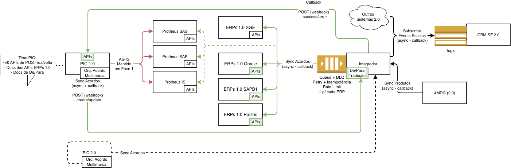

---

## 5. TO-BE

### 5.1. Use Cases / JTBDs

- **UC-TOBE-1** — Operador PIC cadastra Acordo multimarca e vê reflexo em todos os ERPs 1.0 alvo.
  - *Sucesso*: Acordo presente nos ERPs 1.0; UI do PIC mostra sucesso por marca.

- **UC-TOBE-2** — Operador PIC sabe em ~30min quando um sync completa/falha e por qual razão.
  - *Sucesso*: UI do PIC mostra status por marca; mensagem clara em caso de erro.

- **UC-TOBE-3** — Operador PIC retenta manualmente sync que falhou, após corrigir cadastros etc.
  - *Sucesso*: botão de retry na UI dispara novo POST ao Integrador, sem duplicatas.

### 5.2. Perguntas em Aberto

Nenhuma.

### 5.3. Premissas

Premissas que o design abaixo trata como verdade. Se alguma cair, este doc precisa ser revisitado.

#### P-01 — `versaoId` é inteiro monotônico incremental por contrato (PIC contract, `versaoId.min: 1`).

- Identifica unicamente a versão de um Acordo no PIC.
- Fonte única; o Integrador não gera versões; ERPs 1.0 não persistem essa info.

#### P-02 — No PIC 1.9, qualquer alteração no Acordo incrementa `versaoId`.

- **Cai no futuro** por dois vetores: (a) Andre Isaac — updates sem nova assinatura não incrementam versão; (b) rePIC — updates sem nova versão por design.

- Em ambos, o evento chega com mesmo `versaoId` e `dataAlteracao` mais recente.

#### P-03 — [SHOULD] Integrador gera receipt timestamp na entrada (API Gateway), separado dos critérios de dedup.

- Serve para observabilidade (recebimento→ERP, debug, métricas), **não** para dedup/anti-OLD.
- Dedup usa `dataAlteracao` do PIC, porque o operador pode clicar "Sync" muito depois da edição no PIC.
- Receipt-time não representa "qual versão é mais nova".

#### P-04 — PIC envia 1 POST por (marca, endereço de entrega).

- Cada POST traz exatamente 1 marca e exatamente 1 endereço de entrega e faturamento; o Integrador roteia por `(marca, tipoContrato)`.
- Acordo com Intermediador atendendo N escolas → PIC envia N POSTs distintos, um por escola/endereço atendido.
- Não há lógica de splitting no Integrador.

#### P-05 — Em falha parcial multimarca, PIC 1.9 retenta o conjunto inteiro.

- Idempotência por `versaoId` no Integrador garante que marcas já com sucesso são descartadas adequadamente.

#### P-06 — `tipoContrato` ∈ `{Venda Padrão, Loja Virtual, Comercializador}` (PIC contract enum).

- **Venda Padrão** = B2B direto (Acordo entre Arco e a Escola).
- **Loja Virtual** = B2C (Acordo entre Arco e consumidor final via loja online).
- **Comercializador** = B2B via Intermediador (a.k.a. Interveniente) — Acordo entre Arco e uma entidade que contrata material em nome de N escolas. Sempre B2B; não existe Intermediador no modelo B2C.

- Implicação para roteamento `(brandSlug, tipoContrato)`: Comercializador é variante de B2B, então mapeia para o **mesmo ERP destino** do `Venda Padrão` da marca.

- Os quirks de payload (Intermediador como conta no ERP, endereços de entrega por escola atendida) ficam no LLD por ERP.

#### P-07 — ERPs 1.0 são idempotentes em PUT por `agreementId` (`idContratoERP`)

- Reenvio do mesmo Acordo após erro de rede não cria duplicata no ERP.
- O Integrador é incapaz de garantir integridade na base dos ERPs 1.0 em case de partição de rede.

#### P-08 — `create` antes do `update`: se um `update` chegar sem que o `create` correspondente tenha efetivado, o Integrador trata como upsert (cria).

- Evita falhas reais em race conditions PIC→Integrador→ERP.

#### P-09 — Premissas sobre o contrato PIC→Integrador para a Fase 1. Até confirmação formal do time PIC, o design adota:

- **CNPJ**: tipo `string` 14 dígitos numéricos (regex `^[0-9]{14}$`), apesar do exemplo do PIC mostrar integer em alguns lugares.

- **`dataAlteracao`**: string ISO 8601 UTC (`pattern: ^\d{4}-\d{2}-\d{2}T...Z$`).
  - **PRECISA** ser UTC — design dedup depende disso (segundo critério da chave composta após `versaoId`).
  - Risco aceito: se o PIC enviar timestamp errado, podemos descartar um evento legítimo.

- **Callback ao PIC contém `timestamp`**: string ISO 8601 UTC; PIC ordena callbacks por este campo, não pela ordem de entrega (não garantida).
- **`status = "Rascunho" em Acordos`**: aceito pelo schema (enum válido), mas descartado pelo Integrador — não sincroniza ao ERP, sem callback.
  - Premissa: PIC não emite Rascunho ao Integrador; se emitir, será descartado ou gerará 400 (Bad Request).

- **Marcas Positivo e PIÁ**: Positivo é alias de SPE (mesmo destino de roteamento); PIÁ é selo de literatura dentro do Maralto (idem).
- Os dois resolvem para um Tradutor existente; não há Tradutor dedicado. SPE = Positivo, PIÁ = Maralto.
- **`materiais[].suplementar`**: quando preenchido, segue o **mesmo schema de um item de `materiais`** (estrutura recursiva).
- **`Kit.bimestre`**: integer `1..4` (1º a 4º bimestre).

#### P-10 — Validações cruzadas são responsabilidade do PIC, não do Integrador

- Semântica correta de `segmento e serie`, `marca do evento e marca do material`, soma de rateios = 100, `valorLiquido = bruto − desconto`, etc.
- Integrador valida somente a **estrutura** do payload (shape, mandatórios etc) e propaga ao ERP sem validar semântica e regras de negócio inter-campo.
- Se uma regra cruzada falhar no ERP, o erro é tratado como Data Quality — ônus do operador corrigir no PIC.

#### P-11 — Sync nunca acontece sem `materiais` definidos (`min_items=1`).

- Antes da Fase 1, especulava-se que Acordos pudessem ser assinados antes de o material ser definido.
- Negócio confirmou que isso **não ocorre**: um Acordo só é enviado ao Integrador após `materiais` estar preenchido.
- Integrador rejeita payload com `materiais` vazio (`400 Bad Request`); operador corrige no PIC e retenta.
- Demais campos nullable/optional permanecem como tal:
  - `contratoAnterior` (null no 1º ano)
  - `endereco.complemento` (OPCIONAL)
  - `materiais[].suplementar` (null quando não há)
  - `frete.normal.percentual` (null quando `automatico=true`) etc.

#### P-12 — Todo ERP 1.0 retorna o `idContratoERP` na resposta HTTP do upsert.

- O callback ao PIC exige `idContratoERP` em caso de sucesso; logo, assume-se que todos os ERPs 1.0 o devolvem na resposta.

#### P-13 — Todo POST/PUT do Integrador aos ERPs 1.0 são síncronos (nenhum assíncrono).

- A chamada HTTP bloqueia até o ERP responder; sucesso/erro e `idContratoERP` voltam na própria resposta.
- Pela documentação atual dos 4 ERPs 1.0 da Fase 1 (SGE, Oracle EBS, SAPB1, Raízes), nenhum expõe upsert assíncrono.
- O que conhecemos hoje de Protheus também é síncrono.
- Isso simplifica bastante a solução.

#### P-14 — Este design é baseado no contrato do PIC 1.9.

- A migração para o PIC 2.0 (rePIC) potencialmente exigirá alguns ajustes: provavelmente nos endpoints de callback e roteamento (ajustes pequenos).

#### P-15 — O PIC aceita qualquer transição de status nos callbacks para o mesmo `(versaoId, marca)` - alinhado com o time PIC.

- Ordena por `timestamp` do callback (não pela ordem de entrega) e descarta duplicados.
- Aceita erro > sucesso (ex.: retry após ERP voltar) e erro > erro (nova causa de falha), sucesso > erro (atualização contratual inválida).

#### P-16 — O payload do PIC é auto-contido: todos os dados para traduzir ao formato de qualquer ERP 1.0 chegam no próprio payload, independente do `tipoContrato`.

- O Integrador não enriquece de outras fontes — apenas **traduz** (de/para) e **orquestra**.

### 5.4. Decisões

#### D-01 — Fluxo Async com Callback (ao invés de Sync HTTP)

**Decisão**: Async + Callback HTTP do Integrador → PIC Arco.

**Por quê**:
- Disponibilidade exige que o sync aconteça apesar de indisponibilidade dos ERPs 1.0. Síncrono falha quando o ERP está fora; async + retry resolve.
- PIC tem requisito funcional de mostrar status na UI → callback supre isso.
- Já existe a fundação disso no Integrador, reutilizaremos.

**Descartado**:
- Sync HTTP direto (como o PIC↔Protheus hoje): falha no requisito de disponibilidade, não escala para 4+ ERPs.
- Polling do PIC ao Integrador por status (ao invés de callback): chato pro PIC implementar, mais latente, desperdiça chamadas.

#### D-02 — Anti-OLD usa `(versaoId, dataAlteracao)` do PIC, não timestamp do Integrador

**Decisão**: Para decidir se um evento recebido é "mais novo" que o último sucesso gravado, o dedup compara o par `(versaoId, dataAlteracao)` — ambos do payload PIC.

Apesar do Integrador gerar um timestamp próprio no API Gateway ao receber o evento pela primeira vez, por observabilidade, esse timestamp **não** entra no anti-OLD.


**Por quê**:
- **`versaoId` sozinho não basta no futuro**: Andre Isaac citou cenários e rePIC podem gerar eventos legítimos com mesmo `versaoId` e `dataAlteracao` mais recente.
  - Comparar os dois já cobre esse caso desde o início.

- **`dataAlteracao` representa "quando a versão foi alterada no PIC"**, não "quando o operador clicou em Sync na UI do PIC".
  - Operador pode disparar Sync horas depois da edição.
  - Receipt-time do Integrador não distingue "qual a versão mais nova", apenas qual chegou mais recentemente.

- O PIC é o dono da versão e da alteração; faz sentido que ele seja a fonte do critério.

**Risco aceito**: se o PIC enviar `dataAlteracao` errado (clock skew, fuso, bug), o dedup pode descartar um evento legítimo como antigo.

**Descartado**:

- **Comparar só `versaoId`**: frágil ao cenário Andre Isaac/rePIC.

- **Comparar pelo receipt timestamp do Integrador**: não distingue updates anteriores reenviados manualmente pelo operador.

#### D-03 — Descarte de duplicatas e eventos antigos via DynamoDB

**Decisão**: Tabela DynamoDB chaveada em `(cpnj, número do acordo, marca)` — **uma linha por Acordo** — armazena `(last_success_versaoId, last_success_dataAlteracao)`.

Antes de chamar o ERP 1.0, o use case lê 1× (query, não scan) e compara o evento de entrada:

1. Se `event.versaoId > stored.versaoId` → **aceita** (versão nova).
2. Se `event.versaoId < stored.versaoId` → **descarta** (versão antiga, independentemente do `dataAlteracao`).
3. Se `event.versaoId == stored.versaoId` → **tiebreaker por `dataAlteracao`**: aceita se mais recente, descarta se ≤.
  - Cobre o cenário Andre Isaac/rePIC — updates sem nova assinatura/versão, onde dois eventos compartilham `versaoId` legitimamente.

Após sucesso no ERP, atualiza ambos os campos no DB, então notifica o PIC.

O dedup é reavaliado a cada consumo de fila (ingestão por ERP).

**Por quê**:
- Garante anti-OLD + anti-DUPLICADO.
- DynamoDB é rápido, escalável, custo baixo nesse volume; stack conhecida.
- Não há relacionamento aqui, que favoreceria um DB relacional.

**Descartado**:
- **Dedup por timestamp interno do Integrador** (receipt-time): operador pode clicar Sync horas depois da edição; receipt-time não diferencia "qual a versão mais nova", mas sim qual foi sincronizada mais recentemente.

- **Dedup só por `versaoId`** (sem tiebreaker): frágil ao cenário Andre Isaac/rePIC (updates sem nova versão; dois eventos legítimos compartilham `versaoId`).
  - O tiebreaker custa um campo a mais no item e nada no caminho feliz.

- **Tabela relacional**: mais lenta, sem benefício no caso.
- **Idempotência só no ERP**: depende de cada legado garantir; nem todos garantem.

#### D-04 — Erros sempre geram callback; alguns também vão para DLQ

**Decisão**:

- **Não-técnico** (Data Quality — cadastro errado/faltante): callback de erro imediato ao PIC. **Sem retry, sem DLQ.** Operador corrige e retenta pela UI.

- **Técnico transitório** (ERP fora, timeout):
  - N retentativas com backoff exponencial + jitter.
  - Esgotamento → callback de erro + DLQ.

- **Técnico inesperado (a.k.a. bug Integrador)**:
  - Sem retentativas.
  - Callback de erro + DLQ.
  - Re-drive após fix deve limpar DLQ.

**Princípios transversais**:
- **Todo erro emite callback ao PIC**, inclusive bugs no Integrador.
- SLA de notificação ao operador (≤ 30 min) exige visibilidade independente da causa.
- **Redrive seguro**: itens que o operador já retentou com sucesso via UI são descartados silenciosamente quando re-drivados da DLQ
  - O dedup cuida disso.

**Por quê**:
- Não-técnico em DLQ é ruído (sistema não corrige sozinho).
- Transitório em DLQ habilita reprocessamento sem fricção para o operador (engenheiro redriva após o ERP voltar).
- Bug em DLQ é o caso clássico (fix nosso → redrive funciona).
- Callback universal: única forma do operador saber o status; suprimir quebra o SLA de notificação.

**Descartado**:
- Não-técnico em DLQ: ruído sem ganho.
- Suprimir callback em alguma classe de erro: operador no escuro; quebra o SLA de notificação.

#### D-05 — Callback desacoplado do `errors-callback` genérico

**Decisão**: O **cliente HTTP** do callback ao PIC é dedicado, **não** reaproveita o cliente `errors-callback` genérico do Integrador.

A **tabela** `errors_callbacks` é usada para persistir erros do fluxo e produtizar o Painel de Erros — diferente do cliente HTTP.

**Por quê**:
- Contrato do callback é específico do PIC (formato, autenticação, retry).
- Acoplar criaria gambiarra na hora de evoluir qualquer um dos lados.

#### D-06 — Modo Ativo (vs. Modo Hub)

**Decisão**: Cada use case por ERP implementa o de/para no modo ativo (contrato customizado por legado).

**Por quê**:
- **Time pressure**: ao receber a iniciativa, já não havia janela para customizar endpoints padronizados (modo hub) nos legados.
- Internalizar o esforço no Integrador remove dependência externa de prazo.

**Descartado**:
- Modo hub implementado nos ERPs: cronograma apertado, dependência externa adicional inviável.

#### D-07 — Institution ID: mandatório em Acordos, FF (feature flag) em Escolas

**Decisão**: O `institutionId` (ID da Escola no CGI) é tratado de duas formas distintas:

- **Sync de Acordos (PIC Arco → Integrador → ERPs 1.0)**: campo **mandatório** no payload do webhook.
  - Integrador valida na entrada; payload sem `institutionId` é rejeitado.

- **Sync de Escolas (CRM 2.0 → EventBridge → Integrador → ERPs 1.0)**: campo introduzido atrás de **feature flag**, desligada por padrão.
  - Quando a FF for habilitada, Integrador passa a validar e rejeitar eventos sem `institutionId`.

**Por quê**:

- CGI é a futura fonte da verdade para Escolas/Instituições.
- Capturar o ID desde já garante rastreabilidade futura entre Acordo e Escola.
- Fluxo de Acordos é novo — podemos exigir o campo sem quebrar nada.
- Fluxo de Escolas é antigo — exigir agora quebraria mensagens existentes; FF deixa virar sob controle.

**Descartado**:

- Exigir em ambos os fluxos sem FF: quebra produção do Sync de Escolas até CRM se adequar.
- Adiar em ambos: perde a chance de capturar o ID já nas integrações novas.
- FF nos dois lados: complexidade extra sem ganho — Acordos é greenfield.

#### D-08 — Tradução direta PIC → ERP (sem formato intermediário)

**Decisão**: Cada use case por ERP traduz **direto do payload PIC 1.9 para o formato do ERP 1.0 de destino**, sem passar por um formato intermediário do Integrador.

**Por quê**:
- **Time pressure / complexidade**: introduzir um formato intermediário é complexidade significativa para a janela atual.
  - Exigiria absorver campos PIC-específicos na canônica `SalesAgreement` existente
  - Risco alto para Fase 1.

- **Trade-off de reuso aceito**: quando o rePIC entrar, vamos ter um **esforço pequeno** para suportar a nova interface HTTP.
  - Pequeno comparado ao risco de cronograma de fazer o canônico agora.
  - Existe a alternativa do rePIC implementar o mesmo formato do PIC 1.9 (somente ajuste de config nesse caso).

#### D-09 — Implementação em 2 camadas: Fundação + N Tradutores

**Decisão**: A implementação se divide em 2 camadas — uma **Fundação** compartilhada e **N Tradutores** (1 por ERP 1.0).

A Fundação tem dois componentes; cada Tradutor herda a orquestração da Fundação e implementa só a parte específica do ERP. Todos no módulo `agreements`:

- **Roteador** — consome a fila de ingestão e roteia o evento por `(brandSlug, tipoContrato)` para o Tradutor/fila do ERP 1.0 alvo.

- **Orquestrador** — **classe abstrata**; orquestra o fluxo comum a todos os ERPs 1.0: lock, anti-OLD/dedup, máquina de estados, delegação da tradução e callback ao PIC.

- **Tradutores** — **subclasse concreta** do Orquestrador, 1 por ERP 1.0; implementa só o específico do ERP: a tradução de/para e a interação/publicação ao ERP 1.0.

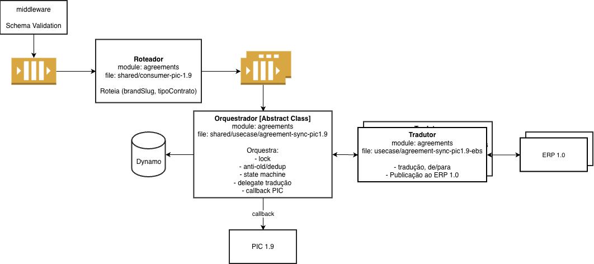

O Tradutor chama o ERP 1.0 diretamente via HTTP síncrono; a Fundação emite o callback ao PIC por cliente HTTP dedicado. Sem despachante assíncrono (`http-caller`) no caminho.

**Topologia de filas** (bulkhead, todas FIFO):
- Componente `middleware` (schema validation) publica numa **fila de ingestão única**.
- Use case pequeno de roteamento na Fundação faz fan-out para **N filas, 1 por ERP 1.0**, por `(brandSlug, tipoContrato)`.
- Marcas do mesmo ERP compartilham a fila dele — instabilidade num ERP não contamina os demais; redrive é por ERP.
- DLQ dedicada por fila (ingestão e por ERP).

**Por quê**:
- **Reuso / Uniformidade**: a orquestração é implementada **uma só vez** na classe abstrata Orquestrador.
  - O Tradutor herda esse fluxo e só implementa a tradução do seu ERP.

- **Custo de adicionar novo ERP 1.0 (previsto)**: 1 nova subclasse Tradutor + 1 entrada no mapa de roteamento da Fundação. Nenhum código de orquestração precisa ser duplicado.

- **Fan-out por ERP**: ingestão única simplifica o contrato do middleware (um destino); o split em filas por ERP entrega bulkhead, redrive isolado e vazão independente por ERP.

#### D-10 — HTTP direto ao ERP (sem `http-caller`); controle de vazão via filas FIFO por ERP

**Decisão**:
- O Tradutor chama o ERP 1.0 **diretamente via HTTP síncrono** (sem `http-caller`); sucesso/erro e `idContratoERP` voltam na própria resposta.
- O **controle de vazão por ERP** é pela fila FIFO daquele ERP (na entrada do fluxo).

**Por quê**:
- ERPs 1.0 respondem síncronamente e devolvem `idContratoERP` na resposta.
  - Um `http-caller` (Lambda fire-and-forget) não devolve esse corpo ao core sem um hop extra (Lambda → core) — implementação extra arriscada no tempo disponível da Fase 1.

- As filas FIFO por ERP já existem para bulkhead; reaproveitá-las para vazão evita infra nova.

- O `MessageGroupId = schoolDocNumber#agreementId#brandSlug` ordena por chave e mantém 1 mensagem em voo por grupo no caminho feliz, mas não serializa sob falha (redelivery após crash pode gerar processamento concorrente).

- O processamento 1-a-1 por chave e o anti-OLD ficam garantidos pelo lock, não pela FIFO.

**Descartado**:
- `http-caller` com callback ao core: hop extra Lambda → core, complexidade extra no tempo disponível.

**Risco aceito**: a vazão ao PIC (callback) não é controlada diretamente — é o somatório das vazões dos ERPs. Mais difícil de limitar, mas gerenciável para a Fase 1.

#### D-11 — Controle de concorrência e anti-OLD — ADR dedicada

A garantia de anti-OLD sob concorrência (nunca gravar uma versão anterior depois de uma posterior, processando 1 evento por chave por vez) tem ADR própria.

Ver: [Controle de concorrência e anti-OLD no Sync de Acordos PIC 1.9](../adrs/7%20-%20Controle%20de%20concorr%C3%AAncia%20e%20anti-OLD%20no%20Sync%20de%20Acordos%20PIC%201.9.md).

**Decisão**: lease-lock no DynamoDB (chave `schoolDocNumber#agreementId#brandSlug`) + re-check do anti-OLD dentro do lock antes do PUT ao ERP; lease via atributo de timestamp expirável.

**Descartados**:
- Version guard otimista (janela de corrida maior para um invariante crítico).
- Notificação + read-latest (PIC 1.9 não expõe o GET de Acordo necessário).

#### D-12 — Sucesso parcial em ERPs 1.0 multi-request: mitigado, sem SAGA pattern

Alguns ERPs 1.0 exigem 2+ requisições HTTP para sincronizar um Acordo por completo.

Em geral, persistir a entidade "escola" e a entidade "acordo" em chamadas separadas; às vezes o header do Acordo numa requisição e os SKUs em outra.

Nesses casos o Integrador pode ter um **sucesso parcial**: parte das chamadas efetiva e outra falha. Aceitamos esse cenário como um risco conhecido e o registramos na seção de Riscos.

**Decisão**: Não implementar o padrão SAGA (compensation requests) agora. Em vez disso, mitigar o sucesso parcial com 5 medidas combinadas.

**Por quê (não SAGA agora)**:
- SAGA tem complexidade alta — exige orquestrar transações de compensação (undo) para cada chamada ao ERP.

- Não temos ainda os endpoints nem a documentação do time legado necessários para desenhar essas compensações; inviável no prazo da Fase 1.

**Mitigações**:
1. **Chamadas em série**: as N requisições ao ERP são feitas em sequência, não em paralelo — restringe as combinações de sucesso parcial possíveis.
  - O fluxo é async, então a latência extra não é problema.

2. **Dado mais crítico por último**: informações sensíveis como o endereço de entrega são persistidas na última chamada da série — minimiza a chance de mexer nesse dado.


3. **Todo ERP 1.0 idempotente em todas as chamadas**: retry e redrive reprocessam o evento inteiro e re-executam chamadas já bem-sucedidas sem duplicar registro nem gerar erro.

4. **Retry do Integrador aos ERPs 1.0**: retentativas reduzem sucessos parciais causados por erros transitórios (partição de rede, timeout etc).
5. **Sucesso parcial = erro do fluxo**: se qualquer chamada da série falha, o `last_success` no DynamoDB não é atualizado e o PIC recebe callback de erro.
  - Coerente com o tratamento de erro já definido antes, e habilita retries/redrives.

As mitigações 3 e 5 se sustentam juntas: como o sucesso parcial não atualiza o `last_success`, o retry/redrive reprocessa o evento inteiro.

A idempotência (3) é o que impede que as chamadas já efetivadas dupliquem registro nesse reprocessamento, ou deem erro que impeça a série de ter sucesso.

**Descartado**:
- **SAGA com compensações**: complexidade alta e dependência de endpoints/docs do legado que ainda não existem; fora da janela da Fase 1.

#### D-13 — Fonte da verdade do endereço é o Acordo; Sync de Escolas não sobrescreve

**Contexto**: Faturamento e entrega são gravados no mesmo registro do ERP 1.0 por dois fluxos que fazem upsert.

São eles: o Sync de Acordos (este HLD) e o Sync de Escolas (CRM 2.0, épico à parte, já em prod).

**Decisão**: O **Acordo é a fonte da verdade** dos endereços de faturamento e de entrega. O Sync de Escolas **não pode sobrescrever** os endereços que um Acordo já gravou.

- A **decisão** é declarada aqui.
- Mas a **trava** (read-before-write ou PATCH em vez de PUT, preservando os campos de endereço) é implementada no **épico do Sync de Escolas**, não nesta Fase 1.

**Por quê**:
- O endereço de entrega correto é definido no Acordo (por escola atendida); o cadastro genérico de Escola no CRM pode divergir.

- Sem a trava, um Sync de Escolas posterior sobrescreve o endereço do Acordo → entrega em endereço errado, exatamente o problema que esta iniciativa resolve.

#### D-14 — Campos mínimos syncados no ERP 1.0 (obrigatórios vs best-effort)

**Contexto**: O Integrador lê de volta certos campos dos ERPs 1.0 para servir 2.0.

Se um campo é lido de volta, ele precisa ter sido gravado — senão o read-back volta incompleto e quebra o consumidor 2.0.

**Decisão**: Os campos do Acordo gravados no ERP 1.0 têm dois níveis de garantia:


- **Obrigatórios (read-back)** — o conjunto lido de volta pelo Integrador para servir 2.0, idêntico para os 4 ERPs. **Sempre gravados.**
  - Se um ERP 1.0 não tem campo nativo para um obrigatório, um campo custom/extensão precisa ser adicionado ao ERP 1.0 — e alinhado com o time de 1.0.

- **Best-effort** — os demais campos que o PIC fornece no payload.
  - Gravados quando o ERP 1.0 tem um campo disponível para aquilo; quando não há, são campos ignorados/descartados, documentados no LLD do ERP e registrados como risco.

  - Sem callback ao PIC por campo descartado.

O ideal é gravar **tudo** que o PIC envia. O que cada ERP 1.0 consegue (ou não) armazenar é **alinhado com os times dos ERPs 1.0** e detalhado em cada LLD.

**Por quê**:
- O read-back 1.0 → 2.0 é um contrato implícito: o que o 2.0 lê tem de existir no ERP 1.0. Tornar isso explícito evita surpresas.

- Nem todo campo do PIC tem correspondente no legado; best-effort assume isso sem travar a Fase 1.

**Descartado**:
- **Exigir 100% dos campos PIC em todo ERP**: irrealista — nem todo campo existe no legado; ou precisa existir.

#### D-15 — Sync de Endereço de Entrega PIC → CRM 2.0 fica fora do Integrador

**Contexto**: O endereço de entrega nasce no Acordo (PIC) e o CRM 2.0 também o quer.

Esse é um fluxo 1.0 → 2.0 — exatamente o tipo de integração que o Integrador costuma intermediar.

**Decisão**: Na Fase 1, esse sync **não passa pelo Integrador**.

O PIC envia o endereço de entrega direto ao CRM (Salesforce) via SF Composite API; se a chamada falhar, o cadastro fica manual por operação.

**Por quê**:
- **Sem capacity na Fase 1**: absorver mais um fluxo no Integrador agora estoura a janela do V1 Excelente.

- **O rePIC (2.0) implementará essa integração direto com o CRM 2.0**: ambos são 2.0, então o Integrador não precisa ser a ponte — fazê-lo aqui seria descartado no rePIC.

- O fallback manual cobre o caso de a SF Composite API falhar, então nenhum endereço se perde silenciosamente.

### 5.5. Diagramas TO-BE

#### 5.5.1. Fluxograma

O fluxograma TO-BE vem em três partes, na ordem de processamento:
- **Fundação** (entrada, lock, anti-OLD)
- **Tradutores** (tradução e sync ao ERP 1.0)
- **Tails** (sub-fluxos terminais por classe de resultado).

**Fundação** — do POST do PIC 1.9 até a decisão de descartar (duplicata/OLD) ou seguir para os Tradutores.

Inclui: schema validation no middleware, fila de ingestão + DLQ, roteamento por (marca, tipoContrato) para a fila do ERP 1.0 alvo, lock por `cnpj#brand#agreementId` (lease com TTL) e checagem de duplicata/OLD.

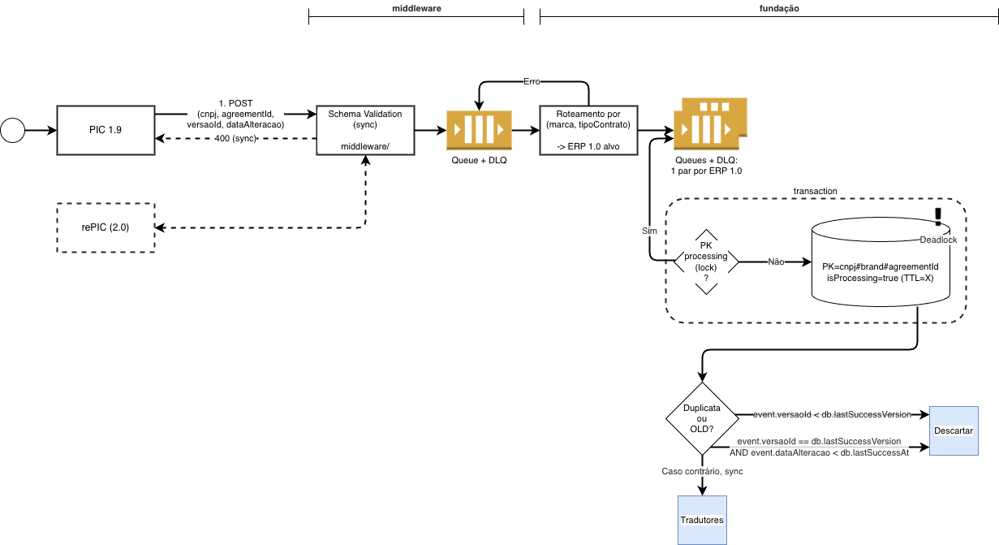

**Tradutores** — tradução de/para o ERP 1.0 alvo e sync do Acordo.

Traduz, e trata ERPs que exigem 1 ou 2+ requisições (escritas em série, dado crítico por último, idempotência) e assume que nenhum POST/PUT é async pelos docs atuais.

Classifica o resultado pelo status code: 2XX sucesso, 4XX data quality, 5XX técnico transitório.

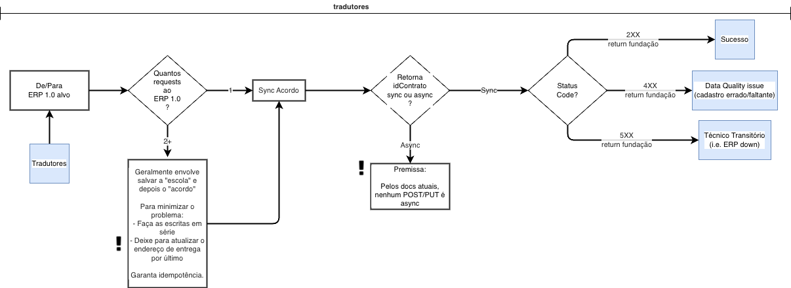

**Tails** — os sub-fluxos terminais, um por classe de resultado: Descartar, Técnico Transitório (retry com backoff → DLQ), Erro Inesperado (sem retry → DLQ), Data Quality (sem retry/DLQ) e Sucesso.

Cada um define o callback ao PIC (ou a ausência dele), a ida ou não à DLQ, e termina liberando o lock (`delete lock`).

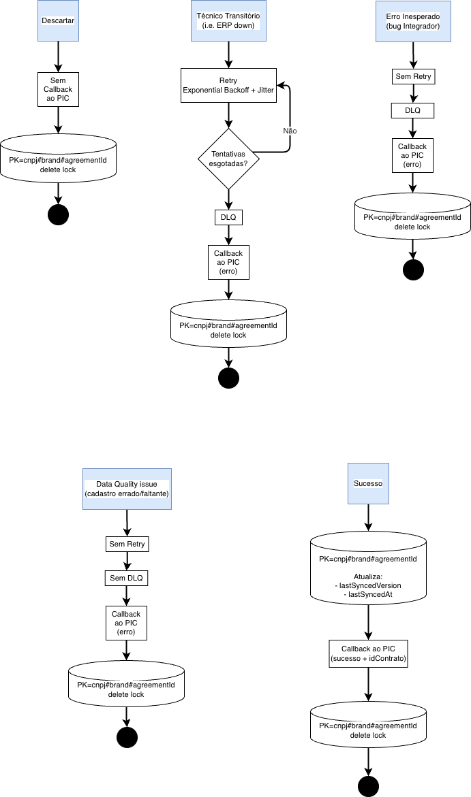

##### 5.5.1.1. Máquina de Estados

A máquina de estados do evento de sync, do `received` aos terminais `discarded`, `notified` e `notification-failed`, incluindo as transições de retry. Os detalhes podem mudar no LLD da Fundação.

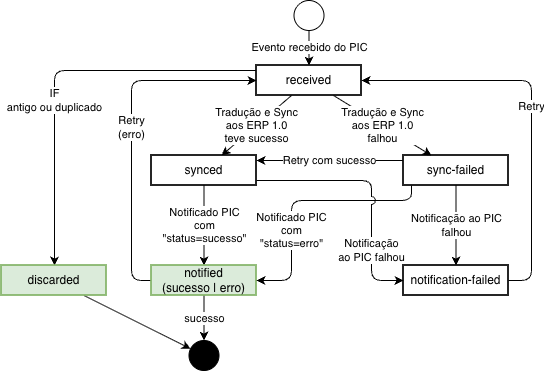

#### 5.5.2. Diagramas de Sequência

##### 5.5.2.1. Sync feliz — multimarca → multi-ERP

PIC quebra o Acordo multimarca em N POSTs (1 por marca).

Cada marca é roteada por `(brandSlug, tipoContrato)` para a fila do seu ERP 1.0 e segue o mesmo pipeline em paralelo — o diagrama detalha 1 marca após o fan-out.

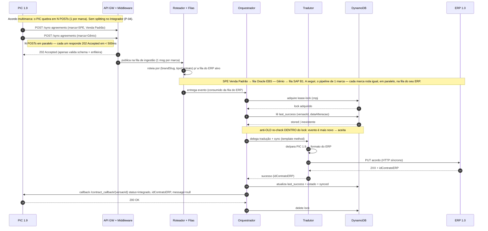

##### 5.5.2.2. Erro técnico transitório — ERP fora

ERP 1.0 fora do ar ou em timeout (5XX). N retentativas com backoff exponencial + jitter.

Ao esgotar, callback de erro ao PIC e a mensagem vai para a DLQ do ERP.

O prefixo (middleware → ingestão → roteamento) é idêntico ao do happy path e foi omitido.

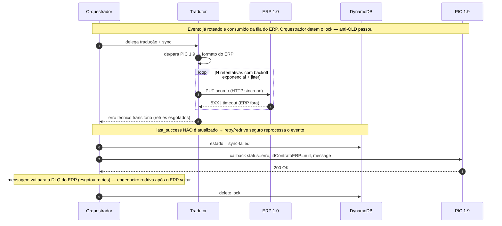

##### 5.5.2.3. Erro de negócio — cadastro errado/faltante

Data Quality (4XX): cadastro errado ou faltante que o sistema não corrige sozinho.

Sem retry e sem DLQ — callback de erro imediato ao PIC, e o operador corrige no PIC e retenta pela UI.

O prefixo (middleware → ingestão → roteamento) é idêntico ao do happy path e foi omitido.

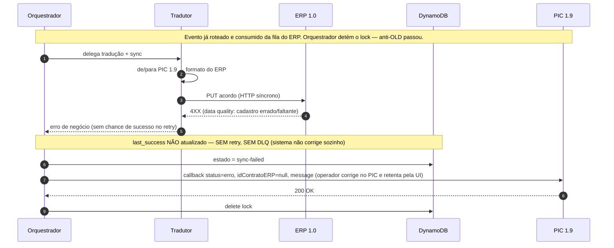

##### 5.5.2.4. Bug no Integrador — DLQ + redrive

Erro técnico inesperado (bug nosso): sem retry, callback de erro + DLQ.

Após o fix, o engenheiro redriva a DLQ e o evento é reprocessado inteiro.

O `alt` mostra as duas saídas do redrive: se o operador já retentou com sucesso pela UI, o anti-OLD/dedup descarta em silêncio (sem callback) — caso contrário, segue para sucesso.

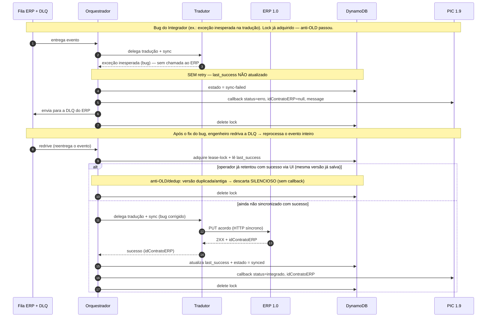

##### 5.5.2.5. Sucesso parcial — Tradutor faz 2 POSTs ao ERP 1.0, 1 falha

ERPs que exigem 2+ requisições para um Acordo completo: chamadas em série, dado crítico (endereço de entrega) por último.

A 1ª efetiva, a 2ª falha — sucesso parcial é tratado como erro do fluxo: `last_success` não atualiza e o PIC recebe callback de erro.

Retry/redrive reprocessa o evento inteiro e a idempotência impede que a chamada 1 duplique registro.

O prefixo (middleware → ingestão → roteamento) é idêntico ao do happy path e foi omitido.

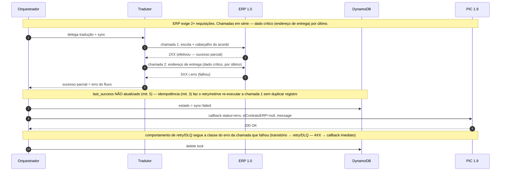

### 5.6. Pontos de Atenção e Riscos

#### R-01 — Raízes sem JSON definido pela consultoria; pode atrasar o último ERP.

- *Mitigação*: priorizar Raízes por último; se atrasar, Fase 1 entrega sem Raízes (desliza pra Fase 2).

#### R-02 — Overwrite do Endereço (faturamento e entrega) vindo do Sync de Escolas pode corromper Acordos sincados.

- *Mitigação*: fonte da verdade é o Acordo; CRM bloqueia edição; trava (PATCH/read-before-write) implementada no épico de Escolas — [ITGD-2957](https://arco-educacao.atlassian.net/browse/ITGD-2957).

#### R-03 — Callback ao PIC indisponível; operador não é notificado.

- *Mitigação*: 3 retries com backoff; se falhar, engenheiros serão alertados.

#### R-04 — Payload PIC pode passar de 256KB do SQS quando `materiais` é grande.

- O schema limita SKUs (≤300) mas **não** a contagem de materiais/kits, então em estrutura adversária o payload estoura o limite.

- *Falha controlada*: SQS rejeita o envio > 256KB já na ingestão; o evento falha cedo e visível (callback de erro / alarme), não some silenciosamente nem chega a uma DLQ.

- *Mitigação (risco aceito na Fase 1)*: o middleware loga o payload inteiro, então nada se perde.
  - Recuperação = habilitar o SQS Extended Client (payload em S3, ponteiro na fila) e/ou compressão e reprocessar manualmente a partir do log.
  - Mecanismo já disponível → correção rápida; default decidido na Tarefa Fundacional.

#### R-05 — Alguns ERPs 1.0 exigem 2+ requisições HTTP para sincronizar um Acordo completo.

- Ex.: persistir a escola e o acordo separadamente, ou o header do acordo numa chamada e os SKUs em outra.
- Isso abre espaço para **sucesso parcial**: parte das chamadas efetiva e outra falha.
- *Mitigado*: optamos por não fazer SAGA na Fase 1 e endereçar o risco com 5 medidas combinadas.
- *Como*, 5 medidas combinadas:
  - Chamadas em série (menos combinações de falha).
  - Dado mais crítico (ex.: endereço de entrega) por último.
  - Idempotência obrigatória em todas as chamadas de cada Tradutor.
  - Retry para erros transitórios.
  - Sucesso parcial tratado como erro: não atualiza `last_success` e dispara callback de erro ao PIC, habilitando retry/redrive seguro.

#### R-06 — Um campo obrigatório (lido de volta para 2.0) pode não ter campo nativo em algum ERP 1.0.

- *Mitigação*: adicionar um campo custom/extensão no ERP, alinhado com o time de 1.0.

#### R-07 — Um campo best-effort do PIC pode não ter onde ser gravado num ERP 1.0.

- *Falha controlada*: o campo é descartado e o Acordo é sincado sem ele, sem callback de erro.
- *Mitigação*: cada gap é documentado no LLD do ERP e alinhado com times do 1.0.

#### R-08 — Classificação de erro depende do status HTTP do ERP, que muitos legados não implementam corretamente.

- O Integrador decide o comportamento do retry/DLQ pela classe do erro.
- Essa classe é inferida em boa parte do status HTTP do ERP.

- Mas muitos legados não respeitam a semântica HTTP: um `4XX` pode ser de fato um técnico transitório, e um `5XX` pode ser um Data Quality.

- *Risco aceito*: ajustável ao longo do tempo.
- Pior caso: um Data Quality retenta desnecessariamente, ou um técnico transitório não chega à DLQ.
- Mas, em qualquer classificação, o erro **sempre gera callback e aparece na UI do PIC** — o operador nunca fica no escuro.

---

## 6. Apêndice (leitura opcional)

> Conteúdo de referência; consulte sob demanda.

### 6.1. Terminologia

- **PIC** — Programa de Integração de Contratos. Sistema interno da Arco para cadastro/atualização de Acordos.
- **PIC Arco / PIC 1.9** — Evolução do PIC 1.0 para cobrir as marcas não-Protheus. Ainda é um sistema 1.0 da ótica de arquitetura.
- **PIC 2.0 / rePIC** — Sistema 2.0 final para Acordos. Em construção; não estará pronto para o V1 Excelente (Ago/2027).
- **V1 Excelente** — Iniciativa cross-time da Arco para entregar uma versão 1 de qualidade alta dos sistemas alvo até Ago/2027.
- **ERPs 1.0** — Sistemas legados: SGE, Oracle EBS, SAPB1, Raízes, Protheus (SAS, SAE, IS).
- **Siglas de marca** (Slack, 16/Jun, Mariana N.T.M.):
  - **PSD** — Positivo Soluções Didáticas. Grupo trazido pela Arco quando comprou a Positivo. Engloba SPE, Conquista, PES, Maralto.
  - **SPE** — Sistema Positivo de Ensino (core do PSD). É o que aparece na operação como "Positivo".
  - **Conquista** (a.k.a. CQT internamente) — core do PSD.
  - **PES** — PES English (plus do PSD).
  - **Maralto** — Literatura (plus do PSD). **PIÁ** é selo de literatura interno ao Maralto.
  - **COC** — Sistema COC (core, de ensino). Quando a Arco comprou o COC, trouxe junto o **PGS**.
  - **PGS** — Pearson Global School (bilíngue, plus do grupo COC).
  - **Gênio** — sistema de ensino do portfólio Arco; slug no payload: `Gênio` (acentuado).
  - **Pleno** — Programa Pleno; programa de competências socioemocionais.
  - **EI** — Escola da Inteligência; programa socioemocional baseado na Teoria da Inteligência Multifocal (Augusto Cury); adquirido pela Arco em 2021.
  - **Mestre** — sistema de ensino do portfólio Arco.
  - **Geekie** — plataforma adaptativa de IA para escolas; adquirida pela Arco.
  - **Nave à vela** — programa de cultura maker e inovação curricular; adquirido pela Arco.
  - **Positivo** — alias operacional de SPE (mesmo destino de roteamento; ver SPE).

- **Integrador** — Serviço middleware da Arco que orquestra integrações entre sistemas 2.0 (CRM, PIC, 4MDG) e 1.0 (ERPs legados).
- **Modo Hub** — Padrão do Integrador onde o ERP exporta endpoint padronizado e o Integrador apenas roteia.
- **Modo Ativo** — Padrão do Integrador onde cada ERP tem contrato próprio e o Integrador implementa o de/para.
- **Acordo / Sales Agreement** — Contrato de venda entre Arco e Escola. Entidade central deste sync.
- **Acordo Multimarca** — Acordo que cobre >1 marca. O PIC quebra em N POSTs (1 por marca) ao Integrador.
- **De/Para** — Mapeamento de campos entre o formato 2.0 (PIC/CRM) e o formato 1.0 (ERP legado).
- **Intermediador (a.k.a. Interveniente)** — Entidade que pode ter N endereços de entrega (1 por escola que atende).
  - Representado como conta nos ERPs 1.0, mesmo padrão das Escolas. Em alguns ERPs admite múltiplos registros.

- **4MDG** — Sistema interno de Master Data Governance (catálogo de Produtos). Fonte da verdade de produtos consumida pelo Integrador e propagada aos ERPs 1.0.
- **CGI** — Sistema novo (ainda não pronto) que será a futura fonte da verdade para Escolas/Instituições da Arco.
- **Institution ID** — ID da Escola/Instituição no CGI. Carregado no payload de Acordo (mandatório) e no evento de Escola (atrás de FF).

### 6.2. Mapeamento `(brandSlug, tipoContrato)` → ERP 1.0

Tabela canônica de roteamento da Fundação. Adicionar novo ERP = nova linha + Tradutor correspondente.

| Marcas | `tipoContrato` | ERP destino |
|---|---|---|
| SPE, Conquista, Maralto, PES, Positivo, PIÁ | `Loja Virtual` (B2C) | **SGE** |
| SPE, Conquista, Maralto, PES, Positivo, PIÁ | `Venda Padrão` ou `Comercializador` (B2B) | **Oracle EBS** |
| COC, PGS | qualquer | **Oracle EBS** |
| Gênio, Pleno, EI, Mestre | qualquer | **SAP B1** |
| Nave à vela, Geekie | qualquer | **Raízes** |
| SAS, SAE, IS | qualquer | **Protheus** (fora do escopo da Fase 1; sync direto PIC→Protheus permanece) |

Notas:
- Positivo resolve para o mesmo Tradutor de SPE; PIÁ resolve para o mesmo Tradutor de Maralto (aliases comerciais, sem Tradutor dedicado).
- Comercializador (B2B via Intermediador) sempre mapeia para o mesmo ERP do `Venda Padrão` da marca.
- Marca/tipoContrato fora dessa tabela → erro de roteamento (Data Quality, callback de erro imediato ao PIC, sem retry).

### 6.3. PIC Arco — Payload de referência

Exemplo único com **todos** os campos preenchidos (obrigatórios + opcionais) e comentários inline indicando `tipo | required/optional | enum ou faixa | descrição`.

Premissas sobre auth, tipos, status, semântica de campos e escopo de validação estão refletidas neste esquema.

Security baseline (caracteres bloqueados por default no middleware): `; , . * \ ' " ~ : / | [ ] ( ) { } —(em dash) -(hyphen)`.

`_` não é bloqueado; campos com hífen/ponto/etc. legítimos declaram `allowed_chars` no contrato.

#### 6.3.1. Webhook inbound — `POST {integrador_base}/v1/webhooks/cross/picarco/sync-agreements`

Disparado pelo PIC ao consolidar um Acordo. Acordo multimarca = 1 POST por marca. **Auth**: header `X-API-Key: $STATIC_TOKEN`. 401 se ausente/inválido.

```jsonc
{
  // string | required | enum [create, update] | informacional/log apenas;
  // Integrador trata sempre como upsert (não diverge comportamento entre create
  // e update)
  "operacao": "create",

  // integer | required | >=1 | ID do contrato no PIC (estável entre updates)
  "id": 12345,

  // integer | required | >=1 | versão do contrato; usado no path do callback
  // /contract_callback/{versaoId} e como chave primária do dedup
  "versaoId": 7,

  "anoVigencia": 2027,  // integer | required | 2024..2099

  // integer | required, nullable | ID do contrato do ano anterior; null no 1º
  // ano
  "contratoAnterior": 12340,

  // string | required | enum [Rascunho, Contrato Assinado, Contrato Assinado -
  // Aguarda Alteração de Contrato, Contrato Assinado - Aguarda integração -
  // Pendência via física, Contrato Assinado - Aguarda Integração (com
  // desconto), Contrato Bundle Assinado] (Rascunho assumido válido)
  "status": "Contrato Assinado",

  // string ISO 8601 UTC | required | última alteração no PIC; tiebreaker do
  // dedup dentro do mesmo versaoId — NÃO confundir com receipt timestamp do
  // Integrador
  "dataAlteracao": "2027-02-14T18:22:05.123Z",

  "duracao": 1,  // integer | required | duração em anos
  "cnpjFilialFaturamento": "12345678000190",  // string 14 dígitos | required
  "cnpjFilialExpedicao": "12345678000190",  // string 14 dígitos | required

  // string | required | enum [Venda Padrão (B2B), Loja Virtual (B2C),
  // Comercializador (revenda)] | compõe a chave de roteamento (brandSlug,
  // tipoContrato)
  "tipoContrato": "Venda Padrão",

  // string | required | enum [SAS, SAE, IS, SPE, PES, Maralto, Conquista,
  // Mestre, Gênio, EI, Pleno, COC, PGS, Positivo, Geekie, Nave à vela, PIÁ] |
  // Multimarca = N POSTs (1/marca); Positivo roteia como SPE, PIÁ como Maralto;
  // SAS/SAE/IS fora do escopo Fase 1
  "marca": "SPE",

  // string | required | ID da Escola no CGI; persistido no ERP 1.0 junto com o
  // Acordo
  "institutionId": "ESC-000123",

  // object | required | dados da Escola titular (mesma estrutura que
  // "mediador")
  "escola": {
    // string | required | max 255 | razão social
    "nome": "Colégio Exemplo S.A.",

    "nomeFantasia": "Colégio Exemplo",  // string | required | max 255

    // string | required | regex ^[0-9]{11}$ (CPF) ou ^[0-9]{14}$ (CNPJ)
    "cpfCnpj": "12345678000190",

    "enderecoPrincipal": {  // object | required
      "cep": "01310100",  // string 8 dígitos | required
      "uf": "SP",  // string 2 maiúsculas | required
      "municipio": "São Paulo",  // string | required | max 100
      "bairro": "Bela Vista",  // string | required | max 100
      "logradouro": "Av. Paulista",  // string | required | max 255
      "numero": "1000",  // string | required | max 20 | aceita "S/N"
      "complemento": "Sala 42"  // string | OPTIONAL | max 255
    }
  },

  "mediador": {
    /* mesma estrutura de "escola"; required (pode espelhar a Escola quando
       não há intermediador) */
  },

  "entrega": {  // object | required

    // string | required | enum [C=CIF (frete pelo remetente), F=FOB (frete pelo
    // destinatário)]
    "condicaoExpedicao": "C",

    // string | required | enum [E=Escola, M=Mediador, O=Outra Unidade]
    "local": "E",

    "endereco": { /* mesma estrutura de enderecoPrincipal */ }
  },

  "frete": {  // object | required

    // string | required | enum [E=pago pela Escola, S=pago pela Arco, T=Tabela]
    "tipoNormal": "S",

    "tipoComplementar": "S",  // string | required | mesmo enum de tipoNormal
    "normal": {
      "automatico": true,  // boolean | required

      // decimal | required, nullable | null quando automatico=true
      "percentual": null
    },
    "complementar": {
      "automatico": false,
      "percentual": 5.0  // decimal | required, nullable
    }
  },

  "pagamento": {  // object | required

    // integer | required | 1..31 | dia de vencimento das parcelas
    "diaFixoPagamento": 10,

    "condicoesPagamentoPorMarca": {  // object | required | map keyed pela marca
      "SPE": {
        "parcelas": [
          {
            // integer | required | 1..12 | sequencial no ano
            "numeroParcela": 1,

            "mes": 2,  // integer | required | 1..12

            // integer | required | >=1 | nº de parcelas permitidas neste mês
            "numeroParcelas": 3,

            "condicaoEspecial": false  // boolean | OPTIONAL
          }
        ],
        "numeroParcelasComplementar": 2,  // integer | required | >=0
        "condicaoEspecialComplementar": false  // boolean | OPTIONAL
      }
    }
  },

  // array | required | min_items=1 | sync nunca acontece sem materiais;
  // middleware rejeita array vazio
  "materiais": [
    {
      "skuColecao": "COL-2027-EFI",  // string | required | max 50
      "descricaoColecao": "Coleção 2027 EFI",  // string | required | max 255

      // string | required | max 255 | user-facing
      "descricaoAmigavel": "Material EFI 2027",

      "composicaoAnual": [  // array | required | min_items=1
        {
          "skuKIT": "KIT-EFI-1B",  // string | required | max 50
          "descricaoKIT": "Kit 1º bimestre EFI",  // string | required | max 255
          "tipo": "K",  // string | required | constante "K"
          "bimestre": 1,  // integer | required | 1..4 | 1º a 4º bimestre
          "composicao": [  // array | required | min_items=1
            {
              "skuProduto": "PROD-001",  // string | required | max 50

              // string | required | max 500
              "descricaoProduto": "Livro do Aluno",

              "suplemento": "N",  // string | required | enum [S, N]
              "tipo": "P"  // string | required | constante "P"
            }
          ]
        }
      ],

      // object | required, nullable | quando preenchido, mesmo schema de um
      // item de `materiais` (recursivo); null quando não há
      "suplementar": null,

      "digital": "N",  // string | required | enum [S, N]
      "quantidadeVenda": 30,  // decimal | required | >=0
      "quantidadeBonificada": 2,  // decimal | required | >=0

      // string | required | enum [A=Aluno, P=Professor, C=Coordenação]
      "tipo": "A",

      "valorBruto": 200.0,  // decimal | required | >=0
      "percentualDesconto": 10.0,  // decimal | required | 0..100

      // decimal | required | >=0 | valorBruto − desconto (consistência é
      // responsabilidade do PIC)
      "valorLiquido": 180.0,

      // decimal | required | 0..100 | rateio por trimestre/quadrimestre
      "rateiov1": 25.0,

      "rateiov2": 25.0,  // decimal | required | 0..100
      "rateiov3": 25.0,  // decimal | required | 0..100

      // decimal | required | 0..100 | soma rateiov1..4 = 100 (consistência é
      // responsabilidade do PIC)
      "rateiov4": 25.0,

      // decimal | required | >=0 | só aplicável quando tipoContrato="Loja
      // Virtual"
      "precoRevendaB2C": 0,

      "voucher": 0,  // decimal | required | 0..100 | % de desconto via voucher

      // decimal | required | >=0 | precoRevendaB2C − voucher
      "precoFinalLoja": 0,

      "nivel": "EFI",  // string | required | enum [EI, EFI, EFII, EM, PV, N/A]

      // string | required | enum extenso (~60 valores) variando por nivel
      // (consistência nivel × serie é responsabilidade do PIC)
      "serie": "1º ano",

      // string | required | enum [Novo, Ampliação, Renovação,
      // Descredenciamento, Perda]
      "status": "Novo",

      // string | required | mesmo enum da marca raiz (consistência com a marca
      // do contrato é responsabilidade do PIC)
      "marca": "SPE",

      // string | required | enum/origem a definir no LLD por ERP (risco de
      // mapeamento)
      "listaPreco": "LP-2027-B2B"
    }
  ],

  // decimal | required | 0..200 | % mínimo de pedido permitido
  "pedidoMinimo": 70.0,

  // decimal | required | 0..500 | % máximo de pedido permitido
  "pedidoMaximo": 120.0,

  // decimal | required | 0..100 | % máximo de devolução permitido
  "devolucaoMaxima": 20.0
}
```

#### 6.3.2. Callback outbound — `POST {pic_api_base}/contract_callback/{versaoId}`

Enviado pelo Integrador ao PIC ao final do processamento (sucesso ou esgotamento de retries).

Multimarca = um callback por marca (1:1 com o inbound).

Auth via header `X-API-Key`; chave de HML disponível, **chave de PROD pendente do time PIC antes do go-live**. Erro de auth retorna 401.

```jsonc
// path param: versaoId (integer, required, >=1) — espelha o versaoId do payload
// inbound
{
  "anoVigencia": 2027,  // integer | required | espelha do inbound
  "marca": "SPE",  // string  | required | espelha do inbound

  // string ISO 8601 UTC | required | momento de publicação do callback; PIC
  // ordena por este campo (não pela ordem de entrega) e descarta duplicados
  "timestamp": "2027-02-14T18:25:30.456Z",

  // string | required | enum [integrado, erro] | colapso 3-vias → 1 par:
  // sucesso → "integrado"; qualquer erro (negócio | transitório | bug) → "erro"
  "status": "integrado",

  // string | required, nullable | preenchido em sucesso; null em erro
  "idContratoERP": "ERP-XYZ-42",

  // string | required, nullable | null em sucesso; mensagem operacional em
  // erro; max 500 chars; NÃO vazar stack trace
  "message": null
}
```

### 6.4. De/para: infos obrigatórias → payload PIC

Origem de cada info obrigatória do Acordo no payload PIC. O mapeamento exato campo-a-campo por ERP fica no LLD.

| Info obrigatória | Origem no payload PIC |
|---|---|
| Número do Contrato | `id` |
| Marca | `marca` |
| CNPJ da Escola | `escola.cpfCnpj`, `cnpjFilialFaturamento`, `cnpjFilialExpedicao` |
| Tem interveniente? | `tipoContrato = Comercializador` + `mediador` |
| Ano Coleção | `anoVigencia` |
| Séries contratadas e alunado | `materiais[].serie`, `materiais[].quantidadeVenda` |
| SKUs contratados: preço, desconto, bonificação | `materiais[].valorBruto`, `materiais[].valorLiquido`, `materiais[].percentualDesconto`, `materiais[].quantidadeBonificada` (B2C: `precoRevendaB2C`, `voucher`) |
| Endereço de Faturamento | filial `cnpjFilialFaturamento` + endereço (detalhe no LLD) |
| Endereço de Entrega | `entrega.endereco` |
| Infos de Frete | `frete` |
| Infos de Pagamento (somente B2B) | `pagamento` |

### 6.5. Sugestão de modelagem das tabelas (a validar no LLD)

> Sugestão de modelagem das tabelas DynamoDB — **a validar/alterar no LLD**. Não é decisão final desta Fase 1.

Modelagem proposta em DynamoDB, com a fase de adoção sugerida por tabela:

A PK base é a chave de Acordo `{cpfCnpj}#{contratoId}#{marca}`, sem `versaoId` — uma linha por Acordo.

Isso é o que o lock e o anti-OLD precisam: comparar versões na mesma linha. A tabela de estado é a exceção — é por versão, então acrescenta `#{versaoId}`.

- **`sync-agreements-lock`** (transação, Fase 1) — PK `{cpfCnpj}#{contratoId}#{marca}`; atributos `isProcessing` (true/false) e `lockExpiresAt` (lease com expiração).
- **`sync-agreements-last-synced`** (Fase 1) — PK `{cpfCnpj}#{contratoId}#{marca}`; atributos `lastSyncedVersaoId` e `lastSyncedAt` (base do anti-OLD).
- **`sync-agreements-state`** (Fase 1, ajuda na debugabilidade) — PK `{cpfCnpj}#{contratoId}#{marca}#{versaoId}`; atributos `errorMsg`, `createdAt`, `updatedAt`, `transactionId` e `state`.
  - `state` ∈ received | discarded | synced | synced-failed | notified | notification-failed.

- **`sync-agreements-transitions`** (append-only, histórico — Futuro) — PK `{cpfCnpj}#{contratoId}#{marca}`; `transitionFrom`, `transitionTo`, `versionFrom`, `versionTo`, `transitionAt`, `transactionId`. Útil para debugabilidade.

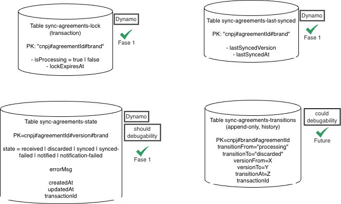
