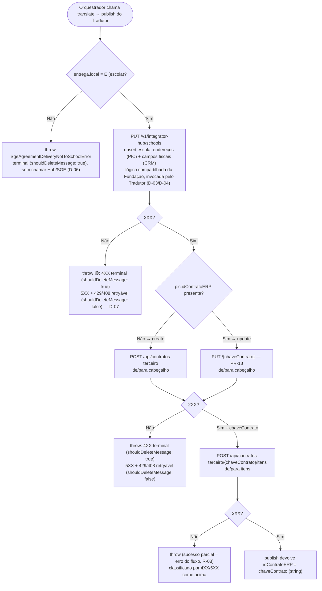

---
# performance-check budget override, not part of the example LLD itself.
# This file's size is set by the document it reproduces, so trimming it would make
# the example unrealistic. Doubled from the 1024w/256l bundled defaults until it fits.
words-budget: 16384
lines-budget: 2048
---

# LLD — Tradutor SGE: Sync de Acordos PIC Arco 1.9 → SGE (de/para)

Status: Draft.

Documentos relacionados:

- HLD do épico: [Sync de Acordos: PIC Arco → ERPs 1.0 (Fase 1)](./sync-agreements-pic1.9_hld.md) — escopo, ADRs, premissas e riscos de todo o épico.

- LLD pai (Fundação): [PIC Arco 1.9 → ERPs 1.0: Fundação](./Fundacao-PIC-ERPs.md) — OpenAPI, filas, roteamento, Orquestrador, lock, anti-OLD, state machine, callback e tratamento de erros; tudo herdado, este LLD **não** repete.

- **Doc PIC Arco 1.9 (canônico)** — contrato do webhook: campos, enums e constantes. [Google Doc](https://docs.google.com/document/d/1dZA9PcF8lMlU5TQ1jqRAVbdqOy-wnWN1DhyDUAX97Cg/edit?tab=t.oy55j4l3kv4q).

- **Doc SGE (consultoria)** — API Contrato Terceiro, endpoints `POST /api/contratos-terceiro` e `POST /api/contratos-terceiro/{chaveContrato}/itens` (schemas no apêndice). [Google Doc](https://docs.google.com/document/d/1dZA9PcF8lMlU5TQ1jqRAVbdqOy-wnWN1DhyDUAX97Cg/edit?tab=t.7trztc7yrj7f#heading=h.ixdh0t2q1j5k) — mesmo gdoc do PIC, aba própria do SGE.

- **Doc SGE (payloads reais)** — exemplos reais de escola/Hub, cabeçalho e itens, usados neste LLD como segunda fonte de confiança. [Google Doc](https://docs.google.com/document/d/1dZA9PcF8lMlU5TQ1jqRAVbdqOy-wnWN1DhyDUAX97Cg/edit?tab=t.wxulsw38szgh) — mesmo gdoc do PIC/SGE, aba própria dos exemplos.

- **Doc Integrador Hub (Escolas)** — `PUT /v1/integrator-hub/schools`: upsert de escola que os ERPs 1.0 expõem (schemas no apêndice). [Google Doc](https://docs.google.com/document/d/1a7HQADF9z4in44q0Hz-p8OIU8mkmIFdIuKVFDbS9GoE/edit?tab=t.0#heading=h.sjurvpjicuvd).

- Planilha [MAPPING_ACV_PIC_ERPs_v1_ex.xlsx](https://docs.google.com/spreadsheets/d/1YtFGk-jBa15K52V2DSLUafW8GHErf3uI/edit?gid=2057024638#gid=2057024638) — **estudo inicial de campos, NÃO é fonte da verdade** (conforme Borne, tech lead do 1.0); contém campos defasados, mas serve em algum grau.

**O conteúdo central** deste doc são os **Mapeamentos de/para.**  

Os schemas dos contratos PIC e SGE foram movidos para o apêndice como **leitura opcional** — consulte sob demanda.

---

## 1. Contexto

### 1.1. Propósito deste LLD

Este é o LLD (Low Level Design) de **um único componente**: o **Tradutor SGE**.

É a subclasse concreta do Orquestrador (Fundação) que implementa o par de hooks `translate` / `publish` para o ERP 1.0 **SGE**.

O escopo deste documento é **exclusivamente o de/para (mapeamento campo a campo)**:
- do payload PIC Arco 1.9, fornecido pelo orquestrador/fundação, para os contratos HTTP do ERP 1.0 SGE;
- do retorno do ID do Contrato retornado do SGE, devolvido ao orquestrador/fundação para o callback PIC Arco.

Orquestração, lock, anti-OLD/dedup, máquina de estados, retry/DLQ, alarmes e o cliente de callback (`PicArcoClient`) são **herdados da Fundação** e **não** são redefinidos aqui — apenas referenciados quando necessário.

### 1.2. Escopo e a restrição que molda tudo: SGE é somente B2C

Pelas tabelas de roteamento (no HLD e na Fundação), o SGE recebe **apenas** acordos com `tipoContrato = "Loja Virtual"` (B2C) do conglomerado PSD.

Marcas PSD, como o PIC as envia (contrato do webhook no HLD): **Positivo, Conquista, Maralto, PES** (e `PIÁ` como alias de Maralto).

Os mesmos `brandSlug` em B2B (`Venda Padrão` / `Comercializador`) roteiam para **Oracle EBS**, não para o SGE - e estão descritos em outro LLD.

Consequências diretas para este de/para:

- **Não há Intermediador no SGE** — `Comercializador` é variante B2B, nunca chega ao SGE (o HLD registra que não existe Intermediador no modelo B2C).

- **Os campos de preço relevantes são os válidos para B2C**: `precoRevendaB2C`, `voucher`, `precoFinalLoja` — **não** `valorBruto`/`valorLiquido`/`percentualDesconto` (a face B2B do material).

### 1.3. De onde os dados vem

Há **três fontes** para o contrato de integração do SGE, em ordem de confiança:

1. **Códigos fixos documentados** na tabela de campos do doc SGE (ex.: `entrega.tipoEndereco` = "Fixo 3 - Entrega") — **vale sobre tudo**; é entendido como regra, não como exemplo;

2. **Payloads reais** fornecidos mais recentemente — Evidência mais forte que o exemplo do doc, que pode estar incompleto/desatualizado;

3. **Exemplo JSON inicial do doc SGE** — vale sobre a prosa quando divergem; a prosa é frequentemente imprecisa (obrigatoriedade "a revisar", descrições genéricas etc).

Onde as fontes divergem, este LLD **as aponta explicitamente**, campo a campo nos blocos JSONC dos de/para (adiante) e dos schemas do apêndice.

Cada divergência resolvida vira uma Premissa ou Decisão (com o risco residual nos Riscos, quando houver).

---

## 2. Requisitos / Critérios de Aceite

### 2.1. Funcionais

1. Traduzir o payload PIC Arco 1.9 recebido da Fundação para o(s) contrato(s) HTTP do SGE, garantindo sincronia/upsert do Acordo;

2. Sincronizar via **chamadas em série** ao SGE para minimizar problemas de race conditions (ver HLD para detalhes);

3. Persistir os campos **obrigatórios (consumidos por 2.0)** de read-back do HLD no SGE;

4. Garantir que os **endereços** (faturamento **e** entrega) do Acordo sejam persistidos onde o 2.0 os lê de volta;

5. Devolver ao Orquestrador o `idContratoERP` (string) retornado por `publish` em caso de sucesso; sinalizar falha **lançando** `BaseCustomError`.
  - A classificação é por exceção, não por valor de retorno (contrato da classe abstrata):
    - **Terminal (dado ruim):** `shouldDeleteMessage: true` (`isRetryable=false`) → Orquestrador envia callback de erro ao PIC e **descarta**, sem retry/DLQ.
    - **Retryável (ERP indisponível):** `shouldDeleteMessage: false` (`isRetryable=true`) → Orquestrador **re-tenta** (SQS → DLQ); callback de erro só na última tentativa.
  - Os dois casos acima cobrem os 3 tipos de erro do HLD: **tipo 1** (não-técnico / Data Quality) é terminal.
  - **Tipos 2 e 3** (técnico transitório e técnico inesperado) caem ambos em retryável.
  - O Integrador não distingue transitório de bug no despacho.

### 2.2. Não-Funcionais (técnicos)

Todos os herdados integralmente da Fundação (disponibilidade, SLA de callback ≤ 30 min, idempotência, observabilidade etc). Específicos do SGE:

1. **Idempotência das chamadas** ao SGE — retry/redrive reprocessa o evento inteiro com sucesso, mesmo em caso de sucesso parcial, sem duplicação;

---

## 3. Premissas

### PR-01 — `tipoEndereco`: o código nomeado vence o exemplo (1/1/3)

A tabela de campos do doc SGE nomeia `1 = Faturamento` e `3 = Entrega`; adotamos `faturamento/cobranca.tipoEndereco = 1` e `entrega.tipoEndereco = 3`.

Os payloads reais tinham mostrado o par invertido (`fat./cob. = 3`, `entrega = 1`).

### PR-02 — Vigência derivada de `anoVigencia` + `duracao`

Provisória — risco das datas presumidas registrado adiante. O SGE exige datas (`dataInicioVigencia`/`dataFimVigencia`) e anos (`anoInicial`/`anoFinal`), mas o PIC manda só `anoVigencia` (ano-base) + `duracao` (nº de anos). Derivação:

- `anoInicial = anoVigencia`; `anoFinal = anoVigencia + duracao − 1` (o intervalo cobre `duracao` anos-calendário a partir de `anoVigencia`; se `duracao=1`, `anoFinal = anoInicial`).

- `dataInicioVigencia = 01/01 do anoInicial`; `dataFimVigencia = 31/12 do anoFinal`.

### PR-03 — `dataInicioVigencia`/`dataFimVigencia` assumidas em UTC

Nenhum payload real ou doc do SGE mostra timezone/offset para essas datas. Assumimos UTC até confirmação do time 1.0.

Provisória — risco de timezone incorreto registrado adiante.

### PR-04 — `tipoVenda` (LNE/ESK) deriva do nº de marcas do Acordo

Validada com o time 1.0. Cada POST traz **1 marca**, mas o Acordo original pode ser **multimarca**.

Regra: Acordo **mono-marca** (só grupo PSD) → `tipoVenda = "LNE"`; **multimarca** → `"ESK"`. A lógica vive no de/para do cabeçalho (adiante).

A detecção de multimarca compara o conjunto de marcas dos materiais do Acordo (`materiais[].marca`) — mais de uma marca distinta ⇒ multimarca (decisão detalhada adiante).

### PR-05 — `valorContrato`: soma calculada pelo Tradutor

`valorContrato` = `Σ (precoFinalLoja × quantidadeVenda)` sobre `pic.materiais[]` (uma parcela por coleção).

Ignora `quantidadeBonificada` (brindes) e vouchers — usa o preço final de loja já líquido. O PIC não manda o total pronto; o Tradutor calcula.

### PR-06 — Campos fixos do cabeçalho sem fonte no PIC

Quatro campos que o doc SGE marca obrigatórios, sem fonte no PIC, assumem valor fixo:

- `percentualComissaoEscola` = `null` — sem fonte no PIC; payloads reais mostraram `7.45`, mas sem regra de cálculo conhecida adotamos `null`; provisória, a revalidar com o time 1.0.
- `integraLoja` = `true` — fato, conforme doc.
- `vendaBimestral` = `false` — B2C vende a coleção do ano inteiro; payloads reais sempre `false`.
- `confissaoDivida` = `false`.

### PR-07 — Achatamento: só coleção e kits viram itens no SGE; avulsos não são enviados

O array plano de itens do SGE recebe **dois** níveis do PIC; o terceiro é descartado:

- Cada `pic.materiais[]` (coleção) → **1 item de coleção** (`produtoGrafica = skuColecao`, `anoProduto = 0`, `bimestre = 0`); `produtoGraficasVinculados` = os `skuKIT` dos seus kits.
- Cada `pic.composicaoAnual[]` (kit) → **1 item "Produto"** (`produtoGrafica = skuKIT`, `bimestre` nativo do kit, `anoProduto` ← `anoVigencia`).
- `pic.composicao[]` (avulsos) → **não** enviado ao SGE.
- `pic.suplementar` (material suplementar, não recursivo) → achatado como coleção adicional, com o mesmo tratamento acima.

### PR-08 — Assumimos `marca`/`nivel`/`serie`/`status`/etc. válidos para todo kit/avulso, mesmo sendo campos só da coleção

Assumimos que `marca`, `nivel`, `serie`, `status`, `listaPreco`, `digital` e demais campos de nível coleção, valem igualmente para **todo** kit/produto daquela coleção.

No schema do PIC, esses campos pertencem ao objeto `material` (a coleção) — `composicaoAnual` (os kits e avulsos) fica aninhado *dentro* dele, não o contrário.

Kits e Avulsos não tem esses campos, então assume que eles herdam-no da sua coleção-pai.

### PR-09 — Preço do item: `valorUnitario` unitário-bruto + desconto

O SGE recebe a **forma unitária** (`valorUnitario`), não o total (`precoTotal` dos payloads reais):

- `valorUnitario` ← `precoRevendaB2C` (preço de revenda **bruto**, unitário).
- `percentualDescontoProduto` ← `voucher` (escala 0..100 — PR-10).

Enviar bruto + desconto (não o líquido `precoFinalLoja`) satisfaz o trio do read-back `fullPrice` + `discount` + `storePrice`.

### PR-10 — `percentualDescontoProduto`: escala assumida em 0..100

Sem exemplo nos payloads reais, que não têm campo de desconto por item.
Assumimos a escala percentual 0..100 — mesma convenção do doc SGE para os demais campos percentuais, não 0..1.

### PR-11 — Preço do kit: rateio da coleção por bimestre, divisão igual, com guarda

O kit não tem preço próprio no PIC; deriva-se do preço da coleção (PR-09) via rateio:

- Por bimestre `b` (1..4): fatia = `precoRevendaB2C × rateiov{b}/100`.
- Cada kit daquele bimestre recebe a fatia **dividida igualmente** entre os kits do mesmo bimestre (melhor esforço — premissa).
- `percentualDescontoProduto` do kit = `voucher` da coleção (percentual, igual para todos).

Uma guarda barra o envio se `Σ (valorUnitario dos kits)` não igualar o preço da coleção (precisão de ponto flutuante); o mecanismo é uma decisão, adiante.

### PR-12 — SKU já registrado no SGE, com catálogo completo (`discipline`/`usagePeriod`/etc.)

Todo `produtoGrafica` enviado pelos itens (`skuColecao` da coleção e `skuKIT` do kit — ver o achatamento em PR-07) já está registrado no master de produto do SGE.
Os atributos de catálogo estão completos.

Os mesmos — `discipline`, `usagePeriod`, `volume`, `isDigital`, `targetUser`, `segmentCode`/`gradeCode` — são exigidos pelo schema `Sku` (2.0).

Este Tradutor não escreve catálogo — só envia `produtoGrafica` (`skuColecao`/`skuKIT`) + valores do Acordo (preço, quantidade).

Não há caminho que alimente o catálogo do SGE a partir do 2.0: o 4MDG (fonte da verdade de produtos) só propaga a Protheus (SAS/IS/SAE), não ao SGE.

- Se o `produtoGrafica` não existir no SGE, a chamada de itens retorna 4XX; o `publish` reclassifica esse `SgeRequestError` via `checkIfDataQualityError` como qualidade de dado — terminal (`shouldDeleteMessage: true`).
  É qualidade de dado do Acordo, não indisponibilidade do ERP, então não deve ser retentado.
- Sob essa premissa o read-back 2.0 não fica incompleto: `discipline`/`usagePeriod`/etc. são lidos direto do master de produto do SGE (mesma fonte do catálogo), não deste sync.

### PR-13 — `sistema` (marca) do item/cabeçalho: enum fechado + de/para

`sistema` é um enum `{SPE, CQT, LIVROS}`. De/para a partir da marca comercial do PIC:

- `Positivo` → `SPE`.
- `Conquista` → `CQT`.
- Qualquer outra marca (`Maralto`, `PES`, `PIÁ`) → `LIVROS`.

Provisória — "até algo mudar": firma o valor enquanto o time SGE 1.0 não publica a tabela completa. Substitui o antigo passthrough de marca; `siglaNivel`/`siglaSerie` seguem em passthrough (PR-14).

### PR-14 — `siglaNivel`/`siglaSerie` do item: passthrough do PIC até o de/para oficial

Provisória — risco de valor incorreto no SGE registrado adiante. `siglaNivel` e `siglaSerie` ainda não têm tabela de/para confirmada.

Enquanto a tabela não chega, enviamos o valor bruto do PIC **sem tradução** (passthrough). Quando fornecerem os enums e o de/para, aplicamos a tradução no código.

### PR-15 — Item `modular`: assumido fixo em `false`

Provisória — risco de divergência com o cadastro do SGE registrado adiante.
Sem fonte no PIC e ausente dos payloads reais; assumimos `false` para todo item.
Indício (planilha de estudo) sugere que o SGE recupera esse valor do próprio cadastro do produto.

### PR-16 — Itens: campos sem fonte PIC ficam de fora do payload

`pesoBruto`/`pesoBrutoTotal` (peso do produto) e `produtoGraficasCompulsoriosVinculados` do item de coleção não têm fonte no PIC; os payloads reais também os omitem ou não os exigem.

Assumimos que são efetivamente opcionais apesar do doc SGE marcá-los `required` — omitimos os três do payload em vez de enviar `null`/`[]`.

Sem risco: nenhum representa dado de negócio do Acordo a perder.

### PR-17 — Constantes fixas do SGE (declaradas no doc)

Valor fixo declarado na **própria tabela de campos do doc SGE** (não na planilha).

Cada uma é um parâmetro do SGE sem correspondente no PIC; todas aparecem no de/para como ⚪ Descartáveis (cabeçalho e itens):

- `tipoCapa="A"` (modelo de capa).
- `tipoContraCapa=1` (contracapa).
- `tipoContratoTerceiro=5` (tipo de contrato de terceiro).
- `tipoCapaPreco="A"` (capa de preço).
- `produtoServico=false` (é produto, não serviço).
- `disponivelEcommerce=true` (disponível no e-commerce).
- `avulso=false` (não é avulso).
- `tipoPortal=1` (identificador de portal/canal).
- `situacaoContrato=1` (Em digitação) — valor do doc; payloads reais mostraram `2`, adotamos o doc.

### PR-18 — Cabeçalho e itens do SGE fazem upsert (criam e atualizam)

Provisória — semântica de re-envio a confirmar com o time SGE 1.0; risco registrado adiante.
O doc SGE diz "envio de inserção ou atualização sempre com todos os dados".
`publish` (o hook que este Tradutor implementa sobre o Orquestrador) envia o payload completo:

- **Criar:** `POST /api/contratos-terceiro` (cabeçalho).
- **Atualizar:** `PUT /api/contratos-terceiro/{chaveContrato}` (cabeçalho) — mesmo payload do POST de criação.
- **Itens (sempre):** `POST /api/contratos-terceiro/{chaveContrato}/itens` — faz upsert (cria se não existir, senão atualiza; sem erro de duplicado).

**Criar vs. atualizar é decidido pela presença de `pic.idContratoERP`:** sem ele ⇒ criar (`POST`); com ele ⇒ atualizar (`PUT`), usando-o como `chaveContrato` no path.

`pic.idContratoERP` chega como `number | null`; o Tradutor normaliza para `string` — o tipo de `chaveContrato` e o retorno de `publish`. Ambos os verbos de cabeçalho retornam o `idContratoERP` (= `chaveContrato`).

### PR-19 — Response do cabeçalho traz `idContratoERP`

A etapa 1 do SGE (`POST`/`PUT` do cabeçalho) retorna um objeto contendo `idContratoERP`, que o Tradutor lê e usa como `chaveContrato` (path da etapa 2 de itens).
Ele devolve esse valor como retorno (string) de `publish` — de onde o Orquestrador o encaminha ao callback (Fundação).

Provisória — o doc SGE não especifica o schema do response.

### PR-20 — Quantidades do read-back enviadas nos itens (provisória)

O Integrador deriva `estimatedStudentCount` de `pic.materiais[].quantidadeVenda` e `bonused` de `quantidadeBonificada`.

Assumimos que o endpoint de itens do SGE aceita as props `quantidadeVenda` e `quantidadeBonificada` no item de coleção (os kits não as carregam), dando destino a esses obrigatórios de read-back.

Provisória — a alinhar com o time SGE 1.0; risco registrado adiante caso o SGE não as aceite.

---

## 4. Decisões

### D-01 — Upsert da escola no Hub SEMPRE (via `PUT`, não `PATCH`)

O Tradutor faz upsert da escola no SGE via Hub `PUT /v1/integrator-hub/schools` **sempre**, independentemente de ela já existir.

Se foi implementado corretamente no ERP 1.0, o PUT é um upsert (cria/atualiza) e isso funciona.

Se comportar-se erroneamente como um update, caso a escola não esteja pré-criada naquele ERP 1.0, isso gerará um erro de negócio.
O CRM é lido pelo Orquestrador; o Tradutor monta o DTO e faz o `PUT` (D-03).

A premissa antiga (escola pré-cadastrada pelo Sync de Escolas) **caiu**: o único caminho para gravar os endereços do Acordo no SGE é fazer upsert da entidade escola no Hub.

- Como o upsert é necessário de qualquer forma, é mais seguro sempre executá-lo do que checar existência antes.

- **Usa `PUT`, não `PATCH` (alternativa descartada):** o `PATCH` pressupõe escola já existente no ERP 1.0 — nem sempre verdade; o `PUT` é create-or-update, robusto à ausência.
    - Consequência: os campos obrigatórios do Hub precisam existir até no caminho de criação (D-02).

### D-02 — Endereços do PIC via Hub; campos faltantes lidos do CRM

O `/contratos-terceiro` só referencia endereço por CNPJ + `tipoEndereco`, então o valor do endereço só entra pelo `PUT /schools`. O Acordo é a fonte da verdade do endereço (HLD).

- **Endereços (do PIC):** billing = `escola.enderecoPrincipal`; delivery = `entrega.endereco` (de/para do Hub).

- **Campos do CRM (Salesforce `Account`), lidos de forma síncrona:** `name`, `tradeName`, `invoiceEmail`, `isTaxPayerType`, `stateTaxId` (de/para do Hub).

- **Email da NF:** reúsa `School.email` (Email__c primeiro, InvoiceEmail__c como fallback) — sem enrich extra; só o `isTaxPayerType` exige campo novo no read do CRM (D-05).

- **Alternativa rejeitada — esperar o Sync de Escolas preencher assíncrono:** acoplaria dois fluxos distintos e é pouco confiável ponta-a-ponta; o Acordo faz upsert numa passada só, sem depender de outro fluxo.

### D-03 — Leitura do CRM: no Orquestrador (Fundação); o Tradutor recebe o `School` e faz o `PUT`

A leitura do CRM (`GET`, read-only) vive **uma vez na camada compartilhada** (Fundação) — vários ERPs 1.0 têm a mesma lacuna; um só ponto de leitura do CRM.

O **Orquestrador** lê o CRM e passa o `School` já lido/validado ao `translate`; o **Tradutor** monta o DTO da escola a partir dele e executa o `PUT /schools` no `publish`.

- **A favor (escolhido):** reutilizável por vários ERPs 1.0; um só ponto de leitura do CRM; a fronteira Orquestrador (I/O de leitura) / Tradutor (montagem + escrita) fica limpa.

- **Contra / alternativa rejeitada (o Tradutor lê o CRM):** duplicaria a leitura do CRM em cada Tradutor e misturaria I/O de leitura com montagem dentro do `translate`.
  O reúso e a fronteira limpa venceram.

### D-04 — Montagem do `PUT`: base de CRM mas endereços do PIC sobrescrevem

- Base: o registro da escola lido do CRM — traz `name`/`tradeName`/`invoiceEmail`/`isTaxPayerType`/`stateTaxId`.

- Endereços: faturamento e entrega vêm do PIC e **sobrescrevem** o do CRM (Acordo é fonte da verdade — D-02).

- **Read-then-PUT evita apagar campos de outro dono:** o `PUT` reenvia o registro completo lido do CRM, então não zera campos que o Sync de Escolas administra (`stateTaxId`, `tradeName`, contatos).
  Mitiga a sobrescrita destrutiva do modo hub.

### D-05 — `isTaxPayerType`: reúso do mapper CRM→Hub já existente

A conversão string→boolean do `isTaxPayerType` reúsa a lógica que o Integrador já tem (`core/src/modules/schools/shared/mappers/crm-school-to-hub-upsert.ts`).
Aplicada na leitura do CRM (Orquestrador), de modo que o `School` já chega com `isTaxPayerType` booleano ao Tradutor (D-03).

Regra (do código atual): lê o enum normalizado `SchoolCrm.TaxPayerType`; `CONTRIBUINTE` → `true`; `NÃO CONTRIBUINTE` → `false`; qualquer outro valor → `false` + log `warn`.

### D-06 — Guard B2C: `entrega.local` fora da escola → erro de dados

Sendo o SGE o único ERP 1.0 que recebe só B2C, qualquer `entrega.local` diferente de escola (`M`=Mediador, `O`=Outra Unidade) é inconsistente com B2C.

- Tratamento: lança `SgeAgreementDeliveryNotToSchoolError` — terminal (`shouldDeleteMessage: true`; callback de erro, sem retry) — não chama o ERP.

- É lógica específica do SGE, **não** da camada compartilhada; vive no Tradutor (no de/para do cabeçalho, adiante).

### D-07 — Ordem: escola → cabeçalho → itens, em série e idempotentes

Ordem obrigatória: (1) upsert da escola no Hub → (2) `POST /contratos-terceiro` (cabeçalho) → (3) `POST /{chaveContrato}/itens`.

O `/contratos-terceiro` referencia o endereço por CNPJ + `tipoEndereco`, então a escola/endereços precisam existir **antes** do cabeçalho.

- **Conflito consciente com "dado crítico por último" (HLD):** a escola (dado crítico) tem de ir **primeiro**, imposto pelo ERP 1.0 → **risco aceito**, registrado adiante.

- **Falha nas 3 chamadas HTTP (Hub, cabeçalho, itens): mesma regra de classificação por status** (🟡 proposta a confirmar):
  - `5XX` → retryável (`shouldDeleteMessage: false`).
  - `4XX` → terminal (`shouldDeleteMessage: true`), **exceto** `429` (Too Many Requests) e `408` (Request Timeout), que são transitórios → retryáveis. O reprocesso (incl. backoff/`Retry-After`) é da Fundação, fora do Tradutor.
  - A Fundação ainda não documenta a chamada ao Hub (D-03 alarga o contrato dela); registrar lá a classificação quando este LLD fechar.

- A sequência completa, incluindo o tratamento de sucesso parcial (cabeçalho criado, itens falham), está no fluxograma de chamadas, adiante.

### D-08 — Multimarca detectada pelo conjunto de marcas dos materiais

O `tipoVenda` do SGE precisa saber se o Acordo é multimarca, mas cada POST carrega só uma marca no topo. A detecção olha o conjunto de marcas dos materiais do próprio Acordo:

- `distinct(pic.materiais[].marca)` com mais de uma marca ⇒ multimarca → `tipoVenda = "ESK"`.
- Uma única marca distinta ⇒ mono-marca → `tipoVenda = "LNE"`.

- **Alternativa descartada (campo novo no payload PIC ou agrupar por `pic.id` no Integrador):** exigiria mudar o contrato PIC ou manter estado extra.
- O conjunto de marcas já viaja nos materiais do POST, basta lê-lo.

### D-09 — Guarda de soma do rateio: reúso das funções puras de reconciliação

O rateio (PR-11) divide o preço da coleção entre os kits; a soma das fatias arredondadas pode não bater o total por precisão.
O Tradutor **barra o envio ao SGE** se `Σ (valorUnitario dos kits)` não igualar o preço da coleção.

Reúsa as **funções puras** de reconciliação (arredonda cada fatia a 2 casas, joga o resíduo em um único item) hoje no unpacking de kits B2C SAS (`unpackSasKitItems`/`toTwoDecimals`).

- **As funções puras são movidas para um local compartilhado**, fora do módulo orders — os dois fluxos passam a depender de uma cópia única, sem import cross-módulo nem drift.
- **Alternativa descartada — reusar in loco a partir do módulo orders:** criaria acoplamento cross-módulo; a lógica de precisão é genérica e não pertence a orders.
- **Alternativa descartada — implementar guarda nova:** duplicaria lógica de precisão já validada em produção.

Se ainda não reconciliar, lança `SgeKitPriceIrreconcilableError`, **retryável → DLQ** (`shouldDeleteMessage: false`), **não terminal**:

- **Não é dado ruim:** o preço do kit é derivado por divisão nossa (PR-11), então um descasamento é bug/inconsistência de implementação (técnico, determinístico), não dado ruim do Acordo.
- **Retryável → DLQ mesmo sendo determinístico:** o retry é fútil, mas o payload fica no DLQ para redrive após o fix e o erro permanece visível/alarmável.
  - Preferível a descartar um bug silenciosamente.

- **Erro SGE-específico próprio, não o `KitPriceIrreconcilableError` do módulo orders:** propósito e contexto distintos (SAS divide kit→avulsos; aqui coleção→kits), ainda que ambos sejam retryáveis.
- Esta é a instância concreta da dívida técnica de classificação de erro (o caso "sem retry + DLQ" não é representável com o booleano único); registrada em `tech-debt_pic-erp-error-classification.md`.

---

## 5. Riscos

### R-01 — Datas de vigência presumidas, não enviadas pelo PIC

O PIC manda `anoVigencia` + `duracao`, não as datas.

Presumir 01/01–31/12 pode gerar vigência errada se o SGE espera a data real de abertura da loja — os **payloads reais usaram datas de abertura** (`2025-10-15`), não 01/01 (liga PR-02).

- *Mitigação candidata:* confirmar com o time 1.0 a regra real de `dataInicioVigencia`/`dataFimVigencia` (a planilha sugere abertura condicionada a "01/03 do ano seguinte"); ajustar PR-02 quando definido.

### R-02 — Timezone assumido (UTC) para `dataInicioVigencia`/`dataFimVigencia` pode estar errado (PR-03)

Nenhum payload real ou doc do SGE mostra timezone/offset para essas datas; a premissa (PR-03) assume UTC até confirmação do time 1.0.

Se o SGE de fato espera outro timezone (ex.: `America/Sao_Paulo`), o envio em UTC pode deslocar a vigência em um dia perto da meia-noite.
Um contrato pode abrir ou fechar um dia antes/depois do esperado, sem erro explícito no `POST`.

- *Mitigação candidata:* confirmar com o time 1.0/SGE o timezone esperado para essas datas; ajustar PR-03 quando definido.

### R-03 — De/para de SKU, série/nível e marca é a parte mais frágil

O achatamento coleção→produto (de/para dos itens) e a tradução de `serie`/`nivel`/`sistema` (marca) concentram o risco.

Erro aqui sincroniza itens/preços/marca errados no SGE — exatamente a divergência que a iniciativa quer eliminar.

- **Por que é frágil (evidência real, no apêndice):**
  - `nivel` do PIC (`EFI`/`EFII`) vira `siglaNivel` do SGE (`EF1`/`EF2`).
  - `serie` por extenso (`"1O ANO"`, `"INF II"`) vira código (`"1"`, `"G2"`).
  - Marca (nome comercial) vira `sistema` (sigla ou nome, divergente por fonte).
  - Sem tabela de/para canônica, cada valor é um ponto de erro silencioso.

- **Agravante:** o de/para de série/nível é feito por outro time (MPS) — se a tabela mudar lá sem sincronizar aqui, o Tradutor passa a mandar código inexistente.

- **Mitigado parcialmente por PR-14** (de/para conhecido quando existir, senão valor bruto do PIC) — reduz o risco a valores ainda não mapeados, não o elimina.

- *Mitigação candidata:* obter com o time 1.0 a tabela oficial de série/nível e a planilha canônica de marca.
  - Até lá, PR-14 mantém o passthrough do valor bruto do PIC; cobrir a tradução com testes por valor quando a tabela chegar.

### R-04 — Modelo coleção/kit vs. payloads reais: `skuKIT` precisa existir no SGE

Os payloads reais trazem SKUs planos (`skuProduto`, ex. `2007.19696`) como itens-folha.
**Não confirmamos** se esses SKUs são kits ou avulsos, então não dá para afirmar que divergem do nosso modelo.

Este design (PR-07) envia **coleção + kits** (`skuKIT`) como itens e descarta os avulsos — decisão de produto confirmada, não inferida.

- **Risco concreto (liga PR-12):** todo `produtoGrafica` enviado (inclusive `skuKIT`) tem de existir no master de produto do SGE.
  Se não, a chamada de itens retorna 4XX, reclassificado como qualidade de dado (terminal — PR-12).

- *Mitigação candidata:* validar com o time SGE 1.0 que os `skuKIT` estão cadastrados no master de produto antes de subir.

### R-05 — Rateio por divisão igual pode não refletir o preço real de cada kit

O kit não tem preço no PIC; o valor deriva da coleção via `rateiov1..v4` (fatia por bimestre) dividida **igualmente** entre os kits do bimestre (PR-11) — o risco central deste design.

A divisão igual é melhor-esforço (premissa): pode não refletir o preço real de cada kit, distribuindo valor de forma diferente da que o SGE esperaria.

A precisão de ponto flutuante (soma das fatias ≠ total) é tratada pela guarda de reconciliação (D-09); o risco residual é a hipótese de divisão igual, não o arredondamento.

- *Mitigação candidata:* validar com o time SGE 1.0 se o SGE espera preço próprio por kit; se sim, obter a fonte real do preço em vez do rateio.

### R-06 — `modular` fixo em `false` pode contradizer o cadastro do produto no SGE (PR-15)

A "pista" da planilha de estudo sugere que o SGE recupera `modular` do próprio cadastro do produto, não do PIC — nossa premissa (PR-15) assume `false` para todo item, ignorando esse cadastro.

Se um produto for de fato modular no SGE, o envio de `false` pode sobrescrever ou contradizer essa informação silenciosamente.
Este Tradutor não lê `modular` de volta, então a divergência não aparece no read-back.

- *Mitigação candidata:* confirmar com o time 1.0/SGE se `modular` é derivado do cadastro do produto.
- Se sim, confirmar se o envio no `POST` de itens sobrescreve esse valor ou é ignorado pelo SGE.

### R-07 — Escola-primeiro: dado crítico não vai por último (aceito)

A ordem escola → cabeçalho → itens (D-07) põe o dado crítico (a escola) **primeiro**, contra a diretriz "dado crítico por último" do HLD.

Risco **aceito**: a ordem é imposta pelo ERP 1.0 — o `/contratos-terceiro` referencia o endereço por CNPJ + `tipoEndereco`, então a escola precisa existir antes do cabeçalho.

### R-08 — Sucesso parcial entre cabeçalho (etapa 1) e itens (etapa 2)

Cabeçalho criado mas itens falham → o contrato fica **sem itens** no SGE até o redrive. Consequências enquanto durar:

- O SGE tem um contrato "casca" (cabeçalho sem composição comercial), que pode aparecer em relatórios/telas do ERP como contrato válido porém vazio.

- O read-back 1.0→2.0 de itens volta vazio nesse intervalo; qualquer leitura 2.0 vê um Acordo sem produtos.

- O callback ao PIC **não** marca sucesso (não atualiza `last_success`, o marcador de conclusão da state machine do Orquestrador — Fundação).
  Logo o PIC continua vendo o Acordo como não integrado até o redrive concluir as duas etapas.

- *Mitigação:* tratado como erro do fluxo + idempotência (PR-18); redrive reprocessa tudo. Comportamento herdado da Fundação, registrado aqui como risco conhecido.

### R-09 — Idempotência de re-envio assumida (PR-18, provisória)

Assumimos que o `PUT /{chaveContrato}` (cabeçalho) e o `POST .../itens` fazem upsert sem erro de duplicado (PR-18, provisória).

Se o SGE de fato retornar erro de duplicado, o redrive de um evento parcialmente aplicado falha.

- *Mitigação candidata:* confirmar a semântica de upsert com o time SGE 1.0; testar redrive contra o Swagger.

### R-10 — Obrigatório de read-back sem campo nativo confirmado no SGE

Alguns obrigatórios do read-back 1.0→2.0 (alunado e quantidade bonificada) não têm campo nativo **confirmado** no SGE (matriz de cobertura, adiante).

- *Mitigação (provisória, PR-20):* o Tradutor envia `quantidadeVenda`/`quantidadeBonificada` no item de coleção, assumindo que o endpoint de itens as aceita — a alinhar com o time SGE 1.0.
- **Risco residual:** se o SGE **não** aceitar essas props, elas são descartadas e o read-back volta incompleto (sem `estimatedStudentCount`/`bonused`).

### R-11 — Campos best-effort descartados silenciosamente

Campos PIC sem destino no SGE (`pedidoMinimo/Maximo`, `devolucaoMaxima`, `pagamento` detalhado, `frete`) podem ser ignorados sem callback — risco herdado do HLD (perda silenciosa de dado best-effort).

- *Mitigação candidata:* documentar cada gap no de/para e alinhar com o SGE quando algum virar obrigatório.

---

## 6. Perguntas em Aberto

Nenhuma — todas resolvidas (ver Premissas e Decisões).

---

## 7. Mapeamentos de/para (o núcleo deste LLD)

Os schemas completos de origem (PIC) e destino (SGE / Hub), com exemplos JSON reais, estão no apêndice de schemas (leitura opcional).

Ordem desta seção: cobertura dos dados obrigatórios, sequência das chamadas e o de/para campo a campo de cada endpoint — Hub, cabeçalho, itens e callback.

As convenções a seguir (notação, formato JSONC, prioridades) valem para os blocos de/para dos quatro endpoints.

**Notação (prefixo do sistema).**
Para tornar a procedência inequívoca, todo campo é qualificado pelo sistema. Cada linha mapeia **destino ← origem**:

- `pic.*` — campo do payload PIC Arco (**origem**). Ex.: `pic.escola.cpfCnpj`.
- `sge.*` — campo da API de contrato do SGE (**destino**; e origem do `idContratoERP` no callback). Ex.: `sge.cliente`.
- `hub.*` — campo do endpoint Hub de escolas (**destino**). Ex.: `hub.schoolDocNumber`.
- `callback.*` — campo do callback PIC Arco (**destino**). Ex.: `callback.idContratoERP`.
- `crm.*` — campo lido do CRM (**origem** do que PIC e SGE não fornecem).
- `const` — valor fixo, sem origem em nenhum sistema.

> É notação deste doc para clareza; os payloads reais (schemas no apêndice) usam os nomes sem prefixo.

**Formato do de/para: JSONC anotado.**
Cada endpoint de/para (Hub, cabeçalho, itens, callback) é descrito por blocos de JSONC anotado, **um por prioridade de persistência**, um campo por linha:

- A **chave** é o campo de destino (o payload do bloco — `sge.*` / `hub.*` / `callback.*`).
- O **valor** `<pic.X>` / `<crm.X>` é a **origem**; constante fixa traz o valor literal.
- O **comentário** traz o status (✅ / 🟡 / ❓) e a nota/OQ.

**Prioridade de persistência no ERP 1.0** (base: obrigatórios de read-back do HLD):

- 🔴 **Obrigatórios (read-back)** — sempre gravados nos ERPs 1.0; se faltar campo nativo, vira custom (R-10).
- 🟢 **Desejáveis** — valor vem do PIC, gravado best-effort.
- ⚪ **Descartáveis** — valor fixo, derivado ou sem fonte definida; não é dado de read-back. Ainda enviado ao SGE quando o schema exige; só não é dado do Acordo a rastrear.
- 🚫 **Não enviados** — campo do PIC que o SGE não tem onde receber; descartado (R-11), não trafega. Listado no fim de cada mapeamento para não ser omitido em silêncio.

**Status de cada campo (no comentário):** ✅ confirmado (doc SGE/premissa) · 🟡 proposta a confirmar com o time SGE 1.0 · ❓ sem fonte definida / remete a OQ.

A matriz de cobertura — todos os obrigatórios de read-back × onde gravamos, mais os *required* das 3 chamadas (incluindo os sem campo nativo no SGE — R-10/R-11) — está a seguir.

### 7.1. Cobertura dos dados obrigatórios — enviamos tudo?

**Resposta: não integralmente.** Dois obrigatórios de read-back — alunado (`estimatedStudentCount`) e quantidade bonificada (`bonused`), ambos *required* no schema `SalesAgreement` — **não têm campo nativo no SGE**.

Sem eles, o read-back 1.0→2.0 volta incompleto até o SGE aceitar as quantidades que enviamos (PR-20, provisória; R-10). O restante está coberto (✅) ou é premissa provisória a confirmar (🟡).

A verificação tem duas frentes:

1. **Read-back 1.0→2.0** — o que o 2.0 lê via `GET /v1/schools/{docNumber}/sales-agreements` (schema `SalesAgreement`) e `.../{id}/skus` (schema `Sku`) precisa ter sido gravado no SGE por uma das 3 chamadas.
2. **Required das 3 chamadas** — todo campo obrigatório de cada `POST`/`PUT` precisa ter origem (PIC, CRM ou constante).

**Frente 1 — obrigatórios de read-back (lista única do HLD) × onde gravamos no SGE:**

| Obrigatório (campo no read-back) | Gravado no SGE via | Status |
|---|---|---|
| Nº do Contrato → `legacyId` (id legado) | resposta do cabeçalho = `chaveContrato` | 🟡 response do cabeçalho não documentado; `idContratoERP` assumido (PR-19) |
| `contractIdentifier` (nº do contrato físico) | sem campo no SGE nem fonte no PIC | ⚪ `nullable: true` no read-back — volta `null`; lacuna aceita |
| Marca → `brandSlug` | cabeçalho+item `sistema` = sigla da marca (enum + de/para — PR-13) | 🟡 de/para provisório (PR-13); tradução p/ o slug 2.0 é feita no read-back, não aqui |
| CNPJ Escola → `schoolDocNumber`, `invoicing.docNumber` | cabeçalho `cliente`/`faturadoPor`; hub `schoolDocNumber` | ✅ |
| Tem interveniente? → `hasInterveningCompany` | não escrito (B2C não tem `mediador`) | ✅ B2C nunca tem interveniente → read-back sempre `false` |
| Ano Coleção → `agreementYear`, SKU `collectionYear` | cabeçalho `anoInicial`; item `anoProduto` | ✅ item `anoProduto` ← `anoVigencia` (PR-07) |
| Séries → `contractedSegmentsAndGrades.segmentCode`/`gradeCode` | item `siglaNivel`/`siglaSerie` | 🟡 passthrough até de/para oficial do MPS (PR-14; R-03) |
| Alunado → `grades[].estimatedStudentCount` | item `quantidadeVenda` (provisório) | 🟡 SGE precisa aceitar a prop (PR-20; R-10) |
| Preço/SKU → `storePrice`/`fullPrice` | item `valorUnitario` ← `precoRevendaB2C` (bruto) | ✅ forma unitária + desconto (PR-09) |
| Desconto/SKU → `discount` | item `percentualDescontoProduto` ← `voucher` | ✅ (PR-09; escala PR-10) |
| Qtd. bonificada → `bonused` (SKU e `grades[]`) | item `quantidadeBonificada` (provisório) | 🟡 SGE precisa aceitar a prop (PR-20; R-10) |
| End. Faturamento → `invoicing.address` | hub `addresses[billing]` (do PIC) | ✅ |
| End. Entrega → `shipment.deliveryAddress` | hub `addresses[delivery]` (do PIC) | ✅ |
| Frete → `shipment.freightPaidBySchool` | não escrito | N/A — B2C nunca paga frete (schema read-back); confirmar `frete.tipoNormal` (R-11) |
| Pagamento → B2B `b2bPaymentMethods` | — | N/A — SGE é B2C |
| CGI ID (metadado) | cabeçalho `institutionId` | ✅ |

**Catálogo do SKU fora deste sync (PR-12).** O item envia só `produtoGrafica` (SKU) + valores do Acordo.

Os campos obrigatórios de catálogo do SKU no read-back não são gravados aqui — o SKU já está registrado no SGE com catálogo completo (PR-12).

O read-back os resolve do master de produto do SGE pela chave `produtoGrafica`: `title`, `disciplineCode`, `volume`, `usagePeriod`, `isDigital`, `targetUser`, `segmentCode`/`gradeCode` do próprio SKU.

Se o SKU não existir no SGE, a chamada de itens retorna 4XX, reclassificado como qualidade de dado (terminal — PR-12) — não é uma lacuna de read-back.

**Frente 2 — required das 3 chamadas sem origem confirmada** (o SGE exige, mas falta fonte definida):

- **`PUT /v1/integrator-hub/schools`:** `invoiceEmail`, `isTaxPayerType` — sem fonte no PIC; lidos do CRM (D-02); `isTaxPayerType` aplica a regra do enum `TaxPayerType`, com a leitura do CRM enriquecida para carregá-lo (D-05).
- **`POST /api/contratos-terceiro` (cabeçalho):**
  - `valorContrato` — soma calculada pelo Tradutor (PR-05).
  - `percentualComissaoEscola`, `integraLoja`, `vendaBimestral`, `confissaoDivida` — valores fixos (PR-06).
  - `situacaoContrato` = 1 (fixo — PR-17).
  - Datas de vigência presumidas, timezone assumido (PR-02/R-01/PR-03/R-02).
- **`POST /api/contratos-terceiro/{chaveContrato}/itens`:**
  - Preço: forma unitária `valorUnitario` + desconto (PR-09).
  - `siglaNivel`/`siglaSerie` — passthrough do PIC (PR-14); `sistema` — enum + de/para (PR-13).
  - Achatamento coleção+kits; avulsos descartados (PR-07); `produtoGraficasCompulsoriosVinculados` omitido (PR-16).
  - `modular` — assumido fixo (PR-15).

### 7.2. Sequência de chamadas ao SGE (TO-BE)

O Tradutor implementa o par `translate` (monta os payloads Hub/cabeçalho/itens) / `publish` (faz as 3 chamadas HTTP em série e devolve o `idContratoERP`). Criar vs. atualizar deriva da presença de `pic.idContratoERP` (PR-18).

Ordem **decidida** (D-07): escola primeiro (imposto pelo SGE), depois cabeçalho, depois itens; em série e idempotentes.



Escola primeiro é imposto pelo SGE (endereço referenciado por CNPJ + `tipoEndereco`) — risco aceito (D-07, R-07); falha no upsert da escola classifica como as chamadas ao ERP (D-07).

Sucesso parcial (etapa 1 ok, etapa 2 falha) é erro do fluxo: redrive reprocessa tudo; a idempotência apoia-se na semântica de upsert assumida (R-08, PR-18).

### 7.3. PIC + CRM → Hub `PUT /v1/integrator-hub/schools` (montagem compartilhada, invocada pelo Tradutor — D-03/D-04)

- Base = registro lido do **CRM** (Salesforce `Account`); endereços (faturamento e entrega) vêm do **PIC** e **sobrescrevem** o CRM (Acordo é fonte da verdade — D-02/D-04).

- Nomes de campo do CRM confirmados no schema do `Account` (via `scripts/rotation-support/salesforce`) — schema completo no schema do CRM (apêndice).

- **billing usa `escola.enderecoPrincipal`** (não a filial `cnpjFilialFaturamento`): em B2C não há Intermediador, então o faturamento é o endereço da própria escola.

**🔴 Obrigatórios.**

```jsonc
{
  // ✅ CNPJ (chave de busca no CRM)
  "schoolDocNumber": "<pic.escola.cpfCnpj>",
  "name": "<crm.RazaoSocial__c>",  // ✅ razão social
  // 🟡 obrigatório por D-04 (opcional no schema)
  "tradeName": "<crm.NomeFantasia__c>",
  // ✅ Email NF ← School.email = Email__c, fallback InvoiceEmail__c (D-02)
  "invoiceEmail": "<crm.Email__c ?? crm.InvoiceEmail__c>",

  // ✅ enum TaxPayerType (D-05): CONTRIBUINTE → true
  // NÃO CONTRIBUINTE → false (sem warn); qualquer outro valor → false + warn
  // leitura do CRM enriquecida para carregar o enum (D-05)
  "isTaxPayerType": "<crm.TaxPayerType → bool (D-05)>",

  // 🟡 Inscrição Estadual (D-04)
  "stateTaxId": "<crm.StateRegistration__c>",

  "addresses": [
    // billing — faturamento = enderecoPrincipal da escola; do PIC
    {
      "type": "billing",  // const
      "street": "<pic.escola.enderecoPrincipal.logradouro>",  // ✅
      "number": "<pic.escola.enderecoPrincipal.numero>",  // ✅ aceita "S/N"
      "postalCode": "<pic.escola.enderecoPrincipal.cep>",  // ✅
      "neighborhood": "<pic.escola.enderecoPrincipal.bairro>",  // ✅
      "city": "<pic.escola.enderecoPrincipal.municipio>",  // ✅
      "state": "<pic.escola.enderecoPrincipal.uf>"  // ✅
    },

    // delivery — endereço de entrega do Acordo (entrega.endereco); do PIC
    {
      "type": "delivery",  // const
      "street": "<pic.entrega.endereco.logradouro>",  // ✅
      "number": "<pic.entrega.endereco.numero>",  // ✅ aceita "S/N"
      "postalCode": "<pic.entrega.endereco.cep>",  // ✅
      "neighborhood": "<pic.entrega.endereco.bairro>",  // ✅
      "city": "<pic.entrega.endereco.municipio>",  // ✅
      "state": "<pic.entrega.endereco.uf>"  // ✅
    }
  ]
}
```

**🟢 Desejáveis.**

```jsonc
{
  // ✅ opcional no schema Hub; mesma fonte PIC do `institutionId`
  // do cabeçalho SGE — reusada aqui
  "institutionId": "<pic.escola.institutionId>",

  "addresses": [
    // ✅ opcional, em cada endereço (do PIC); billing e delivery
    { "complement": "<pic.<addr>.complemento>" }
  ]
}
```

### 7.4. PIC → SGE `POST /api/contratos-terceiro` (cabeçalho)

- **Guard B2C (D-06):** antes de qualquer chamada (primeiro passo do fluxograma de chamadas), o Tradutor rejeita `pic.entrega.local` ≠ escola (`M`/`O`) lançando `SgeAgreementDeliveryNotToSchoolError` (terminal), sem chamar Hub nem SGE.
- **`tipoVenda` (PR-04):** `LNE` se o Acordo é mono-marca (só grupo PSD); `ESK` se multimarca.
  Cada POST traz 1 marca, então a detecção olha o conjunto de marcas dos materiais do Acordo (D-08).

**🔴 Obrigatórios (read-back).**

```jsonc
{
  "cliente": "<pic.escola.cpfCnpj>",  // ✅ CNPJ da Escola
  // ✅ CGI ID (UUID nos payloads reais)
  "institutionId": "<pic.escola.institutionId>",
  "anoInicial": "<pic.anoVigencia>",  // ✅ ano inicial (PR-02)

  // ✅ CNPJ 14 díg. da filial de faturamento (13 díg. no exemplo do doc =
  // engano; payloads reais têm 14 c/ zero à esquerda)
  "faturadoPor": "<pic.cnpjFilialFaturamento>",

  // 🟡 enum {SPE, CQT, LIVROS}; de/para provisório da marca (PR-13);
  // alimenta brandSlug no read-back
  "sistema": "<pic.marca → sigla (PR-13)>",

  // ✅ B2C sem comercializador → tudo = escola
  "faturamento": { "cliente": "<pic.escola.cpfCnpj>" },
  "cobranca":    { "cliente": "<pic.escola.cpfCnpj>" },

  // ✅ = escola; valor do endereço via Hub
  "entrega":     { "cliente": "<pic.escola.cpfCnpj>" }
}
```

**🟢 Desejáveis.**

```jsonc
{
  "anoFinal": "<deriv. pic.anoVigencia + duracao − 1>",  // ✅ PR-02

  // 🟡 PR-02 (R-01); timezone UTC assumido — PR-03 (R-02)
  "dataInicioVigencia": "<deriv. 01/01 do anoInicial>",
  "dataFimVigencia": "<deriv. 31/12 do anoFinal>",  // 🟡 idem

  // 🟡 filial de expedição; presente nos payloads reais,
  // ausente no exemplo do doc
  "expedidoPor": "<pic.cnpjFilialExpedicao>"
}
```

**⚪ Descartáveis** (valor fixo, derivado ou sem fonte definida; ainda enviado ao SGE quando o schema exige, mas não é dado de read-back):

```jsonc
{
  // ✅ exigido pelo SGE; soma calculada pelo Tradutor (PR-05):
  // Σ (precoFinalLoja × quantidadeVenda) sobre pic.materiais
  "valorContrato": "<Σ precoFinalLoja × quantidadeVenda>",

  "tipoCapa": "A",  // const: modelo de capa (PR-17)
  "tipoContraCapa": 1,  // const: contracapa (PR-17)
  "tipoContratoTerceiro": 5,  // const: contrato de terceiro (PR-17)
  "tipoCapaPreco": "A",  // const: capa de preço (PR-17)
  "tipoPortal": 1,  // const: portal/canal (PR-17)

  // ✅ const nomeado (PR-01): 1=Faturamento, 3=Entrega
  // a tabela de campos do doc vence o exemplo invertido dos payloads reais
  "faturamento": { "tipoEndereco": 1 },
  "cobranca":    { "tipoEndereco": 1 },
  "entrega":     { "tipoEndereco": 3 },

  // ✅ PR-04; multimarca detectada pelo conjunto de marcas (D-08)
  "tipoVenda": "<LNE | ESK — deriv. nº de marcas (D-08)>",

  // 🟡 sem fonte PIC; fixo null (payloads reais divergiram: 7.45) — PR-06
  "percentualComissaoEscola": null,

  // opcional no doc; não será enviado
  // "urlLojaNaEscola": undefined,

  "integraLoja": true,  // ✅ fixo true (PR-06)
  "vendaBimestral": false,  // ✅ fixo false — B2C vende o ano todo (PR-06)
  "confissaoDivida": false,  // ✅ fixo false (PR-06)

  // ✅ fixo 1 = Em digitação (PR-17); payloads reais traziam 2, descartado.
  // Os campos extra dos reais (exigeCpfAluno, considerarHorasContratoAnterior)
  // não estão no doc SGE e não são enviados.
  "situacaoContrato": 1
}
```

**🚫 Não enviados** — campos do Acordo (PIC), nível contrato, sem destino no SGE; descartados best-effort (R-11):

- `pic.pedidoMinimo`, `pic.pedidoMaximo` — % mínima/máxima de pedido do Acordo; sem campo no SGE.
- `pic.devolucaoMaxima` — % máxima de devolução; sem campo no SGE.
- `pic.pagamento` — condições de pagamento; obrigatório só em B2B e o SGE é B2C.
- `pic.frete` — infos de frete; em B2C a escola não paga frete e o SGE não tem campo (R-11).

### 7.5. PIC → SGE `POST /api/contratos-terceiro/{chaveContrato}/itens`

**Achatamento (PR-07) — dois níveis do PIC viram itens; o terceiro é descartado.**
O SGE recebe um **array plano**: um item de coleção e um item por kit, no mesmo nível.

- Cada `pic.materiais[]` (coleção, 1º nível) → **1 item de coleção**: `produtoGrafica = skuColecao`, `anoProduto=0`, `bimestre=0`, e `produtoGraficasVinculados` = os `skuKIT` dos seus kits.

- Cada `pic.composicaoAnual[]` (kit, 2º nível) → **1 item "Produto"**: `produtoGrafica = skuKIT`, `bimestre` nativo do kit, `anoProduto` ← `anoVigencia`.

- `pic.composicao[]` (avulsos, 3º nível) → **não** enviado; `pic.suplementar` (não recursivo) achata como coleção adicional (mesmo tratamento).

> **Modelo de produto confirmado** (coleção + kits como itens-folha).
> Os payloads reais trazem SKUs planos cuja natureza (kit ou avulso) não confirmamos — ver R-04 e o exemplo de itens no apêndice.

**🔴 Obrigatórios (read-back).**

```jsonc
// campos comuns a coleção e kit (array completo no apêndice)
{
  // 🟡 enum {SPE, CQT, LIVROS}; de/para provisório, igual ao header (PR-13)
  "sistema": "<pic.materiais[].marca → sigla (PR-13)>",

  // ✅ forma unitária (PR-09): coleção ← precoRevendaB2C (bruto);
  // kit ← rateio da coleção ÷ nº de kits do bimestre (PR-11);
  // guarda de reconciliação barra o envio se Σ kits ≠ coleção (D-09)
  "valorUnitario": "<coleção: precoRevendaB2C | kit: rateio (PR-11)>",

  // ✅ desconto por item ← voucher da coleção; escala 0..100 (PR-09/PR-10)
  "percentualDescontoProduto": "<pic.materiais[].voucher>",

  // ✅ kit ← anoVigencia; item de coleção → 0 (PR-07)
  "anoProduto": "<pic.anoVigencia; item de coleção → 0>",

  // ✅ coleção: skuColecao; kit: skuKIT (PR-07)
  "produtoGrafica": "<materiais[].skuColecao | composicaoAnual[].skuKIT>",

  // 🟡 EI/EFI/EFII/EM/PV → código SGE (EFI→EF1, EFII→EF2);
  // passthrough do PIC até o de/para oficial do MPS (PR-14)
  "siglaNivel": "<pic.materiais[].nivel | PR-14>",

  // 🟡 "1O ANO"→"1", "INF II"→"G2"...; passthrough do PIC (PR-14)
  "siglaSerie": "<pic.materiais[].serie | PR-14>"
}
```

**🟢 Desejáveis.**

```jsonc
{
  // ✅ coleção: descricaoColecao; kit: descricaoKIT (PR-07)
  "descricaoCapa": "<descricaoColecao | descricaoKIT>",

  // ✅ kit: bimestre nativo; item de coleção → 0 (PR-07)
  "bimestre": "<pic.composicaoAnual[].bimestre; coleção → 0>",

  // ✅ só no item de coleção: os skuKIT dos kits que a compõem (PR-07)
  "produtoGraficasVinculados": "<skuKIT de pic.composicaoAnual[]>",

  // 🟡 só no item de coleção; provisório, SGE precisa aceitar (PR-20)
  "quantidadeVenda": "<pic.materiais[].quantidadeVenda>",
  // 🟡 idem; alimenta bonused no read-back (PR-20; R-10)
  "quantidadeBonificada": "<pic.materiais[].quantidadeBonificada>"
}
```

**⚪ Descartáveis** (valor fixo, ou sem fonte):

```jsonc
{
  // const: produto, não serviço (PR-17)
  "produtoServico": false,
  "disponivelEcommerce": true,  // const: disponível no e-commerce (PR-17)
  "avulso": false,  // const: não é avulso (PR-17)
  // ambos: sem fonte PIC; omitidos do payload, não enviados (PR-16)
  // "pesoBruto": null,
  // "pesoBrutoTotal": null,
  "modular": false,  // 🟡 sem fonte PIC; assumido fixo (PR-15)
  // sem fonte PIC; não enviado nem p/ coleção nem p/ kit (PR-07/PR-16)
  // "produtoGraficasCompulsoriosVinculados": []
}
```

**🚫 Não enviados** — campos do item (PIC) sem destino no SGE em B2C:

- `pic.composicao[]` (avulsos, 3º nível) — descartados; só coleção e kits viram itens (PR-07).
- `pic.materiais[].valorBruto`, `.valorLiquido`, `.percentualDesconto` — face B2B do preço; B2C usa `precoRevendaB2C`/`voucher`/`precoFinalLoja`.
- `pic.materiais[].rateiov1..v4` — só insumo do rateio de preço do kit (PR-11); não são campo do item no SGE.
- `pic.materiais[].listaPreco`, `.tipo`, `.status`, `.digital` — sem campo ou uso definido no SGE neste sync.
- `pic.materiais[].descricaoAmigavel` — sem campo no SGE; `descricaoCapa` usa `descricaoColecao`/`descricaoKIT`.
- `pic.composicao[].suplemento` — flag S/N do produto; sem campo no SGE (distinto do material `suplementar` — PR-07).

### 7.6. Retorno ao Orquestrador

O Tradutor devolve ao Orquestrador apenas o `idContratoERP` (o `chaveContrato` lido do response do SGE — PR-19).
A montagem do callback ao PIC Arco (status, ecos do inbound, timestamp, mensagem) é do Orquestrador (Fundação), não deste Tradutor.

---

## 8. Apêndice (leitura opcional)

### 8.1. Contratos de origem e destino (schemas)

> Referência sob demanda. O de/para é autossuficiente; consulte aqui para ver os formatos completos.

#### 8.1.1. Origem — Webhook PIC Arco

Payload completo no HLD (`POST /v1/webhooks/cross/picarco/sync-agreements`) e tabela de campos na Fundação. Campos consumidos por este Tradutor (1 marca por POST, já validado pelo middleware):

Schema completo (exceto `requestUuid` — identificador da chamada HTTP; 1 marca por POST; B2C `tipoContrato = "Loja Virtual"`):

```jsonc
{
  // string | required | enum [create, update]
  // NÃO é o discriminador: criar/atualizar deriva de idContratoERP (PR-18)
  "operacao": "create",

  // integer | nullable | ID do contrato no ERP 1.0; PIC o reecoa no update
  // (premissa anti-deadlock). null/ausente ⇒ create; presente ⇒
  // update, e vira chaveContrato (PR-18). Discrimina criar vs. atualizar.
  "idContratoERP": null,

  // integer | required | >=1 | ID do contrato no PIC (estável entre updates)
  "id": 12345,

  "anoVigencia": 2027,  // integer | required | 2024..2099 | ano-base do Acordo

  // integer | required | >=1 | versão; path do callback e chave do dedup
  "versaoId": 7,

  // integer | required, nullable | ID do contrato do ano anterior no PIC;
  // null quando é o primeiro ano; ainda sem de/para definido
  "contratoAnterior": null,

  // string | required | enum:
  //   - Rascunho
  //   - Contrato Assinado
  //   - Contrato Assinado - Aguarda Alteração de Contrato
  //   - Contrato Assinado - Aguarda integração - Pendência via física
  //   - Contrato Assinado - Aguarda Integração (com desconto)
  //   - Contrato Bundle Assinado
  // este Tradutor só processa "Contrato Assinado" e "Contrato Bundle Assinado"
  // os demais valores do enum são aceitos pelo schema,
  // mas não geram sync para o SGE
  "status": "Contrato Assinado",

  // string ISO 8601 UTC | required | tiebreaker do dedup
  "dataAlteracao": "2027-02-14T18:22:05.123Z",

  "duracao": 1,  // integer | required | duração em anos

  // string | required | regex ^[0-9A-Z]{14}$ | → faturadoPor
  "cnpjFilialFaturamento": "12345678000190",

  // string | required | regex ^[0-9A-Z]{14}$ | → expedidoPor
  // presente nos payloads reais
  "cnpjFilialExpedicao": "12345678000190",

  // string | required | enum:
  //   - Venda Padrão (B2B)
  //   - Loja Virtual (B2C)
  //   - Comercializador
  // "Loja Virtual" roteia ao SGE
  "tipoContrato": "Loja Virtual",

  // string | required | enum nomes comerciais PSD [Positivo, Conquista,
  // Maralto, PES, PIÁ]; siglas SPE/CQT NÃO trafegam (HLD);
  // sistema do SGE = Positivo→SPE, Conquista→CQT, senão LIVROS (PR-13)
  "marca": "Positivo",

  "escola": {  // object | required | escola titular
    // string | required | max 255 | razão social
    "nome": "Colégio Exemplo S.A.",

    "nomeFantasia": "Colégio Exemplo",  // string | required | max 255

    // string | required | regex CPF ^[0-9]{11}$ ou CNPJ ^[0-9A-Z]{14}$ | →
    // cliente do SGE
    "cpfCnpj": "12345678000190",

    // string | required | → institutionId (obrigatório read-back)
    "institutionId": "ESC-000123",

    // object | required | → billing no Hub
    "enderecoPrincipal": {
      "cep": "01310100",  // string 8 dígitos | required

      // string | required | enum [AC, AL, AP, AM, BA, CE, DF, ES, GO, MA, MT,
      // MS, MG, PA, PB, PR, PE, PI, RJ, RN, RS, RO, RR, SC, SP, SE, TO]
      "uf": "SP",

      "municipio": "São Paulo",  // string | required | max 100
      "bairro": "Bela Vista",  // string | required | max 100
      "logradouro": "Av. Paulista",  // string | required | max 255
      "numero": "1000",  // string | required | max 20 | aceita "S/N"
      "complemento": "Sala 42"  // string | optional | max 255
    }
  },

  // object | undefined/null | ignorado em B2C
  "mediador": undefined,

  "entrega": {  // object | required | endereço de entrega do Acordo
    "condicaoExpedicao": "C",  // string | required | enum [C=CIF, F=FOB]

    // string | required | enum [E=Escola, M=Mediador, O=Outra Unidade]
    "local": "E",

    "endereco": { /* object | required */
      "cep": "01310100",  // string 8 dígitos | required

      // string | required | enum [AC, AL, AP, AM, BA, CE, DF, ES, GO, MA, MT,
      // MS, MG, PA, PB, PR, PE, PI, RJ, RN, RS, RO, RR, SC, SP, SE, TO]
      "uf": "SP",

      "municipio": "São Paulo",  // string | required | max 100
      "bairro": "Bela Vista",  // string | required | max 100
      "logradouro": "Av. Paulista",  // string | required | max 255
      "numero": "1000",  // string | required | max 20 | aceita "S/N"
      "complemento": "Sala 42"  // string | optional | max 255
    }
  },

  "frete": {  // object | required | sem destino definido no SGE — ver R-11
    "tipoNormal": "S",  // string | required | enum [E=Escola, S=Arco]
    "tipoComplementar": "S",  // string | required | mesmo enum de tipoNormal
    "normal": {  // object | required
      "automatico": true,  // boolean | required

      // decimal | required, nullable | 0..100 | null quando automatico=true
      "percentual": null
    },
    "complementar": {  // object | required
      "automatico": false,  // boolean | required

      "percentual": 5.0  // decimal | required, nullable | 0..100
    }
  },

  // object | required | irrelevante para este Tradutor — condições de
  // pagamento só existem em B2B; Em B2C vem do gateway no momento
  // do pedido, não do Acordo
  "pagamento": {
    "diaFixoPagamento": 10,  // integer | required | 1..31
    "condicoesPagamentoPorMarca": {  // object | required | map keyed pela marca
      "Positivo": {
        "parcelas": [
          {
            // integer | required | 1..12
            // sequencial no ano (1ª, 2ª... parcela)
            "numeroParcela": 1,

            "mes": 2,  // integer | required | 1..12 | mês de vencimento

            // integer | required | >=1 | nº de parcelas permitidas NESSE mês
            // (não é o total do ano)
            "numeroParcelas": 3,

            // sem descrição no doc PIC de origem; mas irrelevante para B2C
            "condicaoEspecial": false  // boolean | optional
          }
        ],

        // integer | required | >=0 | nº de parcelas do pedido complementar
        "numeroParcelasComplementar": 2,

        // sem descrição no doc PIC de origem; mas irrelevante para B2C
        "condicaoEspecialComplementar": false  // boolean | optional
      }
    }
  },

  // sem campo `createdAt` no payload — `dataAlteracao` (acima) cobre
  // `updatedAt`; no read-back, `createdAt` reusa `updatedAt` (não há
  // fonte de criação no PIC — lacuna aceita)

  // array | required | min_items=1 | coleção
  // (3 níveis: materiais → composicaoAnual → composicao)
  // materiais = array de coleções
  // composicaoAnual = kits daquela coleção
  // composicao = avulsos daquele kit
  "materiais": [
    {
      "skuColecao": "COL-2027-EFI",  // string | required | max 50
      "descricaoColecao": "Coleção 2027 EFI",  // string | required | max 255
      "descricaoAmigavel": "Material EFI 2027",  // string | required | max 255
      "composicaoAnual": [  // array | required | min_items=1 | kit
        {
          "skuKIT": "KIT-EFI-1B",  // string | required | max 50

          // string | required | max 255
          "descricaoKIT": "Kit 1º bimestre EFI",

          "tipo": "K",  // string | required | constante "K" para "kit"
          "bimestre": 1,  // integer | required | 1..4

          "composicao": [  // array | required | min_items=1 | produto
            {
              "skuProduto": "PROD-001",  // string | required | max 50

              // string | required | max 500
              "descricaoProduto": "Livro do Aluno",

              // string | required | enum [S, N] | flag do produto
              // distinto do `suplementar` do material
              // Sem campo no SGE (PR-07)
              "suplemento": "N",

              // string | required | constante "P" para "produto" (avulso)
              "tipo": "P"
            }
          ]
        }
      ],

      // object | required, nullable | null quando não há; schema exato
      // divergente entre o doc PIC (tabela) e o exemplo do próprio doc PIC:
      // a tabela só diz "Material suplementar" e o exemplo real traz
      // skuKIT/descricaoKIT/tipo/bonificado/percentualDesconto/valor/
      // composicao — que não bate nem com o schema de materiais nem com o
      // de Kit documentados. PR-07: tratado como não recursivo e achatado
      // como coleção adicional. Sem descrição/exemplo confiável na
      // fonte canônica — ver PR-07.
      "suplementar": null,

      // discipline/usagePeriod (schema 2.0) não vêm do PIC.
      // São atributos gerais do SKU (não da coleção).
      // Assume-se que essas infos estarão pré-registrados no SGE (PR-12).
      // SKU inexistente lá → itens retorna 4XX, reclassificado como qualidade de dado (terminal — PR-12).

      "digital": "N",  // string | required | enum [S, N]

      // fonte de "alunado"/estimatedStudentCount (soma por nivel+serie).
      // Insumo do valorContrato (PR-05) e enviado no item de coleção
      // (provisório) p/ o read-back (PR-20; R-10).
      "quantidadeVenda": 30,  // decimal | required | >=0

      "quantidadeBonificada": 2,  // decimal | required | >=0

      // decimal | required | quantidade de proporção para materiais
      // Comodato, util apenas no ERP Raizes
      // Irrelevante para esse LLD
      "proporcao": 3.0,

      // string | required | enum [A=Aluno, P=Professor, C=Coordenação,
      // O=Outros]
      "tipo": "A",

      // decimal | required | >=0 | face B2B (não usada no SGE B2C)
      "valorBruto": 200.0,

      "percentualDesconto": 10.0,  // decimal | required | 0..100 | face B2B
      "valorLiquido": 180.0,  // decimal | required | >=0 | face B2B

      // Rateio que deve ser aplicado em cima da coleção.
      // "rateiov1=25" atribui 25% do preço/desconto da coleção para o bimestre 1;
      // usado no rateio de preço da coleção por bimestre (PR-11)
      "rateiov1": 25.0,  // decimal | required | 0..100 | rateio por bimestre
      "rateiov2": 25.0,  // decimal | required | 0..100
      "rateiov3": 25.0,  // decimal | required | 0..100
      "rateiov4": 25.0,  // decimal | required | 0..100 | soma rateiov1..4 = 100

      // decimal | required | >=0 | face B2C — vira valorUnitario (PR-09)
      "precoRevendaB2C": 0,

      // decimal | required | 0..100 | % de desconto via voucher (B2C)
      "voucher": 0,

      // decimal | required | >=0 | precoRevendaB2C − voucher (B2C)
      "precoFinalLoja": 0,

      // string | required | enum [EI, EFI, EFII, EM, PV, N/A] | → siglaNivel
      // por passthrough (PR-14)
      "nivel": "EFI",

      // string | required | enum fixo, 30 valores | → siglaSerie
      // por passthrough (PR-14)
      // lista completa na subseção "Enum de serie", a seguir
      "serie": "1O ANO",

      // string | required | enum [Novo, Ampliação, Renovação,
      // Descredenciamento, Perda]
      "status": "Novo",

      // string | required | mesmo enum da marca raiz
      // → sistema do item via de/para de sigla (PR-13)
      "marca": "Positivo",

      // boolean | required | indica se o kit é comodato (útil para ERP Raizes)
      // do doc PIC fala de "kit", mas o exemplo oficial posiciona o campo
      // no nível do material (aqui)
      // Irrelevante para SGE
      "comodato": false,

      // boolean | required | indica se o kit é maker (somente Raizes)
      // Irrelevante para SGE
      "maker": false,

      // string | required | lista de preço do item, definida pelo PIC;
      // irrelevante para o SGE — sem campo ou uso definido neste sync
      // sem descrição/exemplo no doc PIC de origem — campo ausente da
      // tabela e do exemplo canônicos; descrição acima é inferência
      "listaPreco": "LP-2027-B2B"
    }
  ],

  // decimal | required | 0..100 | percentual mínimo de pedido permitido
  // sem destino definido no SGE — ver R-11
  "pedidoMinimo": 70.0,

  // decimal | required | 0..100 | percentual máximo de pedido permitido
  // sem destino definido no SGE — ver R-11
  "pedidoMaximo": 90.0,

  // decimal | required | 0..100 | percentual máximo de devolução permitido
  // sem destino definido no SGE — ver R-11
  "devolucaoMaxima": 20.0
}
```

##### Enum de `serie`

Lista completa dos 30 valores de `serie` (webhook PIC):

- INF II
- INF III
- INF IV
- INF V
- 1O ANO
- 2O ANO
- 3O ANO
- 4O ANO
- 5O ANO
- 6O ANO
- 7O ANO
- 8O ANO
- 9O ANO
- 1A SERIE
- 2A SERIE
- 3A SERIE
- PRE-UNI
- INF I
- 9O ANO SAS ADAPT
- 1A SERIE SAS ADAPT
- 2A SERIE SAS ADAPT
- 1O SAS FUVEST SUDESTE
- COMBO
- PV ESSENCIAL
- AVULSO
- AVULSO INF
- AVULSO EF1
- AVULSO EF2
- AVULSO EM
- APROVA + AMPLIADO

#### 8.1.2. Destino — Callback PIC Arco

Definido no HLD e na Fundação (`POST {pic_api_base}/contract_callback/{versaoId}`).

```jsonc
// path param: versaoId (espelha o versaoId do payload inbound)
{
  "anoVigencia": 2027,  // integer | required | espelha do inbound
  "marca": "Positivo",  // string | required | espelha do inbound
  "status": "integrado",  // string | required | enum [integrado, erro]

  // string | required, nullable | = chaveContrato em sucesso, null em erro
  "idContratoERP": "ERP-XYZ-42",

  // string | required, nullable | mensagem operacional em erro (sem stack
  // trace)
  "mensagem": null,

  // string ISO 8601 UTC | required | PIC ordena por ele para descartar
  // callbacks antigos
  "callbackTimestamp": "2027-02-14T18:25:30.456Z",

  // integer | required | versão do contrato no PIC (= versaoId)
  "IdContratoVersao": 764355,

  // string | required | = escola.institutionId do inbound
  "institutionId": "ESC-000123"
}
```

**Todos são emitidos pelo Orquestrador (Fundação)** — o Tradutor só devolve `idContratoERP` (ver o de/para do callback).

#### 8.1.3. Destino — SGE etapa 1: `POST {env}/api/contratos-terceiro`

Cabeçalho do contrato. Autenticação: header estático `x-api-key` (o cliente SGE **não** usa OAuth — por simplicidade, apesar de disponível).

Retorno em sucesso: **o código identificador do contrato gerado pelo SGE** (a `chaveContrato`), que **deve** ser armazenado para a etapa 2 e para o callback.

O nome do campo no response é `idContratoERP` (PR-19).

Exemplo **do doc SGE** (consultoria). Os payloads reais divergem em vários campos (`sistema`, `situacaoContrato`, `tipoEndereco`, `expedidoPor` e outros) — cada divergência está anotada no próprio campo abaixo.

```jsonc
// Obrigatoriedade no SGE é imprecisa no doc - "obrigatório - a revisar"
// A coluna `required` reflete o documentado.
{
  // string | required | regex ^[0-9A-Z]{14}$ | CNPJ da escola
  "cliente": "73694564000145",

  "anoInicial": 2029,  // integer | required

  // integer | required
  "anoFinal": 2029,

  // string date YYYY-MM-DD | required | usado para abertura de lojas
  // timezone assumido UTC (PR-03/R-02)
  "dataInicioVigencia": "2029-01-01",

  // string date YYYY-MM-DD | required | timezone assumido UTC (PR-03/R-02)
  "dataFimVigencia": "2029-12-31",

  // integer | required | fixo 1 (Em digitação) conforme doc e PR-17
  "situacaoContrato": 1,

  // string | required | fixo "A" conforme doc
  // código de modelo de capa
  // SGE não documenta a tabela de valores
  "tipoCapa": "A",

  // integer | required | fixo 1 conforme doc
  // código de modelo de contracapa
  // SGE não documenta a tabela de valores
  "tipoContraCapa": 1,

  // Cada bloco aponta um endereço por CNPJ (cliente) + código de tipo
  // object | required | endereço de faturamento por referência
  "faturamento": {
    // string | required | regex ^[0-9A-Z]{14}$ | CNPJ usado para faturamento
    "cliente": "73694564000145",

    // integer | required | fixo 1 conforme doc
    "tipoEndereco": 1
  },

  "cobranca": {  // object | required | endereço de cobrança por referência
    // string | required | regex ^[0-9A-Z]{14}$ | CNPJ usado para cobrança
    "cliente": "73694564000145",

    // integer | required | fixo 1 conforme doc e PR-01
    "tipoEndereco": 1
  },

  "entrega": {  // object | required | endereço de entrega por referência
    // string | required | regex ^[0-9A-Z]{14}$ | CNPJ usado para entrega
    "cliente": "73694564000145",

    // integer | required | fixo 3 conforme PR-01 (não o 1 do exemplo do doc)
    "tipoEndereco": 3
  },

  "tipoVenda": "LNE",  // string | required | enum [LNE, ESK] (deriv. — PR-04)

  // string | required | enum {SPE, CQT, LIVROS} | de/para marca→sigla (PR-13)
  // doc traz "LIVROS"; payloads reais usaram a sigla da marca ("SPE" p/
  // Positivo) — o de/para do PR-13 cobre os dois casos
  "sistema": "LIVROS",

  // integer | required | fixo 1 conforme doc e PR-17
  // identificador de portal/canal de comercialização
  // ausente nos payloads reais, mas o doc vence (mesmo critério da PR-01)
  "tipoPortal": 1,

  // string | required | regex ^[0-9A-Z]{14}$ | CNPJ da filial de faturamento
  "faturadoPor": "6267630001347",

  // string | regex ^[0-9A-Z]{14}$ | CNPJ da filial de expedição
  // ausente no doc, presente nos payloads reais
  "expedidoPor": "06267630001509",

  // integer | required | fixo 5 conforme doc
  // código de tipo de contrato de terceiros
  // SGE não documenta a tabela de valores
  "tipoContratoTerceiro": 5,

  // decimal | required | Σ (precoFinalLoja × quantidadeVenda) — PR-05
  "valorContrato": 15296874.02,

  // decimal | required, nullable | fixo null (PR-06)
  // payloads reais popularam 7.45; a revalidar com o time 1.0
  "percentualComissaoEscola": null,

  // string | optional, nullable | sem fonte PIC
  // decidido não enviar (opcional, não é bloqueante)
  "urlLojaNaEscola": null,

  // boolean | required | fixo true (PR-06)
  "integraLoja": true,

  "vendaBimestral": false,  // boolean | required | fixo false (PR-06)
  "confissaoDivida": false,  // boolean | required | fixo false (PR-06)

  // string | required | fixo "A" conforme doc
  // código de modelo de capa para exibição de preços
  // SGE não documenta a tabela de valores
  "tipoCapaPreco": "A",

  // string UUID | required | CGI ID
  "institutionId": "3bb494e2-ed2c-4a7e-b3d5-a860c8798335"
}
```

#### 8.1.4. Destino — SGE etapa 2: `POST {env}/api/contratos-terceiro/{chaveContrato}/itens`

Composição comercial. `{chaveContrato}` vem da etapa 1.

O body é um **array plano**. Este design envia **dois** níveis do PIC como itens (PR-07): a **coleção** e cada um de seus **kits**; avulsos não entram.

- Item de **coleção**: `produtoGrafica = skuColecao`, `anoProduto = 0`, `bimestre = 0`; `produtoGraficasVinculados` lista os `skuKIT` dos kits.
- Item de **kit**: `produtoGrafica = skuKIT`, `bimestre` nativo do kit, `anoProduto ← anoVigencia`.

Os payloads reais observados trazem SKUs planos (`skuProduto`) como itens-folha; **não confirmamos** se são kits ou avulsos.
O modelo coleção+kits é decisão de produto confirmada; seu risco de runtime está registrado em R-04.

Exemplo (1 coleção + 1 dos seus 4 kits; os outros 3 omitidos):

```jsonc
// Obrigatoriedade no SGE é imprecisa no doc.
// Ordem no array é indiferente (upsert — PR-18).
[
  {  // item de COLEÇÃO (pic.materiais[]) — PR-07

    // string | required | skuColecao, não SKU de produto (PR-07)
    "produtoGrafica": "CQ02",

    "anoProduto": 0,  // integer | required | coleção → 0 (PR-07)
    "bimestre": 0,  // integer | required | coleção → 0 (PR-07)

    // decimal | required | precoRevendaB2C bruto unitário (PR-09)
    "valorUnitario": 1058.0,

    // decimal | required | 0..100 | ← voucher (PR-09; escala PR-10)
    "percentualDescontoProduto": 36.67,

    // decimal | required | >=0 | alunado; enviado no item (provisório — PR-20)
    "quantidadeVenda": 30,

    // decimal | required | >=0 | brindes; enviado no item (provisório — PR-20)
    "quantidadeBonificada": 2,

    // string | required | siglaNivel por passthrough (PR-14)
    "siglaNivel": "EI",

    // string | required | siglaSerie por passthrough (PR-14)
    "siglaSerie": "G2",

    // string | required | marca→sigla do item (PR-13)
    "sistema": "CQT",

    // string | required | descrição da capa
    "descricaoCapa": "COLEÇÃO CONQUISTA GRUPO 2",

    // boolean | required | assumido fixo false (PR-15)
    "modular": false,

    // boolean | required | fixo false (PR-17)
    "produtoServico": false,

    "disponivelEcommerce": true,  // boolean | required | fixo true (PR-17)

    "avulso": false,  // boolean | required | fixo false (PR-17)

    // array | required | os skuKIT dos kits da coleção (PR-07)
    // — skuKIT, não SKU de produto (modelo confirmado; ver R-04)
    "produtoGraficasVinculados": [
      { "produtoGrafica": "CQ02B1" },  // skuKIT do bimestre 1
      { "produtoGrafica": "CQ02B2" },  // skuKIT do bimestre 2
      { "produtoGrafica": "CQ02B3" },  // skuKIT do bimestre 3
      { "produtoGrafica": "CQ02B4" }   // skuKIT do bimestre 4
    ]

    // produtoGraficasCompulsoriosVinculados: omitido, não enviado (PR-16/PR-07)
  },

  {  // item de KIT (pic.composicaoAnual[]) — PR-07

    // string | required | skuKIT (produtoGrafica do kit) — PR-07
    "produtoGrafica": "CQ02B1",

    // integer | required | anoVigencia do Acordo (PR-07)
    "anoProduto": 2026,

    "bimestre": 1,  // integer | required | 1..4 | bimestre nativo do kit

    // decimal | required | rateio da coleção ÷ nº de kits do bimestre (PR-11)
    // = precoRevendaB2C × rateiov1/100 ÷ nKits; guarda Σ = coleção (D-09)
    "valorUnitario": 264.5,

    // decimal | required | 0..100 | ← voucher da coleção (PR-11)
    "percentualDescontoProduto": 36.67,

    // string | required | siglaNivel herdado da coleção (PR-08; PR-14)
    "siglaNivel": "EI",

    // string | required | siglaSerie herdado da coleção (PR-08; PR-14)
    "siglaSerie": "G2",

    // string | required | marca→sigla, herdado da coleção (PR-08; PR-13)
    "sistema": "CQT",

    // string | required | descrição do kit
    "descricaoCapa": "CONQUISTA GRUPO 2 - BIMESTRE 1",

    "modular": false,  // boolean | required | assumido fixo false (PR-15)
    "produtoServico": false,  // boolean | required | fixo false (PR-17)
    "disponivelEcommerce": true,  // boolean | required | fixo true (PR-17)
    "avulso": false,  // boolean | required | fixo false (PR-17)

    // array | required | kit é folha: avulsos não são vinculados (PR-07)
    "produtoGraficasVinculados": []
  }

  // ... kits dos bimestres 2, 3 e 4 omitidos; a guarda soma os 4 = 1058 (PR-11)
]
```

#### 8.1.5. Destino — SGE/Hub escola: `PUT /v1/integrator-hub/schools`

Upsert de escola que o ERP 1.0 expõe em modo hub. **É o único contrato com campos de endereço por valor** (`addresses[]`).

O `/contratos-terceiro` só referencia endereços por `cliente` (CNPJ) + `tipoEndereco` (código).

A fonte da verdade do endereço é o Acordo (HLD), então o valor entra pelo Hub (D-02/D-04). **Onde** a lógica vive: na camada compartilhada da Fundação, invocada pelo Tradutor (D-03).

```jsonc
{
  // string | required | regex ^[0-9A-Z]{14}$ | CNPJ da escola
  "schoolDocNumber": "12345678000190",

  // string | required | max 255 | nome da escola
  "name": "Colégio Exemplo S.A.",

  // string | optional | max 255 | nome fantasia
  // obrigatório por D-04; crm.NomeFantasia__c
  "tradeName": "Colégio Exemplo",

  // string email | required | sem fonte no PIC → lido do CRM (D-02)
  // crm.InvoiceEmail__c
  "invoiceEmail": "nf@colegio.exemplo",

  // boolean | required | do CRM (D-02)
  // crm.SchoolCrm.TaxPayerType → bool via mapper reusado (D-05)
  "isTaxPayerType": true,

  // string | optional | Inscrição Estadual; do CRM (D-04)
  // crm.StateRegistration__c
  "stateTaxId": "123.456.789.000",

  // array | required | min_items=1 | 1 billing (escola.enderecoPrincipal) + 1
  // delivery (entrega.endereco), do PIC (D-02/D-04)
  "addresses": [
    {
      "type": "billing",  // string | required | enum [billing, delivery]
      "street": "Av. Paulista",  // string | required | logradouro
      "number": "1000",  // string | required | aceita "S/N"
      "complement": "Sala 42",  // string | optional
      "postalCode": "01310100",  // string 8 dígitos | required | CEP
      "neighborhood": "Bela Vista",  // string | required | bairro
      "city": "São Paulo",  // string | required | cidade
      "state": "SP"  // string 2 maiúsculas | required | UF
    },
    {
      // object | required | mesma estrutura do billing; endereço de entrega
      // do Acordo (entrega.endereco)
      "type": "delivery",  // string | required | enum [billing, delivery]
      "street": "Av. Paulista",  // string | required | logradouro
      "number": "1000",  // string | required | aceita "S/N"
      "complement": "Sala 42",  // string | optional
      "postalCode": "01310100",  // string 8 dígitos | required | CEP
      "neighborhood": "Bela Vista",  // string | required | bairro
      "city": "São Paulo",  // string | required | cidade
      "state": "SP"  // string 2 maiúsculas | required | UF
    }
  ]
}
```

Resposta: 201 (criado) ou 200 (atualizado).

O doc Integrador Hub (Escolas) também lista `institutionId` (string, opcional, ID de Instituição do CGI) no schema do Hub.

Este de/para o popula a partir de `pic.escola.institutionId` — a mesma origem que alimenta o `institutionId` do cabeçalho SGE.

#### 8.1.6. Origem — CRM (Salesforce `Account`)

Origem dos campos que o Hub `PUT /schools` exige mas o PIC não envia (D-02/D-04).

A lógica compartilhada (D-03) busca o `Account` da **escola** pela chave `CNPJ__c = pic.escola.cpfCnpj`. O `mediador` não é lido (ignorado em B2C, sem Intermediador).

Nomes e tipos confirmados via `SOBJECT=Account ./describe-sobject-fields.sh` (em `scripts/rotation-support/salesforce`):

```jsonc
{
  // string | chave de busca | = pic.escola.cpfCnpj (não vai no PUT como campo)
  "CNPJ__c": "76731033000769",

  "RazaoSocial__c": "...",  // string | Razão Social → hub.name
  "NomeFantasia__c": "...",  // string | Nome Fantasia → hub.tradeName
  // email | Email Nota Fiscal → hub.invoiceEmail
  "InvoiceEmail__c": "nf@escola.com",
  // string | Inscrição Estadual → hub.stateTaxId
  "StateRegistration__c": "ISENTO",

  // enum normalizado | Tipo de Contribuinte → hub.isTaxPayerType
  // regra do enum (D-05): CONTRIBUINTE → true
  // NÃO CONTRIBUINTE → false (sem warn); qualquer outro valor → false + warn
  // NOTA: hoje NÃO lido por findOneWithAddresses; D-05 enriquece a leitura
  "TaxPayerType": "CONTRIBUINTE"
}
```

Campos brutos correlatos de contribuinte no `Account` (não consumidos — o valor efetivo é o enum normalizado `SchoolCrm.TaxPayerType`, per D-05): `TaxPayerType__c`, `TaxPayerType_Resolved__c`, `TaxPayerTypeSAP__c`, `TypeofTaxpayer__c`.

### 8.2. Terminologia

- **`chaveContrato`** — identificador do contrato gerado pelo SGE na etapa 1; é o `idContratoERP` do callback. Usado no path da etapa 2 (itens) e no `update`.
- **Etapa 1 / Etapa 2** — `POST /api/contratos-terceiro` (cabeçalho) e `POST /api/contratos-terceiro/{chaveContrato}/itens` (composição comercial).
- **Hub (modo hub)** — endpoint padronizado `PUT /v1/integrator-hub/schools` que o ERP expõe para upsert de escola (contraste com o modo ativo do Acordo).
- Demais termos (PIC 1.9, PSD/Positivo/Conquista/Maralto/PES e as siglas SPE/CQT, Acordo, de/para, Intermediador, CGI/Institution ID) no HLD.

### 8.3. Referências de implementação (da Fundação)

- Orquestrador (classe abstrata `BaseSyncPicAgreementUseCase<TTranslated>`) com o par `translate`/`publish` e a classificação de erro por exceção (`BaseCustomError.isRetryable`): Fundação.
- `resolveErpTarget` (roteamento → `ErpTarget.SGE`): Fundação.
- Subclasse concreta a criar: `SgeSyncPicAgreementUseCase` (implementa `translate`/`publish`).
- Tabelas DynamoDB (lock + state), classes de erro base e tratamento de falhas: Fundação.
