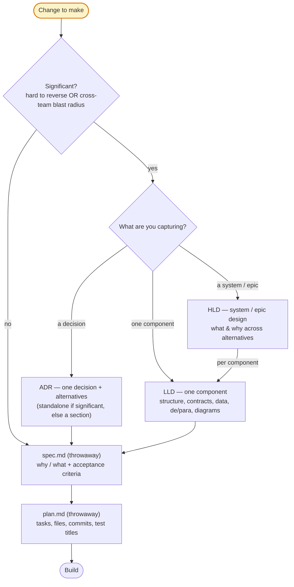

# Choosing a doc: ADR / HLD / LLD / spec / plan

Which doc(s) to write for a piece of work, and how to keep them from overlapping. The toolbox is five docs on two axes.

The split that matters most is **purpose**: HLD, LLD, and ADR are **decision & alignment** docs (durable, for humans); spec and plan are **AI-build** docs (throwaway, spec-driven), fed from them.

So durable docs carry tests, tasks, and launch at **alignment altitude** — strategy, titles, cross-team deps — while the plan carries the **concrete** version — commit-tasks, file paths, test titles.

## Two axes

- **Lifespan** — *Durable* (committed in `docs/`, read months later) vs *Throwaway* (untracked, in the repo root, deleted after the PR).
- **Job** — *Decide* (which option + why) · *Design* (what the solution is) · *Build* (the tasks to execute).

| Doc | Lifespan | Job |
|---|---|---|
| **ADR** | Durable | Decide — one significant decision + alternatives |
| **HLD** | Durable | Design (system / epic) — what & why across alternatives |
| **LLD** | Durable | Design (one component) — structure, contracts, data, de/para |
| **spec.md** | Throwaway | Why / What — requirements + acceptance criteria, one feature |
| **plan.md** | Throwaway | Build — tasks, files, commits, test titles, one feature |

## Decision tree

Reading the tree:

- **Not significant** (cheap to reverse AND contained) → skip durable docs entirely; go straight to `spec.md` → `plan.md`.

- **Significant** → write the durable doc that matches what you're capturing, then still produce `spec.md` → `plan.md` downstream to execute (the hybrid path).

- A trivial component under an HLD can skip its LLD; an ADR can also stand alone when it records a decision with no immediate build.

## RFC is a status, not a doc

An RFC is a doc *circulating for comments*, not a sixth document.

Put it as a `Status` on an HLD or ADR (`Draft → RFC / In Review → Accepted`) while you gather feedback.

Don't create a separate RFC artifact; it would duplicate the HLD.

## Relating docs: recap + link by section, let sections flex

When two docs relate, the referencing doc points to the other by **filepath or URL at the section level**, with a **brief recap** of what's there.

The recap is enough to read standalone; the link is the drill-down for readers who want the full detail.

Recap *and* link, never link alone: a bare "see §X" rots when the target moves and forces a jump to understand, whereas the inline recap keeps each doc readable on its own.

So related sections are **elastic**:

- References an upstream that already answers a section (context, requirements, a decision) → that section shrinks to *recap + link*. An LLD that references an HLD is smaller.

- Self-contained, no related upstream → those sections grow to carry the full content. An LLD with no HLD has a fuller Context and Requirements.

Applies to every pair that relates: HLD↔ADR, HLD↔LLD, LLD↔LLD, LLD↔ADR, HLD↔spec, LLD↔plan, spec↔plan.

## Who owns what (single source of truth)

When two docs could carry the same thing, this table says which one owns the full version; the others recap + link instead of repeating.

| Concern | Owner | Others |
|---|---|---|
| Why / business context | HLD (epic) · spec.md (feature) | recap + link |
| Decision + alternatives | ADR; or HLD/LLD decision section / spec·plan log (minor) | recap + link the ADR |
| Structure, contracts, data model, de/para | LLD | recap + link the LLD |
| Diagrams — big-picture (C4L1, architecture; high-level flow/sequence/state) | HLD | recap + link, don't redraw |
| Diagrams — detailed (code/component design, data-model & endpoint schemas, detailed flow/sequence/state, corner/failure) | LLD | recap + link, don't redraw |
| Success metrics, UAT, test & launch strategy — high-level | HLD / LLD | spec/plan recap + link |
| Task breakdown — titles only (estimates, parallelization, cross-team deps) | HLD / LLD | plan expands to commit-tasks |
| Concrete testable acceptance criteria | spec.md | HLD/LLD keep the high-level version + link |
| Test titles, commit-sized tasks, file paths, commit sketch | plan.md | — |

Diagram *type* isn't the discriminator — altitude is: the same flow/sequence/state diagram can serve an HLD at big-picture level and an LLD at detail level.

## Rules of thumb

- **Significant** = hard to reverse OR cross-team blast radius. Neither → no durable doc; `spec` → `plan`.

- **Durable docs carry only the alignment altitude** — task *titles*, test/launch *strategy*, success metrics — for estimates, parallelization, and cross-team deps.

- **File paths, commit-sized tasks, and concrete test titles live only in the throwaway plan** — they rot, and they belong with the build (plan + TaskList).

- **Code bodies live in neither** the design nor the plan — they live in the repo. The LLD holds interfaces/schemas (the contract); the plan holds file paths and tasks.

- **A decision you'll argue again in 6–12 months → ADR.** A minor one → a line in the spec/plan decision log; graduate it to an ADR if it grows teeth.
