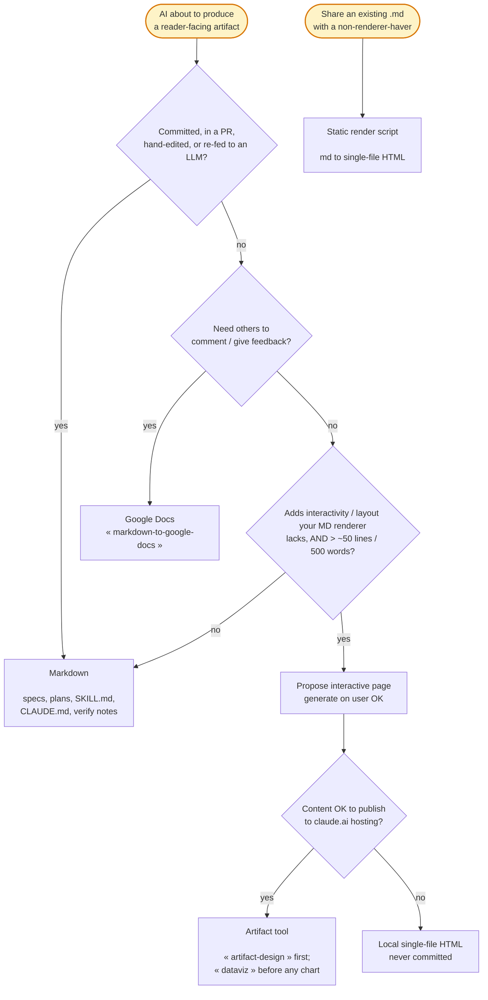

# HTML Artifacts

When to render an artifact as an interactive page instead of Markdown, and which pipeline produces it.

Default is Markdown. An interactive page earns its place in one narrow gap: a **read-once, non-living artifact** where interactivity or layout materially speeds the human reader.

Human reading/review is the bottleneck now — scarcer than tokens. An artifact faster to comprehend is worth extra tokens, but only for the right artifact.

## Walk the format router before producing a reader-facing artifact



The router has four gates, walked in order.

### Gate 1 — Lifecycle exclusion routes living docs to Markdown

If the artifact will be committed, placed in a PR, hand-edited, or re-fed to an LLM, produce Markdown. Do not propose an interactive page.

This covers specs, plans, SKILL.md, CLAUDE.md edits, README, HLD/LLD design docs, and verification notes.

Why: CSS/tags/JS noise rots a doc as AI implementation context, blocks hand-editing, and blocks inline comments.

The user confirmed this empirically — a spec generated as native HTML was rejected on first review, adding no value over their neovim markdown renderer.

Markdown stays the source of truth; an interactive page is at most a regenerable view of it.

### Gate 2 — Feedback need routes to Google Docs

If others must comment on or give feedback on the artifact, use the `markdown-to-google-docs` skill, not HTML.

Why: commenting is Google Docs' native feature. HTML can't match it without hosting plus a widget, so it owns reading and interactivity only — never the feedback niche.

### Gate 3 — Capability test AND one-screen floor, both required

Propose an interactive page only when **both** hold:

- **Capability test** — the page adds something the user's markdown renderer (neovim) lacks: interactivity (sort, filter, collapse, tabs, tune) or a layout markdown can't express. "Renders nicer" never qualifies.

- **One-screen floor** — the artifact exceeds ~50 rendered lines / ~500 words. A tiny doc stays Markdown even with a table or static diagram; interactivity on it isn't worth the file.

A static diagram never justifies an interactive page on its own. A diagram too dense to read is SPLIT into sub-diagrams per the `mermaid-diagrams` skill, not promoted to HTML.

Only a genuine zoom/pan/toggle need (a large non-splittable image) clears the capability test.

Why: neovim already renders styled prose, tables, and static mermaid, so without a real capability gain an interactive page just spends tokens for no reading speedup.

Both gates are required because each alone misfires: size alone greenlights big-but-static docs neovim renders fine; capability alone greenlights a tiny interactive toy not worth a file.

### Gate 4 — Hosted Artifact by default; local HTML only when hosting is wrong

When an interactive page wins, produce it with the native **Artifact tool** — hosted, versioned, shareable URL, theme-aware, CSP-enforced self-contained.

- Load the `artifact-design` skill BEFORE writing the page (the harness mandates it), and `dataviz` before any chart/graph/dashboard.
- Publishing sends the content to claude.ai hosting — an external service — so the propose-first gate below is the consent moment.

Fall back to a **local single-file `.html`** only when hosting is wrong: sensitive content that must not leave the machine, or a page that must open offline.

- To share an existing `.md`, run `md-to-html` (below) — never hand-reimplement it.
- A hand-authored local page must be one self-contained file with zero external references.
  - Embedded CSS in `<style>`, JS in `<script>`, diagrams as inline SVG, images as base64 `data:` URIs.
  - Why: its whole value is opening anywhere offline with no build step; one external reference breaks that.

A templated HTML+JSON path for recurring artifact types stays deferred — the spike lives in `~/unix-utils/workflow-tasks.md`; the Artifact tool's redeploy-to-same-URL may supersede it.

## Propose first, generate only on user OK

When the router selects an interactive page, propose it in one line and wait for the user's OK.
The proposal names the capability gain (e.g. "sortable/filterable findings neovim can't show") and the pipeline (Artifact vs local).

Why: the user is token-sensitive and wants the cost decision per instance — and for Artifacts the OK also covers publishing to claude.ai. Never auto-generate, and never auto-generate both md+html.

## Generation strategies

### Artifact tool — hosted interactive page

Write the page content to a file, then publish it via the Artifact tool; iterate by editing the file and republishing to the same URL.

Authoring rules (theme-awareness, responsiveness, self-containment, favicon) live in `artifact-design` — follow it, don't duplicate it here.

### Static render — an existing `.md` to single-file HTML

To share a Markdown's content with someone who lacks a renderer, run the shipped converter — do not re-implement it:

```bash
md-to-html <input.md> [output.html]   # default output = input path with .html
```

In neovim, `<leader>vM` saves the current `.md` buffer, renders it via `md-to-html`, and opens the result (`open` on macOS, `xdg-open` on Linux). Rendered HTML goes to `/tmp`, never the repo.

The converter is a dumb format converter: it adds no numbered anchoring. It handles mermaid (inline SVG via `mmdc`), embeds CSS, and errors clearly if `pandoc` or `mmdc` is missing.

### Mermaid embedding gotcha — applies to Artifact pages and local HTML alike

Render mermaid to inline SVG with `htmlLabels:false` so labels are SVG-native `<text>`, not `<foreignObject>`.

- `foreignObject` labels have fixed size and clip to "truncated text" when the SVG scales to fit width.
- Inline a runtime mermaid library only when the diagram itself must stay interactive (rare; ~MBs).

## Numbered anchoring for authored pages

Any hand-authored interactive page (Artifact or local) carries numbered sections/blocks by default (a `§N` TOC, CSS section counters, heading `id`s).

Why: the user references "§3.2, do X" instead of copy-pasting text back to you, and you locate the block by its number.

The `md-to-html` converter is exempt — anchoring belongs to authored artifacts, not format conversion. Numbered sections in the source Markdown already serve specs/plans.

## doc-standards apply — check the prose, not the markup

An interactive page that substitutes a `.md` obeys all `doc-standards` (same density caps).

Verify on the rendered **prose**, not the raw file:

- **Converted HTML** (pandoc, content-only): run `check-density.sh` on the `.html` directly — it passes cleanly.

- **Authored pages** with inline CSS/JS: strip `<style>` and `<script>` blocks first, then run `check-density.sh` on what remains.
  - The minified one-liners are not prose — measuring them is a false positive (one `<style>` line can read as 18,000+ chars), not a real density violation.

Why: the density caps protect reader cognitive load on prose; inline CSS/JS/data carry no prose and must be excluded from the measurement.

## Never commit an HTML artifact

An HTML artifact — local file or Artifact page source — is never staged, committed, or attached to a PR. Only the Markdown source (if any) enters version control.

Why: these are read-once, throwaway views. Committing one re-introduces the review-cost and context-rot problems Gate 1 exists to avoid.

## Artifact routing — concrete verdicts

| Artifact | Format | Why |
|----------|--------|-----|
| Spec / Plan | Markdown (numbered sections for §-anchored comments) | living, edited, re-fed to an LLM |
| HLD / LLD (durable design docs) | Markdown + Google Docs for external review | committed; heavy external feedback |
| README / CLAUDE.md / SKILL.md | Markdown | they are LLM context |
| brag | Markdown | structured prose neovim renders; fails the capability test |
| perf / consistency check-reports | Markdown | under the one-screen floor |
| auto-review / pr-review report | Markdown | `address-verdicts` re-reads it and annotates APPLIED/SKIPPED in place |
| deep-research synthesis | Artifact candidate | only if it clears the capability + size bar |
| interactive explanation / dashboard | Artifact (with `dataviz` for charts) | interactivity is the point |
| large zoom/pan image | Artifact | genuine zoom/pan/toggle need |
| sensitive interactive report | local single-file HTML | must not publish to claude.ai hosting |
