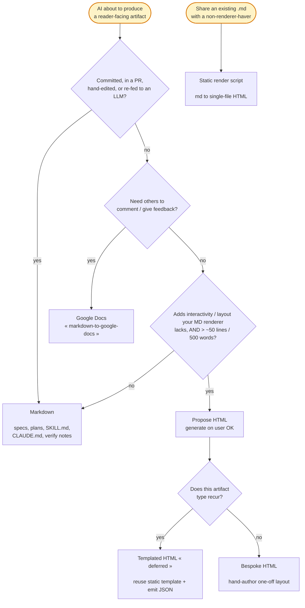

# HTML Artifacts

When to render an artifact as HTML instead of Markdown, and how to author it.

Default is Markdown. HTML earns its place in one narrow gap: a **read-once, non-living artifact** where interactivity or layout materially speeds the human reader.

Human reading/review is the bottleneck now — scarcer than tokens. An artifact faster to comprehend is worth extra tokens, but only for the right artifact.

## Walk the format router before producing a reader-facing artifact



The router has four gates, walked in order.

### Gate 1 — Lifecycle exclusion routes living docs to Markdown

If the artifact will be committed, placed in a PR, hand-edited, or re-fed to an LLM, produce Markdown. Do not propose HTML.

This covers specs, plans, SKILL.md, CLAUDE.md edits, README, HLD/LLD design docs, and verification notes.

Why: CSS/tags/JS noise rots a doc as AI implementation context, blocks hand-editing, and blocks inline comments.

The user confirmed this empirically — a spec generated as native HTML was rejected on first review, adding no value over their neovim markdown renderer.

Markdown stays the source of truth; HTML is at most a regenerable view of it.

### Gate 2 — Feedback need routes to Google Docs

If others must comment on or give feedback on the artifact, use the `markdown-to-google-docs` skill, not HTML.

Why: commenting is Google Docs' native feature. HTML can't match it without hosting plus a widget, so it owns reading and interactivity only — never the feedback niche.

### Gate 3 — Capability test AND one-screen floor, both required

Propose HTML only when **both** hold:

- **Capability test** — HTML adds something the user's markdown renderer (neovim) lacks: interactivity (sort, filter, collapse, tabs, tune) or a layout markdown can't express. "Renders nicer" never qualifies.

- **One-screen floor** — the artifact exceeds ~50 rendered lines / ~500 words. A tiny doc stays Markdown even with a table or static diagram; interactivity on it isn't worth the file.

A static diagram never justifies HTML on its own. A diagram too dense to read is SPLIT into sub-diagrams per the `mermaid-diagrams` skill, not promoted to HTML.

Only a genuine zoom/pan/toggle need (a large non-splittable image) clears the capability test.

Why: neovim already renders styled prose, tables, and static mermaid, so without a real capability gain HTML just spends tokens for no reading speedup.

Both gates are required because each alone misfires: size alone greenlights big-but-static docs neovim renders fine; capability alone greenlights a tiny interactive toy not worth a file.

### Gate 4 — Recur? Template; else bespoke

When HTML wins and the artifact type recurs (e.g. a code-review report), it is a candidate for the templated strategy — **deferred to v2** (see below).

For now, and for any one-off layout, author bespoke.

If no template exists for a recurring-looking type, author bespoke once and flag that a template would pay off next time.

## Propose first, generate only on user OK

When the router selects HTML, propose it in one line naming the capability gain (e.g. "sortable/filterable findings neovim can't show"), then wait for the user's OK before generating.

Why: the user is token-sensitive and wants the cost decision per instance. Never auto-generate, and never auto-generate both md+html — both spend tokens without consent.

## Generation strategies

### Static render — an existing `.md` to single-file HTML

To share a Markdown's content with someone who lacks a renderer, run the shipped converter — do not re-implement it:

```bash
md-to-html <input.md> [output.html]   # default output = input path with .html
```

In neovim, `<leader>vM` saves the current `.md` buffer, renders it via `md-to-html`, and opens the result (`open` on macOS, `xdg-open` on Linux). Rendered HTML goes to `/tmp`, never the repo.

The converter is a dumb format converter: it adds no numbered anchoring. It handles mermaid (inline SVG via `mmdc`), embeds CSS, and errors clearly if `pandoc` or `mmdc` is missing.

### Bespoke — hand-author a one-off layout

Author a single self-contained `.html` for a novel artifact with no template. Apply the non-negotiables and numbered anchoring below.

### Templated — DEFERRED to v2

The recurring path (reuse a static template, emit only JSON data merged client-side) is **not built yet**. Its doc-standards verification — density on JSON-fed HTML — is unsolved.

Keep it on the radar: when a type recurs, note that a template would pay off, but author bespoke for now. Tracked on `workflow-tasks.md` #6.

## Non-negotiables for any HTML artifact

Every HTML artifact, static or bespoke, must satisfy all of these:

- **One self-contained file** — exactly one `.html`, zero external references: no CDN, no `<link>`, no sibling assets. It must open correctly offline with no network fetch.

- **Embedded CSS** — all styles inlined in `<style>`.

- **Embedded JS** — all scripts inlined in `<script>`; no external `src`.

- **Embedded diagrams** — mermaid rendered to inline SVG (vector, JS-free).
  - Render with mermaid `htmlLabels:false` so labels are SVG-native `<text>`, not `<foreignObject>`.
  - `foreignObject` labels have fixed size and clip to "truncated text" when the SVG scales to fit width.
  - Inline a runtime mermaid library only when the diagram itself must stay interactive (rare; ~MBs).

- **Embedded images** — base64 `data:` URIs; prefer SVG/vector to avoid the ~33% base64 size penalty.

Why: the whole value of the artifact is that the user can keep, share, and open it anywhere with no build step. One external reference breaks that offline-anywhere guarantee.

## Numbered anchoring for bespoke HTML

Natively-authored HTML carries numbered sections/blocks by default (a `§N` TOC, CSS section counters, heading `id`s).

Why: the user references "§3.2, do X" instead of copy-pasting text back to you, and you locate the block by its number.

The `md-to-html` converter is exempt — anchoring belongs to authored artifacts, not format conversion. Numbered sections in the source Markdown already serve specs/plans.

## doc-standards apply — check the prose, not the markup

An HTML artifact that substitutes a `.md` obeys all `doc-standards` (same density caps).

Verify on the rendered **prose**, not the raw file:

- **Converted HTML** (pandoc, content-only): run `check-density.sh` on the `.html` directly — it passes cleanly.

- **Bespoke HTML** with inline CSS/JS: strip `<style>` and `<script>` blocks first, then run `check-density.sh` on what remains.
  - The minified one-liners are not prose — measuring them is a false positive (one `<style>` line can read as 18,000+ chars), not a real density violation.

Why: the density caps protect reader cognitive load on prose; inline CSS/JS/data carry no prose and must be excluded from the measurement.

## Never commit an HTML artifact

An HTML artifact is never staged, committed, or attached to a PR. Only the Markdown source (if any) enters version control.

Why: these are read-once, throwaway views. Committing one re-introduces the review-cost and context-rot problems Gate 1 exists to avoid.

## Artifact routing — concrete verdicts

| Artifact | Format | Why |
|----------|--------|-----|
| spec_<slug>.md / plan_<slug>.md | Markdown (numbered sections for §-anchored comments) | living, edited, re-fed to an LLM |
| HLD / LLD (durable design docs) | Markdown + Google Docs for external review | committed; heavy external feedback |
| README / CLAUDE.md / SKILL.md | Markdown | they are LLM context |
| brag | Markdown | structured prose neovim renders; fails the capability test |
| perf / consistency check-reports | Markdown | under the one-screen floor |
| code-review / auto-review report | HTML (sortable/filterable findings) | interactivity neovim lacks; pick fixes by number, never commit it |
| deep-research synthesis | HTML candidate | only if it clears the capability + size bar |
| interactive explanation / dashboard | HTML (bespoke) | interactivity is the point |
| large zoom/pan image | HTML | genuine zoom/pan/toggle need |
