---
# performance-check budget override, not part of the diagram itself.
# This file's size is fixed by the number of steps the skill actually has, so
# trimming it would drop steps from the flow audit. Doubled from the 1024-word
# bundled default, which it sat exactly at until the failure/gate/review
# restructure added four reference-load nodes.
# Parked in assets/ and never loaded by the model, so its words cost no context.
words-budget: 2048
---

# implement — flow overview

Human-facing overview for auditing the flow at a glance. Non-authoritative — the numbered steps in [`../SKILL.md`](../SKILL.md) win on any conflict. Regenerate this file whenever the skill's flow changes.

```mermaid
flowchart TD
  n1(["1. /implement &lt;task-ids&gt; | &lt;PR-label(s)&gt;<br/><br/>or natural language ('let's implement that')<br/>when plan_&lt;slug&gt;.md exists"]):::start
  n2["2. Step 1.1 · Locate plan_&lt;slug&gt;.md (+ spec)"]
  n3{"3. Plan found?"}
  n3a(["3a. Stop: no plan given"])
  n4["4. Step 1.2 · ONE up-front interview —<br/>the only round until the<br/>review package:<br/><br/>- Plan pick, if multiple candidates<br/>- Run in a git worktree?<br/>- Open a draft PR at batch end?<br/>- Refactor+auto-review tails? (default yes)<br/>- Confirm the base branch"]:::gate
  n5["5. Step 1.3 · Re-validate BOTH graphs ONCE,<br/>before any execution:<br/>check-tasks-dag.sh + check-pr-dag.sh"]:::hook
  n6{"6. Both graphs valid?"}
  n6a(["6a. Stop: surface the script's stderr;<br/>fix the plan, re-invoke"])
  n7{"7. Worktree requested?"}
  n7a["7a. Load references/worktree-setup.md"]:::skill
  n7b["7b. Step 1.4 · EnterWorktree + symlink<br/>plan/spec/branches files,<br/>copy .env*"]
  n8{"8. Arg is PR-label(s)?"}
  n8a["8a. Load references/pr-awareness.md"]:::skill
  n8b["8b. Step 1.5 · Resolve EVERY PR-N to its<br/>task-id list (get-pr-tasks.sh),<br/>before any seeding"]
  n9["9. Step 2.1 · TaskList: one entry per task,<br/>ALL PRs upfront in execution order<br/>(subjects prefixed 'PR-2 &middot;');<br/>1st in_progress, rest pending;<br/>status only"]:::state

  subgraph seedRemind["10. Step 2.2 · After each PR's task entries, seed that batch's 5 batch-end [Reminder]s — separate entries, never one chain:<br/>a combined entry has one completed flag, so a step-level skip would have nowhere to land."]
    direction TB
    n10a["10a. Add to TaskList a [Reminder] for<br/>Batch-end 1/5: planned-test presence gate"]:::state
    n10b["10b. Add to TaskList a [Reminder] for<br/>Batch-end 2/5: repo-green gate, fix-loop until green"]:::state
    n10c["10c. Add to TaskList a [Reminder] for<br/>Batch-end 3/5: review tails ∥ then triage"]:::state
    n10d["10d. Add to TaskList a [Reminder] for<br/>Batch-end 4/5: push + open the PR via create-pr"]:::state
    n10e["10e. Add to TaskList a [Reminder] for<br/>Batch-end 5/5: package print, diffview pane"]:::state
    n10a --> n10b --> n10c --> n10d --> n10e
  end

  n11["11. Step 2.3 · Write durable state NOW,<br/>kept current as the run goes:<br/>one /tmp/implement_&lt;session_id&gt;[_prN].json<br/>per unit (phase=tasks, start_sha=HEAD)<br/>+ /tmp/implement_&lt;session_id&gt;.md scratchpad.<br/>NO resume path — a leftover file is stale"]:::state

  subgraph perunit ["Per unit: the whole batch (task-ids run), or each PR in turn (PR-label list)"]
    n12{"12. PR-label run: checkout needed?<br/>(need-git-checkout.sh)"}:::hook
    n12a["12a. Step 3.1 · Orchestrator creates this<br/>PR's branch — ONCE, here; never<br/>mid-loop, never by a subagent"]
    n13["13. Step 3.2 · Capture BATCH_BASE_SHA into<br/>the state file; recap the base from<br/>COMMIT MESSAGES, not the diff"]:::state
    n14["14. Step 3.3 · Exact-match this unit's task-ids<br/>(a collision means a malformed plan)"]
    n15["15. Step 3.4 · Activate a task: TaskUpdate<br/>in_progress + breadcrumb;<br/>assign the checklist path"]:::state
    n16["16. Step 4 · Dispatch tdd-coder<br/>(agent-pinned, background,<br/>SERIAL across tasks, 1h Monitor cap)"]:::dispatch
    n16a["16a. Hooks: subagent-model-guard + git-guard"]:::hook
    n16b["16b. 1h Monitor expires: TaskStop the<br/>subagent (resolves as timeout)"]:::hook
    n16c["16c. THE SUBAGENT writes its own RED-GREEN<br/>checklist + evidence:<br/>/tmp/implement_substeps_&lt;slug&gt;_&lt;id&gt;.md<br/>(the orchestrator only checks it exists)"]:::state
    n17{"17. Step 4.4 · Subagent report status?"}
    n18["18. Step 5.1 · Delegate the verify to a fresh<br/>general-purpose (sonnet · high), FOREGROUND —<br/>it judges the checklist + evidence,<br/>re-running nothing"]:::dispatch
    n19{"19. Verify verdict?"}
    n19a["19a. Load references/failure-and-halt.md"]:::skill
    n19b["19b. Step 5.2 · Record the attempt<br/>(fail/timeout/blocked + signature)<br/>into the state file"]:::state
    n19c{"19c. Step 5.2 · implement-loop-state.sh:<br/>verdict?"}:::hook
    n19d["19d. Step 5.3 · Mark the task terminal;<br/>chain-abort dependents transitively;<br/>plan [Blocked]; TaskUpdate completed"]:::state
    n19e{"19e. Step 5.3 · Any runnable task left?"}
    n20["20. Step 5.4 · Advance: state file status=done;<br/>plan [Done]; record [Scout] notes;<br/>TaskUpdate completed"]:::state
    n21{"21. Step 5.4 · implement-loop-state.sh: verdict?<br/>ONLY this script sends a unit to the gates"}:::hook
    n22["22. Load references/batch-test-presence-gate.md"]:::skill
    n23["23. Step 8 · Dispatch deep-reviewer:<br/>planned-test presence gate (agent-pinned)"]:::dispatch
    n23a["23a. Hook: deep-reviewer-write-guard"]:::hook
    n24{"24. All planned test titles found<br/>(or all N/A)?"}
    n24a{"24a. Fix attempts left?"}
    n24b["24b. Step 8 · Re-dispatch the owning task's<br/>tdd-coder (agent-pinned, same 1h<br/>Monitor cap), then RE-GATE"]:::dispatch
    n25["25. Load references/batch-end-review.md"]:::skill
    n26["26. Step 9.1 · Repo-green GATE: full lint +<br/>full test suite, repo-wide, never<br/>scoped to the batch's own files"]:::gate
    n27{"27. Green? (a failure the batch didn't<br/>cause is a [Scout], never a blocker)"}
    n27a{"27a. Fix attempts left?"}
    n27b["27b. Step 9.1 · Dispatch tdd-coder to fix it<br/>(agent-pinned, 1h Monitor cap, attempt<br/>recorded); RE-RUN THE FULL SUITE"]:::dispatch
    n28{"28. Tails requested?"}
    n28a["28a. Load code-review-pipeline/<br/>references/deep-reviewer-tail-pair.md"]:::skill
    n28b["28b. Step 9.2 ∥ 9.3 · Dispatch the refactor +<br/>auto-review tails (BOTH agent-pinned,<br/>PARALLEL, mandatory, report-only) —<br/>only now the repo is green"]:::dispatch
    n28c["28c. Record both report paths into<br/>the state file"]:::state
    n28d["28d. Step 9.4 · Triage: synthesize one<br/>prioritized summary. REPORT-ONLY —<br/>this skill never applies a finding"]
    n29["29. Load references/batch-end-pr.md<br/>(skip entirely when neither a PR-label<br/>run nor an opted-in draft PR)"]:::skill
    n30["30. Step 9.5 · branches_&lt;slug&gt;.md manifest<br/>entry + PR-level status marker<br/>(PR-label runs only)"]:::state
    n31{"31. Draft PR requested?"}
    n31a["31a. Step 9.5 · Dispatch the create-pr agent<br/>(agent-pinned): it composes the body,<br/>pushes the branch AND opens the PR"]:::dispatch
    n31b{"31b. PR opened?"}
    n32["32. Step 9.5 · Print the review package,<br/>THEN the nvim diffview pane<br/>(open-in-tmux); complete the<br/>remaining [Reminder]s"]
    n33["33. Step 9.5 · phase=presented;<br/>DELETE this unit's state file"]:::state
  end

  n34{"34. PR-label run with PRs remaining?"}
  n35["35. Load references/failure-and-halt.md"]:::skill
  n36(["36. Step 5.5 · HALT and wait for the human:<br/>phase=halted; write what each blocker<br/>needs into the scratchpad; leave<br/>remaining [Reminder]s pending;<br/>run NOTHING further"]):::gate
  n37(["37. Invocation ends"])
  n37a["37a. Stop hook: releases only on<br/>phase presented or halted"]:::hook

  n1 --> n2 --> n3
  n3 -->|"no"| n3a
  n3 -->|"yes"| n4 --> n5 --> n6
  n6 -->|"no"| n6a
  n6 -->|"yes"| n7
  n7 -->|"yes"| n7a --> n7b --> n8
  n7 -->|"no"| n8
  n8 -->|"yes"| n8a --> n8b --> n9
  n8 -->|"no"| n9
  n9 --> n10a
  n10e --> n11 --> n12
  n12 -->|"yes"| n12a --> n13
  n12 -->|"no / task-ids run"| n13
  n13 --> n14 --> n15 --> n16
  n16 -.->|"guards"| n16a
  n16 -.->|"writes"| n16c
  n16 -->|"1h timeout"| n16b --> n19a
  n16 --> n17
  n17 -->|"blocked"| n19a
  n17 -->|"done"| n18 --> n19
  n19 -->|"pass"| n20
  n19 -->|"fail"| n19a
  n19a --> n19b --> n19c
  n19c -->|"retry (loads debug-standards)"| n16
  n19c -->|"stuck"| n19d --> n19e
  n19c -->|"halt-budget"| n35
  n19e -->|"yes"| n15
  n19e -->|"no"| n35
  n20 --> n21
  n21 -->|"next-task"| n15
  n21 -->|"gates"| n22 --> n23
  n21 -->|"halted / halt-budget"| n35
  n23 -.->|"guards"| n23a
  n23 --> n24
  n24 -->|"yes"| n25
  n24 -->|"missing"| n24a
  n24a -->|"no"| n35
  n24a -->|"yes"| n24b --> n23
  n25 --> n26 --> n27
  n27 -->|"no"| n27a
  n27a -->|"no"| n35
  n27a -->|"yes"| n27b --> n26
  n27 -->|"yes"| n28
  n28 -->|"yes"| n28a --> n28b --> n28c --> n28d --> n29
  n28b -.->|"guards"| n23a
  n28 -->|"no"| n29
  n29 --> n30 --> n31
  n31 -->|"yes"| n31a --> n31b
  n31b -->|"no"| n35
  n31b -->|"yes"| n32
  n31 -->|"no"| n32
  n32 --> n33 --> n34
  n34 -->|"yes"| n12
  n34 -->|"no"| n37
  n35 --> n36 --> n37
  n37 -.->|"releases"| n37a

  classDef start fill:#fef3c7,stroke:#d97706,stroke-width:2px
  classDef gate fill:#fee2e2,stroke:#dc2626,stroke-width:2px
  classDef dispatch fill:#dbeafe,stroke:#2563eb,stroke-width:2px
  classDef state fill:#dcfce7,stroke:#16a34a,stroke-width:2px
  classDef skill fill:#f3e8ff,stroke:#9333ea,stroke-width:2px
  classDef hook fill:#e5e7eb,stroke:#4b5563,stroke-width:2px
```

