---
# performance-check budget overrides, not part of the diagram itself.
# This file's size is fixed by the number of steps the skill actually has, and
# it renders each step twice — once as pseudo-code, once as a diagram node — so
# trimming to the bundled defaults would drop steps from the flow audit or drop
# a whole rendering. Two renderings is the point: they cross-check each other.
# Parked in assets/ and never loaded by the model, so its words cost no context.
words-budget: 4096
lines-budget: 512
---

# implement — flow overview

Human-facing overview for auditing the flow at a glance. Non-authoritative — the numbered steps in [`../SKILL.md`](../SKILL.md) win on any conflict. Regenerate this file whenever the skill's flow changes.

Two renderings of the same flow, kept cross-checkable on purpose. The `# N` comments in the pseudo-code are the diagram's node ids, so an id with no matching comment is drift.

## Pseudo-code

Python-shaped for readability only; nothing here is runnable, and the function names stand for orchestrator actions, not real APIs.

```python
# 1 · Entry: /implement <task-ids> | <PR-label(s)>
#     or natural language ("let's implement that") when plan_<slug>.md exists.
def implement(arg):
    plan, spec = locate_plan_and_spec()                    # 2 · §1.1, CWD top-level glob
    if not plan:                                            # 3
        return stop("no plan given")                       # 3a
    # A plan with no spec is a supported mode, not a missing input: a plan-only
    # run works unchanged, and the spec is simply passed nowhere.

    # 4 · §1.2 — ONE up-front interview, the only round until the review package:
    #     plan pick · plan path, if none found (§1.1) · worktree · draft PR
    #     · quality-gate tail (default yes) · full-suite green baseline
    #     · repo-green gate (default yes) · confirm the base branch.
    answers = ask_everything_at_once()

    # 5 · §1.3 — re-validate BOTH graphs ONCE, before any execution.
    if not (check_tasks_dag(plan) and check_pr_dag(plan)):  # 6
        return stop(script_stderr_verbatim)                # 6a · fix the plan, re-invoke

    if answers.worktree:                                   # 7
        load("references/worktree-setup.md")               # 7a
        enter_worktree(symlink=[plan, spec], copy=[".env*"])    # 7b · §1.4

    if arg.is_pr_labels:                                   # 8
        load("references/pr-awareness.md")                 # 8a
        units = [get_pr_tasks(label) for label in arg.labels]   # 8b · §1.5
        # 8c · §1.5 — decide the stack mode ONCE: a PR with 2+ parents
        #      (diamond) → merge; linear AND the gh-stack extension installed
        #      → native; else merge. Recorded as a Mode: line under the plan's
        #      PR Breakdown heading — sticky for the stack's whole life.
        plan.record_stack_mode(decide_stack_mode(units))
    else:
        units = [Unit(arg.task_ids)]                       # the whole batch is one unit

    # 9 · §1.6 — capture a full-suite green baseline, only when §1.2 said yes;
    #     runs once worktree (7b) and PR-label resolution (8b) have settled.
    if answers.baseline:                                   # 9
        load("references/full-suite-baseline.md")          # 9a
        state.baseline = capture_full_suite_baseline()      # 9b · full lint + full test
                                                             #      suite; log PATH + failing
                                                             #      signatures only, never content

    # 10 · §2.1 + 11 · §2.2 — seed the WHOLE run upfront, in execution order:
    #     ALL PRs, each PR's tasks before its own batch-end reminders.
    for unit in units:
        for task in unit.tasks:
            task_create(f"{unit.label} · {task.id}. {task.title}",
                        status="in_progress" if is_first_of_run(task) else "pending")
            # TaskList carries status ONLY — attempts, gates and SHAs live in the JSON.
        for step in BATCH_END_STEPS:      # FOUR separate entries:
            task_create(f"[Reminder] {step}")
            # 11a · 1/4 quality-gate tail with --auto-solve (opt-in)
            # 11b · 2/4 repo-green gate, fix-loop until green (opt-in)
            # 11c · 3/4 push the branch; record it on the PR line; PR when wanted
            # 11d · 4/4 package print, closing review notification
            # Never one chain: a combined entry has one completed flag, so a
            # step-level skip would have nowhere to land.

    # 12 · §2.3 — durable state NOW, kept current as the run goes.
    for unit in units:
        write_json(f"/tmp/implement_{session_id}{unit.suffix}.json",
                   phase="tasks", start_sha=head(), batch_base_sha="")
    write_scratchpad(f"/tmp/implement_{session_id}.md")
    # NO resume path — a leftover state file is stale: delete it and start over.

    # 35 · a task-ids run has one unit; a PR-label run repeats §3–§8 per PR, in order.
    for unit in units:
        run_unit(unit)

    return  # 38 · invocation ends
            # 38a · Stop hook releases only on
            #       phase "presented" or "halted"


def run_unit(unit):
    if unit.is_pr and need_git_checkout(plan, unit.label):  # 13
        load("references/pr-branch-creation.md")            # 13a
        create_branch(unit)   # 13b · §3.1 — ONCE, here. Never mid-loop, never a subagent.

    state.batch_base_sha = head()                          # 14 · §3.2
    recap(git_log(base_branch, "HEAD"), read="COMMIT MESSAGES, not the diff")

    tasks = exact_match(unit.task_ids, plan.headings)      # 15 · §3.3
    # A prefix matching two headings means a malformed plan, not a question — stop.

    task = tasks.first
    while task:
        # 16 · §3.4 — the only orchestrator work between two dispatches: flip the
        #      status, hand over a breadcrumb. No checklist path is assigned.
        task_update(task, "in_progress", breadcrumb=plan.acceptance_titles(task))

        while True:   # retry loop: 20c's "retry" comes back here, not to activation
            # 17 · §4 — agent-pinned, background, SERIAL across tasks, 1h Monitor cap.
            report = dispatch("tdd-coder", task, timeout_ms=3_600_000)
            # 17a · hooks: subagent-model-guard + git-guard
            # 17c · THE SUBAGENT owns its RED-GREEN checklist end to end: it derives
            #       the path, writes it, and resumes from it. The orchestrator never
            #       names it, reads it, or gates on it.
            if report.timed_out:
                task_stop(report.agent)                    # 17b · resolves as a timeout
                report.status = "timeout"

            if report.status == "done":                    # 18 · §4.4
                # 19 · §5.1 — the orchestrator's whole part: no dispatch, no re-run,
                #      no checklist. One `git cat-file -e <sha>^{commit}` per SHA
                #      the report named — existence only, never content.
                accepted = all_reported_commits_resolve(report)      # 20
            else:
                accepted = False  # `blocked` and `timeout` take the failure path too

            if accepted:
                state.set(task, status="done")             # 21 · §5.4 — before the script
                plan.mark(task, "[Done]")
                task_create_scouts(report.scouts)          # §4.3 — one task each
                task_update(task, "completed")
            else:
                load("references/failure-and-halt.md")     # 20a
                state.record_attempt(task, result, signature)    # 20b · §5.2

            # 20c / 22 · ONLY this script sends a unit to the gates. Never infer
            #            "gates" from an empty-looking queue — it empties two ways.
            v = implement_loop_state(state_file)
            if v != "retry":                               # retry loads debug-standards
                break

        if v == "stuck":                                   # 20d · §5.3
            mark_terminal(task)
            chain_abort_dependents(task, transitive=True)
            plan.mark(task, "[Blocked]")
            task_update(task, "completed")
            task = next_runnable()                         # 20e
            if not task:
                return halt()
        elif v == "next-task":
            task = v.task                                  # back to 16
        elif v == "gates":
            break                                          # every task in the unit is done
        else:                                              # "halted" | "halt-budget"
            return halt()

    # ---- 23–27 · §8.1–§8.2 · the two opt-in gates, in that order ----
    load("references/batch-end-review.md")                 # 23

    if answers.quality_gate_tail:                          # 24 · else skipped by request
        # 25 · §8.1 — IN THIS SESSION, never wrapped in a subagent: its legs are
        #     already fresh-context reviewers, and its commits need a permission
        #     prompt only main can render. The spec argument goes in only when
        #     §1.1 resolved one — the skill matches paths by spec_/plan_ prefix.
        run_skill("/quality-gate", spec_if_resolved, plan,
                  tasks=unit.task_ids, base_ref=state.batch_base_sha,
                  auto_solve=True)
        # 25a · inside it: refactor ∥ auto-review ∥ test-sdd legs → three
        #       verdict_*.md, then per-finding apply → commit → mark [Done].
        # 25b · hook: deep-reviewer-write-guard (only verdict_*.md writes approved).
        state.record_verdict_paths()   # 25c · PATHS, never content; every finding
        scout(quality_gate.declined)   #       it declined becomes a [Scout];
        state.phase = "tails"          #       then phase=tails

    if answers.repo_green_gate:                            # 26 · else skipped by request
        while True:
            # 27 · §8.2 — repo-wide, never scoped to the batch's own files. Runs
            #     AFTER the quality gate, so it measures a tree already holding
            #     whatever --auto-solve applied. That ordering is why no "the gate
            #     applied something, so re-run the suite" rule exists.
            if full_lint() and full_test_suite():          # 27a
                break
            # A failure the batch didn't cause is a [Scout], never a blocker.
            if not fix_attempts_left():                    # 27b
                return halt()
            dispatch("tdd-coder", failure,                 # 27c · attempt recorded,
                     timeout_ms=3_600_000)                 #       RE-RUN THE FULL SUITE

    # ---- 28–34 · §8.3 · push, PR, package, finalize ----
    # 28 · Finalize step 1 — ALWAYS, on every batch end, whatever pr.wanted says.
    #      A pushed branch with no PR is the ordinary outcome, not a half state.
    if not git_push("-u", "origin", "HEAD"):               # 29 · no remote, a rejected
        return halt()                                      #      non-fast-forward, no creds

    if unit.is_pr or answers.draft_pr:                     # 30
        load("references/batch-end-pr.md")                 # 30a
        if unit.is_pr:
            # 31 · Finalize step 2, PR-label runs only: the Branch: clause and the
            #      PR-level [Done] marker, both on this PR's own plan line.
            plan.record_branch_clause(unit.label, current_branch())
            plan.mark_pr(unit.label, "[Done]")
        if answers.draft_pr:                               # 32
            pr = dispatch("pr-creator", batch_diff)  # 32a · composes the body and
                                                     #       CREATES ONLY — 28 pushed,
                                                     #       so it must never push
            if not pr.opened:                              # 32b
                return halt()
            # 32c · native mode + the run's last PR only: register the chain as
            #       a native stack, reusing the already-created PRs. Linking
            #       runs LAST so no branch is server-rebased mid-run; a failed
            #       link downgrades Mode: to merge and continues — never a halt.
            if plan.stack_mode == "native" and unit.is_last_label:
                if not gh("stack", "link"):
                    plan.record_stack_mode("merge")

    print_review_package()          # 33 · Finalize step 3 — the package, closing with
                                    #      the review notification: base SHA + its
                                    #      subject, then one line per unit — label ·
                                    #      branch · commit count · PR URL when one exists
    complete_remaining_reminders()
    state.phase = "presented"                              # 34 · Finalize step 4
    delete(state_file)


def halt():
    load("references/failure-and-halt.md")                 # 36
    set_halted_phase_on_all_units()                        # 37 · §5.5
    scratchpad.write(what_each_blocker_needs)
    leave_pending(remaining_reminders)
    # Run NOTHING further; wait for the human.
```

## Flowchart

```mermaid
flowchart TD
  n1(["1. /implement &lt;task-ids&gt; | &lt;PR-label(s)&gt;<br/><br/>or natural language ('let's implement that')<br/>when plan_&lt;slug&gt;.md exists"]):::start
  n2["2. Step 1.1 · Locate plan_&lt;slug&gt;.md (+ the spec when one<br/>exists — a plan-only run is a supported mode)"]
  n3{"3. Plan found?"}
  n3a(["3a. Stop: no plan given"])
  n4["4. Step 1.2 · ONE up-front interview —<br/>the only round until the<br/>review package:<br/><br/>- Plan pick, if multiple candidates<br/>- Plan path, if none found (§1.1)<br/>- Run in a git worktree?<br/>- Open a draft PR at batch end?<br/>- Quality-gate tail? (default yes)<br/>- Capture a full-suite green baseline first?<br/>- Repo-green gate? (default yes)<br/>- Confirm the base branch"]:::gate
  n5["5. Step 1.3 · Re-validate BOTH graphs ONCE,<br/>before any execution:<br/>check-tasks-dag.sh + check-pr-dag.sh"]:::hook
  n6{"6. Both graphs valid?"}
  n6a(["6a. Stop: surface the script's stderr;<br/>fix the plan, re-invoke"])
  n7{"7. Worktree requested?"}
  n7a["7a. Load references/worktree-setup.md"]:::skill
  n7b["7b. Step 1.4 · EnterWorktree + symlink<br/>the plan and its spec, copy .env*"]
  n8{"8. Arg is PR-label(s)?"}
  n8a["8a. Load references/pr-awareness.md"]:::skill
  n8b["8b. Step 1.5 · Resolve EVERY PR-N to its<br/>task-id list (get-pr-tasks.sh),<br/>before any seeding"]
  n8c["8c. Step 1.5 · Decide the stack mode ONCE:<br/>diamond (a PR with 2+ parents) -&gt; merge;<br/>linear AND gh-stack extension installed -&gt; native;<br/>else merge. Record a Mode: line under the plan's<br/>PR Breakdown heading — sticky for the stack's life"]:::state
  n9{"9. Full-suite baseline requested?"}
  n9a["9a. Load references/full-suite-baseline.md"]:::skill
  n9b["9b. Step 1.6 · Capture the baseline: full lint +<br/>full test suite, once worktree (7b) and<br/>PR-label resolution (8b) have settled;<br/>save the log PATH + failing signatures into<br/>state.baseline (never the log content)"]:::state
  n10["10. Step 2.1 · TaskList: one entry per task,<br/>ALL PRs upfront in execution order<br/>(subjects prefixed 'PR-2 &middot;');<br/>1st in_progress, rest pending;<br/>status only"]:::state

  subgraph seedRemind["11. Step 2.2 · After each PR's task entries, seed that batch's 4 batch-end [Reminder]s — separate entries, never one chain:<br/>a combined entry has one completed flag, so a step-level skip would have nowhere to land."]
    direction TB
    n11a["11a. Add to TaskList a [Reminder] for<br/>Batch-end 1/4: quality-gate tail with --auto-solve<br/>(only when opted in)"]:::state
    n11b["11b. Add to TaskList a [Reminder] for<br/>Batch-end 2/4: repo-green gate, fix-loop until green<br/>(only when opted in)"]:::state
    n11c["11c. Add to TaskList a [Reminder] for<br/>Batch-end 3/4: push the branch; record it on the<br/>PR line; open the PR via pr-creator when wanted"]:::state
    n11d["11d. Add to TaskList a [Reminder] for<br/>Batch-end 4/4: package print,<br/>closing review notification"]:::state
    n11a --> n11b --> n11c --> n11d
  end

  n12["12. Step 2.3 · Write durable state NOW,<br/>kept current as the run goes:<br/>one /tmp/implement_&lt;session_id&gt;[_prN].json<br/>per unit (phase=tasks, start_sha=HEAD)<br/>+ /tmp/implement_&lt;session_id&gt;.md scratchpad.<br/>NO resume path — a leftover file is stale"]:::state

  subgraph perunit ["Per unit: the whole batch (task-ids run), or each PR in turn (PR-label list)"]
    n13{"13. PR-label run: checkout needed?<br/>(need-git-checkout.sh)"}:::hook
    n13a["13a. Load references/pr-branch-creation.md"]:::skill
    n13b["13b. Step 3.1 · Orchestrator creates this<br/>PR's branch — ONCE, here; never<br/>mid-loop, never by a subagent"]
    n14["14. Step 3.2 · Capture BATCH_BASE_SHA into<br/>the state file; recap the base from<br/>COMMIT MESSAGES, not the diff"]:::state
    n15["15. Step 3.3 · Exact-match this unit's task-ids<br/>(a collision means a malformed plan)"]
    n16["16. Step 3.4 · Activate a task: TaskUpdate<br/>in_progress + breadcrumb.<br/>NO checklist path is assigned"]:::state
    n17["17. Step 4 · Dispatch tdd-coder<br/>(agent-pinned, background,<br/>SERIAL across tasks, 1h Monitor cap)"]:::dispatch
    n17a["17a. Hooks: subagent-model-guard + git-guard"]:::hook
    n17b["17b. 1h Monitor expires: TaskStop the<br/>subagent (resolves as timeout)"]:::hook
    n17c["17c. THE SUBAGENT owns its RED-GREEN checklist<br/>end to end: it derives the path, writes it,<br/>and resumes from it. The orchestrator never<br/>names it, reads it, or gates on it"]:::state
    n18{"18. Step 4.4 · Subagent report status?"}
    n19["19. Step 5.1 · Accept the result: the orchestrator<br/>dispatches no reviewer, re-runs nothing and reads no<br/>checklist — its whole part is one<br/>git cat-file -e &lt;sha&gt;^{commit} per reported SHA"]
    n20{"20. Every reported commit resolves?<br/>(a 'done' reporting none fails too;<br/>existence only, never content)"}
    n20a["20a. Load references/failure-and-halt.md"]:::skill
    n20b["20b. Step 5.2 · Record the attempt<br/>(fail/timeout/blocked + signature)<br/>into the state file"]:::state
    n20c{"20c. Step 5.2 · implement-loop-state.sh:<br/>verdict?"}:::hook
    n20d["20d. Step 5.3 · Mark the task terminal;<br/>chain-abort dependents transitively;<br/>plan [Blocked]; TaskUpdate completed"]:::state
    n20e{"20e. Step 5.3 · Any runnable task left?"}
    n21["21. Step 5.4 · Advance: state file status=done;<br/>plan [Done]; TaskCreate [Scout] items;<br/>TaskUpdate completed"]:::state
    n22{"22. Step 5.4 · implement-loop-state.sh: verdict?<br/>ONLY this script sends a unit to the gates"}:::hook
    n23["23. Load references/batch-end-review.md"]:::skill
    n24{"24. Quality-gate tail requested?"}
    n25["25. Step 8.1 · Invoke /quality-gate [&lt;spec&gt;] &lt;plan&gt;<br/>--tasks &lt;this unit's ids&gt; --auto-solve,<br/>base ref = BATCH_BASE_SHA. The spec argument goes in<br/>only when §1.1 resolved one.<br/>IN THIS SESSION, never wrapped in a subagent:<br/>its legs are already fresh-context reviewers, and<br/>its commits need a prompt only main can render"]:::skill
    n25a["25a. Inside it: refactor ∥ auto-review ∥ test-sdd legs<br/>→ three verdict_*.md, then per-finding<br/>apply → commit → mark [Done]"]:::dispatch
    n25b["25b. Hook: deep-reviewer-write-guard<br/>(only verdict_*.md writes are approved)"]:::hook
    n25c["25c. Record each verdict PATH into the state file<br/>(never its content); every finding it declined<br/>becomes a [Scout]; then phase=tails"]:::state
    n26{"26. Repo-green gate requested?"}
    n27["27. Step 8.2 · Repo-green GATE: full lint + full test<br/>suite, repo-wide, never scoped to the batch's own<br/>files. Runs AFTER the quality gate, so it measures a<br/>tree already holding whatever --auto-solve applied —<br/>which is why no 'it applied something,<br/>so re-run the suite' rule exists"]:::gate
    n27a{"27a. Green? (a failure the batch didn't<br/>cause is a [Scout], never a blocker)"}
    n27b{"27b. Fix attempts left?"}
    n27c["27c. Step 8.2 · Dispatch tdd-coder to fix it<br/>(agent-pinned, 1h Monitor cap, attempt<br/>recorded); RE-RUN THE FULL SUITE"]:::dispatch
    n28["28. Step 8.3 · Finalize step 1 · git push -u origin HEAD<br/>— ALWAYS, on every batch end, whatever pr.wanted<br/>says. A pushed branch with no PR is the ordinary<br/>outcome, not a half-finished state"]:::gate
    n29{"29. Push succeeded?<br/>(no remote / rejected non-fast-forward /<br/>missing credentials)"}
    n30{"30. PR-label run, or a draft PR requested?"}
    n30a["30a. Load references/batch-end-pr.md"]:::skill
    n31["31. Step 8.3 · Finalize step 2 · Record the Branch:<br/>clause + the PR-level [Done] marker on this PR's<br/>own plan line (PR-label runs only)"]:::state
    n32{"32. Draft PR requested?"}
    n32a["32a. Step 8.3 · Dispatch the pr-creator agent<br/>(agent-pinned): it composes the body and CREATES<br/>the PR ONLY — step 28 already pushed,<br/>so it must never push or force-push"]:::dispatch
    n32b{"32b. PR opened or updated?"}
    n32c["32c. Native mode + the run's LAST PR only: gh stack link<br/>registers the chain as a native stack, reusing the<br/>already-created PRs. Linking runs LAST so no branch is<br/>server-rebased mid-run; a failed link downgrades the<br/>plan's Mode: to merge and continues — never a halt"]
    n33["33. Step 8.3 · Finalize step 3 · Print the review<br/>package, closing with the review notification:<br/>base SHA + its subject, then one line per unit —<br/>label · branch · commit count · PR URL when one<br/>exists; complete the remaining [Reminder]s"]
    n34["34. Step 8.3 · Finalize step 4 · phase=presented;<br/>DELETE this unit's state file"]:::state
  end

  n35{"35. PR-label run with PRs remaining?"}
  n36["36. Load references/failure-and-halt.md"]:::skill
  n37(["37. Step 5.5 · HALT and wait for the human:<br/>phase=halted on all units; write what each blocker<br/>needs into the scratchpad; leave<br/>remaining [Reminder]s pending;<br/>run NOTHING further"]):::gate
  n38(["38. Invocation ends"])
  n38a["38a. Stop hook: releases only on<br/>phase presented or halted"]:::hook

  n1 --> n2 --> n3
  n3 -->|"no"| n3a
  n3 -->|"yes"| n4 --> n5 --> n6
  n6 -->|"no"| n6a
  n6 -->|"yes"| n7
  n7 -->|"yes"| n7a --> n7b --> n8
  n7 -->|"no"| n8
  n8 -->|"yes"| n8a --> n8b --> n8c --> n9
  n8 -->|"no"| n9
  n9 -->|"yes"| n9a --> n9b --> n10
  n9 -->|"no"| n10
  n10 --> n11a
  n11d --> n12 --> n13
  n13 -->|"yes"| n13a --> n13b --> n14
  n13 -->|"no / task-ids run"| n14
  n14 --> n15 --> n16 --> n17
  n17 -.->|"guards"| n17a
  n17 -.->|"owns"| n17c
  n17 -->|"1h timeout"| n17b --> n20a
  n17 --> n18
  n18 -->|"blocked"| n20a
  n18 -->|"done"| n19 --> n20
  n20 -->|"yes"| n21
  n20 -->|"no"| n20a
  n20a --> n20b --> n20c
  n20c -->|"retry (loads debug-standards)"| n17
  n20c -->|"stuck"| n20d --> n20e
  n20c -->|"halt-budget"| n36
  n20e -->|"yes"| n16
  n20e -->|"no"| n36
  n21 --> n22
  n22 -->|"next-task"| n16
  n22 -->|"gates"| n23
  n22 -->|"halted / halt-budget"| n36
  n23 --> n24
  n24 -->|"yes"| n25 --> n25a --> n25c --> n26
  n25a -.->|"guards"| n25b
  n24 -->|"no, skipped by request"| n26
  n26 -->|"yes"| n27 --> n27a
  n27a -->|"no"| n27b
  n27b -->|"no"| n36
  n27b -->|"yes"| n27c --> n27
  n27a -->|"yes"| n28
  n26 -->|"no, skipped by request"| n28
  n28 --> n29
  n29 -->|"no"| n36
  n29 -->|"yes"| n30
  n30 -->|"yes"| n30a --> n31 --> n32
  n30 -->|"no"| n33
  n32 -->|"yes"| n32a --> n32b
  n32b -->|"no"| n36
  n32b -->|"yes"| n32c --> n33
  n32 -->|"no"| n33
  n33 --> n34 --> n35
  n35 -->|"yes"| n13
  n35 -->|"no"| n38
  n36 --> n37 --> n38
  n38 -.->|"releases"| n38a

  classDef start fill:#fef3c7,stroke:#d97706,stroke-width:2px
  classDef gate fill:#fee2e2,stroke:#dc2626,stroke-width:2px
  classDef dispatch fill:#dbeafe,stroke:#2563eb,stroke-width:2px
  classDef state fill:#dcfce7,stroke:#16a34a,stroke-width:2px
  classDef skill fill:#f3e8ff,stroke:#9333ea,stroke-width:2px
  classDef hook fill:#e5e7eb,stroke:#4b5563,stroke-width:2px
```


