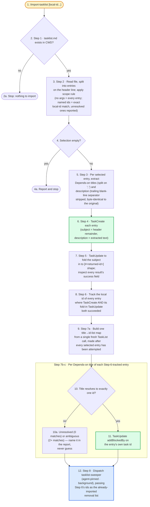

# import-tasklist — flow overview

Human-facing overview for auditing the flow at a glance. Non-authoritative — the numbered steps in [`../SKILL.md`](../SKILL.md) win on any conflict. Regenerate this file whenever the skill's flow changes.

Two renderings of the same flow, kept cross-checkable on purpose. The `# N` comments in the pseudo-code are the diagram's node ids, so an id with no matching comment is drift.

## Pseudo-code

Python-shaped for readability only; nothing here runs, and the function names stand for steps this skill performs, not real APIs.

```python
# 1 · Entry: /import-tasklist [local-id...]
def import_tasklist(local_ids):
    if not exists("tasklist.md"):                           # 2
        return stop("nothing to import")                    # 2a

    # 3 · Step 2 — split on the "### <id>. [" header line;
    #     no args = every entry, named ids = exact local-id match
    #     (an unresolved name is skipped and reported, not an error).
    entries = apply_scope_rule(split_entries(read("tasklist.md")), local_ids)
    if not entries:                                          # 4
        return stop("nothing selected")                      # 4a

    for e in entries:
        # 5 · Step 3 — Depends-on titles split on "; "; description
        #     captured verbatim with the one trailing blank-line
        #     separator stripped off, byte-identical to the original.
        e.depends_on, e.description = extract_fields(e)

        e.task_id = task_create(e.subject_header, e.description)   # 6 · Step 4

        # 7 · Step 5 — fold the subject in to "[#<id>]"; inspect
        #     success rather than trusting a thrown error alone.
        e.fold_ok = task_update(e.task_id, subject=folded(e)).success

    # 8 · Step 6 — only entries where BOTH calls succeeded are
    #     eligible for step 7's resolution and step 8's removal list.
    tracked = [e for e in entries if e.task_id and e.fold_ok]

    # 9 · Step 7a — one fresh TaskList call, made after every entry
    #     was attempted, already covers this batch's own new tasks.
    title_to_ids = build_title_map(task_list())

    for e in tracked:
        for title in e.depends_on:                          # 10 · once per title
            ids = title_to_ids.get(title, [])
            if len(ids) != 1:                                # 10
                report_unresolved(e, title, ids)              # 10a · 0 = gone, 2+ = ambiguous
                continue
            task_update(e.task_id, add_blocked_by=ids[0])    # 11

    # 12 · Step 8 — spawn once, passing step 6's successful ids
    #     as the already-imported removal list.
    dispatch("tasklist-sweeper", background=True,
             remove=[e.local_id for e in tracked])

    return report(tracked, entries)
```

## Flowchart


