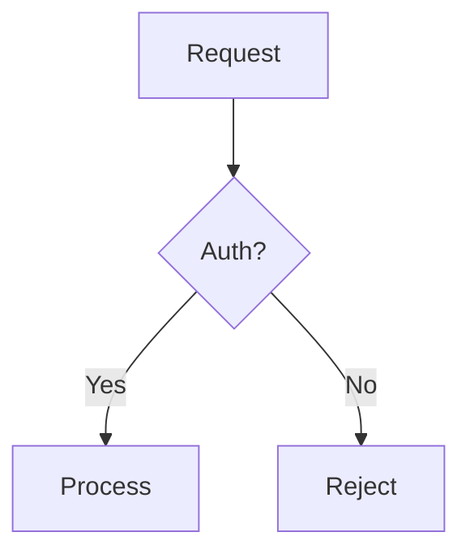

# Mermaid ASCII Diagrams

Guidelines for rendering Mermaid diagrams as terminal-friendly text art.

## When to Use

- Architecture overviews (component relationships, system boundaries)
- Data flow and processing pipelines
- State machines and lifecycle transitions
- Sequence diagrams (API call flows, message exchanges)

## Tools

### render-ascii-mermaid (terminal text output)

Renders Mermaid to Unicode box-drawing art. Use for inline terminal display during conversations.

```bash
printf 'flowchart LR\n  A --> B --> C' | render-ascii-mermaid
render-ascii-mermaid diagram.mmd
```

### compile-mermaid (PNG output)

Renders Mermaid to PNG files. Use for documentation, exports, and sharing.

```bash
compile-mermaid diagram.mmd
```

## Supported Diagram Types

- **Flowchart**: `flowchart LR` / `graph TD` -- architecture, decision trees
- **Sequence**: `sequenceDiagram` -- API calls, message flows
- **State**: `stateDiagram-v2` -- lifecycle, status transitions
- **Class**: `classDiagram` -- domain models, type relationships
- **ER**: `erDiagram` -- data models, entity relationships

## Syntax Requirements

- Use **multi-line** format (one node/edge per line). Single-line semicolon syntax is not supported.
- Use **spaces around arrows**: `A --> B`, not `A-->B`.
- Use only **standard node shapes**: `[text]` (box), `{text}` (diamond), `(text)` (rounded). Special shapes like `[/text/]` (parallelogram), `[[text]]` (subroutine), `[(text)]` (cylinder) are silently rendered as regular boxes.

```
# Good
flowchart LR
  A[Start] --> B{Decision} --> C(End)

# Bad -- will fail or render incorrectly
flowchart LR; A-->B-->C

# Bad -- special shapes degrade to regular boxes
A[/parallelogram/] --> B[(cylinder)]
```

## Usage in spec.md / plan.md

Include both the Mermaid source (for tooling/re-rendering) and the rendered ASCII output (for immediate readability):

````markdown


```
┌───────────┐
│           │
│  Request  │
│           │
└─────┬─────┘
      │
      ▼
◇──────────◇
│          │
│  Auth?   ├────┐
│          │    │
◇─────┬────◇   No
      │        │
     Yes       │
      │        │
      ▼        ▼
┌─────────┐ ┌────────┐
│ Process │ │ Reject │
└─────────┘ └────────┘
```
````

Generate the ASCII block by piping the Mermaid source through `render-ascii-mermaid`.

## Usage in Terminal

Render inline for immediate visual feedback:

```bash
printf 'sequenceDiagram\n  Alice ->> Bob: Hello\n  Bob -->> Alice: Hi' | render-ascii-mermaid
```

## Guidelines

- Keep diagrams concise -- terminals have limited width (~120 chars)
- Complex diagrams with many nodes work better as PNG (`compile-mermaid`)
- Use `render-ascii-mermaid` for quick sketches and inline explanations
- Use `compile-mermaid` for polished diagrams in docs and exports
