# C4L1 Context Diagram

Shows the system under design and its external actors. Keep it high-level — no internal implementation details. Use `flowchart TD` with clear node shapes to distinguish actors from systems.

## Edge incidence — only edges touching the focal system

[Instruction] In a C4L1 with focal subject X, only show edges whose source OR target is X.

Don't draw inter-third-party arrows for "completeness" — they belong in a wider ecosystem diagram or in L2.

[Why] L1's purpose is X's contract with its surroundings. Inter-third-party edges misrepresent that focus and clutter the diagram with information that doesn't decide anything about X.

[Examples] If a Hub posts orders directly to OMS (bypassing X), don't draw `Hub --> OMS` in X's L1 — drop the arrow even though the relationship exists.

Annotate it inside the Hub's node label if context-critical.

## Abstraction level — roles, not fields

[Instruction] L1 talks about ROLES (orders, invoices, sync, fan-out). L2 talks about specific containers/objects/fields. Don't leak L2 detail into L1.

[Why] L1 is the role-level story (who plays what part); L2 zooms into the specific machinery. Leaking field names buries the role under noise the reader can't act on at this level.

[Examples] Bad (L2 detail in L1): `Integrator --> ERP: reads sales agreements, branches, carriers, segments, payment-info`. Good (L1 role-level): `Integrator --> ERP: reads sales agreements and products`.

## Uniform pattern when N entities play the same role

[Instruction] When N entities share a role, use the SAME edge labels for the common pattern; append per-instance deltas only where they truly differ.

[Why] Uniformity is itself information — it tells the reader "these all play the same role" at a glance.

Bespoke labels per entity force the reader to read each label and *infer* the shared role.

[Examples] Four ERPs (Protheus SAS/SAE/IS + SAP1 NSE) all play the "1.0 ERP" role.

Uniform skeleton: `Integrator --> <ERP>: reads Acordos and Produtos; syncs Escolas and Produtos`.

Append per-brand deltas only where they apply (SAS adds `+ envia Pedidos e dispara NFs`; NSE adds `+ envia Devoluções`).

## Full worked example — strangler-fig migration context (validated)

A real C4L1 (the Integrador as anti-corruption layer between Arco 1.0 and 2.0). It realizes every rule above and adds four techniques worth reusing. Validated with `mmdc` before inclusion.

[Instruction] **Focal system = one rich, self-documenting node, visually dominant.** Put its mission + responsibilities *inside the label* and give it a distinct `classDef` (thick border) so the eye lands there first.

[Why] In L1 the focal system's contract IS the diagram. A bare `["Integrador"]` box forces the reader to reconstruct its role from the surrounding arrows; a self-documenting node states it outright.

[Instruction] **Subgraph per environment / tenant / lifecycle-group, not per arbitrary cluster.** Group third-party systems by the business unit or migration cohort they belong to (here: SAS, SAE, IS, NSE, Arco 2.0).

[Why] The grouping is itself information — it tells the reader which systems share a lifecycle and will be retired together. 18 scattered boxes become 5 legible clusters.

[Instruction] **Encode migration direction with color AND state the convention in a `%%` comment.** Legacy clusters red, modern target green, plus a comment naming the scheme.

[Why] Color carries the strangler-fig story; the comment means the next reader never has to guess what red/green mean. An unexplained color forces readers to infer semantics they can't verify.

[Instruction] **A bypass that skips the focal system goes in a node label, not as an arrow.** Configurador's label notes "envia Remessas B2C direto ao OMS" rather than drawing `config --> OMS`.

[Why] Preserves edge-incidence (every arrow touches the focal system) while still recording the bypass fact where it's relevant. The arrow would clutter; the annotation informs.

```mermaid
%%{init: {"flowchart": {"defaultRenderer": "elk"}}}%%
flowchart LR
Integrator["<b>Integrador</b><br/>fachada de estrangulamento entre Arco 1.0 e 2.0;<br/>camada anti-corrupção;<br/>encolhe conforme 1.0 desidrata.<br/><br/><b>Responsabilidades:</b><br/>- Publica upserts de Acordos e Produtos (ERPs 1.0 e 4MDG → OMS, Configurador, Meu Arco B2B)<br/>- Sincroniza Escolas (CRM → ERPs 1.0, filtrando por marca contratada)<br/>- Roteamento de Pedidos de Lojas 1.0 e Isaac 2.0 → OMS (B2B push, B2C push, B2B polling de PDPs)<br/>- Faturamento de Pedidos/Remessas/Devoluções de Lojas 2.0 em ERPs 1.0 (OMS → ERPs 1.0; notifica NF de volta ao OMS)<br/>- Cancelamentos<br/>- Expõe API de Erros (consumida pelo Painel de Erros e pelo módulo Admin B2B)"]:::system

subgraph SAS["SAS 1.0"]
pSAS["Protheus SAS<br/>ERP<br/>(Fonte da Verdade: Acordo de Vendas)"]
eskolareSAS["Eskolare SAS<br/>Loja B2C"]
pdpSAS["Plataforma de Pedidos SAS<br/>Loja B2B"]
end

subgraph SAE["SAE 1.0"]
pSAE["Protheus SAE<br/>ERP<br/>(Fonte da Verdade: Acordo de Vendas)"]
magento["Magento SAE<br/>Loja B2C (sem cross-sell)"]
eskolare["Eskolare SAE<br/>Loja B2C (com cross-sell)"]
pdp["Plataforma de Pedidos SAE<br/>Loja B2B"]
end

subgraph IS["IS 1.0"]
pIS["Protheus IS<br/>ERP<br/>(Fonte da Verdade: Acordo de Vendas)"]
magentoIS["Magento IS<br/>Loja B2C"]
lojaB2B1["Loja B2B 1.0"]
end

subgraph NSE["NSE 1.0"]
sap1["SAP1<br/>ERP NSE<br/>(Fonte da Verdade: Acordo de Vendas)"]
end

subgraph Modern["Arco 2.0"]
sfCRM["Salesforce CRM<br/>(Fonte da Verdade: Escolas, RFs)"]
sfOMS["Salesforce OMS<br/>gestão de pedidos B2B e B2C<br/>(Fonte da Verdade: Pedidos, Remessas e Devoluções)"]
mdg["4MDG<br/>(Fonte da Verdade: Produtos — Kits e Avulsos)"]
sap4["SAP4 — ERP 2.0<br/>(Fonte da Verdade: Notas Fiscais)"]
tms["TMS 2.0<br/>(Fonte da Verdade: Transportadoras)"]
wms["WMS 2.0<br/>Warehouse Manager"]
hubB2B["Meu Arco B2B 2.0<br/>Loja B2B NSE (inclui módulo Admin B2B)"]
config["Salesforce Configurador<br/>Admin B2C 2.0<br/>(envia Remessas B2C direto ao OMS, sem passar pelo Integrador)"]
isaac["Meu Arco B2C (Isaac)<br/>Loja B2C SAS e SAE"]
errorsUI["Painel de Erros<br/>UI de investigação de erros (Integrador e OMS)"]
end

viacep["ViaCEP<br/>API pública na internet<br/>consulta de CEPs"]

%% Painel de erros consome a API de Erros do Integrador
errorsUI -->|"consulta API de Erros"| Integrator

%% SAS 1.0 — padrão ERP unificado + ciclo de pedido/NF próprio do SAS
Integrator -->|"lê Acordos e Produtos; sincroniza Escolas e Produtos; envia Pedidos e dispara NFs"| pSAS
pSAS -->|"notifica NF emitida"| Integrator
eskolareSAS -->|"envia pedidos B2C"| Integrator
Integrator -->|"notifica NF emitida e erros de pedido"| eskolareSAS
Integrator -->|"consulta pedidos B2B e remessas B2C; notifica NF emitida"| pdpSAS

%% SAE 1.0 — ERP só faz padrão unificado (pedido/NF SAE vai pelo OMS)
Integrator -->|"lê Acordos e Produtos; sincroniza Escolas e Produtos"| pSAE
magento -->|"envia pedidos B2C"| Integrator
Integrator -->|"notifica erros de pedido"| magento
eskolare -->|"envia pedidos B2C"| Integrator
Integrator -->|"notifica NF emitida e erros de pedido"| eskolare
Integrator -->|"consulta pedidos B2B e remessas B2C; notifica NF emitida"| pdp

%% IS 1.0
Integrator -->|"lê Acordos e Produtos; sincroniza Escolas e Produtos; envia Pedidos"| pIS
pIS -->|"notifica mudanças em Acordo de Venda"| Integrator
magentoIS -->|"envia pedidos B2C"| Integrator
Integrator -->|"notifica erros de pedido"| magentoIS
Integrator -->|"consulta pedidos B2B e remessas B2C; notifica NF emitida"| lojaB2B1

%% NSE 1.0 (polling por cron, sem webhooks)
Integrator -->|"lê Acordos e Produtos; sincroniza Escolas e Produtos; envia Pedidos e Devoluções; lê notificações de NF"| sap1

%% Arco 2.0 — apenas edges que tocam o Integrador
sfCRM -->|"publica eventos de upsert de Escolas (por marca contratada)"| Integrator
Integrator -->|"lê Escolas e marcas contratadas por cada Escola"| sfCRM
mdg -->|"publica eventos de upsert de Produtos (info geral; preço/desconto/quantidade vêm do Acordo)"| Integrator
sfOMS -->|"envia Pedidos, Remessas e Devoluções (B2B/B2C) e notificações de NF — para Lojas 2.0 cuja fatura é emitida em ERP 1.0"| Integrator
Integrator -->|"publica eventos de upsert de Acordos e Produtos; envia Pedidos; notifica NF emitida"| sfOMS
Integrator -->|"publica eventos de upsert de Acordos e Produtos"| config
Integrator -->|"publica eventos de upsert de Acordos e Produtos"| hubB2B
hubB2B -->|"lê erros de pedidos via módulo Admin B2B"| Integrator
isaac -->|"envia pedidos B2C"| Integrator

%% Utilitário externo (API pública)
Integrator -->|"consulta CEPs"| viacep

classDef system fill:#dbeafe,stroke:#1d4ed8,stroke-width:3px

%% Coloração strangler-fig: 1.0 legado (sendo estrangulado) em vermelho; 2.0 moderno (alvo) em verde
style SAS fill:#fee2e2,stroke:#dc2626,stroke-width:2px
style SAE fill:#fee2e2,stroke:#dc2626,stroke-width:2px
style IS fill:#fee2e2,stroke:#dc2626,stroke-width:2px
style NSE fill:#fee2e2,stroke:#dc2626,stroke-width:2px
style Modern fill:#d1fae5,stroke:#059669,stroke-width:2px
```

[Examples] It also realizes the rules above:

- **edge-incidence** — every arrow touches Integrador; the Configurador bypass lives in a label.
- **uniform pattern** — the 4 ERPs share one skeleton label, deltas appended per brand.
- **bidirectional handshakes** — drawn as two role-labeled edges (request out, notification back).
- **ELK renderer** — for a subgraph-heavy layout.
