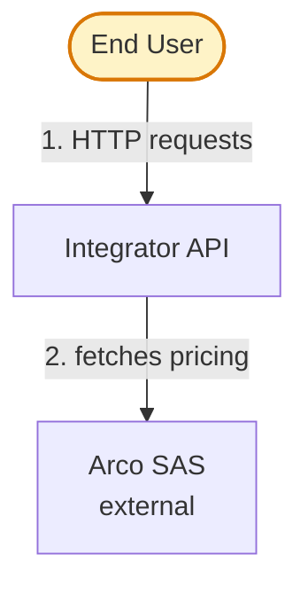

# C4L1 Context Diagram

Shows the system under design and its external actors. Keep it high-level — no internal implementation details. Use `flowchart TD` with clear node shapes to distinguish actors from systems.

## Edge incidence — only edges touching the focal system

[Instruction] In a C4L1 with focal subject X, only show edges whose source OR target is X.

Don't draw inter-third-party arrows for "completeness" — they belong in a wider ecosystem diagram or in L2.

[Why] L1's purpose is X's contract with its surroundings. Inter-third-party edges misrepresent that focus and clutter the diagram with information that doesn't decide anything about X.

[Example] If a Hub posts orders directly to OMS (bypassing X), don't draw `Hub --> OMS` in X's L1 — drop the arrow even though the relationship exists.

Annotate it inside the Hub's node label if context-critical.

## Abstraction level — roles, not fields

[Instruction] L1 talks about ROLES (orders, invoices, sync, fan-out). L2 talks about specific containers/objects/fields. Don't leak L2 detail into L1.

[Why] L1 is the role-level story (who plays what part); L2 zooms into the specific machinery. Leaking field names buries the role under noise the reader can't act on at this level.

[Example] Bad (L2 detail in L1): `Integrator --> ERP: reads sales agreements, branches, carriers, segments, payment-info`. Good (L1 role-level): `Integrator --> ERP: reads sales agreements and products`.

## Uniform pattern when N entities play the same role

[Instruction] When N entities share a role, use the SAME edge labels for the common pattern; append per-instance deltas only where they truly differ.

[Why] Uniformity is itself information — it tells the reader "these all play the same role" at a glance.

Bespoke labels per entity force the reader to read each label and *infer* the shared role.

[Example] Four ERPs (Protheus SAS/SAE/IS + SAP1 NSE) all play the "1.0 ERP" role.

Uniform skeleton: `Integrator --> <ERP>: reads Acordos and Produtos; syncs Escolas and Produtos`.

Append per-brand deltas only where they apply (SAS adds `+ envia Pedidos e dispara NFs`; NSE adds `+ envia Devoluções`).

## Worked example lives in a sibling file

A validated real-world C4L1 — the Integrador as anti-corruption layer across a strangler-fig migration — is in [`diagram-c4l1-strangler-fig-example.md`](diagram-c4l1-strangler-fig-example.md).

It realizes every rule above and adds four techniques for busier diagrams.

Those are: a self-documenting focal node, and subgraphs grouped by environment or cohort.

Plus: migration direction encoded as color with a `%%` comment explaining it, and a bypass recorded in a node label instead of an arrow.

Read it only when the diagram has many third-party systems or a legacy-vs-target split; the rules above suffice for a simple one.
