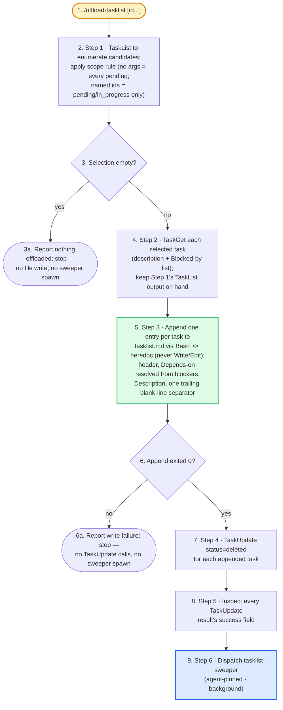

# offload-tasklist — flow overview

Human-facing overview for auditing the flow at a glance. Non-authoritative — the numbered steps in [`../SKILL.md`](../SKILL.md) win on any conflict. Regenerate this file whenever the skill's flow changes.

Two renderings of the same flow, kept cross-checkable on purpose. The `# N` comments in the pseudo-code are the diagram's node ids, so an id with no matching comment is drift.

## Pseudo-code

Python-shaped for readability only; nothing here runs, and the function names stand for steps this skill performs, not real APIs.

```python
# 1 · Entry: /offload-tasklist [id...]
def offload_tasklist(ids):
    # 2 · Step 1 — no args = every pending task (in_progress left
    #     alone); named ids = exactly those, drawn from pending or
    #     in_progress. A named id that doesn't resolve is excluded here.
    selected = apply_scope_rule(task_list(), ids)
    if not selected:                                        # 3
        return stop("nothing offloaded")                    # 3a · no file write, no sweeper

    # 4 · Step 2 — TaskGet each selected task for its description
    #     and "Blocked by: #<id>[, #<id>...]" line; keep this
    #     TaskList snapshot on hand to resolve blocker ids to titles.
    entries = [task_get(t) for t in selected]

    # 5 · Step 3 — append via a Bash >> heredoc, never Write/Edit
    #     (Write would clobber entries this skill never read).
    #     Depends-on titles resolve from each Blocked-by id against
    #     the Step-1 snapshot; provisional local ids start at 1.
    exit_code = append_entries("tasklist.md", entries)
    if exit_code != 0:                                      # 6
        return stop("append failed")                        # 6a · no TaskUpdate, no sweeper

    # 7 · Step 4 — delete every appended task now that its entry landed.
    results = [task_update(t.id, status="deleted") for t in selected]

    # 8 · Step 5 — inspect success on every result; watching only
    #     for a thrown error would miss a well-formed delete that
    #     still failed.
    failures = [r for r in results if not r.success]

    # 9 · Step 6 — spawn regardless of whether every delete succeeded.
    dispatch("tasklist-sweeper", background=True)

    return report(len(selected), failures)
```

## Flowchart


