---
# performance-check budget overrides, not part of the diagram itself.
# This file's size is fixed by the number of steps the skill actually has, and
# it renders each step twice — once as pseudo-code, once as a diagram node — so
# trimming to the bundled defaults would drop steps from the flow audit or drop
# a whole rendering. Two renderings is the point: they cross-check each other.
# Parked in assets/ and never loaded by the model, so its words cost no context.
words-budget: 2048
lines-budget: 256
---

# parallel-worktrees — flow overview

Human-facing overview for auditing the flow at a glance. Non-authoritative — the prose in [`../SKILL.md`](../SKILL.md) wins on any conflict. Regenerate this file whenever the skill's flow changes.

Two renderings of the same flow, kept cross-checkable on purpose. The `# N` comments in the pseudo-code are the diagram's node ids, so an id with no matching comment is drift.

## Pseudo-code

Python-shaped for readability only; nothing here is runnable, and the function names stand for orchestrator actions, not real APIs.

```python
# 1 · Entry: a caller loads this skill holding 2+ dispatchable items.
#     Four inputs and no others. Every extra one would be a precondition the
#     next caller has to satisfy before it could reuse any of this.
def parallel_worktrees(candidates, files_by_item, base_sha, slug):

    # 2 · Dependency satisfaction encodes ORDERING, never shared files, so two
    #     items the caller called independent can still edit one file and
    #     collide at merge-back. Keep the lowest id of any overlapping pair.
    wave = drop_pairwise_file_overlaps(candidates, files_by_item)

    # 3 · A --ff-only merge refuses to overwrite a locally-modified file, so an
    #     item touching one would halt the very merge-back it was meant to
    #     make cheap. Drop it now rather than discover it at 12c.
    wave = drop_items_touching(wave, git("status", "--porcelain"))

    # 4 · Past 4 the worktrees contend for one disk and one test runner: the
    #     wall-clock curve flattens while the merge queue keeps growing.
    wave = wave[:4]

    if len(wave) < 2:                                      # 5
        # 5a · A worktree exists ONLY to keep concurrent siblings off one
        #      index. With fewer than two there are none, so create nothing
        #      and let the caller dispatch in its main tree as usual.
        return HandBack(wave)

    for item in wave:
        # 6 · Off base_sha, NOT HEAD: one common base is what makes 12's
        #     ascending-id merge order deterministic.
        git("worktree", "add", "-b", f"parallel/{slug}/t{item.id}",
            f"/tmp/parallel-wt/{slug}/t{item.id}", base_sha)

        # 7 · That checkout carries TRACKED files only, so every untracked
        #     artifact the agent must read is brought in by hand. Symlink, so
        #     an append in one tree is visible in the others; .env* is copied
        #     instead, being worktree-local by design and never shared state.
        symlink_into(item.worktree, caller.untracked_shared_artifacts)
        copy_into(item.worktree, glob(".env*"))

        # 8 · BEFORE the spawn, never after. This mark is the only thing
        #     stopping a later round from dispatching the same item into a
        #     second worktree. A caller with no ledger has no guard to write:
        #     it dispatches once and runs no top-up round at 9a.
        caller.ledger.mark_in_flight(item, branch=item.branch,
                                     worktree_path=item.path)

    # 9 · ONE message for the whole set, so they run concurrently. One message
    #     per agent serializes the fan-out and gives back the wall-clock the
    #     worktrees just bought. Each prompt adds two fields to whatever the
    #     caller already pushes per item: the worktree path, and the branch.
    reports = dispatch_all_in_one_message(
        [(caller.agent, item, cwd=item.worktree) for item in wave])

    # 9a · Advisory, for a caller that re-queries eligibility mid-wave: use a
    #      query that accounts for in-flight items. One that assumes nothing is
    #      in flight reads a wave-in-progress as a stalled run. Anything it
    #      returns must clear 2 and 3 against the LIVE siblings' files too.

    while not caller.accepted_all(wave):                    # 10, 11
        # 11a · A failure or block is that item's alone: it re-dispatches into
        #       its OWN worktree while its siblings keep working. The caller's
        #       acceptance check, retry rule and chain-abort all apply here
        #       exactly as they would in a sequential run.
        wait_for_next_report()

    # 12 · ASCENDING id, one at a time. That order is the whole reason the
    #      resulting history is indistinguishable from a sequential run's:
    #      the same commits, in the same order, on one line.
    for item in sorted(wave, key=lambda i: int(i.id)):
        # 12a · INSIDE the worktree: git refuses to rebase a branch that is
        #       checked out elsewhere. Rebase every branch, including the
        #       first, where it is a no-op — a uniform two-step has no
        #       special case left to get wrong.
        if not git("-C", item.worktree, "rebase", caller.base_branch):   # 12b
            # 12b1 · A conflict means predicate 2 or 3 was wrong for that
            #        pair. Preserving the work is what lets a human resolve
            #        it; guessing would bury what actually collided.
            git("-C", item.worktree, "rebase", "--abort")
            raise CallerHalt(item.branch)   # cleanup stops entirely below

        git("merge", "--ff-only", item.branch)              # 12c
        # 12d · Per merge, never batched to the end of the wave. git branch -d
        #       refuses an unmerged branch, so the delete cannot outrun the
        #       merge that made it safe.
        git("worktree", "remove", item.worktree)
        git("branch", "-d", item.branch)

    # 13 · Back to the caller. A worktree the caller made for its own reasons
    #      was never touched here: it may exist for a human to review, so it
    #      has to outlive the run. The ones above are the opposite — per-item,
    #      commits already on the branch, and no human was meant to open one.
    return Done()
```

## Flowchart

```mermaid
flowchart TD
  n1["1. A caller loads this skill holding 2+ dispatchable items,<br/>passing four inputs and no others: the candidate ids, one<br/>Files list per candidate, the base SHA every worktree branches<br/>from, and a slug unique to the run. Each extra input would be<br/>one more precondition the next caller has to satisfy"]:::start

  n2["2. Drop pairwise file overlaps, keeping the lowest id of each<br/>colliding pair: dependency satisfaction encodes ORDERING,<br/>never shared files, so two items the caller called independent<br/>can still edit one file and collide at merge-back"]
  n3["3. Drop any item touching a path in git status --porcelain:<br/>a --ff-only merge refuses to overwrite a locally-modified<br/>file, so that item would halt the merge-back it was<br/>supposed to make cheap"]
  n4["4. Cap the survivors at 4 — past that the worktrees contend<br/>for one disk and one test runner, so the wall-clock curve<br/>flattens while the merge queue keeps growing"]

  n5{"5. Are 2 or more left?"}
  n5a["5a. Hand the set back and create NOTHING. A worktree exists<br/>only to keep concurrent siblings off one index, and below<br/>two there are none: the caller dispatches in its main tree"]

  subgraph perItem["Per item in the set — the whole loop runs before any agent is spawned, so the ledger is complete when the fan-out goes out"]
    direction TB
    n6["6. git worktree add -b parallel/&lt;slug&gt;/t&lt;id&gt; off the base SHA<br/>rather than HEAD: one common base is what makes 12's<br/>ascending-id merge order deterministic"]
    n7["7. Symlink every untracked artifact the agent must read into<br/>the worktree — the checkout carries tracked files only — and<br/>COPY any .env*, which is worktree-local by design. A symlink<br/>keeps one file; a copy would drift on the next append"]:::state
    n8["8. Mark the item in-flight in the CALLER's ledger, with its<br/>branch and worktree path — BEFORE the spawn, never after.<br/>That mark is the only thing stopping a later round from<br/>dispatching the same item into a second worktree"]:::state
  end

  n9["9. Dispatch the whole set in ONE message, each agent pointed at<br/>its own worktree. One message per agent serializes the fan-out<br/>and gives back the wall-clock the worktrees just bought"]:::dispatch
  n9a["9a. Advisory for a caller re-querying eligibility mid-wave:<br/>use a query that accounts for in-flight items, or a<br/>wave-in-progress reads as a stalled run. Anything it<br/>returns must clear 2 and 3 against the LIVE siblings too"]

  n10["10. The caller runs its OWN acceptance check, per report,<br/>as each one lands"]
  n11{"11. Has every item in the set been accepted?"}
  n11a["11a. Keep waiting. A failure or block is that item's alone:<br/>it re-dispatches into its OWN worktree while its siblings<br/>keep working, and the caller's retry and chain-abort<br/>rules apply exactly as in a sequential run"]

  n12{"12. Any accepted branch still unmerged? Take them in<br/>ASCENDING id order — that order is the whole reason<br/>the resulting history is indistinguishable from a<br/>sequential run's: same commits, same order, one line"}
  n12a["12a. git -C &lt;worktree&gt; rebase &lt;base-branch&gt; — INSIDE the<br/>worktree, since git refuses to rebase a branch checked out<br/>elsewhere. Rebase even the first, where it is a no-op: a<br/>uniform two-step has no special case left to get wrong"]
  n12b{"12b. Did the rebase apply cleanly?"}
  n12b1["12b1. git rebase --abort, leave that worktree AND branch<br/>untouched, then halt down the caller's own halt path naming<br/>the branch. Cleanup stops entirely on the way out: these<br/>branches hold work only a human can resolve"]:::gate
  n12c["12c. git merge --ff-only &lt;branch&gt; in the main tree"]
  n12d["12d. git worktree remove + git branch -d, per merge and never<br/>batched to the end of the wave. git branch -d refuses an<br/>unmerged branch, so the delete cannot outrun the merge"]:::state

  n13["13. Back to the caller. A worktree the caller made for its own<br/>reasons was never touched: it may exist for a human to review,<br/>so it outlives the run. The ones above are the opposite —<br/>per-item, commits already on the branch, never opened"]

  n1 --> n2 --> n3 --> n4 --> n5
  n5 -->|"fewer than 2"| n5a
  n5 -->|"2 or more"| n6 --> n7 --> n8 --> n9
  n9 -.->|"advises"| n9a
  n9 --> n10 --> n11
  n11 -->|"not yet"| n11a --> n10
  n11 -->|"yes"| n12
  n12 -->|"yes"| n12a --> n12b
  n12b -->|"no — conflict"| n12b1
  n12b -->|"yes"| n12c --> n12d --> n12
  n12 -->|"no — all merged"| n13

classDef start fill:#fef3c7,stroke:#d97706,stroke-width:2px
classDef gate fill:#fee2e2,stroke:#dc2626,stroke-width:2px
classDef dispatch fill:#dbeafe,stroke:#2563eb,stroke-width:2px
classDef state fill:#dcfce7,stroke:#16a34a,stroke-width:2px
classDef skill fill:#f3e8ff,stroke:#9333ea,stroke-width:2px
classDef hook fill:#e5e7eb,stroke:#4b5563,stroke-width:2px
```


