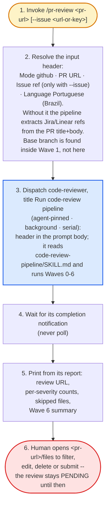

# pr-review — flow overview

Human-facing overview for auditing the flow at a glance. Non-authoritative — the steps in [`../SKILL.md`](../SKILL.md) win on any conflict. Regenerate this file whenever the skill's flow changes.

Two renderings of the same flow, kept cross-checkable on purpose. The `# N` comments in the pseudo-code are the diagram's node ids, so an id with no matching comment is drift.

The pipeline's own waves are collapsed into the dispatch node; they live in `../../code-review-pipeline/assets/flowchart.md`.

## Pseudo-code

Python-shaped for readability only; nothing here runs, and the function names stand for steps this skill performs, not real APIs.

```python
def pr_review(pr_url, issue_ref=None):                        # 1
    # 2 · the input header the pipeline parses; base branch is
    #     discovered inside its Wave 1, never resolved here
    header = {
        "Mode": "github",
        "PR URL": pr_url,
        "Issue ref": issue_ref,  # only when --issue was passed; replaces title/body extraction
        "Language": "Portuguese (Brazil)",
    }

    # 3 · one background orchestrator runs Waves 0-6; the diff, rubrics
    #     and findings never enter this session's context
    agent = dispatch("code-reviewer", title="Run code-review pipeline",
                     prompt=header + "read code-review-pipeline/SKILL.md "
                                     "and orchestrate every wave from there")

    report = await_completion_notification(agent)              # 4

    # 5 · everything printed comes from the orchestrator's one-line-per-item
    #     report, never from re-reading its work dir
    print(report.review_url, report.per_severity_counts,
          report.skipped_files, report.wave6_summary)

    # 6 · submitting is the human's decision alone -- the review stays
    #     PENDING until they act on <pr-url>/files
    return "PENDING review posted; human filters, edits, deletes or submits"
```

## Flowchart


