---
# performance-check budget override, not part of the diagram itself.
# This file renders one flow twice — once as pseudo-code, once as a diagram — so
# its size is fixed by the skill's step count, and trimming to the bundled default
# would drop steps from the flow audit or drop a whole rendering.
# Parked in assets/ and never loaded by the model, so its words cost no context.
words-budget: 2048
---

# quality-gate — flow overview

Human-facing overview for auditing the flow at a glance. Non-authoritative — the numbered steps in [`../SKILL.md`](../SKILL.md) win on any conflict. Regenerate this file whenever the skill's flow changes.

Two renderings of the same flow, kept cross-checkable on purpose. The `# N` comments in the pseudo-code are the diagram's node ids, so an id with no matching comment is drift.

## Pseudo-code

Python-shaped for readability only; nothing here runs, and the function names stand for steps this skill performs, not real APIs.

```python
# 1 · Entry: /quality-gate <spec> <plan> --tasks <ids> --auto-solve,
#     or another skill's batch-end dispatch.
def quality_gate(arg):
    auto_solve = arg.auto_solve
    if not auto_solve:                                     # 2
        # 2a · Step 1 — ONE question, asked before anything else,
        #      so nobody is surprised by commits.
        auto_solve = ask("report only (default), or auto-solve?")

    # 3 · Step 2 — arg paths by their spec_/plan_ prefix, else glob the CWD.
    specs, plans = resolve_spec_and_plan(arg)
    if len(specs) > 1 or len(plans) > 1:                   # 4
        specs, plans = ask_numbered_list(specs, plans)     # 4a · the user picks

    # 5 · Step 2 — from origin/HEAD, or the caller's base ref
    #     (/implement passes BATCH_BASE_SHA).
    BASE_BRANCH = arg.base_ref or git("symbolic-ref", "origin/HEAD")

    # ---- 6 · Step 3 — dispatch every leg in the SAME turn. Independent
    #      report-only passes, no ordering between them. Each leg IS the
    #      fresh-context reviewer, so none of them spawns a nested one. ----
    legs = dispatch_parallel("deep-reviewer", background=True, legs=[
        ("refactor",    "refactor/SKILL.md",    f"verdict_refactor_{ts}.md"),      # 6a
        ("auto-review", "auto-review/SKILL.md", f"verdict_auto-review_{ts}.md"),   # 6b
        # 6c · scoped by --tasks, and dispatched ONLY when a plan resolved.
        ("test-sdd",    "test-sdd/SKILL.md",    f"verdict_test-sdd_{ts}.md"),
    ] if plans else [...])
    # 6d · hook: deep-reviewer-write-guard — only verdict_*.md writes are approved.

    for leg in legs:                                       # 7 · Step 4
        if not present_and_non_empty(leg.verdict_path):
            redispatch_once(leg)                           # 7a
            if still_missing(leg):
                flag(leg)   # 7a · the other legs still stand
        # 7a · never report from a capped return message — always from the file

    if not auto_solve:                                     # 8
        # 8a · Step 5 — the compact index, one line per finding per leg, then STOP.
        #      Nothing is applied, however safe it looks.
        print(compact_index(legs))
        return                                             # 8a

    # 9 · Step 6.1 — read all three verdict files IN FULL, sort every finding
    #     addressable vs not, and print both lists with reasons BEFORE applying.
    addressable, not_addressable = sort_findings(read_in_full(legs))
    print(addressable, not_addressable)

    # 10 · Step 6.2 — seed the WHOLE TaskList upfront, before applying anything.
    #      The list is this run's entire timeline.
    for f in addressable:   # 10a · in execution order, breadcrumbed apply → commit → [Done]
        TaskCreate(f"[Task] {f.title}", metadata={"steps": "apply → commit → mark [Done]"})
    TaskCreate("[Reminder] Step 7: the closing report")   # 10b · a compaction cannot drop it

    # ---- Step 6.3 — one finding at a time, SERIAL.
    #      Two agents on overlapping scope would conflict unseen. ----
    while True:
        f = next_addressable()
        TaskUpdate(f.task, status="in_progress")           # 11

        match f.lens:                                      # 12
            case "refactor":
                # 12a · agent-pinned, given the scope + test command.
                #       It refuses behavior changes by design.
                dispatch("refactor", scope=f.scope, test_cmd=f.test_cmd)
            case "auto-review" | "test-sdd":
                # 12b · agent-pinned; the test goes RED before it goes GREEN.
                dispatch("tdd-coder", finding=f)

        # 13 · verify against the ARTIFACTS — the diff and the test output,
        #      never the agent's summary.
        applied_clean = verify(git_diff(), test_output())  # 13

        if not applied_clean:                              # 14
            # 14a · leave the entry open and the finding unmarked,
            #       recording what it needs to retry.
            record_failure(f, needs=...)
        else:
            # 15 · tdd-coder already committed, so confirm the SHA. The refactor
            #      agent leaves its change uncommitted, so commit it HERE, in
            #      session, where the permission prompt can render.
            sha = confirm_sha(f) if f.lens != "refactor" else commit_in_session(f)

            # 16 · mark it IMMEDIATELY as "### N. [Done][SEVERITY] title".
            #      Batching this would leave a killed session with fixes and no ledger.
            f.verdict_file.mark_done(f)
            TaskUpdate(f.task, status="completed")         # 17

        if not any_addressable_left():                     # 18
            break

    # 19 · Step 7 — close with the report: the three verdict paths, applied
    #      findings with SHAs, findings judged not addressable with reasons,
    #      failed applies with their retry needs, and a note that unmarked
    #      findings are worked later by /address-verdicts.
    return report(...)
```

## Flowchart

```mermaid
flowchart TD
  n1(["1. /quality-gate &lt;spec&gt; &lt;plan&gt;<br/>--tasks &lt;ids&gt; --auto-solve<br/><br/>or another skill's batch-end dispatch"]):::start
  n2{"2. --auto-solve passed?"}
  n2a["2a. Step 1 · ONE question, before anything else:<br/>report only (default) or auto-solve?<br/>Asked first so no one is surprised by commits"]:::gate
  n3["3. Step 2 · Resolve spec + plan: arg paths by<br/>spec_/plan_ prefix, else glob CWD"]
  n4{"4. More than one spec, or more than one plan?"}
  n4a["4a. Prompt with a numbered list;<br/>the user picks which files feed the run"]:::gate
  n5["5. Step 2 · Resolve BASE_BRANCH from<br/>origin/HEAD, or take the caller's base ref<br/>(/implement passes BATCH_BASE_SHA)"]

  subgraph legs["6. Step 3 · Dispatch every leg in the SAME turn — independent report-only passes, no ordering between them. Each leg IS the fresh-context reviewer, so none spawns a nested one."]
    direction TB
    n6a["6a. deep-reviewer · reads refactor/SKILL.md<br/>(agent-pinned, background, ∥)<br/>→ verdict_refactor_&lt;ts&gt;.md"]:::dispatch
    n6b["6b. deep-reviewer · reads auto-review/SKILL.md<br/>(agent-pinned, background, ∥)<br/>→ verdict_auto-review_&lt;ts&gt;.md"]:::dispatch
    n6c["6c. deep-reviewer · reads test-sdd/SKILL.md,<br/>scoped by --tasks (agent-pinned, background, ∥)<br/>→ verdict_test-sdd_&lt;ts&gt;.md<br/>ONLY when a plan resolved"]:::dispatch
  end

  n6d["6d. Hook: deep-reviewer-write-guard<br/>(only verdict_*.md writes are approved)"]:::hook
  n7{"7. Step 4 · Each leg's verdict file<br/>present and non-empty?"}
  n7a["7a. Re-dispatch that leg ONCE; still missing,<br/>flag it and let the others stand.<br/>Never report from a capped return message"]:::dispatch
  n8{"8. Auto-solve chosen?"}
  n8a(["8a. Step 5 · Print the compact index — one line<br/>per finding, per leg — and STOP.<br/>Nothing is applied, however safe it looks"])
  n9["9. Step 6.1 · Read all three verdict files IN FULL;<br/>sort every finding addressable vs not;<br/>print both lists with reasons BEFORE applying"]

  subgraph seed["10. Step 6.2 · Seed the whole TaskList upfront, before applying anything — the list is this run's entire timeline"]
    direction TB
    n10a["10a. Add to TaskList one [Task] per addressable<br/>finding, in execution order, each breadcrumbed<br/>apply → commit → mark [Done]"]:::state
    n10b["10b. Add to TaskList a [Reminder] for Step 7:<br/>the closing report, so a compaction<br/>cannot drop the wrap-up"]:::state
    n10a --> n10b
  end

  subgraph apply["Step 6.3 · One finding at a time, SERIAL — two agents on overlapping scope would conflict unseen"]
    direction TB
    n11["11. TaskUpdate this finding's entry to in_progress"]:::state
    n12{"12. Which lens raised the finding?"}
    n12a["12a. Refactor lens → dispatch the refactor agent<br/>(agent-pinned) with the scope + test command.<br/>It refuses behavior changes by design"]:::dispatch
    n12b["12b. Auto-review or test-sdd lens → dispatch<br/>tdd-coder (agent-pinned): the test goes<br/>RED before it goes GREEN"]:::dispatch
    n13["13. Verify against the ARTIFACTS — the diff and the<br/>test output, never the agent's summary"]
    n14{"14. Applied clean?"}
    n14a["14a. Record the failure; leave the entry open<br/>and the finding unmarked, with what<br/>it needs to retry"]:::state
    n15["15. Commit: tdd-coder already committed, so confirm<br/>the SHA; the refactor agent leaves its change<br/>uncommitted, so commit it HERE, in session,<br/>where the permission prompt can render"]
    n16["16. Mark the finding [Done] in its verdict file<br/>IMMEDIATELY — ### N. [Done][SEVERITY] title.<br/>Batching it would leave a killed session<br/>with fixes and no ledger"]:::state
    n17["17. TaskUpdate this finding's entry to completed"]:::state
    n18{"18. Any addressable finding left?"}
  end

  n19(["19. Step 7 · Close with the report: the three verdict<br/>paths, applied findings with SHAs, findings judged<br/>not addressable with reasons, failed applies with<br/>their retry needs, and that unmarked findings<br/>are worked later by /address-verdicts"])

  n1 --> n2
  n2 -->|"no"| n2a --> n3
  n2 -->|"yes"| n3
  n3 --> n4
  n4 -->|"yes"| n4a --> n5
  n4 -->|"no"| n5
  n5 --> n6a
  n5 --> n6b
  n5 --> n6c
  n6a -.->|"guards"| n6d
  n6b -.->|"guards"| n6d
  n6c -.->|"guards"| n6d
  n6a --> n7
  n6b --> n7
  n6c --> n7
  n7 -->|"no"| n7a --> n8
  n7 -->|"yes"| n8
  n8 -->|"no"| n8a
  n8 -->|"yes"| n9 --> n10a
  n10b --> n11 --> n12
  n12 -->|"refactor"| n12a --> n13
  n12 -->|"correctness / missing test"| n12b --> n13
  n13 --> n14
  n14 -->|"no"| n14a --> n18
  n14 -->|"yes"| n15 --> n16 --> n17 --> n18
  n18 -->|"yes"| n11
  n18 -->|"no"| n19

  classDef start fill:#fef3c7,stroke:#d97706,stroke-width:2px
  classDef gate fill:#fee2e2,stroke:#dc2626,stroke-width:2px
  classDef dispatch fill:#dbeafe,stroke:#2563eb,stroke-width:2px
  classDef state fill:#dcfce7,stroke:#16a34a,stroke-width:2px
  classDef skill fill:#f3e8ff,stroke:#9333ea,stroke-width:2px
  classDef hook fill:#e5e7eb,stroke:#4b5563,stroke-width:2px
```


