---
# performance-check budget override, not part of the diagram itself.
# This file renders one flow twice — once as pseudo-code, once as a diagram — so
# its size is fixed by the skill's step count, and trimming to the bundled default
# would drop steps from the flow audit or drop a whole rendering.
# Parked in assets/ and never loaded by the model, so its words cost no context.
words-budget: 2048
---

# quality-gate — flow overview

Human-facing overview for auditing the flow at a glance. Non-authoritative — the numbered steps in [`../SKILL.md`](../SKILL.md) win on any conflict. Regenerate this file whenever the skill's flow changes.

Two renderings of the same flow, kept cross-checkable on purpose. The `# N` comments in the pseudo-code are the diagram's node ids, so an id with no matching comment is drift.

## Pseudo-code

Python-shaped for readability only; nothing here runs, and the function names stand for steps this skill performs, not real APIs.

```python
# 1 · Entry: /quality-gate <spec> <plan> --tasks <ids> --auto-solve,
#     or another skill's batch-end dispatch.
def quality_gate(arg):
    auto_solve = arg.auto_solve
    if not auto_solve:                                     # 2
        # 2a · Step 1 — ONE question, asked before anything else,
        #      so nobody is surprised by commits.
        auto_solve = ask("report only (default), or auto-solve?")

    # 3 · Step 2 — arg paths by their spec_/plan_ prefix, else glob the CWD.
    specs, plans = resolve_spec_and_plan(arg)
    if len(specs) > 1 or len(plans) > 1:                   # 4
        specs, plans = ask_numbered_list(specs, plans)     # 4a · the user picks

    # 5 · Step 2 — from origin/HEAD, or the caller's base ref
    #     (/implement passes BATCH_BASE_SHA).
    BASE_BRANCH = arg.base_ref or git("symbolic-ref", "origin/HEAD")

    # ---- 6 · Step 3 — dispatch every leg in the SAME turn. Independent
    #      report-only passes, no ordering between them. Each leg IS the
    #      fresh-context reviewer, so none of them spawns a nested one. ----
    legs = dispatch_parallel("deep-reviewer", background=True, legs=[
        ("refactor",    "refactor/SKILL.md",    f"verdict_refactor_{ts}.md"),      # 6a
        ("auto-review", "auto-review/SKILL.md", f"verdict_auto-review_{ts}.md"),   # 6b
        # 6c · scoped by --tasks, and dispatched ONLY when a plan resolved.
        ("test-sdd",    "test-sdd/SKILL.md",    f"verdict_test-sdd_{ts}.md"),
    ] if plans else [...])
    # 6d · hook: deep-reviewer-write-guard — only verdict_*.md writes are approved.

    for leg in legs:                                       # 7 · Step 4
        if not present_and_non_empty(leg.verdict_path):
            redispatch_once(leg)                           # 7a
            if still_missing(leg):
                flag(leg)   # 7a · the other legs still stand
        # 7a · never report from a capped return message — always from the file

    if not auto_solve:                                     # 8
        # 8a · Step 5 — the compact index, one line per finding per leg, then STOP.
        #      Nothing is applied, however safe it looks.
        print(compact_index(legs))
        return                                             # 8a

    # 9 · Step 6.1 — read all three verdict files IN FULL, sort every finding
    #     addressable vs not, and print both lists with reasons BEFORE applying.
    addressable, not_addressable = sort_findings(read_in_full(legs))
    print(addressable, not_addressable)

    # 10 · Step 6.2 — infer the repo's test command (a package.json script, a
    #      Makefile target, the repo's own CLAUDE.md) BEFORE delegating, so the
    #      callee has nothing left to guess about.
    test_cmd = resolve_test_command()

    # ---- 11 · Step 6.2 — APPLYING IS NOT THIS SKILL'S JOB. /address-verdicts is
    #      the one apply step for every verdict_*.md on disk; this skill only
    #      decides WHICH findings deserve a fix. Two copies of the loop would
    #      drift, leaving a human unable to tell which one their report followed.
    #
    #      Runs IN THIS SESSION rather than in a subagent, for the same two
    #      reasons /implement invokes this skill in its own main session:
    #        - it commits the refactor agent's work, and a permission prompt
    #          only renders in the main session;
    #        - its per-finding apply agents are already fresh-context subagents,
    #          so wrapping it spends the one nesting level on nothing. ----
    ledger = skill("address-verdicts",                     # 11
                   findings=explicit_ids(addressable),     # 11a · never a severity floor
                   no_ask=True,                            # 11b · nobody is standing by
                   test_cmd=test_cmd)                      # 11c · nothing left to infer
    # 11d · it owns the TaskList seeding, the lens routing, the per-finding
    #       verify, the commit, and the [Done] / APPLIED / SKIPPED annotation.

    # 12 · Step 7 — close from the RETURNED ledger, not a second read of the
    #      files: the verdict paths, applied findings with SHAs, findings 6.1
    #      judged not addressable, findings the callee skipped, failed applies,
    #      and that unmarked findings need a later human-answered run.
    return report(ledger)
```

## Flowchart

```mermaid
flowchart TD
  n1(["1. /quality-gate &lt;spec&gt; &lt;plan&gt;<br/>--tasks &lt;ids&gt; --auto-solve<br/><br/>or another skill's batch-end dispatch"]):::start
  n2{"2. --auto-solve passed?"}
  n2a["2a. Step 1 · ONE question, before anything else:<br/>report only (default) or auto-solve?<br/>Asked first so no one is surprised by commits"]:::gate
  n3["3. Step 2 · Resolve spec + plan: arg paths by<br/>spec_/plan_ prefix, else glob CWD"]
  n4{"4. More than one spec, or more than one plan?"}
  n4a["4a. Prompt with a numbered list;<br/>the user picks which files feed the run"]:::gate
  n5["5. Step 2 · Resolve BASE_BRANCH from<br/>origin/HEAD, or take the caller's base ref<br/>(/implement passes BATCH_BASE_SHA)"]

  subgraph legs["6. Step 3 · Dispatch every leg in the SAME turn — independent report-only passes, no ordering between them. Each leg IS the fresh-context reviewer, so none spawns a nested one."]
    direction TB
    n6a["6a. deep-reviewer · reads refactor/SKILL.md<br/>(agent-pinned, background, ∥)<br/>→ verdict_refactor_&lt;ts&gt;.md"]:::dispatch
    n6b["6b. deep-reviewer · reads auto-review/SKILL.md<br/>(agent-pinned, background, ∥)<br/>→ verdict_auto-review_&lt;ts&gt;.md"]:::dispatch
    n6c["6c. deep-reviewer · reads test-sdd/SKILL.md,<br/>scoped by --tasks (agent-pinned, background, ∥)<br/>→ verdict_test-sdd_&lt;ts&gt;.md<br/>ONLY when a plan resolved"]:::dispatch
  end

  n6d["6d. Hook: deep-reviewer-write-guard<br/>(only verdict_*.md writes are approved)"]:::hook
  n7{"7. Step 4 · Each leg's verdict file<br/>present and non-empty?"}
  n7a["7a. Re-dispatch that leg ONCE; still missing,<br/>flag it and let the others stand.<br/>Never report from a capped return message"]:::dispatch
  n8{"8. Auto-solve chosen?"}
  n8a(["8a. Step 5 · Print the compact index — one line<br/>per finding, per leg — and STOP.<br/>Nothing is applied, however safe it looks"])
  n9["9. Step 6.1 · Read all three verdict files IN FULL;<br/>sort every finding addressable vs not;<br/>print both lists with reasons BEFORE applying"]

  n10["10. Step 6.2 · Resolve the repo's test command<br/>(package.json script, Makefile target, its CLAUDE.md)<br/>so the callee has nothing left to guess about"]

  subgraph delegate["11. Step 6.2 · Applying is NOT this skill's job — /address-verdicts is the one apply step for every verdict_*.md on disk. Two copies of the loop would drift, leaving a human unable to tell which one their report followed."]
    direction TB
    n11["11. Invoke /address-verdicts IN THIS SESSION,<br/>never wrapped in a subagent:<br/>it commits the refactor agent's work and permission<br/>prompts render only in the main session; and its apply<br/>agents are already fresh-context subagents, so wrapping<br/>it spends the one nesting level on nothing"]:::skill
    n11a["11a. Pass the accepted findings as EXPLICIT ids,<br/>never a severity floor — nothing re-derives<br/>the triage and quietly widens the scope"]
    n11b["11b. Pass --no-ask: an auto-solve run has no human<br/>standing by, and a prompt mid-batch would stall<br/>an /implement tail indefinitely"]:::gate
    n11c["11c. Pass --test-cmd, so its own inference<br/>step has nothing left to guess"]
    n11d["11d. It owns the TaskList seeding, the lens routing,<br/>the per-finding verify, the commit, and the<br/>[Done] / APPLIED / SKIPPED annotation"]:::state
    n11 --> n11a --> n11b --> n11c --> n11d
  end

  n12(["12. Step 7 · Close from the RETURNED ledger, not a<br/>second read of the files: verdict paths, applied<br/>findings with SHAs, findings 6.1 judged not<br/>addressable, findings the callee skipped, failed<br/>applies, and that unmarked findings need<br/>a later human-answered run"])

  n1 --> n2
  n2 -->|"no"| n2a --> n3
  n2 -->|"yes"| n3
  n3 --> n4
  n4 -->|"yes"| n4a --> n5
  n4 -->|"no"| n5
  n5 --> n6a
  n5 --> n6b
  n5 --> n6c
  n6a -.->|"guards"| n6d
  n6b -.->|"guards"| n6d
  n6c -.->|"guards"| n6d
  n6a --> n7
  n6b --> n7
  n6c --> n7
  n7 -->|"no"| n7a --> n8
  n7 -->|"yes"| n8
  n8 -->|"no"| n8a
  n8 -->|"yes"| n9 --> n10 --> n11
  n11d --> n12

  classDef start fill:#fef3c7,stroke:#d97706,stroke-width:2px
  classDef gate fill:#fee2e2,stroke:#dc2626,stroke-width:2px
  classDef dispatch fill:#dbeafe,stroke:#2563eb,stroke-width:2px
  classDef state fill:#dcfce7,stroke:#16a34a,stroke-width:2px
  classDef skill fill:#f3e8ff,stroke:#9333ea,stroke-width:2px
  classDef hook fill:#e5e7eb,stroke:#4b5563,stroke-width:2px
```


