---
# performance-check budget override, not part of the diagram itself.
# This file renders one flow twice — once as pseudo-code, once as a diagram — so
# its size is fixed by the skill's step count, and trimming to the bundled default
# would drop steps from the flow audit or drop a whole rendering.
# Parked in assets/ and never loaded by the model, so its words cost no context.
words-budget: 2048
---

# quality-gate — flow overview

Human-facing overview for auditing the flow at a glance. Non-authoritative — the numbered steps in [`../SKILL.md`](../SKILL.md) win on any conflict. Regenerate this file whenever the skill's flow changes.

Two renderings of the same flow, kept cross-checkable on purpose. The `# N` comments in the pseudo-code are the diagram's node ids, so an id with no matching comment is drift.

## Pseudo-code

Python-shaped for readability only; nothing here runs, and the function names stand for steps this skill performs, not real APIs.

```python
# 1 · Entry: /quality-gate <spec> <plan> --tasks <ids>
#     --base-ref <ref> --auto-solve | --report-only, or
#     another skill's batch-end dispatch.
def quality_gate(arg):
    if arg.auto_solve and arg.report_only:                  # 2 · both flags passed?
        halt("--auto-solve and --report-only are a contradiction")  # 2a · STOP — not a precedence puzzle
        return

    # A flag on the command line means this run was dispatched by another
    # skill, so nobody is standing by to answer a prompt (used at 5x and 7x).
    flag_passed = arg.auto_solve or arg.report_only

    if flag_passed:                                          # 3 · either flag passed?
        mode = "auto-solve" if arg.auto_solve else "report-only"
    else:
        # 3a · Step 1 — ONE question, before anything else, so nobody is
        #      surprised by commits. Covers the refactor and auto-review
        #      lenses ONLY — test-sdd is outside it, applied on every run
        #      that dispatches that leg regardless of the answer (§5.1).
        mode = ask("report only (default), or auto-solve?")

    # 4 · Step 2 — arg paths by their spec_/plan_ prefix, else glob the CWD.
    specs, plans = resolve_spec_and_plan(arg)
    if len(specs) > 1 or len(plans) > 1:                     # 5 · multi-match?
        if flag_passed:                                      # 5x · nobody standing by?
            # 5a · Nobody is standing by, so a prompt would stall a
            #      batch-end caller forever. Drop the multi-matched
            #      kind and say so, exactly as a zero match resolves.
            specs, plans = drop_multi_matched_kind(specs, plans)
        else:
            specs, plans = ask_numbered_list(specs, plans)   # 5b · §1 already asked, so a human stands by

    # 6 · Step 2 — from --base-ref when the caller passed one
    #     (/implement's batch-end tail passes BATCH_BASE_SHA that
    #     way), else resolve-base-ref.sh: origin/HEAD, then local
    #     main, then local master.
    BASE_REF = arg.base_ref or sh("~/.claude/scripts/resolve-base-ref.sh")
    if base_ref_detection_failed(BASE_REF):                  # 7 · detection failed?
        if flag_passed:                                      # 7x · nobody standing by?
            halt("base ref detection failed")                # 7a · no safe default the way a missing spec has
            return
        BASE_REF = ask("which branch to diff against?")      # 7b · ask which branch

    # ---- 8 · Step 3 — dispatch every leg in the SAME turn. Independent
    #      report-only passes, no ordering between them. Each leg IS the
    #      fresh-context reviewer, so none of them spawns a nested one. ----
    legs = dispatch_parallel("deep-reviewer", background=True, legs=[
        ("refactor",    "refactor/SKILL.md",    f"verdict_refactor_{ts}.md"),      # 8a · leg dispatch
        ("auto-review", "auto-review/SKILL.md", f"verdict_auto-review_{ts}.md"),   # 8b · leg dispatch
        # 8c · scoped by --tasks, and dispatched ONLY when a plan resolved.
        ("test-sdd",    "test-sdd/SKILL.md",    f"verdict_test-sdd_{ts}.md"),
    ] if plans else [...])
    # 8d · hook: deep-reviewer-write-guard — approves verdict_*.md and
    #      verdict_*.html, AND any write under /tmp; everything else denied.
    #      Each leg is told the /tmp half too: a leg believing only
    #      verdict_* is writable skips the $work_dir persistence its
    #      compaction-resume depends on.

    for leg in legs:                                         # 9 · Step 4
        if not present_and_non_empty(leg.verdict_path):
            redispatch_once(leg)                             # 9a
            if still_missing(leg):
                flag(leg)   # 9a · the other legs still stand
        # 9a · never report from a capped return message — always from the file

    # ---- 10 · Step 5 — assemble the apply list. Compose the whole list
    #      before invoking or printing anything; the two groups below enter
    #      on different terms. ----
    apply_list = []
    if plans and present_and_non_empty(test_sdd_leg.verdict_path):
        # 10a · Step 5.1 — every test-sdd finding enters unconditionally,
        #       on a report-only run exactly as on an auto-solve one. No
        #       triage runs: the plan already declared the test, and the
        #       human already approved the plan.
        apply_list += read_in_full(test_sdd_leg.verdict_path)

    if mode == "auto-solve":                                 # 10b · Step 5.2
        # 10b2 · Read BOTH verdict files IN FULL, never the legs' return
        #        summaries; sort every finding addressable vs not;
        #        print both lists with reasons BEFORE applying.
        addressable, not_addressable = sort_findings(
            read_in_full(refactor_leg.verdict_path),
            read_in_full(auto_review_leg.verdict_path),
        )
        print(addressable, not_addressable)
        apply_list += addressable
    else:
        # 10b1 · Report-only — neither lens contributes anything, including
        #        findings that look trivially safe. The opt-in came from
        #        §1, and its absence is an answer.
        pass

    if not apply_list:                                       # 11 · apply list empty?
        # a report-only run that resolved no plan has nothing to apply —
        # skip §6 entirely and close straight from what this run resolved.
        return report(ledger=None)

    # ---- 12 · Step 6 — hand the WHOLE apply list to /address-verdicts in
    #      ONE invocation, never one call per lens. APPLYING IS NOT THIS
    #      SKILL'S JOB — that skill is the one apply step for every
    #      verdict_*.md on disk; this skill only decides WHICH findings
    #      deserve a fix. Runs IN THIS SESSION rather than in a subagent:
    #      it commits the refactor agent's work (permission prompts only
    #      render in the main session), and its per-finding apply agents
    #      are already fresh-context subagents, so wrapping it would spend
    #      one of three nesting levels on a layer that decides nothing. ----
    test_cmd = resolve_test_command()                        # 12a · nothing left for the callee to guess
    ledger = skill("address-verdicts",                       # 12b · invoked in this session
                   findings=apply_list,                       # 12c · explicit ids, never a severity floor
                   no_ask=True,                                # 12d · nobody is standing by, on either mode
                   test_cmd=test_cmd)                          # 12e · nothing left to infer
    # 12f · it owns the TaskList seeding, the lens routing, the per-finding
    #       verify, the commit, and the [Done] / APPLIED / SKIPPED annotation.

    # 13 · Step 7 — close with a report: every verdict path (+ any leg that
    #      failed to produce one), applied findings with SHAs, §5.2's
    #      not-addressable findings, /address-verdicts' skipped/failed
    #      findings, and — on a report-only run — every refactor and
    #      auto-review finding listed under a heading naming them as NEVER
    #      TRIAGED, closing with the two ways to work them: /address-verdicts,
    #      or a re-run as /quality-gate --auto-solve.
    return report(ledger)
```

## Flowchart

```mermaid
flowchart TD
  n1(["1. /quality-gate &lt;spec&gt; &lt;plan&gt;<br/>--tasks &lt;ids&gt; --base-ref &lt;ref&gt;<br/>--auto-solve | --report-only<br/><br/>or another skill's batch-end dispatch"]):::start
  n2{"2. Both --auto-solve and<br/>--report-only passed?"}
  n2a(["2a. STOP — contradiction, not a<br/>precedence puzzle. Print and halt."])
  n3{"3. Either --auto-solve or<br/>--report-only passed?"}
  n3a["3a. Step 1 · ONE question, before anything else:<br/>report only (default) or auto-solve?<br/>Covers the refactor and auto-review lenses ONLY —<br/>test-sdd is outside it, applied on every run that<br/>dispatches that leg regardless of the answer (§5.1)"]:::gate
  n4["4. Step 2 · Resolve spec + plan: arg paths by<br/>spec_/plan_ prefix, else glob CWD"]
  n5{"5. More than one spec, or more than one plan?"}
  n5x{"5x. Either flag passed on the<br/>command line? (nobody standing by)"}
  n5a["5a. Drop the multi-matched kind and say so,<br/>exactly as a zero match resolves.<br/>A prompt here would stall a batch-end caller forever"]
  n5b["5b. Prompt with a numbered list;<br/>the user picks which files feed the run.<br/>§1 already asked, so a human stands by"]:::gate
  n6["6. Step 2 · Resolve BASE_REF from --base-ref when the<br/>caller passed one (/implement's batch-end tail passes<br/>BATCH_BASE_SHA that way), else resolve-base-ref.sh:<br/>origin/HEAD, then local main, then local master"]
  n7{"7. Base ref detection failed<br/>(none of the three found)?"}
  n7x{"7x. Either flag passed on the<br/>command line? (nobody standing by)"}
  n7a(["7a. STOP the run and print what failed —<br/>no safe default the way a missing spec has"])
  n7b["7b. Ask which branch to diff against"]:::gate

  subgraph legs["8. Step 3 · Dispatch every leg in the SAME turn — independent report-only passes, no ordering between them. Each leg IS the fresh-context reviewer, so none spawns a nested one."]
    direction TB
    n8a["8a. deep-reviewer · reads refactor/SKILL.md<br/>(agent-pinned, background, ∥)<br/>→ verdict_refactor_&lt;ts&gt;.md"]:::dispatch
    n8b["8b. deep-reviewer · reads auto-review/SKILL.md<br/>(agent-pinned, background, ∥)<br/>→ verdict_auto-review_&lt;ts&gt;.md"]:::dispatch
    n8c["8c. deep-reviewer · reads test-sdd/SKILL.md,<br/>scoped by --tasks (agent-pinned, background, ∥)<br/>→ verdict_test-sdd_&lt;ts&gt;.md<br/>ONLY when a plan resolved"]:::dispatch
  end

  n8d["8d. Hook: deep-reviewer-write-guard — approves verdict_*.md<br/>and verdict_*.html, AND any write under /tmp; else denied.<br/>Each leg is told the /tmp half too: a leg believing only<br/>verdict_* is writable skips the $work_dir persistence<br/>its compaction-resume depends on"]:::hook
  n9{"9. Step 4 · Each leg's verdict file<br/>present and non-empty?"}
  n9a["9a. Re-dispatch that leg ONCE; still missing,<br/>flag it and let the others stand.<br/>Never report from a capped return message"]:::dispatch

  subgraph applylist["10. Step 5 · Assemble the apply list — compose the whole list before invoking or printing anything. The two groups below enter on different terms."]
    direction TB
    n10a["10a. Step 5.1 · Every test-sdd finding enters the apply<br/>list UNCONDITIONALLY, whenever that leg was dispatched<br/>(a plan resolved) and its verdict file is non-empty —<br/>report-only exactly as auto-solve. No triage: the plan<br/>already declared it, the human already approved the plan"]
    n10b{"10b. Step 5.2 · Mode == auto-solve?"}
    n10b1["10b1. Report-only — neither lens contributes anything,<br/>including trivially-safe findings.<br/>The opt-in came from §1; its absence is an answer"]
    n10b2["10b2. Auto-solve — read BOTH verdict files IN FULL, never<br/>the legs' return summaries; sort every finding addressable<br/>vs not; print both lists with reasons BEFORE applying"]
    n10a --> n10b
    n10b -->|"report-only"| n10b1
    n10b -->|"auto-solve"| n10b2
  end

  n11{"11. Step 6 · Apply list empty?"}

  subgraph delegate["12. Step 6 · Hand the WHOLE apply list to /address-verdicts in ONE invocation — never one call per lens. Applying is NOT this skill's job: that skill is the one apply step for every verdict_*.md on disk; this skill only decides WHICH findings deserve a fix."]
    direction TB
    n12a["12a. Resolve the repo's test command<br/>(package.json script, Makefile target, its CLAUDE.md)<br/>so the callee has nothing left to guess about"]
    n12b["12b. Invoke /address-verdicts IN THIS SESSION,<br/>never wrapped in a subagent: it commits the refactor<br/>agent's work and permission prompts render only in the<br/>main session; and its apply agents are already<br/>fresh-context subagents, so wrapping it spends one of<br/>three nesting levels on nothing"]:::skill
    n12c["12c. Pass the apply list as EXPLICIT ids,<br/>never a severity floor — nothing re-derives<br/>the triage and quietly widens the scope"]
    n12d["12d. Pass --no-ask: nobody is standing by,<br/>on either mode, and a prompt mid-batch would<br/>stall a batch-end caller indefinitely"]:::gate
    n12e["12e. Pass --test-cmd, so its own inference<br/>step has nothing left to guess"]
    n12f["12f. It owns the TaskList seeding, the lens routing,<br/>the per-finding verify, the commit, and the<br/>[Done] / APPLIED / SKIPPED annotation"]:::state
    n12a --> n12b --> n12c --> n12d --> n12e --> n12f
  end

  n13(["13. Step 7 · Close with a report: every verdict path<br/>(+ any leg that failed), applied findings with SHAs,<br/>§5.2's not-addressable findings, /address-verdicts'<br/>skipped/failed findings, and — on a report-only run —<br/>every refactor/auto-review finding under a heading<br/>naming them NEVER TRIAGED, closing with the two ways<br/>to work them: /address-verdicts, or a re-run as<br/>/quality-gate --auto-solve"])

  n1 --> n2
  n2 -->|"yes"| n2a
  n2 -->|"no"| n3
  n3 -->|"yes"| n4
  n3 -->|"no"| n3a --> n4
  n4 --> n5
  n5 -->|"no"| n6
  n5 -->|"yes"| n5x
  n5x -->|"yes"| n5a --> n6
  n5x -->|"no"| n5b --> n6
  n6 --> n7
  n7 -->|"no"| n8a
  n7 -->|"no"| n8b
  n7 -->|"no"| n8c
  n7 -->|"yes"| n7x
  n7x -->|"yes"| n7a
  n7x -->|"no"| n7b
  n7b --> n8a
  n7b --> n8b
  n7b --> n8c
  n8a -.->|"guards"| n8d
  n8b -.->|"guards"| n8d
  n8c -.->|"guards"| n8d
  n8a --> n9
  n8b --> n9
  n8c --> n9
  n9 -->|"yes"| n10a
  n9 -->|"no"| n9a --> n10a
  n10b1 --> n11
  n10b2 --> n11
  n11 -->|"yes"| n13
  n11 -->|"no"| n12a
  n12f --> n13

  classDef start fill:#fef3c7,stroke:#d97706,stroke-width:2px
  classDef gate fill:#fee2e2,stroke:#dc2626,stroke-width:2px
  classDef dispatch fill:#dbeafe,stroke:#2563eb,stroke-width:2px
  classDef state fill:#dcfce7,stroke:#16a34a,stroke-width:2px
  classDef skill fill:#f3e8ff,stroke:#9333ea,stroke-width:2px
  classDef hook fill:#e5e7eb,stroke:#4b5563,stroke-width:2px
```


