# refactor — flow overview

Human-facing overview for auditing the flow at a glance. Non-authoritative — the numbered steps in [`../SKILL.md`](../SKILL.md) win on any conflict. Regenerate this file whenever the skill's flow changes.

Two renderings of the same flow, kept cross-checkable on purpose. The `# N` comments in the pseudo-code are the diagram's node ids, so an id with no matching comment is drift.

## Pseudo-code

Python-shaped for readability only; nothing here runs, and the function names stand for steps this skill performs, not real APIs.

```python
# 1 · Entry: /refactor, /refactor <path-or-glob>, or another
#     skill's dispatch (/implement's batch-end tail reaches
#     this lens through /quality-gate).
def refactor(arg):
    if arg.path_or_glob:                                   # 2
        targets = [arg.path_or_glob]                       # 2a
    else:
        # 2b · Unpushed commits. @{upstream} when the branch tracks
        #      a remote, else the repo default branch — all a fresh
        #      /implement branch has, its tail running before the
        #      first push.
        base = git("rev-parse", "@{upstream}") or sh(
            "~/.claude/scripts/resolve-base-ref.sh")
        unpushed = git("diff", "--name-only", f"{base}..HEAD")

        # 2c · Uncommitted (staged + unstaged), then untracked.
        uncommitted = git("diff", "--name-only", "HEAD")
        untracked = git("ls-files", "--others", "--exclude-standard")

        targets = dedup(unpushed + uncommitted + untracked)  # 2d

    if not targets:                                        # 3
        return inform_user_and_stop()                      # 3a

    # 4 · Step 2 — mint the report path BEFORE dispatching. CWD, never
    #     /tmp: the user reads it beside the diff in their editor. The
    #     verdict_ prefix is mandatory — the write guard denies every
    #     other basename at exit 2 — and it beats report_/findings_
    #     because the harness intercepts those before any hook runs.
    #     One file per invocation; never reuse a prior run's path.
    VERDICT_PATH = sh('date "+verdict_refactor_%Y-%m-%d_%H:%M.md"')

    # ---- 5 · Step 2 — dispatch the reviewer. Report-only by
    #      construction: subAgent=refactor would silently turn this
    #      into an editing leg, so it is never the one dispatched. ----
    agent = dispatch("deep-reviewer", background=True,      # 5
                     targets=targets,
                     # 5 · the prompt also carries the analysis
                     #     constraints and the per-finding schema
                     #     verbatim, plus write-only-to-VERDICT_PATH.
                     verdict_path=VERDICT_PATH)
    # 5a · hook: deep-reviewer-write-guard backs that contract at the
    #      tool layer, so stating it only saves a blocked-write attempt.

    while not present_and_non_empty(VERDICT_PATH):         # 6
        # 6a · The run failed. Re-invoke rather than proceeding from
        #      the return message, which is capped and WILL truncate
        #      a long finding list.
        agent = redispatch(agent)

    # 7 · Step 3 — read the file end-to-end. The return carries only a
    #     count, the path, and one title line per finding, by design.
    findings = read_in_full(VERDICT_PATH)

    # 8 · Step 3 — one line per finding: <file>:<lines> — <title>
    #     [classification, risk, effort]. No Before/After inline; the
    #     user already has the full file open.
    print(compact_index(findings))

    # 9 · Step 3 — name the report path and invite the user to open it.
    print(f"Full report: {VERDICT_PATH}")

    # 10 · STOP. This skill never applies a finding and never seeds
    #      apply-tasks. /address-verdicts globs verdict_refactor_*.md
    #      and routes each one to the refactor AGENT, which applies it
    #      under a test gate — the artifact written above is exactly
    #      what that skill consumes.
    return
```

## Flowchart

```mermaid
flowchart TD
  n1(["1. /refactor, or /refactor &lt;path-or-glob&gt;<br/><br/>or another skill's dispatch — /implement's<br/>batch-end tail arrives via /quality-gate"]):::start
  n2{"2. Was a path or glob passed?"}
  n2a["2a. Use the given path(s) directly<br/>as the target list"]
  n2b["2b. Unpushed commits: base = @{upstream} when the<br/>branch tracks a remote, else resolve-base-ref.sh<br/>— all a fresh /implement branch has, its tail<br/>running before the first push"]
  n2c["2c. Uncommitted (staged + unstaged) via<br/>git diff --name-only HEAD, then untracked via<br/>git ls-files --others --exclude-standard"]
  n2d["2d. Deduplicate and merge the three lists"]
  n3{"3. Any target files?"}
  n3a(["3a. Inform the user and stop"]):::gate
  n4["4. Step 2 · Mint VERDICT_PATH =<br/>date +verdict_refactor_&lt;ts&gt;.md, in CWD not /tmp<br/>— the user reads it beside the diff in their editor.<br/>The verdict_ prefix is mandatory: the write guard<br/>denies every other basename at exit 2, and it beats<br/>report_/findings_ because the harness intercepts<br/>those before any hook runs. One file per invocation"]:::state
  n5["5. Step 2 · Dispatch deep-reviewer<br/>(agent-pinned, background) — report-only by<br/>construction; subAgent=refactor would silently<br/>make this an editing leg.<br/>Prompt carries the target files, the analysis<br/>constraints and per-finding schema verbatim,<br/>and write-only-to-VERDICT_PATH"]:::dispatch
  n5a["5a. Hook: deep-reviewer-write-guard<br/>— backs the report-only contract at the tool layer"]:::hook
  n6{"6. VERDICT_PATH present and non-empty?"}
  n6a["6a. Treat the run as failed and re-invoke.<br/>Never proceed from the return message —<br/>it is capped and WILL truncate a long list"]:::dispatch
  n7["7. Step 3 · Read VERDICT_PATH end-to-end.<br/>The return carries only a count, the path, and<br/>one title line per finding, by design"]
  n8["8. Step 3 · Print the compact index — one line per<br/>finding: &lt;file&gt;:&lt;lines&gt; — &lt;title&gt;<br/>[classification, risk, effort].<br/>No Before/After; the user has the file open"]
  n9["9. Step 3 · Name the report path and invite<br/>the user to open it (tail -f or editor)"]
  n10(["10. STOP — report only. No finding is applied and<br/>no apply-task is seeded. /address-verdicts globs<br/>verdict_refactor_*.md and routes each finding to<br/>the refactor AGENT, which applies it under a<br/>test gate; this file is what that skill consumes"])

  n1 --> n2
  n2 -->|"yes"| n2a --> n3
  n2 -->|"no"| n2b --> n2c --> n2d --> n3
  n3 -->|"no"| n3a
  n3 -->|"yes"| n4
  n4 --> n5
  n5 -.->|"guards"| n5a
  n5 --> n6
  n6 -->|"no"| n6a --> n5
  n6 -->|"yes"| n7 --> n8 --> n9 --> n10

  classDef start fill:#fef3c7,stroke:#d97706,stroke-width:2px
  classDef gate fill:#fee2e2,stroke:#dc2626,stroke-width:2px
  classDef dispatch fill:#dbeafe,stroke:#2563eb,stroke-width:2px
  classDef state fill:#dcfce7,stroke:#16a34a,stroke-width:2px
  classDef skill fill:#f3e8ff,stroke:#9333ea,stroke-width:2px
  classDef hook fill:#e5e7eb,stroke:#4b5563,stroke-width:2px
```


