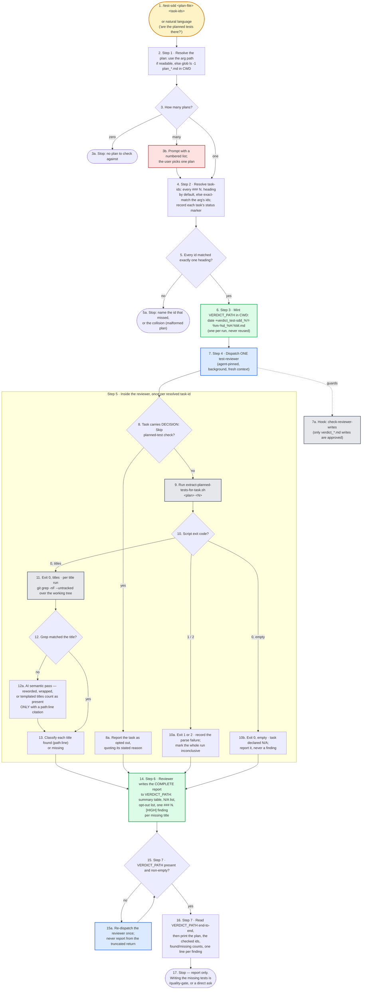

# test-sdd — flow overview

Human-facing overview for auditing the flow at a glance. Non-authoritative — the numbered steps in [`../SKILL.md`](../SKILL.md) win on any conflict. Regenerate this file whenever the skill's flow changes.

Two renderings of the same flow, kept cross-checkable on purpose. The `# N` comments in the pseudo-code are the diagram's node ids, so an id with no matching comment is drift.

## Pseudo-code

Python-shaped for readability only; nothing here runs, and the function names stand for steps this skill performs, not real APIs.

```python
# 1 · Entry: /test-sdd <plan-file> <task-ids>
#     or natural language ("are the planned tests there?").
def test_sdd(arg):
    plans = [read(arg.plan_file)] if readable(arg.plan_file) else glob("plan_*.md")  # 2 · Step 1
    if len(plans) == 0:                                    # 3
        return stop("no plan to check against")            # 3a
    plan = plans[0] if len(plans) == 1 else ask_user_to_pick(numbered(plans))   # 3b

    # 4 · Step 2 — every "### N." heading by default, else exact-match the arg's ids.
    tasks = resolve_task_ids(plan, arg.task_ids)
    for t in tasks:
        t.status_marker = plan.status_of(t)
    if not each_id_matched_exactly_one(tasks):             # 5
        return stop(the_id_that_missed_or_the_collision)   # 5a · a collision = malformed plan

    # 6 · Step 3 — minted in CWD, one per run, never reused.
    verdict_path = f"verdict_test-sdd_{now('%Y-%m-%d_%H:%M')}.md"

    # 7 · Step 4 — ONE test-reviewer, agent-pinned, background, fresh context.
    dispatch("test-reviewer", plan, tasks, verdict_path)
    # 7a · hook: check-reviewer-writes (only verdict_*.md writes are approved)

    # ---- 8–13 · Step 5 · inside the reviewer, once per resolved task-id ----
    for task in tasks:
        if task.carries_decision_skip:                     # 8
            report_opted_out(task, quoting=task.stated_reason)   # 8a
            continue

        titles, exit_code = extract_planned_tests_for_task(plan, task.id)   # 9
        if exit_code in (1, 2):                            # 10
            record_parse_failure(task)   # 10a · marks the WHOLE run inconclusive
            continue
        if not titles:                                     # exit 0, empty
            report_na(task)              # 10b · task declared N/A, never a finding
            continue

        for title in titles:             # 11 · exit 0 with titles
            hit = git_grep("-nF", "--untracked", title)     # over the working tree
            if not hit:                                    # 12
                # 12a · AI semantic pass — reworded, wrapped or templated titles
                #       count as present ONLY with a path:line citation.
                hit = semantic_pass(title, require="path:line")
            classify(title, found_at=hit)                  # 13 · found (path:line) or missing

    # 14 · Step 6 — the reviewer writes the COMPLETE report to VERDICT_PATH:
    #      summary table, N/A list, opt-out list, one "### N. [HIGH]" per missing title.
    reviewer.write(verdict_path)

    while not present_and_non_empty(verdict_path):         # 15 · Step 7
        redispatch_once("test-reviewer")   # 15a · never report from the truncated return

    read_end_to_end(verdict_path)                          # 16 · Step 7
    print(plan, checked_ids, found_and_missing_counts, one_line_per_finding)

    return  # 17 · Stop — report only. Writing the missing tests is
            #      /quality-gate, or a direct ask.
```

## Flowchart


