---
# performance-check budget override, not part of the diagram itself.
# This file renders one flow twice — once as pseudo-code, once as a diagram — so
# its size is fixed by the skill's step count, and trimming to the bundled default
# would drop steps from the flow audit or drop a whole rendering.
# Parked in assets/ and never loaded by the model, so its words cost no context.
words-budget: 2048
---

# usage-audit — flow overview

Human-facing overview for auditing the flow at a glance. Non-authoritative — the numbered steps in [`../SKILL.md`](../SKILL.md) win on any conflict. Regenerate this file whenever the skill's flow changes.

Two renderings of the same flow, kept cross-checkable on purpose. The `# N` comments in the pseudo-code are the diagram's node ids, so an id with no matching comment is drift.

## Pseudo-code

Python-shaped for readability only; nothing here runs, and the function names stand for steps this skill performs, not real APIs.

```python
# 1 · Entry: /usage-audit — takes no arguments.
def usage_audit(arg=None):
    if arg is not None:                                    # 2
        tell_user("the argument is ignored")               # 2a · then run the standard flow anyway

    # 3 · Step 0 — seed the TaskList BEFORE any script runs. A minutes-long
    #     backfill plus a multi-turn interview invites a mid-run compaction,
    #     and the TaskList is the only surface that survives one.
    TaskCreate("[Reminder] Step 1: find the last committed snapshot day")     # 3a
    TaskCreate("[Reminder] Step 2: backfill snapshots up to yesterday")       # 3b
    TaskCreate("[Reminder] Step 3: read the config-change ledger")            # 3c
    TaskCreate("[Reminder] Step 4: interview the user on inferred intents")   # 3d
    TaskCreate("[Reminder] Step 5: settle experiments, recommend closures")   # 3e
    TaskCreate("[Reminder] Step 6: build and open the viewer")                # 3f
    TaskCreate("[Reminder] Step 7: ask for new experiments, offer to commit") # 3g

    # 4 · Step 1 — the committed tail, NOT the newest file on disk.
    SINCE = last_line(git("ls-files", "usage-history/snapshots/"))
    UNTIL = yesterday()          # every later step reuses this one range

    if SINCE != UNTIL:                                     # 5
        # 5a · Step 2 — output saved to /tmp/usage-report.txt and read back from
        #      the file. The current day is never snapshotted.
        run("claude-usage-report.py --backfill --since", SINCE, to="/tmp/usage-report.txt")

    # 6 · Step 3 — the ONLY sanctioned way to read git history here.
    ledger = run("config-change-ledger.py --since", SINCE, "--until", UNTIL)

    # 7 · one candidate per commit or same-day cluster: the tweak, the surface it
    #     touched, the KPI it could move. model / advisorModel / effortLevel are
    #     hand-recorded, since those never commit.
    candidates = [draft_intent(c) for c in commits_or_same_day_clusters(ledger)]

    # 8 · Step 4 — ONE batched round, one question per candidate,
    #     each carrying your reading and your confidence.
    confirmed = ask_together([question_for(c) for c in candidates])

    for intent in confirmed:                               # 9
        if intent.is_incidental:
            experiments_md.note_confounder(intent)
        else:
            experiments_md.enacted.add(intent, commit_day=..., watch_signal=...)

    # 10 · Step 5 — every ## Enacted entry: before → after numbers with BOTH
    #      source day filenames, plus one recommendation per entry.
    for entry in experiments_md.enacted:
        present(entry, before, after, recommend=one_of("kept", "reverted", "keep watching"))
        if user_approves_closure(entry):                   # 11
            experiments_archive_md.move(entry)             # 11a · same edit that settles it
        # 11 · no → the watch window stays open

    for entry in experiments_md.enacted:                   # 12
        if not ledger.has_commit_for(entry):
            experiments_md.demote_to_proposed(entry)

    for commit in ledger.uncovered_by_any_entry():         # 13
        experiments_md.add_enacted(commit) or note_why_it_cannot_move_a_kpi(commit)

    # 14 · Step 6 — refresh the delivered-work denominator first; it cannot be
    #      re-derived later, so repeat any warning it prints.
    run("delivered-work-ledger.py --refresh")

    run("build-usage-viewer.py --open")   # 15 · Step 6 — viewer.html is gitignored

    # 16 · walk the user through the chart under "Reading the numbers":
    #      the main-vs-subagent split first, then the four known levers.
    walk_through(chart)

    ask("Any new experiments to note?")                    # 17 · Step 7

    # 18 · 1-3 hypotheses of your own, each backed by web search against
    #      current official sources.
    experiments_md.proposed.extend(web_backed_hypotheses(n=range(1, 4)))

    # 19 · advance ONE Open-questions backlog item: settle it with cited
    #      evidence, or promote it into an entry carrying a watch signal.
    advance_one(open_questions_backlog)

    offer("commit the new snapshots plus the experiments edits")   # 20
    if user_authorizes():                                  # 21
        commit_from_main_session()   # 21a · main is where the permission gate renders

    return  # 22 · Done
```

## Flowchart

```mermaid
flowchart TD
  n1(["1. /usage-audit — takes no arguments"]):::start
  n2{"2. An argument passed anyway?"}
  n2a["2a. Tell the user the argument is ignored,<br/>then run the standard flow"]

  subgraph n3 ["3. Step 0 · Seed the TaskList before any script runs —<br/>a minutes-long backfill plus a multi-turn interview invites a<br/>mid-run compaction, and only the TaskList survives one"]
    n3a["3a. Add [Reminder] Step 1: find the last committed snapshot day"]:::state
    n3b["3b. Add [Reminder] Step 2: backfill snapshots up to yesterday"]:::state
    n3c["3c. Add [Reminder] Step 3: read the config-change ledger"]:::state
    n3d["3d. Add [Reminder] Step 4: interview the user on inferred intents"]:::state
    n3e["3e. Add [Reminder] Step 5: settle experiments, recommend closures"]:::state
    n3f["3f. Add [Reminder] Step 6: build and open the viewer"]:::state
    n3g["3g. Add [Reminder] Step 7: ask for new experiments, offer to commit"]:::state
  end

  n4["4. Step 1 · git ls-files usage-history/snapshots/ | tail -1<br/>SINCE = that day (committed tail, not newest file on disk)<br/>UNTIL = yesterday; every later step reuses this range"]:::hook
  n5{"5. Is SINCE already yesterday?"}
  n5a["5a. Step 2 · claude-usage-report.py --backfill --since SINCE<br/>output saved to /tmp/usage-report.txt and read from the file;<br/>the current day is never snapshotted"]:::hook
  n6["6. Step 3 · config-change-ledger.py --since SINCE --until UNTIL<br/>(the only sanctioned way to read git history here)"]:::hook
  n7["7. Draft one candidate intent per commit or same-day cluster:<br/>the tweak, the surface it touched, the KPI it could move.<br/>Hand-record model / advisorModel / effortLevel, which never commit"]
  n8["8. Step 4 · Interview: ONE batched round, one question per<br/>candidate, each carrying your reading and your confidence"]:::gate
  n9["9. Write each confirmed intent into experiments.md ## Enacted<br/>with its commit day and watch signal;<br/>file an incidental tweak as a confounder note instead"]:::state
  n10["10. Step 5 · Present every ## Enacted entry: before → after<br/>numbers with both source day filenames, plus a recommendation —<br/>close as kept, close as reverted, or keep watching"]:::gate
  n11{"11. User approves a closure?"}
  n11a["11a. Move each closed entry to experiments-archive.md<br/>in the same edit that settles it"]:::state
  n12["12. Verify via the ledger that each ## Enacted entry has a commit;<br/>demote it to ## Proposed when none exists"]:::state
  n13["13. Catalogue any Step 3 commit no entry covers — new ## Enacted<br/>entry, or a note saying why it cannot move a KPI"]:::state
  n14["14. Step 6 · delivered-work-ledger.py --refresh<br/>(cannot be re-derived later; repeat any warning it prints)"]:::hook
  n15["15. Step 6 · build-usage-viewer.py --open<br/>(viewer.html is gitignored and never committed)"]:::hook
  n16["16. Walk the user through the chart under 'Reading the numbers':<br/>main-vs-subagent split first, then the four known levers"]
  n17["17. Step 7 · Ask the user outright for new experiments to note"]:::gate
  n18["18. Raise 1-3 hypotheses of your own, each backed by web search<br/>against current official sources; append under ## Proposed"]:::state
  n19["19. Advance one Open questions backlog item — settle it with cited<br/>evidence, or promote it into an entry with a watch signal"]:::state
  n20["20. Offer to commit the new snapshots plus the experiments edits"]:::gate
  n21{"21. User authorizes the commit?"}
  n21a["21a. Commit from the main session, where the permission gate renders"]
  n22(["22. Done"])

  n1 --> n2
  n2 -->|"yes"| n2a
  n2 -->|"no"| n3a
  n2a --> n3a
  n3a --> n3b
  n3b --> n3c
  n3c --> n3d
  n3d --> n3e
  n3e --> n3f
  n3f --> n3g
  n3g --> n4
  n4 --> n5
  n5 -->|"no, closed days are missing"| n5a
  n5 -->|"yes, nothing to snapshot"| n6
  n5a --> n6
  n6 --> n7
  n7 --> n8
  n8 --> n9
  n9 --> n10
  n10 --> n11
  n11 -->|"yes"| n11a
  n11 -->|"no, windows stay open"| n12
  n11a --> n12
  n12 --> n13
  n13 --> n14
  n14 --> n15
  n15 --> n16
  n16 --> n17
  n17 --> n18
  n18 --> n19
  n19 --> n20
  n20 --> n21
  n21 -->|"yes"| n21a
  n21 -->|"no"| n22
  n21a --> n22

  classDef start fill:#fef3c7,stroke:#d97706,stroke-width:2px
  classDef gate fill:#fee2e2,stroke:#dc2626,stroke-width:2px
  classDef dispatch fill:#dbeafe,stroke:#2563eb,stroke-width:2px
  classDef state fill:#dcfce7,stroke:#16a34a,stroke-width:2px
  classDef skill fill:#f3e8ff,stroke:#9333ea,stroke-width:2px
  classDef hook fill:#e5e7eb,stroke:#4b5563,stroke-width:2px
```


