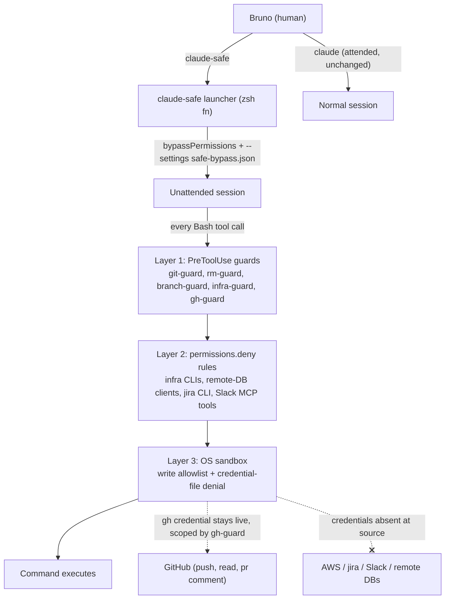

# Spec: Safe bypass-permissions profile (`claude-safe`)

**Bottom line — read first:**

- Build a `claude-safe` launcher that runs Claude Code under `bypassPermissions` inside three native guardrail layers — `permissions.deny` rules, PreToolUse guard hooks, and the OS-level sandbox.
  - Unattended sessions cannot mutate infra, remote DBs, protected branches, or files outside the workspace.

- The one decision to weigh: `gh pr comment` stays allowed under the profile (reversible, skill-driven) — the single outward-facing action an unattended agent can still take under Bruno's account.

- Scope boundary: this spec does NOT cover a container/devcontainer overnight tier (future opt-in), Auto Mode, or any non-native mechanism. It supersedes workflow-tasks.md tasks 5 and 15 entirely.

**Since your last review:**

- Bottom line: the decision-to-weigh is now the `gh pr comment` residual (Phase-2 residual was accepted).

- Background: credential strategy reframed from "mask everything" to "remove at source"; gh is the only credential that stays live.

- Context Diagram: Layer 2 label now includes jira CLI + Slack MCP; credential edge relabeled.

- Non-Functional Requirements: containment wording updated (credential absence + gh scoping); new requirement for the sudo-gated jira credential.

- Testable Acceptance Criteria: AC-2 and AC-8 reworded; new AC-18 (work-service tools blocked), AC-19 (gh scoped), AC-20 (jira credential absent by default); two checklist rows updated.

- Open Questions: all three resolved (no local k8s; per-service credential model; branch list confirmed) — section now empty.

- New requirement (mid-review): deletions must be git-recoverable — new AC-21 blocks deleting untracked/uncommitted or out-of-repo paths; this also fixes a hole in today's rm-guard.

- Functional Decisions: credential decision rewritten to the per-service absence model; kubectl confirmation noted on the infra decision; new deletion-recoverability decision.

---
## Background / Context

Bruno regularly works under bypass-permissions (`skipDangerousModePermissionPrompt` is already on) and wants low-attention/overnight runs. Auto Mode was rejected: Opus-only in practice for his setup, and it spends classifier tokens on every tool call.

Today's guardrails (`claude-git-guard.sh`, `claude-rm-guard.sh`) cover git-local destruction only. Nothing covers the actual worry list: infra CLIs (terraform/aws/kubectl/gcloud), non-local DBs, pushes to shared branches, deletions outside the workspace.

Verified native facts this design rests on (all from code.claude.com/docs):

- Deny rules apply in every mode, including `bypassPermissions` (permission-modes.md).

- PreToolUse hooks returning deny fire before the permission-mode check — they block even under `--dangerously-skip-permissions` (hooks-guide.md).

- The native sandbox (`sandbox` settings key; Seatbelt on macOS, bubblewrap on Linux) enforces filesystem write allowlists, network domain rules, and credential file/env denial+masking with `injectHosts`.
  - Combining it with bypass is documented as intended defense-in-depth (sandboxing.md).

- Managed settings (`/Library/Application Support/ClaudeCode/managed-settings.json`, root-owned; `/etc/claude-code/` on Linux) outrank user/project settings and CLI flags.
  - `allowManagedHooksOnly` stops any non-managed hook wiring (permissions.md, server-managed-settings.md).

The managed-settings facts answer old task 5's load-bearing open question (immutable hook wiring, human-only via sudo) natively — its bespoke `/etc/claude-autonomous-mode` + `/usr/local/sbin` toggle design is retired.

Its referenced spec file (`specs/spec-autonomous-mode-2026-06-14.md`) does not exist in the repo, so nothing is lost by superseding it.

Threat model (decided in interview): honest mistakes + evasion — a confused or prompt-injected agent that rephrases a blocked command (`sh -c`, script files, aliases).

Not full-adversarial; a deliberately self-modifying agent editing Phase-1 config is out of scope until Phase 2, and even then only the promoted subset is tamper-proof.

Credential strategy (decided in review round 2): remove credentials at the source instead of masking them.

- AWS: Bruno logs in via SSO and can log out — no session, no capability; the CLI is blocked under the profile anyway.

- jira: the static credential stops being default-exported in `.zshrc`; its file becomes unreadable to the agent; exporting it requires Bruno's password (sudo-gated helper). Lives partly in the `oh-my-zsh` repo.

- Slack: MCP-based; its tools are denied under the profile and the connector is disabled by default in attended sessions — re-enabling goes through the claude.ai OAuth flow (inherently human-interactive).

- GitHub: the one credential that must stay live (feat-branch pushes) — so it gets capability scoping at the guard layer instead: push (non-protected branches), read subcommands, and `gh pr comment` only.

---
## Goals and Success Metrics / KPIs

- Unattended bypass runs (e.g. fixing fragile tests overnight) complete without permission prompts and without any path to remote/destructive damage.

- Zero marginal token cost — every layer is deterministic (rules, regex, OS sandbox), no classifier.

- Attended daily sessions are untouched: plain `claude` behaves exactly as today.

- Success check: a destructive-command test matrix (see Acceptance Criteria) passes on macOS and Linux; each blocked class stays blocked in both plain and evasion-encoded form.

- workflow-tasks.md tasks 5 and 15 are removed, superseded by this shipped feature.

---
## Context Diagram

Layers 1–2 are string-matched (catch mistakes cheaply); Layer 3 is the evasion-proof backstop — a command that cannot authenticate or write outside the allowlist is harmless regardless of how it was spelled.

---
## User Stories

- As Bruno, I want one command (`claude-safe`) to start an unattended bypass session, so overnight work runs without prompts and without babysitting.

- As Bruno, I want destructive infra/DB/git actions blocked even when the agent rephrases the command, so a confused or injected agent cannot cause remote damage.

- As Bruno, I want my attended sessions unchanged, so daily work (including direct-to-master pushes in sole-maintainer repos) keeps its current flow.

- As Bruno, I want the stabilized ruleset promoted to a root-owned file only sudo can change, so the agent cannot edit away its own guardrails.

---
## Non-Functional and Technical Requirements

1. Native mechanisms only: deny rules, PreToolUse hooks, `sandbox` settings, managed settings. No third-party wrappers or MCP.

2. Cross-platform MUST: macOS (Seatbelt, `/Library/Application Support/ClaudeCode/`) and Linux (bubblewrap, `/etc/claude-code/`); path-based config carries both home-dir forms.

3. Guards: shellcheck-clean, self-contained bash, and fail-closed under the profile — a guard that cannot parse its input blocks (exit 2) instead of allowing.

4. The launcher fails closed: missing/unreadable `safe-bypass.json`, or a platform where the sandbox cannot start, aborts with a clear message — never silently degrades to plain bypass.

5. Network stays open (package managers, WebFetch/WebSearch, MCP) — containment comes from credential absence at the source plus gh capability scoping, not domain allowlists.

6. The jira credential moves to a sudo-gated export (root-readable file + helper function in `oh-my-zsh`); no shell exports it by default.

7. Everything versioned in `unix-utils/configs/ai-docs/claude/`, symlink-deployed and mirrored in `install.sh` (Phase 2 adds a sudo step there).

8. Zero marginal token cost at runtime.

---
## Testable Acceptance Criteria

#### Happy path

### AC-1: Launcher starts a guarded bypass session
- **When** Bruno runs `claude-safe`
- **Then** the session starts in `bypassPermissions` with the safe-bypass settings layer active (sandbox on, profile deny rules present, all four guards wired)

### AC-2: Feat-branch push works
- **Given** a repo on branch `feat/x` with remote `origin` on GitHub
- **When** the agent runs `git push origin feat/x`
- **Then** the push succeeds — the gh credential stays live; its scoping is the gh-guard, not credential removal

### AC-3: Package managers and web stay usable
- **When** the agent runs `npm install <pkg>` or a WebFetch
- **Then** both succeed without prompts

### AC-4: Local docker and localhost DBs stay usable
- **When** the agent starts a local container and connects to a localhost database
- **Then** both succeed

### AC-5: Attended sessions unchanged
- **When** Bruno runs plain `claude` (no profile)
- **Then** infra CLIs and protected-branch pushes behave exactly as today (existing guards only, normal permission flow)

#### Blocking behavior

### AC-6: Infra CLI mutation blocked
- **When** the agent runs `terraform apply` (or any `aws`/`gcloud`/`kubectl`/`terraform` command) under the profile
- **Then** the call is blocked before execution, with stderr explaining the block and the attended-session escape hatch

### AC-7: Protected-branch push blocked, carve-out honored
- **Given** a repo whose current push target is `master`, `main`, `develop`, or `release-*`
- **When** the agent runs `git push`
- **Then** the push is blocked
- **And** the same push succeeds in a repo where Bruno set the per-repo carve-out (`git config claude.allow-protected-push true`, set by the human)

### AC-8: Remote credentials unreachable
- **When** the agent reads `~/.aws/credentials`, `~/.pgpass`, `~/.kube/config`, or the jira credential file via any means (Read tool, `cat`, a script)
- **Then** the read fails at the sandbox layer

### AC-9: Writes outside the workspace blocked
- **When** the agent writes or deletes a path outside the session workspace, `/tmp`, and configured cache dirs (e.g. `rm -rf ~/Documents/x`)
- **Then** the operation fails at the sandbox layer

### AC-10: Evasion-encoded commands still contained
- **When** a blocked action is re-spelled to dodge string matching — `sh -c 'cat ~/.aws/credentials'`, the command hidden in a script file, `bash <(echo ...)`
- **Then** Layers 1–2 may miss it, but the sandbox still denies the credential read / out-of-workspace write

### AC-18: Work-service tools blocked under the profile
- **When** the agent runs a jira command or calls any Slack MCP tool under the profile
- **Then** both are denied — jira via deny rules plus its absent credential.
  - Slack is denied via denied MCP tools; the connector is disabled by default even attended, re-enabled only through the human OAuth flow.

### AC-19: gh is capability-scoped, not blocked
- **When** the agent runs `gh pr view` / `gh pr list` / `gh api` reads, or `gh pr comment` during a skill that calls for it
- **Then** they succeed
- **And** mutating gh subcommands (`gh pr merge`, `gh repo delete`, `gh release`, `gh secret`, and the like) are blocked by the gh-guard

### AC-20: jira credential absent by default
- **Given** a fresh shell on either machine
- **When** the environment is inspected
- **Then** no jira credential is exported; exporting it requires the sudo-gated helper (Bruno's password)

### AC-21: Only git-recoverable deletions allowed
- **When** the agent deletes a path that git cannot restore — an untracked or modified-uncommitted file inside a repo, or any path outside a git repo
- **Then** the deletion is blocked, with `trash` (or committing first) suggested
- **And** this replaces today's rm-guard rule, which wrongly allows `rm -rf` on untracked files just because they sit inside a repo

#### Corner cases

**Boundary checklist** — one row per corner-case item in `~/.claude/skills/test-standards/references/coverage-taxonomy.md`:

- empty / single / many / max-size / overflow: covered (empty `tool_input.command` → guards allow, AC-11; chained many-command lines, AC-12)

- null / undefined / missing: covered (missing `command` key treated as empty, AC-11; missing settings file → launcher aborts, AC-14)

- unicode / whitespace-only / leading-trailing spaces: covered (extra whitespace/tab-padded commands still match guards, AC-12; exotic re-spellings fall through to the sandbox, AC-10)

- duplicate / out-of-order entries: N/A — no list-shaped input

- boundary numbers: N/A — no numeric input

- clock / timezone / DST: N/A — no time dependence

- combined / composed filters: covered (profile composed with git worktrees, AC-13)

### AC-11: Non-Bash and empty tool calls pass guards untouched
- **When** a PreToolUse guard receives JSON without a `tool_input.command` (or an empty one)
- **Then** it exits 0 (allow) — well-formed-but-irrelevant input is not an error

### AC-12: Chained and padded commands still match
- **When** the agent runs `cd infra && terraform apply` or `git   push origin master` (extra whitespace)
- **Then** the guard still blocks the destructive segment

### AC-13: Profile composes with worktrees
- **Given** a session started via `claude-safe` inside a git worktree
- **When** the agent edits, commits, and pushes its feat branch
- **Then** all succeed; the sandbox workspace boundary covers the worktree path

#### Failure modes

**Failure category checklist** — one row per failure-mode item in `~/.claude/skills/test-standards/references/coverage-taxonomy.md`:

- validation error: covered (malformed hook stdin JSON → guard blocks, AC-15)

- downstream timeout / never-responds: N/A — guards call no network

- downstream 5xx: N/A — guards call no network

- partial failure: covered (one guard broken while others work → broken one fails closed, AC-15)

- auth / authz failure: covered (credentials absent at source → remote auth fails visibly rather than half-succeeding, AC-8 / AC-10 / AC-20)

- rate limits: N/A — no rate-limited dependency in the guard path

- concurrency / race / double-submit: covered (two simultaneous `claude-safe` sessions share stateless guards + per-process sandbox, AC-16)

- idempotency: covered (re-running the launcher or re-invoking a guard is side-effect-free by construction, AC-16)

- network drop mid-operation: N/A — containment is local; an interrupted push is git-safe

- datastore unavailable: N/A — no datastore

- crash mid-transaction: N/A — no transactional state

- stale cache: covered (settings snapshot at session start; changing safe-bypass.json mid-session does not weaken the running session's hooks, AC-17)

- resource exhaustion: N/A — guards are O(1) regex on one string

- async delivery (all four items): N/A — no events or messages

### AC-14: Missing profile aborts the launcher
- **When** `claude-safe` runs and `safe-bypass.json` is missing, unreadable, or the sandbox cannot start on this platform
- **Then** the launcher exits non-zero with a clear message and no session starts

### AC-15: Guards fail closed under the profile
- **When** a guard receives malformed JSON, or `jq` is unavailable
- **Then** it exits 2 (block) with a diagnostic on stderr — under the profile, a broken guard never silently allows

### AC-16: Parallel sessions don't interfere
- **When** two `claude-safe` sessions run at once
- **Then** each is independently guarded; no shared state exists to corrupt

### AC-17: Mid-session config edits can't weaken the running session
- **Given** a `claude-safe` session is running
- **When** the agent edits `safe-bypass.json` or a guard script
- **Then** the running session's hook wiring is unaffected (hooks snapshot at startup), and Phase 2 makes the promoted subset uneditable entirely

---
## Open Questions

None open — the three from the first draft were resolved in review:

- No local k8s exists (docker only), so the full `kubectl` block and `~/.kube` denial cost nothing.

- Credential env-var masking replaced by the per-service absence-at-source model (see Background and the credential decision below).

- Protected-branch list confirmed as `master`, `main`, `develop`, `release-*`.

---
## Functional Decisions

Chronological log. Editable during refinement.

- **DECISION:** __Chose__ native three-layer guardrails (deny rules + PreToolUse guards + OS sandbox) behind an opt-in `claude-safe` launcher.
  - __because__ each layer is verified to hold under bypassPermissions, costs zero marginal tokens, and the opt-in wrapper leaves attended sessions untouched.
  - __Discarded__ **Auto Mode**: Opus-only for this setup, classifier token cost on every call, plan-gated.
  - __Discarded__ **bespoke `/etc/claude-autonomous-mode` + sudo toggle (old task 5)**: managed settings provide the same human-only immutability natively.
  - __Discarded__ **container-first isolation**: stays a future opt-in overnight tier, not the base mechanism.
  - __Discarded__ **always-on strictness (no wrapper)**: would break attended infra/DB work and sole-maintainer master pushes.

- **DECISION:** __Chose__ blocking infra CLIs entirely under the profile, __because__ unattended work has no legitimate infra mutation and a read-only allowlist is an evasion-prone maintenance surface.
  - __Discarded__ **read-only subcommand allowlist**: string-matched, high upkeep.
  - Confirmed in review: Bruno has never used local k8s, so the full `kubectl` block has zero workflow cost.

- **DECISION:** __Chose__ protected-branch blocklist with per-repo human-set carve-out (`git config claude.allow-protected-push true`).
  - __because__ it is stateless, versionable, and covers the real damage (shared branches) without breaking sole-maintainer repos.
  - __Discarded__ **session-created-branch-only**: needs state, breaks resuming existing feat branches.
  - __Discarded__ **branch-name pattern allowlist**: couples safety to a naming convention.

- **DECISION:** __Chose__ credential absence at the source, per service, as the evasion-proof layer.
  - **AWS**: logout (plus CLI block).
  - **jira**: de-exported behind a sudo-gated helper.
  - **Slack**: MCP disabled by default.
  - **Remote-DB**: credential files sandbox-denied.
  - __because__ an absent credential cannot leak or be used no matter how a command is spelled — stronger and simpler than masking; network otherwise stays open per the must-keep list.
  - GitHub is the deliberate exception: its credential must stay live for feat-branch pushes, so it gets guard-layer capability scoping (push to non-protected branches, reads, `gh pr comment`) instead of removal.
  - Accepted residual: `gh pr comment` posts under Bruno's account unattended — reversible (comments delete) and skill-driven, so allowed.
  - __Discarded__ **blanket sandbox env masking with `injectHosts`**: once credentials are removed at the source there is nothing left to mask, and masking adds config that can silently drift.
  - __Discarded__ **deny files but keep env vars**: an exported jira token or prod `DATABASE_URL` would remain usable.

- **DECISION:** __Chose__ git-recoverability as the deletion criterion under the profile.
  - A delete is allowed only when git can restore the target (tracked and committed); everything else is blocked with `trash` suggested.
  - __because__ untracked and modified-uncommitted files have no copy in git, so deleting them is permanent even inside a repo.
  - The current rm-guard's "inside a repo = recoverable" rule is wrong for exactly the files most likely to be in-progress work.
  - __Discarded__ **keeping today's rm-guard rule**: allows unrecoverable deletions inside repos.
  - __Discarded__ **blocking all deletions**: routine cleanup of committed files is safe and common; blanket blocking would make the profile unusable.

- **DECISION:** __Chose__ two phases — tune in user-editable settings (Phase 1), then promote the always-safe subset to root-owned managed settings + `allowManagedHooksOnly`, with guard scripts also root-owned copies (Phase 2).
  - __because__ sudo-per-tweak friction is worst exactly when rules churn, and managed settings apply machine-wide so only mode-aware or always-safe rules may promote.
  - __Discarded__ **managed from day one**: sudo round-trip per tweak during tuning.
  - __Discarded__ **user-editable forever**: permanently accepts the agent editing away its own guardrails.

- **DECISION:** __Chose__ superseding workflow-tasks.md tasks 5 and 15 with this spec.
  - __because__ both converge on the same mechanism and task 5's referenced spec file no longer exists; their removal from workflow-tasks.md rides with this feature's commits.

<!-- ── execution begins below; entries above are frozen, append-only below ── -->
