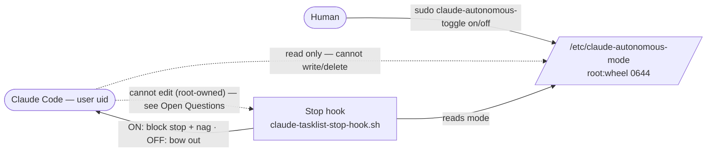

# Spec: Autonomous Mode — human-only toggle for unattended-accountability hooks

> Dated design doc for **workflow-tasks.md task #5**. Authored 2026-06-14 from a
> spike session; **execution deferred** to a later session. A `plan.md` is
> intentionally NOT written yet — it follows once this spec is reviewed.
>
> NOTE: unlike the `spec-driven-development` default (session-scoped, untracked),
> this spec is **committed and durable** — it is the backlog's record of the
> design until task #5 is executed.

---
## Background / Context

- Claude Code runs with the human's **own uid**. Any file the human can read or
  write without privilege, Claude can too — including via its own Bash calls.

- Some hooks are **accountability mechanisms that only matter when the human is
  away** (unattended runs). Today's case: the tasklist Stop-nag
  (`claude-tasklist-stop-hook.sh`) re-prompts Claude while the TaskList still has
  open work, so an unattended Claude can't quietly stop early or game the list.

- That hook's own header records the core problem: it refuses an env-var opt-out
  because "a `CLAUDE_TASKLIST_HOOK=off` switch would let Claude silence its own
  accountability mechanism via a Bash call." Task #5 is the authenticated switch
  that the hook explicitly punted on.

- When the human IS at the machine, the nag is just noise — so the desired
  default is **OFF**, with the nag firing **only** during unattended runs.

- The switch must be one Claude **cannot subvert**: it can't flip the state, and
  (expanded scope, 2026-06-14) it can't edit the hook scripts or unwire them.

---
## Goals and Success Metrics / KPIs

- A single **autonomous mode** switch — `on` / `off` — default **OFF**.

- When **ON**, unattended-accountability hooks fire (today: the tasklist nag).
  When **OFF**, they bow out.

- Claude **cannot** write the state or flip the switch at its own privilege level
  (achieved by the root-owned state). **Goal, pending verification:** Claude also
  cannot edit the hook scripts or unwire them — gated on verifying the
  immutable-wiring mechanism (see Open Questions) and bounded by the
  installer-trust note (see the Scout).

- Boundary **holds at Claude's privilege level** — verified on the dev Mac: sudo
  requires a password (not NOPASSWD), `/etc` and `/usr/local` are `root:wheel`.

- **Cross-platform** (macOS + Linux). Claude Code is the only tool in scope
  (per repo `CLAUDE.md`); cross-tool parity is explicitly out of scope.

---
## Context Diagram

---
## User Stories

- As the human, I want to **enable autonomous mode before I leave**, so the
  unattended-accountability hooks keep Claude honest while I'm away.

- As the human, I want it **OFF by default**, so I'm not nagged when I'm present.

- As the human, I want **Claude unable to disable it** — not the state, not the
  hook scripts, not the wiring — so the accountability can't be self-neutralized.

- As the human, when I genuinely need to change a hook, I'll **edit it myself**
  (privileged), accepting that hooks are no longer Claude-editable.

---
## Non-Functional and Technical Requirements

1. **Security — boundary is OS privilege separation, not crypto.** State and the
   toggle command are born **root-owned** in fully root-owned parent chains
   (`/etc`, `/usr/local`), so Claude can read but not write or delete them.

2. **Security — crypto rejected.** HMAC fails: a symmetric key the hook must read
   to verify is a key Claude (same uid) reads and forges. Plain dotfile/env
   rejected: Claude-writable.

3. **Security — requires password-protected sudo.** Under NOPASSWD sudo the
   boundary does not hold; the installer must refuse to wire it there.

4. **Security — hook scripts + wiring must also be Claude-immutable** (expanded
   scope). Mechanism is an Open Question (managed settings — to verify).

5. **Fail to OFF.** Missing / unreadable / malformed state ⇒ OFF. Claude cannot
   write the state, so it cannot force this path; OFF simply matches the
   attended common case.

6. **Single source of truth** for "is autonomous mode ON?", so future gated hooks
   (#9 PR-size, #15 bypass/loop) share one path + semantics and cannot drift.

7. **Cross-platform.** Portable ownership (`chown 0:0`), macOS + Linux paths;
   mirror all wiring into `install.sh`.

8. **Reuse** the existing `claude-tasklist-stop-hook.sh` and the repo's
   install/symlink patterns rather than introducing parallel machinery.

---
## Testable Acceptance Criteria

#### Happy path

### AC-1: Human enables autonomous mode
- **When** the human runs `sudo claude-autonomous-toggle on`
- **Then** the state file holds `on` and is owned `root:wheel`, mode `0644`
- **And** `claude-autonomous-toggle status` prints `autonomous mode: on`

### AC-2: Nag fires while ON with work pending
- **Given** autonomous mode is `on` and the session TaskList has pending/in_progress tasks
- **When** the Stop hook runs
- **Then** it blocks the stop and returns the tasklist nag reason

### AC-3: Nag bows out while OFF (the default)
- **Given** autonomous mode is `off` and the TaskList has pending tasks
- **When** the Stop hook runs
- **Then** it exits 0 silently (no nag)

### AC-4: Status is readable without privilege
- **When** Claude or the human runs `claude-autonomous-toggle status` (no sudo)
- **Then** the current mode prints and exit code is 0

#### Corner cases

**Boundary checklist** — state file is the only input field this spec affects:

- empty / single / many / max-size / overflow: covered (AC-6, empty/whitespace → OFF); max-size `N/A — fixed two-value enum`
- null / undefined / missing: covered (AC-5, missing file → OFF)
- unicode / whitespace-only / leading-trailing-spaces: covered (AC-6, trimmed then compared)
- duplicate / out-of-order: `N/A — single scalar value`
- boundary numbers (0, -1, MAX_INT, off-by-one): `N/A — non-numeric on/off enum`

### AC-5: Missing state file ⇒ OFF
- **Given** `/etc/claude-autonomous-mode` does not exist
- **When** the reader helper runs
- **Then** it reports OFF (exit 1) and the nag bows out

### AC-6: Malformed / whitespace state ⇒ OFF
- **Given** the state file contains anything other than `on` after trimming whitespace
- **When** the reader helper runs
- **Then** it reports OFF

### AC-7: Re-install does not clobber a human-set mode
- **Given** the human has set autonomous mode `on`
- **When** `install.sh` re-runs
- **Then** the state stays `on` (installer creates the file only if absent), and owner/mode are re-asserted

### AC-8: Toggle is idempotent
- **When** `sudo claude-autonomous-toggle on` runs twice
- **Then** the result is identical to running it once (state `on`)

#### Failure modes

**Failure category checklist**:

- validation error (4xx): covered (AC-12, bad/no arg → usage exit 64; non-root mutate → refuse)
- downstream timeout / 5xx: `N/A — no network/downstream`
- partial failure (some items succeed, some fail): `N/A — single atomic state write`
- auth / authz failure: covered (AC-9 Claude write denied; AC-11 NOPASSWD refusal)
- concurrency / race / double-submit: covered (AC-8 idempotent; single-writer human command)
- idempotency (repeat request behavior): covered (AC-8)
- network drop mid-operation: `N/A — local file only`

### AC-9: Claude cannot write the state
- **Given** Claude runs as the user (non-root)
- **When** it attempts to write or delete `/etc/claude-autonomous-mode`
- **Then** the OS denies it (file root-owned, `/etc` root-owned ⇒ no unlink)

### AC-10: Claude cannot edit the hook scripts or wiring
- **Given** the hook scripts and their wiring have been made root-owned / immutable
- **When** Claude attempts to edit a hook script or remove its wiring
- **Then** the OS denies it, so the gate cannot be neutralized from Claude's uid
- **Note:** the immutability mechanism is unresolved (managed settings — see Open
  Questions). Until that mechanism is verified, this AC is aspirational, not yet testable.

### AC-11: Installer refuses under NOPASSWD sudo
- **Given** `sudo -n true` succeeds (passwordless sudo)
- **When** `install.sh` reaches the autonomous-mode wiring
- **Then** it skips the install and warns that the boundary would not hold

### AC-12: Mutating without root is refused
- **When** `claude-autonomous-toggle on` runs without sudo
- **Then** it refuses with guidance to use `sudo`, and a bad/missing argument prints usage (exit 64)

---
## Open Questions

- **QUESTION (load-bearing):** Does Claude Code support **managed/policy
  settings** that (a) can define `hooks`, (b) take highest precedence over user
  & project settings, and (c) have **no user-writable kill-switch** (setting,
  flag, or env var) that disables all hooks — including managed ones? What are
  the exact file paths on macOS AND Linux? If a Claude-writable surface can
  globally disable hooks, the immutable-wiring goal (AC-10) collapses and the
  mechanism must change. MUST be verified before execution.

- **QUESTION:** Scope of immutability — only the tasklist nag's chain, or ALL
  hooks (also `claude-git-guard.sh`, `claude-rm-guard.sh`)? Root-owning the
  guards would harden them too, but widens blast radius and the edit-workflow
  cost.

- **QUESTION:** Install path for the command that resolves under sudo's
  `secure_path` so the bare name `sudo claude-autonomous-toggle` works.
  `/usr/local/sbin` is root-owned and safe, but bare-name resolution under macOS
  sudo is unverified — confirm, or document the full-path invocation.

- **QUESTION:** How do root-owned hook scripts coexist with the repo's
  "edit source in `configs/`, symlink to `~/.claude`" model? Likely: installer
  **copies** (not symlinks) them in as root, and a hook edit means edit-in-repo
  then `sudo install.sh`. Confirm the workflow.

---
## Functional Decisions

- **DECISION:** __Chose__ OS privilege separation (root-owned state file flipped
  via sudo), __because__ it gives the needed asymmetry (human writes, Claude only
  reads) with zero key management and works cross-OS.
  - __Discarded__ **HMAC-signed state w/ key in Keychain/`pass`**: symmetric — the
    hook must read the key to verify, so Claude (same uid) reads it and forges.
  - __Discarded__ **plain dotfile / env flag**: Claude-writable, defeats the gate.
  - __Discarded__ **Touch ID / Secure Enclave signing**: macOS-only and notably
    more complex (Secure Enclave keygen); sudo serves the cross-OS goal better.

- **DECISION:** __Chose__ **default OFF**, nag gated to fire only when ON,
  __because__ the nag is unattended-accountability and is noise when the human is
  present. Note this **inverts** today's always-nag behavior.

- **DECISION (expanded scope, 2026-06-14):** __Chose__ to require the hook
  **scripts and wiring** be Claude-immutable too (not just the state),
  __because__ protecting only the state leaves Claude free to edit the hook or
  unwire it in `settings.json` — the same hole one file over. See the Scout below.

### Scout (from the spike, filed as a TaskList item)

- **Hook code/wiring (AC-10):** the state boundary protects the **state**, not the
  hook **code/wiring**. Hooks are Claude-writable symlinks under `~/.claude/hooks`,
  and `settings.json` (which wires them) is Claude-writable too. Fully closing
  AC-10 needs immutable hook scripts + immutable wiring (managed settings — Open
  Question), which also hardens the existing `git-guard`/`rm-guard`. Overlaps
  **task #15** (sandbox / safe bypass loop). Decide: fold into #15 or track standalone.

- **Privileged-installer trust root:** the boundary is *deployed* by
  `sudo install.sh`, and `install.sh` is repo-resident (Claude-writable). An
  autonomous Claude could edit `install.sh` so a later `sudo install.sh` runs its
  code as root — collapsing the boundary. Routine on/off uses
  `sudo claude-autonomous-toggle` and does NOT touch `install.sh`, so this risk is
  confined to (re)install time. Mitigation (standard setup-script trust): review
  the `install.sh` diff before running it privileged. Documented as a known bound,
  not a thing the state file can fix.
