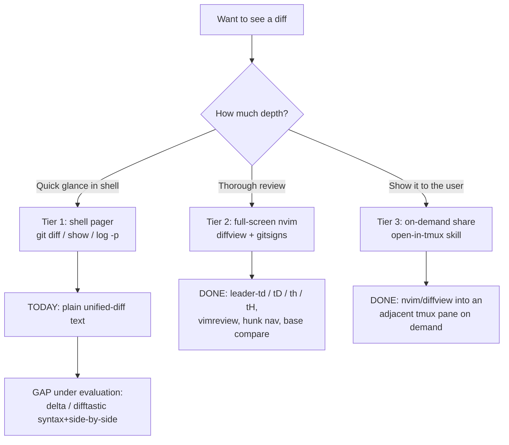

# Spec: claude-diff-view — terminal diff-review at desktop-app parity

> Referenced by `workflow-tasks.md` task 2 (the diff-view spike). Companion: `plan-claude-diff-view.md`.

---
## Background / Context

The user is terminal-primary (heavy tmux / hooks / skills / neovim investment).

One of the few real draws of the Claude Code **desktop app** is its **visual diff review** — side-by-side, syntax-highlighted, with a file tree.

The question this spec answers: can the terminal stack match that, so a desktop switch isn't needed *just* for nicer diffs?

The task 2 spike already answered most of it — **the visual full-screen tier already exists**:

- `diffview.nvim` is installed and mature in `~/neovim/init.lua`: side-by-side panes + file panel, base-branch compare, history, auto-refresh on focus.

- `gitsigns` gives gutter signs + hunk navigation (`]h` / `[h`) + hunk reset.

- a `vimreview` shell command opens diffview for staged / vs-REV / piped-diff input.

So the *visual* draw of the desktop app is matched today.

What is **not** present is a **syntax-aware shell pager** (`delta` / `difftastic`): every raw `git diff` / `show` / `log -p` still prints as plain, uncolored unified-diff text.

**The open, unsettled question: is that shell-pager tier even worth adding**, given diffview already covers thorough review?

The user is not yet convinced of its value and wants to read/trial first. This spec supports that decision rather than presuming it.

---
## Goals and Success Metrics / KPIs

- **Goal**: review any diff — quick glance, thorough review, or share-with-collaborator — without leaving the terminal, at parity with the desktop app's diff draw.

- **Goal**: reach a clear, recorded **adopt / reject** decision on a syntax-aware shell pager (delta vs difftastic vs neither), grounded in a hands-on trial rather than hearsay.

- **Success metric**: zero need to open the desktop app *for diff review* — every tier (glance / thorough / share) has a terminal answer the user actually reaches for.

- **Success metric**: the whole setup is version-controlled and reproduced by `install.sh` on a fresh machine (both OSes).

---
## Context Diagram

The three diff-review **tiers**. The spike confirmed tiers 2 and 3 are done; tier 1 (shell glance) is the only gap — and its value is the open question.

---
## User Stories

- As a terminal-primary dev, I want full-screen side-by-side diffs with a file panel, so I can review a branch like the desktop app does. *(satisfied today by diffview)*

- As a terminal-primary dev, I want a quick `git diff` in the shell to be syntax-highlighted and scannable, so I don't open a full editor to eyeball a small change.
  - *(the proposed delta tier — value under evaluation)*

- As a terminal-primary dev, I want to occasionally see structural (AST-level) diffs that ignore formatting churn, so a reflow or rename doesn't drown the real change.
  - *(the difftastic angle — under evaluation)*

- As a terminal-primary dev, I want the entire diff setup version-controlled, so a fresh machine reproduces it via `install.sh` on both macOS and Linux.

---
## Non-Functional and Technical Requirements

1. **Cross-platform (MUST)**: every piece works on macOS and Linux. Home-dir paths and install commands need both forms. (Repo rule — non-negotiable.)

2. **Coexistence**: must not disrupt the existing diffview / gitsigns / vimreview setup, nor the `vimreview` piped-diff fallback.

3. **On-demand, not automatic**: no hook that auto-opens diffs on every edit (rejected — see Decisions). Review is user-initiated.

4. **Graceful when the pager is absent**: if delta/difftastic isn't installed yet (e.g. fresh machine before `install.sh` finishes), plain `git` must still work — no broken `git diff`.

5. **Reproducibility**: any pager config lives in a **version-controlled** `~/.gitconfig`, which today is unmanaged → depends on `workflow-tasks.md` task 4.

6. **Reuse**: reuse the existing `install.sh` symlink pattern and the already-working neovim diff stack; do not reimplement visual review.

---
## Testable Acceptance Criteria

#### Happy path

### AC-1: visual full-screen review works (regression guard)
- **When** the user triggers `<leader>td` / `<leader>tD` / `<leader>th` / `<leader>tH` in neovim, or runs `vimreview` in the shell
- **Then** diffview opens the corresponding diff (uncommitted / vs-base / branch history / repo history) with side-by-side panes and a file panel
- **And** this behavior is unchanged by anything added in this spec

### AC-2: syntax-aware shell pager renders read diffs (proposed — gated on adopt decision)
- **Given** the chosen pager (delta) is installed and configured
- **When** the user runs `git diff`, `git show`, or `git log -p` in a terminal
- **Then** the output is syntax-highlighted with the configured layout (side-by-side or inline + navigation)

#### Corner cases

**Boundary checklist** — terminal/tooling spec; per-field input boundaries mostly N/A.

- empty / single / many / max-size / overflow: covered (AC-4, huge/binary diff)
- null / undefined / missing: covered (AC-3, pager binary absent)
- unicode / whitespace-only / leading-trailing-spaces: N/A — pager passes git output through verbatim
- duplicate / out-of-order: N/A — no list inputs
- boundary numbers (0, -1, MAX_INT, off-by-one): N/A — no numeric inputs

### AC-3: pager absent → git still works
- **Given** delta/difftastic is not installed
- **When** the user runs `git diff`
- **Then** git falls back to its default pager with plain output and a non-broken exit — no "command not found" from a missing pager

### AC-4: huge or binary diffs are handled
- **When** a diff is very large or touches a binary file
- **Then** the pager pages it (does not flood the scrollback) and shows a "binary file differs" line rather than garbage

### AC-5: non-tty / piped output stays plain
- **Given** output is piped, not a terminal (e.g. `git diff | cat`, or the `vimreview` piped-diff fallback)
- **When** git produces the diff
- **Then** the pager is bypassed and plain text is emitted, so scripts and the `vimreview` fallback are unaffected

### AC-6: config applies inside a git worktree
- **Given** the user is working inside a `.claude/worktrees/<id>` worktree
- **When** they run `git diff`
- **Then** the global `~/.gitconfig` pager config still applies (worktrees share the global config)

#### Failure modes

**Failure category checklist**

- validation error (4xx): N/A — no network/API surface
- downstream timeout / 5xx: N/A — local tooling only
- partial failure (some items succeed, some fail): covered (AC-3, pager absent degrades gracefully)
- auth / authz failure: N/A — no auth in the diff path
- concurrency / race / double-submit: N/A — read-only review
- idempotency (repeat request behavior): N/A — viewing a diff is naturally idempotent
- network drop mid-operation: N/A — fully local

### AC-7: gitconfig managed cross-platform
- **Given** a fresh machine on either macOS or Linux
- **When** `install.sh` runs
- **Then** `~/.gitconfig` is symlinked from the repo and the `gh` credential-helper path resolves on that OS (not a hardcoded `/opt/homebrew` path on Linux)

---
## Open Questions

- **QUESTION (core / value):** Does a shell pager add enough marginal value over the already-working diffview to adopt **at all**?
  - diffview already covers thorough review; the pager only upgrades the quick-glance tier. Needs a hands-on trial before committing.
  - *(User: "still not sure what this is about and the value it has.")*

- **QUESTION (tool):** delta only, or delta as default pager **plus** difftastic for on-demand structural/AST diffs?
  - delta = line-based, git-native, side-by-side pager.
  - difftastic = tree-sitter structural diff that ignores formatting churn but is slower and less pager-like.
  - *(User: "need to read more to decide properly.")*

- **QUESTION (scope):** if adopting delta — read commands only (`diff` / `show` / `log -p`), or also wire `interactive.diffFilter` so `git add -p` staging hunks render through delta too? *(User: deferred.)*

- **QUESTION (layout):** side-by-side by default, or inline with `navigate = true` (jump between files with `n` / `N`)? Side-by-side needs width; inline suits narrow panes.

---
## Functional Decisions

- **DECISION:** __Chose__ `diffview.nvim` for the full-screen visual tier.
  - __Because__ it gives side-by-side + file panel + base-compare + history closest to the desktop app, and is already implemented and in daily use.
  - __Discarded__ **fugitive `:Gdiffsplit`**: weaker file-panel / multi-file review; no reason to switch.

- **DECISION:** __Chose__ to **reject** an auto-open `PostToolUse` (Edit/Write) hook that pops diffs into a tmux pane.
  - __Because__ it would fire on every edit and spam panes; the `open-in-tmux` skill already covers opening a diff in an adjacent pane **on demand**, with user intent.

- **DECISION:** __Chose__ to make **version-controlling `~/.gitconfig` a prerequisite** (`workflow-tasks.md` task 4) for any pager config.
  - __Because__ this repo's purpose is config versioning; pager config in an unmanaged dotfile would be lost on a fresh machine.

- **DECISION:** __Chose__ `delta` as the **leading candidate** for the shell-pager tier, if the value question resolves "adopt".
  - __Because__ it is git-native, actively maintained, and offers side-by-side + line numbers + navigation as a drop-in pager.
  - __Discarded (for now)__ **difftastic as the default pager**: valuable but slower and less pager-like; kept only as a possible on-demand complement (see Open Questions).
